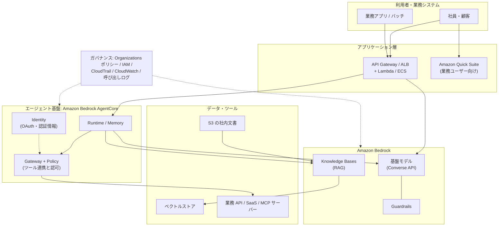
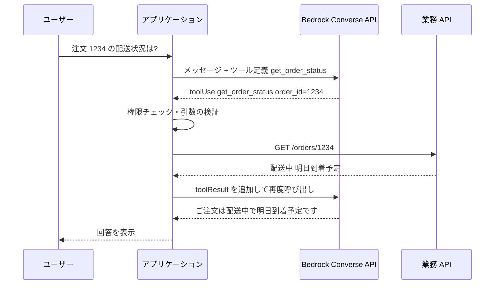
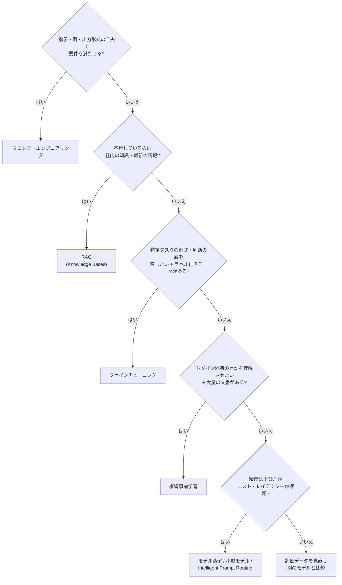
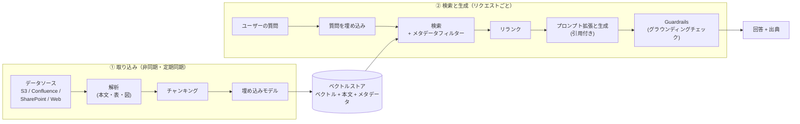
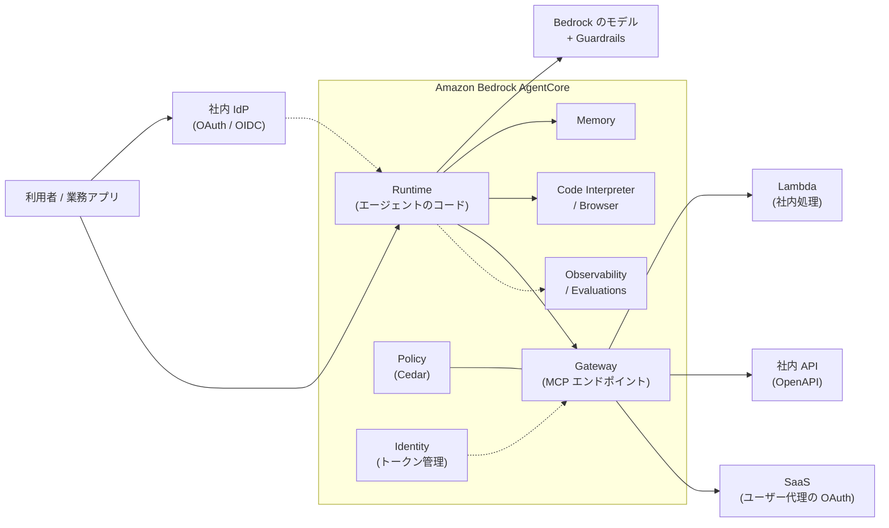
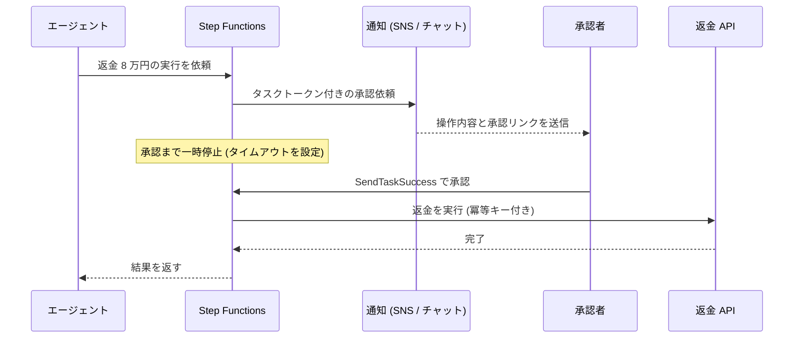
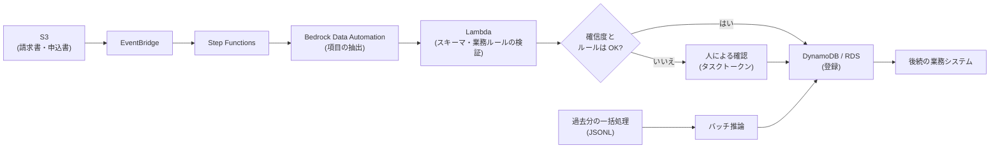

[ホーム](../README.md) > [Phase 3: プロフェッショナル](README.md) > 生成 AI・エージェント AI のアーキテクチャ

# 生成 AI・エージェント AI のアーキテクチャ

> **この章のゴール**
> - トークン・コンテキストウィンドウ・推論パラメーター・ハルシネーションが、コスト・性能・信頼性にどう効くかを説明できる
> - Amazon Bedrock の推論オプション（オンデマンド / バッチ / プロビジョンドスループット / サービスティア / クロスリージョン推論）と最適化機能（プロンプトキャッシュ、Intelligent Prompt Routing、モデル蒸留）を使い分けられる
> - プロンプトエンジニアリング・RAG・ファインチューニング・継続事前学習から、要件に合うカスタマイズ手法を選べる
> - Knowledge Bases を使った RAG を、チャンキング・ベクトルストア・メタデータフィルタリング・評価まで含めて設計できる
> - Guardrails と Amazon Bedrock AgentCore を組み合わせ、人による承認を含む安全なエージェントを設計できる
> - 組織全体の生成 AI ガバナンス（モデル制限、Guardrails の強制、ログ、ネットワーク）を設計できる
>
> **対応試験**: SAP-C03（D1 クラウドネイティブアーキテクチャの設計と実装 が中心。D2 セキュリティ・ガバナンス、D3 コスト最適化、D5 運用にも関連。ドメイン名は仮訳）
> **目安時間**: 合計 10 時間（読む 7 時間 / 確認問題 1 時間 / [Lab 12](../04-labs/lab12-bedrock-rag.md) 2 時間）

## この章の全体像

SAP-C03 で最も大きく追加された領域が、生成 AI とエージェント AI です。発表時点の情報では、この領域で **11 のスキル** が追加され、Amazon Bedrock を使ったアプリケーション統合の設計、Amazon Bedrock AgentCore による AI エージェントのアーキテクチャ、RAG（検索拡張生成）、Guardrails によるコンテンツフィルタリング、人による監督（human oversight）、コスト管理などが挙げられています。正式なタスクステートメントは 2026-10-27 公開予定の試験ガイドで必ず確認してください。

SAP で問われるのは「モデルの作り方」ではありません。**基盤モデルを部品として使い、既存のデータ・業務システム・セキュリティ統制と安全につなぐアーキテクチャ** です。本章は次の地図に沿って進みます。



| 追加スキル（発表内容の要約） | 本章の主な節 |
|---|---|
| Bedrock を使ったアプリケーション統合の設計 | 2 節、11 節 |
| RAG の設計 | 4 節 |
| コンテンツフィルタリング（Guardrails） | 5 節 |
| AgentCore による AI エージェントのアーキテクチャ | 6 節 |
| 人による監督（human-in-the-loop） | 6.7 節 |
| セキュリティとガバナンス（D2 と重なる） | 7 節 |
| コスト管理・運用 | 2.5〜2.8 節、8 節 |

> [!IMPORTANT]
> **2026年9月時点のサービス状況（古い教材との違い）**
> - **Amazon Bedrock Agents** は「**Agents Classic**」に名称変更され、2026-07-30 に新規受付を終了しました（2026年6月に発表）。新しいエージェントは **Amazon Bedrock AgentCore** で構築します。Knowledge Bases と Guardrails は影響を受けません。
> - **Amazon Kendra** と **Amazon Q Business** は 2026年6月に新規受付終了が発表されました。社内文書の RAG は Bedrock Knowledge Bases、業務ユーザー向けの AI アシスタントは Amazon Quick Suite や Bedrock ベースのアプリで設計します。
> - **Amazon SageMaker AI** の Model Monitor / Clarify / Ground Truth / Augmented AI（A2I）も 2026年6月に新規受付終了が発表されました。
> - **Amazon Q Developer** は 2026-05-15 に新規サインアップを停止し、IDE プラグインは 2027-04-30 にサポート終了予定です（後継は AI IDE の **Kiro**）。
>
> 試験や古い教材では、これらの旧サービスが正解として出題される可能性があります。本章では現在の推奨構成を教え、旧サービスは「レガシー」として仕組みだけ押さえます。最新の状況は [AWS のメンテナンス中サービス一覧](https://docs.aws.amazon.com/general/latest/gr/maintenance_services.html) で確認できます。

---

## 1. 生成 AI の基礎（アーキテクトが押さえる最小限）

### 1.1 基盤モデルと LLM

**基盤モデル（Foundation Model、FM）** は、膨大なデータで事前学習され、要約・質問応答・分類・コード生成など多くのタスクに転用できる大規模なモデルです。テキストを中心に扱うものを **大規模言語モデル（LLM）** と呼びます。

LLM の動作原理はシンプルです。入力（プロンプト）の続きとして「次に来る確率が高いトークン」を 1 つずつ選び、それを入力に足してまた次を選ぶ、という処理を繰り返します（自己回帰生成）。ここから、アーキテクチャ上の重要な性質が 3 つ導かれます。

1. **モデルは「事実を検索」していない**: もっともらしい続きを生成しているだけなので、事実と異なる内容を自信を持って出力することがある（ハルシネーション）。
2. **モデルは社内データや最新情報を知らない**: 学習データには知識のカットオフ（ある時点まで）があり、自社の規程や在庫は含まれない。→ RAG やツール連携で「外から渡す」必要がある。
3. **コストと時間は生成するトークン数に比例する**: 出力が長いほど遅く、高くなる。

| 種類 | 入力 → 出力 | 用途例 | Bedrock での例 |
|---|---|---|---|
| テキスト生成（LLM） | テキスト（+ 画像・文書）→ テキスト | 要約、QA、分類、抽出、コード | Anthropic Claude、Amazon Nova、Meta Llama、Mistral AI など |
| 埋め込み（Embedding） | テキスト・画像 → ベクトル | 意味検索、RAG、クラスタリング | Amazon Titan Text Embeddings V2、Cohere Embed |
| 画像・動画生成 | テキスト → 画像・動画 | 広告素材、デザイン案 | Amazon Nova Canvas、Stability AI など |
| リランク | クエリ + 文書群 → 関連度順 | 検索結果の並べ替え | Amazon Rerank、Cohere Rerank |

### 1.2 トークンとコンテキストウィンドウ

**トークン** は、モデルが処理する最小単位（単語の一部や記号）です。Bedrock のオンデマンド料金は **入力トークン数と出力トークン数** で決まり、多くのモデルで出力トークンの単価は入力より高く設定されています。また、呼び出しのクォータも **1 分あたりのトークン数（TPM）とリクエスト数（RPM）** で管理されます。

日本語は英語に比べて、同じ文字数でもトークン数が多くなりやすい傾向があります（トークナイザーに依存）。見積もりは英語の目安をそのまま使わず、実データで計測してください。

**コンテキストウィンドウ** は、1 回の呼び出しで扱える最大トークン数（入力 + 出力）です。最近のモデルは数十万〜100 万トークン級のものもありますが、「全部入れればよい」わけではありません。

| 概念 | 設計への影響 |
|---|---|
| 入力トークン | 長いシステムプロンプト・会話履歴・検索結果はそのままコストになる → プロンプトキャッシュ、履歴の要約、取得チャンク数の最適化 |
| 出力トークン | レイテンシーとコストに直結 → 最大トークン数の制限、簡潔な出力形式の指定、ストリーミング |
| コンテキストウィンドウ | 超える入力はエラーになる。長大な入力は精度・レイテンシー・コストが悪化しやすい（文書の中ほどにある情報を見落としやすいことも知られている）→ RAG で必要な部分だけ渡す |
| TPM / RPM クォータ | ピーク時のスロットリングの原因 → クロスリージョン推論、プロビジョンドスループット、キューで平準化 |

### 1.3 推論パラメーター

推論パラメーターは、次のトークンをどう選ぶか（ばらつき）と、どこで止めるかを制御します。

| パラメーター | 意味 | 小さくすると | 典型的な使い方 |
|---|---|---|---|
| temperature | 確率分布の「鋭さ」。高いほど低確率のトークンも選ばれやすい | 出力が安定・保守的になる | 抽出・分類・社内 QA は低め、コピーライティングやアイデア出しは高め |
| top_p | 累積確率が p に達するまでの候補からだけ選ぶ | 候補が絞られ、突飛な語が減る | temperature とどちらか一方を主に調整する |
| top_k | 確率上位 k 個の候補からだけ選ぶ（対応モデルのみ） | 候補が絞られる | 細かなチューニング用 |
| 最大トークン数 | 出力の上限 | 長い回答が途中で切れる | コストとレイテンシーの上限を決める安全装置 |
| 停止シーケンス | 指定文字列が出たら生成を止める | ― | 出力形式の制御、無駄な生成の防止 |

> [!WARNING]
> **ひっかけ注意**: temperature を 0 にしても、出力が完全に再現される保証はありません。「同じ入力で同じ出力を監査のために再現したい」という要件には、パラメーターではなく **呼び出しログ（入力・出力の保存）** で応えます（7.6 節）。

### 1.4 ハルシネーションとその対策

ハルシネーションは、モデルが事実と異なる内容や根拠のない内容をもっともらしく生成する現象です。原因は 1.1 節の「確率的な生成」「社内データを知らない」「知識のカットオフ」にあります。**モデルを大きくするだけでは解消しない** ため、アーキテクチャで多層的に抑えます。

| 対策 | 仕組み | AWS での実現 |
|---|---|---|
| 根拠を渡す | 回答に必要な文書を検索してプロンプトに入れる | Knowledge Bases（RAG）、ツールで業務 API を参照 |
| 根拠を示させる | 引用元（出典）付きで回答させ、利用者が検証できるようにする | RetrieveAndGenerate の引用（citations） |
| 根拠との整合を検査する | 回答が参照文書に基づいているか、質問に関連しているかを採点して閾値未満を遮断 | Guardrails のコンテキストグラウンディングチェック |
| ルールとの整合を論理検証する | 規程などから作った論理ルールで回答の正しさを検証 | Guardrails の自動推論チェック（Automated Reasoning checks） |
| 分からないと言わせる | 「根拠がなければ回答しない」とシステムプロンプトで指示 | プロンプト設計、低い temperature |
| 出力を機械的に検証する | JSON スキーマ、業務ルール、参照整合性をコードでチェック | Lambda / Step Functions での検証 |
| 人が確認する | 影響の大きい出力は人の承認を経てから使う | Step Functions のタスクトークン（6.7 節） |

### 1.5 埋め込みとベクトル検索（RAG の土台）

**埋め込み（エンベディング）** は、文章や画像の「意味」を数百〜数千次元の数値ベクトルに変換したものです。意味が近い文章はベクトル空間上で近くに配置されるため、キーワードが一致しなくても「似た意味の文書」を探せます。例えば「有給休暇の申請方法」というクエリで「年次休暇を取得する手続き」という見出しの文書を見つけられます。

- **類似度**: コサイン類似度、ユークリッド距離、内積などで測る。
- **近似最近傍探索（ANN）**: 全件と比較すると遅いため、HNSW などのインデックスで「ほぼ最も近いもの」を高速に探す。精度と速度・メモリのトレードオフがある。
- **同じ埋め込みモデルを使う**: 文書の取り込み時と検索時で同じモデル・同じ次元数を使う必要がある。モデルを変えたら **全文書の再埋め込み（再インデックス）** が必要。
- **次元数のトレードオフ**: 次元が大きいほど表現力は高いが、ストレージ・メモリ・検索レイテンシーが増える（例: Titan Text Embeddings V2 は 256 / 512 / 1,024 次元から選べる）。
- **ハイブリッド検索**: 型番・社員番号・固有名詞のような「完全一致が重要な語」はベクトル検索が苦手。キーワード検索（BM25 など）と組み合わせると精度が上がる。

> [!TIP]
> **試験のポイント**: 「意味的に類似した文書を検索」「セマンティック検索」「RAG の検索部分」とあれば **埋め込みモデル + ベクトルストア**。「製品型番の完全一致も重要」とあれば **ハイブリッド検索**（キーワード + ベクトル）に対応したストア（OpenSearch など）を選びます。

---

## 2. Amazon Bedrock の設計ポイント

### 2.1 Bedrock の全体像

Amazon Bedrock は、複数のプロバイダーの基盤モデルを **サーバーレスな単一の API** で利用できるフルマネージドサービスです。GPU の調達やモデルのホスティングは不要で、使った分（トークン数など）だけ支払います。さらに、アプリケーションに必要な部品が機能として揃っています。

| 機能 | 役割 | 本章 |
|---|---|---|
| 基盤モデル（モデルカタログ） | Anthropic、Amazon（Nova）、Meta、Mistral AI、Cohere などのモデルを API で利用 | 2 節 |
| Knowledge Bases | マネージドな RAG（取り込み・チャンキング・埋め込み・検索・引用） | 4 節 |
| Guardrails | 入力と出力の安全対策（有害コンテンツ、個人情報、プロンプト攻撃、根拠チェック） | 5 節 |
| Amazon Bedrock AgentCore | エージェントを本番運用するための基盤（実行、メモリ、ツール連携、認証、観測、ポリシー、評価） | 6 節 |
| Flows / Prompt Management | プロンプトや処理をつないだワークフロー、プロンプトのバージョン管理 | 2.9 節 |
| Evaluations | モデル・RAG の品質評価（自動評価、LLM-as-a-judge、人による評価） | 8.2 節 |
| Bedrock Data Automation（BDA） | 文書・画像・音声・動画から構造化データを抽出 | 11.3 節 |
| モデルのカスタマイズ | ファインチューニング、継続事前学習、モデル蒸留、カスタムモデルのインポート | 3 節 |

### 2.2 モデルアクセス（2025年10月以降の変更）

2025年10月以降、商用リージョンでは Bedrock の **サーバーレスな基盤モデルがデフォルトで利用可能** になりました（以前の「モデルアクセス」ページは廃止）。Anthropic のモデルだけは、初回に **一度だけユースケースの申請フォーム** の提出が必要です。

「どのモデルを誰が使えるか」は、コンソールのスイッチではなく **IAM ポリシーと SCP** で制御します（7.3 節）。

> [!WARNING]
> **ひっかけ注意**: 古い教材や試験問題では「モデルアクセスページで対象モデルを有効化していないため AccessDeniedException になる」という設定が出てくることがあります。現在はデフォルトで有効なので、組織として利用モデルを絞りたい場合は **SCP や IAM で明示的に拒否・許可** する設計が必要です。「何もしなければ使えない」という前提は成り立ちません。

### 2.3 モデル選択の観点

SAP の問題では「最も高性能なモデル」ではなく、**要件を満たす中で最もコスト効率が高いモデル** が正解になることが多いです。

| 観点 | 確認すること | 設計上の意味 |
|---|---|---|
| タスク品質 | 自社の評価データセットでの正答率・有用性 | 候補モデルを Bedrock Evaluations で比較してから決める |
| 日本語性能 | 日本語の読解・敬語・表記ゆれへの強さ | 英語のベンチマークだけで判断しない |
| レイテンシー | 最初のトークンまでの時間（TTFT）、出力トークン/秒 | 対話 UI はストリーミング + 小〜中規模モデル、バッチは問わない |
| コスト | 入力・出力トークン単価、キャッシュ単価 | 大量処理は小型モデル・バッチ・蒸留を検討 |
| コンテキスト長 | 必要な入力の長さ | 長文を毎回入れるならキャッシュや RAG と併用 |
| モダリティ | 画像・PDF・音声・動画の入力、画像生成 | 図表を含む文書処理はマルチモーダルモデル |
| 機能対応 | ツール利用、プロンプトキャッシュ、クロスリージョン推論、バッチ、ファインチューニング、Guardrails との組み合わせ | モデルによって対応が異なる |
| リージョンとデータ所在 | 利用リージョン、推論が処理されるリージョン | データ所在要件があれば地理的推論プロファイル（2.5 節） |

> [!TIP]
> **試験のポイント**: 「簡単な分類を大量に」「最小のコスト」→ 小型モデル（+ バッチ）。「難易度がばらつく問い合わせ」→ Intelligent Prompt Routing。「特定タスクで大型モデル並みの精度を小型モデルで」→ モデル蒸留。「モデルを差し替えやすくしたい」→ Converse API。

### 2.4 呼び出し API: InvokeModel と Converse API

| API | 特徴 | 使いどころ |
|---|---|---|
| InvokeModel / InvokeModelWithResponseStream | リクエスト本文がモデルごとに異なる（ネイティブ形式） | 埋め込み・画像生成など、モデル固有の機能を使う場合 |
| **Converse / ConverseStream** | **モデル間で共通のメッセージ形式**。システムプロンプト、マルチターン会話、ツール利用、画像・文書入力、Guardrails の指定を統一的に扱える | チャット・エージェント・業務アプリの標準。モデル ID を変えるだけで差し替えられる |
| バッチ推論（CreateModelInvocationJob） | S3 上の JSONL をまとめて非同期処理 | リアルタイム性が不要な大量処理（2.5 節） |

Converse API の重要な機能が **ツール利用（Tool use / Function calling）** です。モデルは自分で API を呼べません。モデルは「このツールをこの引数で呼んでほしい」という **要求（toolUse）** を返し、実際の実行はアプリケーション側が行って結果（toolResult）を返します。この「モデルが考え、アプリが実行する」ループが、6 節のエージェントの基本形です。



この構造から、セキュリティ上の大原則が導かれます。**ツールを実行するのはアプリケーション（またはエージェント基盤）であり、そこで認可・入力検証を行える**、ということです。モデルの出力を信用せず、実行前に必ず検証します（7.4 節）。

> [!NOTE]
> ツール定義に JSON スキーマを与えてモデルにそのツールを使わせると、モデルの出力を **スキーマに沿った JSON** として受け取れます。文書からの項目抽出など、後続処理が機械的に読む出力に便利です。それでも、受け取った JSON はコード側で検証します。

### 2.5 推論オプション（オンデマンド / サービスティア / バッチ / プロビジョンドスループット / クロスリージョン推論）

同じモデルでも、**どう呼び出すか** でコスト・レイテンシー・スループットが大きく変わります。SAP では「リアルタイム性が必要か」「量は一定か、バースト的か」「データをどこで処理してよいか」の 3 点から選びます。

| オプション | 課金（2026年9月時点） | 特徴 | 向いているワークロード |
|---|---|---|---|
| オンデマンド（Standard ティア） | 入力・出力トークン単価 | コミットなし。TPM / RPM クォータの範囲で利用 | 一般的な対話・業務アプリ |
| Priority ティア | Standard の料金 + 割増 | 処理が優先され、出力トークン/秒（OTPS）が Standard より最大 25% 向上（公式ページの記載） | レイテンシーが顧客体験や売上に直結する対話 |
| Flex ティア | Standard より割引 | 優先度が低く、混雑時は Standard の後に処理される（レイテンシーが延びることを許容） | モデル評価、要約、エージェントのバックグラウンド処理 |
| Reserved ティア | 1 分あたりのトークン数（TPM）1,000 単位の固定料金（月額請求）。期間は 1 か月または 3 か月 | 必要な TPM を確保し、予測可能な性能を得る | 一定の TPM が必要なミッションクリティカルなアプリ |
| バッチ推論 | オンデマンドの約 50%（対応モデル） | S3 上の JSONL をジョブでまとめて非同期処理し、結果を S3 に出力 | 大量文書の要約・分類・埋め込み生成、夜間処理 |
| プロビジョンドスループット | モデルユニット（MU）単位の時間課金。1 か月または 6 か月のコミットで割引（カスタムモデルにはコミットなしの購入方法もある） | 一定のスループットを確保できる。カスタムモデルの推論で使うことが多い | 安定した大量トラフィック、スループットの保証、カスタムモデル |
| クロスリージョン推論 | 追加料金なし（送信元リージョンの料金） | 推論プロファイル経由で、複数リージョンの容量に自動で振り分け | ピーク時のスロットリング対策、スループット向上 |

サービスティア（Priority / Standard / Flex）は 2025年11月に追加された仕組みで、リクエストごとに選べます。2026年9月時点では、TPM を期間契約で確保する Reserved ティアも案内されています。割増・割引の率と対応モデルはモデルごとに異なるため、[Amazon Bedrock のサービスティア](https://aws.amazon.com/bedrock/service-tiers/) で確認してください。

#### クロスリージョン推論とデータ所在

クロスリージョン推論（CRIS）は、**推論プロファイル** を指定して呼び出すと、Bedrock が同じ地域グループ内の複数リージョンに推論を自動で振り分ける仕組みです。1 つのリージョンの容量不足によるスロットリングを避けられます。

| 種類 | 振り分け先 | 使いどころ |
|---|---|---|
| 地理的クロスリージョン推論 | 同じ地理的範囲のリージョンのみ（US、EU、APAC など。一部のモデルでは **日本（東京・大阪）** や オーストラリアに閉じたプロファイルもある） | データ所在要件がある場合の標準 |
| グローバルクロスリージョン推論（2025-09〜） | 世界中の対応商用リージョン | データ所在の制約がなく、スループットを最大化したい場合 |

- 通信は AWS のグローバルネットワーク上を流れ、パブリックインターネットを経由しません。
- 推論の **処理** が他リージョンで行われることがあっても、呼び出しログやナレッジベースなど **保存されるデータは送信元リージョン** に置かれます。
- IAM では、推論プロファイルと振り分け先リージョンの基盤モデルの両方に対する権限が必要です。**リージョンを制限する SCP を使っている組織では、振り分け先リージョンでの推論が SCP で拒否されないように例外を設計** します（詳細は [クロスリージョン推論の公式ドキュメント](https://docs.aws.amazon.com/bedrock/latest/userguide/cross-region-inference.html) を参照）。

> [!WARNING]
> **ひっかけ注意**: 「個人データを日本国内で処理することが規制で求められる」要件に対して、**グローバル** クロスリージョン推論は選べません。東京リージョン内のオンデマンド推論、または日本（東京・大阪）に閉じた地理的推論プロファイル（対象モデルのみ）を選びます。「スロットリング対策」だけを見てグローバルを選ばないようにしてください。

> [!TIP]
> **試験のポイント**: 「翌朝までに数百万件を処理」「リアルタイム性不要」「最もコスト効率が高い」→ **バッチ推論**（または Flex）。「ピーク時に ThrottlingException」→ **クロスリージョン推論**（+ 指数バックオフ付きリトライ）。「常に一定の大量トラフィックでスループットを保証」「カスタムモデル」→ **プロビジョンドスループット**。「レイテンシー最優先で割増料金を許容」→ **Priority ティア**。

### 2.6 プロンプトキャッシュ

RAG やエージェントでは、長いシステムプロンプト、ツール定義、参照文書など **毎回同じ前半部分（プレフィックス）** を送り続けることがよくあります。プロンプトキャッシュ（2025年4月 GA）は、このプレフィックスの処理結果を一時的に保持して再利用する機能です。

- **仕組み**: プロンプト内にキャッシュのチェックポイントを置くと、チェックポイントまでの内容が完全に一致する後続リクエストでは、その部分をキャッシュから読み込みます。キャッシュ読み取りのトークンは通常の入力より大幅に安く、処理も速くなります（AWS は対応モデルでコスト最大 90%・レイテンシー最大 85% の削減を例示）。
- **有効期間**: キャッシュは最後のアクセスから短時間（既定で 5 分程度）で失効し、ヒットするたびに延長されます。
- **設計のコツ**: 変わらない内容（システムプロンプト、ツール定義、長い文書）を前に、変わる内容（ユーザーの質問）を後ろに置きます。チェックポイントごとに最小トークン数があり、モデルによって対応状況が異なります。
- **注意**: モデルによってはキャッシュ書き込みが通常の入力より割高です。再利用されないプレフィックスをキャッシュすると逆にコストが増えます。

### 2.7 Intelligent Prompt Routing

Intelligent Prompt Routing（2025年4月 GA）は、**同じモデルファミリー内** の複数のモデル（例: 大型と小型）の間で、リクエストごとに「どのモデルなら十分な品質の回答をより安く返せるか」を予測して振り分ける機能です。簡単な質問は小型モデル、難しい質問は大型モデルに送られます。

- 向いているのは、問い合わせの難易度がばらつくチャットや FAQ（AWS は最大 30% 程度のコスト削減を例示）。
- ルーターは **同一ファミリー内** のモデルが対象で、異なるプロバイダー間の振り分けには使えません。
- 自社のルールで明確に振り分けられる場合（例: 「要約は小型、契約書レビューは大型」）は、アプリ側で決め打ちするほうが単純です。

### 2.8 モデル蒸留（Model Distillation）

モデル蒸留は、大型で高精度な **教師モデル** の回答を使って、小型で高速な **生徒モデル** を特定タスク向けに学習させる手法です。Bedrock では、用意したプロンプト（または呼び出しログに残っている実際のプロンプト）を教師モデルに回答させて学習データを自動生成し、生徒モデルをファインチューニングします。

- **効果**: 特定タスクにおいて、大型モデルに近い精度を、小型モデルのコストとレイテンシーで実現する。
- **向いている状況**: 同じ種類のタスクが大量にあり、大型モデルの品質は必要だがコストやレイテンシーが見合わない。
- **注意**: 結果はカスタムモデルになるため、推論方法（プロビジョンドスループット、または対応モデルではオンデマンド）と更新の運用が必要です。汎用性は下がります。

### 2.9 Bedrock Flows と Prompt Management

- **Bedrock Flows**（2024年11月 GA）: プロンプト、ナレッジベース、Lambda、条件分岐などをつないだ生成 AI ワークフローを定義し、バージョンとエイリアスで管理します。処理の順序が決まっている定型処理に向いています。
- **Prompt Management**: 変数付きのプロンプトテンプレートをバージョン管理し、アプリのコードから分離します。

> [!NOTE]
> 人の承認待ち、長時間の待機、多数の AWS サービスとの連携、エラー時の補償処理が必要な業務ワークフローは、**AWS Step Functions**（Bedrock の最適化統合あり）のほうが適しています。Step Functions の設計は [クラウドネイティブ設計](08-cloud-native-architecture.md) を参照してください。

---

## 3. カスタマイズの選択肢

### 3.1 どの順番で検討するか

基盤モデルを自社の要件に合わせる手段は複数あります。原則は **「安く・速く・元に戻せる手法から試す」** です。プロンプトの工夫は即日試せて失敗しても捨てるだけですが、継続事前学習は大量のデータと費用が必要で、知識は学習時点で固定されます。

| 手法 | 何を変えるか | 必要なデータ | コスト・期間 | 知識の鮮度 | 向いている用途 | 注意点 |
|---|---|---|---|---|---|---|
| プロンプトエンジニアリング | 入力（指示、例、出力形式） | 少数の例（few-shot） | 最小・即日 | 入力に含めた分だけ | 出力形式・口調の統一、単純なタスク | 長いプロンプトはトークンコスト → キャッシュ |
| RAG | 実行時に渡す知識 | 文書（ラベル不要） | 中（取り込み処理とベクトルストア） | **同期すれば最新** | 社内規程 QA、マニュアル、出典の提示が必要な回答 | 検索の品質が回答の品質を決める |
| ファインチューニング | モデルの重み（振る舞い） | ラベル付きの入力と出力のペア | 中〜高（学習 + カスタムモデルの推論費用） | 学習時点で固定 | 特定の形式・文体・分類、プロンプトで直らない癖 | 事実知識の注入には不向き。変更のたびに再学習 |
| 継続事前学習 | モデルの重み（ドメインの言語理解） | 大量のラベルなしドメイン文書 | 高 | 学習時点で固定 | 専門用語が多い業界（医療・法務・社内独自用語）への適応 | データ量と費用が大きい。まず RAG で足りるか検証 |
| モデル蒸留 | 小型モデルの重み | プロンプト（回答は教師モデルが生成） | 中 | 学習時点で固定 | 精度を保ったままコストとレイテンシーを下げる | 特定タスク向けで汎用性は下がる |

これらは排他的ではありません。例えば「ファインチューニングで社内の回答フォーマットを身につけさせ、知識は RAG で渡す」という組み合わせは一般的です。他の環境で学習したモデルの重みは、**カスタムモデルインポート** で Bedrock に取り込み、サーバーレスに推論させることもできます（対応するアーキテクチャのみ）。



> [!WARNING]
> **ひっかけ注意**: 「毎週更新される社内規程にモデルが答えられるよう、規程をファインチューニングで学習させる」は典型的な誤答です。(1) 更新のたびに再学習が必要で古くなる、(2) 回答の出典を示せない、(3) 利用者ごとの閲覧権限を反映できない、(4) それでもハルシネーションは起きる、という理由で **RAG** が正解です。

> [!TIP]
> **試験のポイント**: 「ラベル付きデータ」→ ファインチューニング。「ラベルなしの大量のドメイン文書」→ 継続事前学習。「最新情報」「出典」「ドキュメントごとのアクセス制御」→ RAG。「運用上のオーバーヘッドが最も少ない」→ まずプロンプトエンジニアリング、次にマネージドな RAG（Knowledge Bases）。

---

## 4. RAG の設計

### 4.1 RAG の仕組み

RAG（Retrieval-Augmented Generation、検索拡張生成）は、質問に関連する文書を検索し、その内容をプロンプトに加えてから回答を生成させる方式です。モデルの重みは変えず、**知識を実行時に渡す** のが本質です。RAG は性質の異なる 2 つのパイプラインから成ります。



- **取り込みパイプライン** はバッチ処理です。同期の頻度が「回答の新しさ」を決めます（例: 毎時同期なら最大 1 時間古い）。
- **検索と生成のパイプライン** はリクエストごとに動きます。レイテンシーは「埋め込み + 検索 + リランク + 生成」の合計で、ほとんどは生成が占めます。
- 回答の品質は、**検索で正しいチャンクを取れたか**（検索品質）と、**取れたチャンクから正しく答えたか**（生成品質）に分解して考えます（4.8 節）。

### 4.2 Amazon Bedrock Knowledge Bases

Knowledge Bases は、上の図の取り込みと検索をマネージドに提供する機能です。

| 項目 | 内容 |
|---|---|
| データソース | S3、Web クローラー、Confluence、SharePoint、Salesforce、カスタム（API から直接取り込み）など |
| 同期 | 取り込みジョブで追加・変更・削除された文書だけを反映（増分同期）。EventBridge のスケジュールなどで定期実行 |
| 解析（パーサー） | 既定のパーサー（テキスト中心）のほか、表や図を含む PDF などには Bedrock Data Automation や基盤モデルをパーサーとして使える |
| API | **Retrieve**（関連チャンクを返す。生成は自前）/ **RetrieveAndGenerate**（検索から引用付きの回答生成まで一括） |
| 構造化データ | Redshift などに対して、自然言語から SQL を生成して回答する構成に対応 |
| GraphRAG | Neptune Analytics と組み合わせ、エンティティ間の関係をたどる質問に強くする |

Retrieve API だけを使えば、生成部分は自前のプロンプトやエージェントに任せられます。RetrieveAndGenerate は最短で RAG を作れる代わりに、細かな制御は Retrieve より少なくなります。

> [!NOTE]
> 以前は Amazon Kendra を RAG の検索基盤として使う構成が定番でしたが、Kendra は 2026年6月に新規受付終了が発表されました。新規の設計では **Bedrock Knowledge Bases** を使います。試験や古い教材で「Kendra + LLM」の構成が出てきたら、「エンタープライズ検索のマネージドサービスで、コネクターと文書単位のアクセス制御を持つ」という位置づけを思い出してください。

### 4.3 チャンキング戦略

チャンキングは、文書を検索の単位（チャンク）に分割する処理です。**チャンクが小さすぎると文脈が失われ、大きすぎると無関係な内容が混ざって埋め込みがぼやけ、トークンコストも増えます。** 文書の構造に合わせて選びます。

| 戦略 | 仕組み | 長所 | 短所 | 向いている文書 |
|---|---|---|---|---|
| デフォルト | 約 300 トークンを目安に、文の区切りを考慮して分割 | 設定不要 | 文書構造は考慮しない | まず試す基準 |
| 固定サイズ | 指定したトークン数とオーバーラップ（重なり）で分割 | 単純で予測しやすい | 節の途中で切れることがある | 均質な文章 |
| 階層型 | 小さな子チャンクで検索し、対応する大きな親チャンクを返す | 検索精度と文脈量を両立 | 生成に渡すトークンが増える | 章・節構造のあるマニュアルや規程 |
| セマンティック | 文の意味の近さで話題の切れ目を判定して分割 | 話題単位でまとまる | 取り込み時に埋め込み処理の追加コスト | 話題が混在する長文 |
| チャンキングなし | 1 ファイル = 1 チャンク | 事前に分割済みなら最適 | 大きなファイルには不向き | 1 問 1 ファイルの FAQ など |
| カスタム（Lambda） | 独自ロジックで分割・加工 | 独自フォーマットや表に対応 | 開発と運用の手間 | 特殊な帳票、コードなど |

> [!TIP]
> **試験のポイント**: 「回答に必要な前後の文脈が欠ける」→ 階層型チャンキングやオーバーラップの拡大。「無関係な内容が混ざる」「トークンコストが高い」→ チャンクを小さくする、取得件数を減らしてリランクする。「表の内容が正しく検索できない」→ 表や図に対応したパーサー（Bedrock Data Automation や基盤モデルのパーサー）。

### 4.4 埋め込みモデルの選択

- **言語**: 日本語文書なら多言語対応の埋め込みモデル（Amazon Titan Text Embeddings V2、Cohere Embed Multilingual など）を選び、自社データで検索精度を比較します。
- **次元数**: 次元を下げるとストレージとレイテンシーは改善しますが、精度が下がる場合があります。
- **変更の影響**: 埋め込みモデルを変えると全文書の再埋め込みが必要です。最初に評価データで選び、安易に変えない設計にします。

### 4.5 ベクトルストアの選択

Knowledge Bases は複数のベクトルストアに対応しています。**性能要件（レイテンシー・QPS）、データ量、検索頻度、既存資産、コスト構造** で選びます。

| ベクトルストア | 特性 | コスト構造 | 向いている用途 | 注意点 |
|---|---|---|---|---|
| Amazon OpenSearch Serverless | 低レイテンシー・高 QPS。ハイブリッド検索（キーワード + ベクトル）や豊富なフィルター | OCU（計算容量）+ ストレージ。**クラシックコレクションは最小 OCU 分の料金が常時かかる**。2026年から **コレクショングループの NextGen コレクションはゼロまでスケール可能** | 本番の対話型 RAG、型番など完全一致も重要な検索 | クラシックは小規模・低頻度だと割高。NextGen はアイドル後の初回にコールドスタートがある |
| Amazon OpenSearch Service（マネージドクラスター） | 既存クラスターを活用でき、細かく調整できる | インスタンス時間 | 既に OpenSearch を運用している組織 | クラスターの運用が必要 |
| Aurora PostgreSQL（pgvector） | SQL でベクトルと業務データを一緒に扱える。トランザクション | Aurora の料金（Serverless v2 も可） | 既存の Aurora 資産、リレーショナルなメタデータとの結合 | 大規模・高 QPS では索引とインスタンスのチューニングが必要 |
| **Amazon S3 Vectors**（2025-12-02 GA） | S3 のベクトルバケット / ベクトルインデックス。1 インデックス最大 20 億ベクトル | 保存量・書き込み・クエリの従量課金。**低コスト**（AWS は総コスト最大 90% 削減をうたう） | 大量のベクトルを安く保持したい、検索頻度が低〜中程度 | ミリ秒単位の応答や高 QPS が必要なら OpenSearch を選ぶ |
| Amazon Neptune Analytics | グラフ + ベクトル。**GraphRAG** | 確保するメモリ容量ベース | 「A 社の子会社の取引先は?」のような関係をたどる多段の質問 | グラフ構築の処理とコスト |
| サードパーティ（Pinecone、MongoDB Atlas、Redis Enterprise Cloud など） | 既存の SaaS を活用 | 各社の料金 | 既に利用している組織 | データが AWS 外に出る場合の統制 |

OpenSearch Serverless の **コレクショングループ内の NextGen コレクション** は、既定で最小 OCU が 0 に設定され、リクエストがない状態が 10 分続くとゼロまでスケールして課金も止まります。次のリクエストではコールドスタートが発生します。一方、**クラシックコレクション** は従来どおり最小 OCU 分の料金が常時かかります（2026年9月時点。[公式ドキュメント](https://docs.aws.amazon.com/opensearch-service/latest/developerguide/serverless-scale-to-zero.html)）。

> [!WARNING]
> **ひっかけ注意**: 古い教材には「OpenSearch Serverless は最小 OCU の料金が常にかかるので小規模には高い」とだけ書かれています。これは **クラシックコレクション** の話です。2026年からはコレクショングループの NextGen コレクションでゼロまでスケールできます。一方、**大量のベクトルを低頻度で検索し、コストを最優先する** 要件なら、S3 Vectors が有力な答えです。

### 4.6 メタデータフィルタリングとアクセス制御

社内 RAG で最も重要な非機能要件が「**見てはいけない文書を回答に使わない**」ことです。Knowledge Bases では、文書にメタデータを付けて検索時にフィルターできます。S3 のデータソースでは、文書と同じ場所に `<ファイル名>.metadata.json` を置きます。

```json
{
  "metadataAttributes": {
    "department": "hr",
    "confidentiality": 2,
    "year": 2026
  }
}
```

検索時（Retrieve / RetrieveAndGenerate）にフィルターを指定します。

```json
{
  "vectorSearchConfiguration": {
    "numberOfResults": 5,
    "filter": {
      "andAll": [
        { "in": { "key": "department", "value": ["all", "hr"] } },
        { "lessThanOrEquals": { "key": "confidentiality", "value": 2 } }
      ]
    }
  }
}
```

**設計の原則**:

1. **フィルターはバックエンドで組み立てる**: 利用者の所属や権限は、認証済みのトークン（Amazon Cognito や IAM Identity Center 経由の IdP のグループ情報など）からサーバー側で決めます。クライアントから送られたフィルターを信用してはいけません。
2. **権限の変更に追従させる**: 元のシステムで文書の閲覧権限が変わったら、メタデータを更新して再同期する仕組みを作ります。
3. **マルチテナントの分離レベルを選ぶ**:

| 方式 | 分離の強さ | コスト・運用 | 向いているケース |
|---|---|---|---|
| テナントごとにナレッジベース（+ インデックス）を分ける | 強い（物理的・論理的に分離） | リソース数と運用が増える | 規制業種、契約で分離が求められる |
| 共有ナレッジベース + `tenant_id` メタデータフィルター | フィルターの正しさに依存 | 効率的 | 多数の小規模テナント |
| 階層化（大口は専用、小口は共有） | 中間 | 中間 | SaaS の料金プランに合わせる |

### 4.7 検索品質を上げる工夫

- **ハイブリッド検索**: 対応するベクトルストア（OpenSearch など）では、意味検索とキーワード検索を組み合わせられます。型番・略語・社内コードに強くなります。
- **リランク**: 最初の検索で多め（例: 20〜50 件）に取り、リランクモデル（Amazon Rerank、Cohere Rerank）で関連度順に並べ替えて上位数件だけを生成に渡します。**精度が上がり、渡すトークンも減る** ので、品質とコストの両方に効きます。
- **クエリの分解・書き換え**: 複合的な質問（「A 製品と B 製品の保証期間の違いは?」）を複数の検索クエリに分解します。
- **取得件数の調整**: 多すぎると無関係な内容でモデルが混乱し、少なすぎると根拠が欠けます。評価データで決めます。
- **引用の提示**: 出典を UI に表示すると、利用者が回答を検証でき、信頼性が上がります。

### 4.8 RAG の評価

RAG の品質は「なんとなく良さそう」ではなく、**評価データセットと指標** で管理します。

| 観点 | 主な指標 | 悪いときの対策 |
|---|---|---|
| 検索品質 | 文脈の関連性（取れたチャンクは質問に関係するか）、文脈の網羅性（正解に必要な情報を取れたか） | チャンキング、埋め込みモデル、ハイブリッド検索、メタデータ、リランク |
| 生成品質 | 正確性、完全性、忠実性（取れた文脈に基づいているか）、有用性 | プロンプト、モデル、グラウンディングチェック |
| 安全性 | 有害性、回答拒否の適切さ | Guardrails |

- **Amazon Bedrock Evaluations** の RAG 評価では、「検索のみ」または「検索と生成」を対象に、LLM を評価者として使う方式（LLM-as-a-judge）で上記の指標を採点できます。Knowledge Bases だけでなく、自前の RAG の出力を持ち込んで評価することもできます。
- 評価データセット（質問、模範回答、期待される出典）は業務の専門家と作ります。チャンキング・埋め込みモデル・プロンプト・モデルを変えるたびに実行し、**回帰テスト** として CI/CD に組み込みます。
- 本番では、利用者のフィードバック（良い / 悪い）、「回答できません」の割合、Guardrails の介入率を継続的に監視します。

> [!TIP]
> **試験のポイント**: 「回答に必要な文書が検索結果に含まれていない」→ 検索側（チャンキング、埋め込み、ハイブリッド検索、メタデータ）を直す。「正しい文書は取れているのに回答が不正確」→ 生成側（プロンプト、モデル、グラウンディングチェック）を直す。原因を分解できるかが問われます。

RAG は [Lab 12: Amazon Bedrock Knowledge Bases で RAG](../04-labs/lab12-bedrock-rag.md) で実際に構築します。本節を読んだ後に取り組むと理解が深まります。

---

## 5. Guardrails（入出力の安全対策）

### 5.1 なぜモデルの外側に安全装置を置くのか

基盤モデル自体にも安全対策は組み込まれていますが、その強さはモデルやバージョンごとに異なり、「投資助言はしない」「社員番号はマスクする」といった **自社固有のルール** は知りません。**Amazon Bedrock Guardrails** は、モデルとは独立した層で **ユーザーの入力とモデルの出力の両方** を、設定したポリシーで評価する機能です。

- 同じガードレールを複数のモデル・アプリに適用できるため、**モデルを差し替えても安全方針は変わらない**。
- Converse / InvokeModel、Knowledge Bases、Flows、エージェントから指定して使える。
- **ApplyGuardrail API** を使うと、モデルを呼ばずにテキストだけを評価できる。SageMaker AI のエンドポイントや他社のモデルの出力、ツールが返した外部コンテンツの検査にも使える。
- 入力の段階でブロックされた場合、モデルの推論は実行されない（課金はガードレールの評価分のみ）。

処理の流れは「入力を評価 → 違反なら定型メッセージを返して終了 → モデルを呼び出す → 出力を評価 → 違反ならブロックまたはマスク」です。

### 5.2 ポリシーの種類

| ポリシー | 防ぐもの | 主な設定 | 例 |
|---|---|---|---|
| コンテンツフィルター | 憎悪・侮辱・性的・暴力・不正行為（Misconduct）の有害コンテンツ | カテゴリごとに強度（なし / 低 / 中 / 高）を入力・出力別に設定。テキストと画像に対応 | 顧客向けチャットで暴言や不適切な画像を遮断 |
| プロンプト攻撃フィルター | ジェイルブレイク、プロンプトインジェクション（Standard ティアではプロンプト漏えいも検出） | コンテンツフィルターの 1 カテゴリとして、ユーザー入力に適用 | 「これまでの指示を無視して…」を遮断 |
| 拒否トピック | 業務として扱わない話題 | トピックを自然言語で定義し、例文を添える | 保険の問い合わせ窓口で「個別の投資助言」を拒否 |
| ワードフィルター | 特定の語句 | カスタムの語句リスト、マネージドな不適切語リスト | 競合他社名、社内のコードネーム |
| 機密情報フィルター | 個人情報（PII）や機密情報の入出力 | PII の種類ごとに **ブロック** または **マスク**。正規表現で独自のパターンも定義 | 回答内のメールアドレスをマスク、社員番号をブロック |
| コンテキストグラウンディングチェック | 参照文書に基づかない回答、質問と無関係な回答 | 根拠性（grounding）と関連性（relevance）のスコアに閾値を設定 | RAG や要約の回答を検査 |
| 自動推論チェック（Automated Reasoning checks、2025-08 GA） | 規程やルールと論理的に矛盾する回答 | 規程文書から論理ルール（自動推論ポリシー）を作り、回答を検証 | 「入社 3 か月で有給 20 日付与」という誤回答の検出 |

プロンプト攻撃フィルターを正しく効かせるには、**開発者が書いたシステムプロンプトと、信頼できない入力（ユーザー入力や取得した外部コンテンツ）を区別して渡します**（Converse API の `guardContent` ブロック、InvokeModel の入力タグ）。区別しないと、正規の指示まで攻撃と判定されたり、評価すべき箇所が曖昧になったりします。

### 5.3 コンテキストグラウンディングチェックと自動推論チェックの違い

どちらも「ハルシネーション対策」ですが、比べる相手と方式がまったく異なります。

| 観点 | コンテキストグラウンディングチェック | 自動推論チェック |
|---|---|---|
| 何と比べるか | その回答の生成に使った参照文書（検索結果など）と質問 | 事前に作成した論理ポリシー（規程のルール） |
| 方式 | モデルによるスコアリング（確率的な判定） | 形式手法（数理論理）による検証 |
| 結果 | スコアが閾値を下回る回答をブロック | 検証結果（ルールと整合するか、矛盾するか）とその根拠を返す |
| 向いている領域 | RAG・要約など「参照文書がある」回答 | 人事規程、保険の適用条件、融資の基準など、明確なルールがある領域 |
| 注意点 | 参照文書のない雑談には使えない | ルール化できない領域には使えない。ポリシーの作成とテストが必要 |

自動推論チェックは「なぜ誤りなのか」を説明できるため、規制業種で説明責任が求められる場面に向きます。検証結果に応じて、再生成・回答の差し戻し・人への回付をアプリケーション側で設計します。

### 5.4 保護ティア（Classic / Standard）と日本語対応

コンテンツフィルター（プロンプト攻撃を含む）と拒否トピックには、**保護ティア（safeguard tier）** があります（2026年9月時点。[公式ドキュメント](https://docs.aws.amazon.com/bedrock/latest/userguide/guardrails-tiers.html)）。

| 観点 | Standard ティア | Classic ティア |
|---|---|---|
| 言語 | 多言語に対応（日本語を含む対応言語は公式の一覧で確認） | 英語・フランス語・スペイン語 |
| 精度 | コンテンツフィルターとプロンプト攻撃の検出がより堅牢 | 従来どおり |
| プロンプト漏えいの検出 | あり | なし |
| コード | コメント・変数名・文字列リテラル内の有害な内容も検出 | ― |
| 拒否トピックの定義 | 1 件あたり最大 1,000 文字 | 1 件あたり最大 200 文字 |
| 処理 | ガードレールのクロスリージョン推論を使う（同じ地理的範囲のリージョンに分散） | 単一リージョン |

> [!TIP]
> **試験のポイント**: 日本語のアプリケーションでコンテンツフィルターや拒否トピックを使うなら **Standard ティア** が前提です。Classic ティアのままでは日本語の有害表現やプロンプト攻撃を十分に検出できません。Standard ティアは処理が同じ地理的範囲の他リージョンに分散されるため、データ所在要件がある場合は対象リージョンも確認します。

### 5.5 組織全体での強制

ガードレールを「各アプリが指定し忘れない」ことに頼ると、統制は形骸化します。SAP では **強制（enforcement）の仕組み** が問われます。

| 方法 | 仕組み | 範囲 |
|---|---|---|
| **AWS Organizations の Amazon Bedrock ポリシー**（2026年4月〜） | 管理アカウントで作成したガードレールの **特定バージョン** を JSON のポリシーで参照し、ルート・OU・アカウントにアタッチする。継承ルールで各アカウントの有効なポリシーが決まり、**そのアカウントのすべてのモデル推論呼び出しに自動で適用** される | 組織全体 |
| アカウント単位の強制設定 | 1 つのアカウント内のモデル呼び出しに、指定したガードレールを強制する | 単一アカウント |
| IAM の条件キー `bedrock:GuardrailIdentifier` | 承認済みのガードレールを指定していない推論リクエストを IAM ポリシー（や SCP）で拒否する | ポリシーを付けた範囲 |

- ガードレールは **リージョン単位のリソース** です。Organizations のポリシーでもリージョンごとにガードレールを用意します。
- 「組織共通の最低基準（有害コンテンツ、プロンプト攻撃）は Organizations で強制し、業務固有のルール（拒否トピック、独自の PII パターン）は各アプリのガードレールで追加する」という役割分担が基本です。
- 詳細は [Amazon Bedrock ポリシー（AWS Organizations ユーザーガイド）](https://docs.aws.amazon.com/organizations/latest/userguide/orgs_manage_policies_bedrock.html) を参照してください。マルチアカウントのポリシー全般は [マルチアカウント戦略とガバナンス](02-multi-account-governance.md) で扱います。

### 5.6 Guardrails の限界と設計上の注意

- **Guardrails は認可の仕組みではない**: 「営業部の文書は営業部員だけ」「返金は 5 万円まで」は、IAM、Knowledge Bases のメタデータフィルター（4.6 節）、AgentCore Policy（6.3 節）で制御します。拒否トピックで権限制御をしようとしてはいけません。
- **誤検知と見逃しがある**: 評価データセットで強度を調整し、介入率（ブロックされた割合）を監視します。
- **ストリーミングとの組み合わせ**: 同期モードは出力をまとめて評価してから返すため安全ですがレイテンシーが増えます。非同期モードは応答が速い代わりに、ブロックされる前に一部の内容が利用者に届く可能性があります。
- **コスト**: 評価したテキスト量に応じてポリシーごとに課金されます。必要なポリシーだけを有効にします。

> [!WARNING]
> **ひっかけ注意**: 「プロンプトに含まれる個人情報をリアルタイムにマスクしたい」に対して Amazon Macie を選ぶのは誤りです。Macie は **S3 に保存されたデータ** の機密情報を検出するサービスです（RAG の取り込み前に、元文書の PII を洗い出す用途には有効です）。リクエストごとの入出力は **Guardrails の機密情報フィルター** で処理します。

---

## 6. エージェントとエージェント AI

### 6.1 エージェントとは何か

**エージェント** は、与えられた目標に対して、LLM が「次に何をするか」を自分で決めながら、**計画 → ツールの実行 → 結果の観察 → 次の行動** を繰り返してタスクを完了させるシステムです。2.4 節のツール利用ループを、目標の達成まで自律的に回すものと考えてください。

ただし、すべてをエージェントにすればよいわけではありません。**手順を誰が決めるか** で使い分けます。

| 方式 | 手順を決めるのは | 予測可能性 | 向いている処理 |
|---|---|---|---|
| 決まったワークフロー（Step Functions、Bedrock Flows） | 開発者（定義・コード） | 高い | 手順が決まっている業務、監査が厳しい処理 |
| ツール利用付きの呼び出し（2.4 節） | モデルが 1〜数回ツールを選ぶ | 中 | 注文状況の照会など単純な照会 |
| 自律型エージェント | モデルが計画と反復を行う | 低い（実行ごとにばらつく） | 調査、問い合わせ対応、複数システムにまたがる作業 |

> [!TIP]
> **試験のポイント**: 「処理の順序が決まっている」「監査のため毎回同じ手順で実行する」なら、エージェントではなく **Step Functions** が正解になりやすいです。エージェントにするのは **手順を事前に決められない部分だけ** にし、決まった部分はワークフローに寄せるのが、コスト・信頼性・監査の面で有利です。

### 6.2 Agents Classic から AgentCore へ

従来の **Amazon Bedrock Agents** は、指示文・アクショングループ（Lambda や OpenAPI で定義したツール）・ナレッジベースを設定するだけでエージェントを作れるマネージド機能でした。現在は **「Agents Classic」** に名称変更され、**2026-07-30 に新規受付を終了** しています（既存のお客様は継続利用可）。

新しいエージェントは **Amazon Bedrock AgentCore**（2025-10 GA）で構築します。AgentCore は、エージェントを本番で **安全に、大規模に運用するための基盤サービス群** です。

- **フレームワークを問わない**: Strands Agents（AWS が公開するオープンソースの SDK）、LangGraph、CrewAI などで書いたエージェントをそのまま動かせる。
- **モデルを問わない**: Bedrock のモデルに限らず利用できる。
- **モジュール式**: 必要なコンポーネントだけを選んで使える（例: Runtime は使わずに Gateway と Identity だけ使う）。

> [!WARNING]
> **ひっかけ注意**: 試験や古い教材では「Bedrock Agents のアクショングループで Lambda を呼ぶ」構成が正解として出題される可能性があります。概念（アクショングループ = ツール、return of control = 実行前に制御をアプリへ返す）は理解しておき、**新規構築の設計を問われたら AgentCore** を選んでください。

### 6.3 AgentCore のコンポーネント

| コンポーネント | 役割 | 設計上のポイント |
|---|---|---|
| **Runtime** | エージェント（やツール用のサーバー）をサーバーレスでホストする | セッションごとに分離された実行環境。最大 8 時間のセッションで長時間の処理にも対応。MCP・A2A プロトコルに対応 |
| **Memory** | 会話中の短期記憶と、セッションをまたぐ長期記憶 | 長期記憶は会話から事実・好み・要約などを抽出して保存する。個人情報を含むため保持期間とアクセスを設計 |
| **Gateway** | API（OpenAPI など）、Lambda 関数、既存の MCP サーバーを **エージェント用のツール（MCP）** に変換して一元的に提供 | ツールの入口を 1 か所に集約し、認証・認可・監査を集中させる |
| **Identity** | エージェントの ID と認証情報の管理。受信側の認証（社内 IdP など）と、外部サービス用の OAuth トークンや API キーの安全な保管 | **ユーザーの代理として本人の権限で** SaaS にアクセスできる。認証情報をコードやプロンプトに書かない |
| **Policy**（2026-03 GA） | Gateway を通るツール呼び出しを **Cedar** のルールで許可・拒否 | LLM の判断とは独立した **決定的な制御**（金額上限、操作できる顧客の範囲など） |
| **Observability** | エージェントの各ステップ、モデル呼び出し、ツール呼び出しをトレース | OpenTelemetry 互換。CloudWatch で可視化し、障害や品質低下の原因を追える |
| **Evaluations**（2026-03 GA） | エージェントの品質を評価（開発時と本番トラフィック） | 回帰テストと継続的な品質監視（8.2 節） |
| **Code Interpreter** | エージェントが生成したコードを隔離されたサンドボックスで実行 | 計算やデータ分析。任意コードの実行を本番環境から隔離 |
| **Browser** | エージェント用のマネージドなクラウドブラウザー | API がない Web 画面の操作を、隔離された環境で行う |

> [!TIP]
> **試験のポイント（キーワード → コンポーネント）**: 「長時間の実行」「セッション間の分離」→ Runtime。「既存の API や Lambda をエージェントのツールにしたい」→ Gateway。「ユーザーの代わりに SaaS へ OAuth でアクセス」→ Identity。「LLM の判断に依存せずツール呼び出しを制限」→ Policy。「前回の会話や好みを覚える」→ Memory。「どのステップで失敗したか追跡」→ Observability。「生成したコードを安全に実行」→ Code Interpreter。

### 6.4 AgentCore を使ったエージェントのアーキテクチャ



リクエストの流れは次のとおりです。

1. 利用者は社内 IdP で認証し、トークンを付けてエージェントを呼び出します。Runtime は受信側の認証でトークンを検証します。
2. エージェントは Memory から過去の文脈を読み込み、モデルを呼び出して次の行動を決めます（Guardrails で入出力を検査）。
3. ツール呼び出しはすべて Gateway を通ります。Gateway の前段で **Policy** が「誰が・どのツールを・どの引数で」呼ぼうとしているかを評価し、許可されたものだけが実行されます。
4. Gateway は Identity が管理するトークン（ユーザー本人の権限の OAuth トークンなど）を使って SaaS や社内 API を呼びます。エージェントのコードは認証情報を直接扱いません。
5. すべてのステップは Observability でトレースされ、Evaluations で品質を評価します。

### 6.5 MCP と A2A

**MCP（Model Context Protocol）** は、AI アプリケーション（クライアント）とツールやデータ（サーバー）をつなぐための **オープンなプロトコル** です。以前は「アプリの数 × ツールの数」だけ個別の連携を作る必要がありましたが、MCP に対応したサーバーを 1 度作れば、MCP に対応した任意のエージェントや IDE から使えます。サーバーは **ツール（関数）・リソース（データ）・プロンプト（テンプレート）** を公開します。

AWS では、AgentCore Gateway が既存の API や Lambda を MCP ツールに変換し、既存の MCP サーバーの前段にもなります。AgentCore Runtime で MCP サーバー自体をホストすることもできます。

| 観点 | MCP | A2A（Agent2Agent） |
|---|---|---|
| つなぐもの | エージェント ↔ ツール・データ | エージェント ↔ エージェント |
| 例 | 在庫 API、社内 DB、チケット管理 SaaS | 旅行手配エージェントがホテル予約エージェントに依頼する |
| AgentCore での対応 | Gateway（ツールの集約）、Runtime（MCP サーバーのホスト） | Runtime（A2A プロトコル） |

MCP サーバーは **認証情報を持って実際の操作を行うコード** です。導入時は次の点を確認します。

- 提供元の信頼性とコードの審査。組織として承認した MCP サーバーだけを Gateway に登録する。
- ツールの説明文に悪意のある指示を埋め込む攻撃（ツールポイズニング）があり得る。説明文もレビュー対象にする。
- リモートの MCP サーバーは認証（OAuth など）を必須にし、インターネットに無防備に公開しない。
- ツールごとに最小権限の認証情報を割り当てる（7.4 節）。

### 6.6 マルチエージェント

1 つのエージェントに多数のツールや責務を詰め込むと、ツール選択の精度が下がり、権限も過大になります。そこで、役割ごとにエージェントを分けて協調させるのが **マルチエージェント** です。

| パターン | 仕組み | 長所 | 短所 |
|---|---|---|---|
| スーパーバイザー型 | 統括エージェントが専門エージェントにタスクを振り分け、結果を統合する | 役割と権限を分離できる。専門ごとにモデル・プロンプトを最適化できる | 呼び出し回数が増え、レイテンシーとコストが増える |
| エージェントをツールとして呼ぶ | 専門エージェントを 1 つのツールとして呼び出す | 単純で段階的に導入しやすい | 入れ子が深いと追跡が難しい |
| グラフ（ワークフロー）型 | エージェント間の遷移をあらかじめ定義する | 予測可能性が高い | 柔軟性は下がる |
| ピアツーピア（A2A） | チーム・組織・ベンダーをまたいでエージェント同士が連携する | 他チームや他社のエージェントを再利用できる | 認証・信頼・責任分界の設計が必要 |

設計の指針は次のとおりです。

- **まず単一エージェント + よく設計されたツール** から始め、ツールが増えて選択精度が落ちた、権限を分けたい、担当チームが違う、といった理由が出てから分割する。
- 専門エージェントごとに **個別の ID と最小権限** を与える（例: 返金エージェントだけが返金ツールを使える）。
- **反復回数・タイムアウト・トークン予算の上限** を設け、エージェント同士が無限に呼び合う暴走を防ぐ。
- トレースをエージェント間で引き継ぎ、全体の処理を 1 本の流れとして追跡できるようにする。

### 6.7 human-in-the-loop（人による監督）

SAP-C03 では「人による監督（human oversight）」が明示的なスキルとして挙げられています。次のような操作は、エージェントに任せきりにせず **人の確認を挟みます**。

- 取り消せない、または影響が大きい操作（支払い、返金、データ削除、社外へのメール送信、本番環境の設定変更）
- 規制で人の判断が求められる判定（与信、保険金の支払い可否など）
- モデルの確信度が低い出力、ルール検証で矛盾が見つかった出力

| パターン | 仕組み | 待機できる時間 | 使いどころ |
|---|---|---|---|
| 実行前の確認（return of control） | エージェントが実行しようとする操作と引数をアプリケーションに返し、利用者の確認後に再開する | 利用者が応答するまで（対話中） | 「この内容で送信しますか?」のような本人確認 |
| Step Functions のタスクトークン（`.waitForTaskToken`） | ワークフローがトークンを発行して一時停止し、承認者が `SendTaskSuccess` / `SendTaskFailure` を呼ぶと再開する | 最大 1 年（Standard ワークフロー） | 上長の承認、別部署の審査など非同期の承認 |
| Lambda durable functions（2025-12 GA） | 関数のコード内でチェックポイントを取り、外部からの応答を待機する | 最大 1 年 | 承認待ちを含む処理をコードで書きたい場合 |
| 閾値による段階制御 | 閾値以下は自動、超えたら承認フローへ回す（AgentCore Policy やアプリのルールで判定） | ― | 返金額・取引額などで判断を分ける |
| 事後レビュー | 実行後にサンプリングして人が確認し、評価データに反映する | ― | 影響が小さく件数が多い出力 |



設計のポイントは次のとおりです。

- **承認の強制は LLM の外側で行う**: 「5 万円を超える返金は承認を得ること」とプロンプトに書くだけでは、プロンプトインジェクションや誤判断で回避され得ます。返金 API 側や AgentCore Policy で「承認記録のない高額返金は拒否」と決定的に強制します。
- **承認者にはモデルの要約ではなく、実際に実行される操作と引数を見せる**。
- **タイムアウトとエスカレーション** を決める（応答がなければ却下、または別の承認者へ）。
- **監査証跡**（誰が・いつ・何を承認したか）を残し、再実行で二重に処理されないよう **冪等キー** を使う。

> [!TIP]
> **試験のポイント**: 「承認に数時間〜数日かかる」「承認者は別部署」→ **Step Functions のタスクトークン**。「チャット中に本人へ実行前の確認をしたい」→ **return of control**（実行前に制御をアプリケーションへ返す）。「システムプロンプトで承認ルールを守らせる」は、強制力がないため誤答です。

---

## 7. セキュリティとガバナンス

### 7.1 データの扱いと責任共有モデル

Amazon Bedrock では、**プロンプトと出力は基盤モデルの学習に使われず、モデルプロバイダーにも共有されません**。モデルプロバイダーは、モデルが稼働する環境にアクセスできません。ファインチューニング用のデータで作ったカスタムモデルも、そのお客様だけが利用できます。

| AWS の責任 | お客様の責任 |
|---|---|
| モデルの実行基盤の運用と分離、通信の暗号化（TLS）、サービスの可用性 | どのデータをモデルに送るか、IAM による利用者とモデルの制御、Guardrails の設定、呼び出しログの有無と保護、出力の検証、KMS キーの管理（カスタマーマネージドキーを使う場合） |

> [!NOTE]
> 「Bedrock はデータを保存しない」は **推論そのもの** の話です。呼び出しログ（7.6 節）、Knowledge Bases のベクトルストア、AgentCore Memory など、**お客様が有効にした機能は設計上データを保存** します。暗号化・保持期間・アクセス権はそれぞれ設計が必要です。

### 7.2 ネットワーク: PrivateLink

VPC 内のアプリケーションから Bedrock を呼ぶときは、**インターフェイス VPC エンドポイント（AWS PrivateLink）** を使うとインターネットを経由しません。推論用（bedrock-runtime）、Knowledge Bases の検索用（bedrock-agent-runtime）、管理用（bedrock）など、API ごとにエンドポイントが分かれています。AgentCore も VPC 接続や PrivateLink に対応しています（対応コンポーネントは公式ドキュメントで確認）。

- **VPC エンドポイントポリシー** で、そのエンドポイント経由で呼べる操作やモデルを制限できる。
- IAM ポリシーの条件キー `aws:SourceVpce` で、「特定のエンドポイント経由以外の呼び出しを拒否」できる。
- ベクトルストア（OpenSearch Serverless のネットワークポリシーなど）も VPC からのアクセスに限定する。

### 7.3 IAM と SCP によるモデル・リージョンの制限

2.2 節のとおり、サーバーレスの基盤モデルはデフォルトで利用可能です。そのため **使ってよいモデルを IAM と SCP で明示的に絞る** 必要があります。Converse / ConverseStream も、`bedrock:InvokeModel` / `bedrock:InvokeModelWithResponseStream` の権限で認可されます。

アプリケーションの IAM ロールには、承認済みのモデルと推論プロファイルだけを許可します。

```json
{
  "Version": "2012-10-17",
  "Statement": [
    {
      "Sid": "AllowApprovedModelsOnly",
      "Effect": "Allow",
      "Action": [
        "bedrock:InvokeModel",
        "bedrock:InvokeModelWithResponseStream"
      ],
      "Resource": [
        "arn:aws:bedrock:*::foundation-model/amazon.nova-lite-v1:0",
        "arn:aws:bedrock:*::foundation-model/amazon.titan-embed-text-v2:0",
        "arn:aws:bedrock:ap-northeast-1:111122223333:inference-profile/apac.amazon.nova-lite-v1:0"
      ]
    }
  ]
}
```

組織全体では、OU に次のような SCP を適用して「アプリ側の設定ミスがあっても越えられない上限」を作ります。

| 目的 | SCP の内容 |
|---|---|
| 承認済みモデル以外の禁止 | 承認リスト外のモデル ARN に対する `bedrock:InvokeModel*` を拒否 |
| リージョンの制限 | `aws:RequestedRegion` で許可リージョン以外を拒否（クロスリージョン推論の振り分け先を考慮した例外を設計。2.5 節） |
| ログ設定の保護 | `bedrock:PutModelInvocationLoggingConfiguration` / `bedrock:DeleteModelInvocationLoggingConfiguration` をセキュリティ用ロール以外に拒否 |
| 高額なコミットの防止 | サンドボックス OU で `bedrock:CreateProvisionedModelThroughput` やモデルカスタマイズのジョブ作成を拒否 |
| ガードレールの強制 | 5.5 節の Organizations の Amazon Bedrock ポリシー、または `bedrock:GuardrailIdentifier` 条件キー |

### 7.4 プロンプトインジェクションとツール権限の最小化

**プロンプトインジェクション** は、モデルへの入力に紛れ込ませた指示で、本来の指示や制約を無視させる攻撃です。利用者が直接入力する **直接型** に加え、RAG で取得した文書、Web ページ、受信メール、ツールの結果に指示が埋め込まれている **間接型** が特に危険です。エージェントがツールを持つと、被害は「不適切な回答」から「不正な操作（データの持ち出し、送金、削除）」に広がります。

大原則は **「LLM の出力は信頼できない入力として扱い、セキュリティの判断を LLM に任せない」** ことです。

| 対策 | 内容 |
|---|---|
| 入力の区別と検出 | システムプロンプトと信頼できない入力を区別して渡し、Guardrails のプロンプト攻撃フィルター（日本語なら Standard ティア）で検出する |
| ツールの最小権限 | ツールごとに範囲を絞った IAM ロールや OAuth スコープを与える。強い権限の共有サービスアカウントではなく、**ユーザー本人の権限で代理アクセス**（AgentCore Identity）する。参照用と更新用のツールを分ける |
| 決定的な認可 | ツール呼び出しを AgentCore Policy（Cedar）やバックエンドの認可処理で検査する。モデルが組み立てた SQL を管理者権限で実行させない |
| 副作用のある操作の確認 | 送信・支払い・削除などは人の確認を挟む（6.7 節） |
| 出力の検証 | JSON スキーマ、許可リスト（URL・コマンド）、業務ルールでコード側が検証する。画面に表示する前にエスケープする。生成コードはサンドボックス（Code Interpreter）以外で実行しない |
| 送信先の制限 | VPC からの外向き通信や、アクセスできるドメインを制限し、細工されたリンクやツール経由のデータ持ち出しを防ぐ |
| 上限の設定 | 反復回数、トークン予算、API のレート制限（API Gateway の使用量プラン、AWS WAF） |

> [!WARNING]
> **ひっかけ注意**: 「システムプロンプトに『ユーザーの指示で規則を変更しないこと』と書く」だけでは対策になりません。プロンプトは攻撃者の入力と同じ経路でモデルに届くため、強制力がないからです。正解は **権限の最小化と、LLM の外側での決定的な制御** の組み合わせです。

### 7.5 個人情報の保護と出力の検証

| タイミング | 対策 |
|---|---|
| 取り込み前 | Amazon Macie で S3 の元文書に含まれる PII を検出し、除外・マスク・メタデータでの分類を行う |
| リクエストごと | Guardrails の機密情報フィルターで入力・出力の PII をブロックまたはマスクする |
| ログ | 呼び出しログには生のプロンプトが残る。CloudWatch Logs のデータ保護ポリシーでマスクし、閲覧権限を絞る |
| 記憶 | AgentCore Memory の長期記憶に残る個人データの保持期間と、削除要求への対応手順を決める |
| 出力の利用 | 後続システムに渡す前に、スキーマ・値の範囲・参照整合性をコードで検証する |

### 7.6 呼び出しログと監査

| 仕組み | 記録する内容 | 主な用途 |
|---|---|---|
| **モデル呼び出しログ**（model invocation logging） | リクエストとレスポンスの本文（テキスト、画像、埋め込み）とメタデータ。**既定では無効**。出力先は CloudWatch Logs / S3 | 監査、入出力の再現、評価データセットやモデル蒸留（2.8 節）の元データ |
| AWS CloudTrail | 誰が・いつ・どこから・どの API（どのモデル）を呼んだか。**プロンプトの本文は含まない** | 操作の監査、不正利用の調査 |
| AgentCore Observability | エージェントの各ステップ、ツール呼び出し、モデル呼び出しのトレース | エージェントの動作の追跡と障害調査 |

- 呼び出しログは **ログアーカイブアカウントの S3** に集約し、KMS で暗号化し、必要に応じて S3 オブジェクトロックで改ざんを防ぎます。分析は Athena で行います。
- ログには機密情報が含まれるため、閲覧できるロールを最小限にし、保持期間をデータ分類に合わせて決めます。

> [!TIP]
> **試験のポイント**: 「プロンプトと回答の内容を監査のために保存」→ **モデル呼び出しログ**（CloudTrail ではない）。「どの IAM ロールがどのモデルを呼んだか」→ **CloudTrail**。「エージェントがどのツールをどの順で呼んだか」→ **AgentCore Observability**。

---

## 8. 運用とコスト

### 8.1 監視とクォータ管理

Bedrock は CloudWatch に次のようなメトリクスを送信します（モデル ID などのディメンション付き）。

| メトリクス | 見るべきこと |
|---|---|
| `Invocations` | 呼び出し数の推移、利用の急増 |
| `InvocationLatency` | 応答時間（p90 / p99 でアラーム） |
| `InvocationThrottles` | クォータ（TPM / RPM）超過。クロスリージョン推論やクォータ引き上げの判断材料 |
| `InvocationClientErrors` / `InvocationServerErrors` | 入力の誤り、サービス側のエラー |
| `InputTokenCount` / `OutputTokenCount` | コストの先行指標。エージェントの暴走や、プロンプトの肥大化の検知 |

- 技術メトリクスに加え、**業務メトリクス**（利用者の評価、「回答できません」の割合、Guardrails の介入率、人へのエスカレーション率）もダッシュボードで追います。
- スロットリングには、SDK の **指数バックオフとジッター付きのリトライ**、クロスリージョン推論、Service Quotas でのクォータ引き上げ、非同期処理なら SQS で平準化、容量の保証が必要なら Reserved ティアやプロビジョンドスループットで対応します。

### 8.2 評価（Evaluations）

- **Amazon Bedrock Evaluations**: モデルの評価（組み込み指標による自動評価、LLM を評価者にする LLM-as-a-judge、必要に応じて人による評価）と、RAG の評価（4.8 節）を行えます。自前のアプリの出力を持ち込んで評価することもできます。モデルの選定、プロンプトの変更、モデルの更新のたびに実行し、CI/CD の **回帰テスト** に組み込みます。
- **AgentCore Evaluations**: エージェントとしての品質（タスクを達成できたか、適切なツールを選んだかなど）を、開発時と本番トラフィックの両方で評価します。
- 以前よく使われた SageMaker AI の Model Monitor / Clarify / Ground Truth / Augmented AI（A2I）は 2026年6月に新規受付終了が発表されました。Bedrock を使うアプリの品質管理は、**Bedrock Evaluations、AgentCore Evaluations、CloudWatch、Guardrails** で設計します。

### 8.3 コスト最適化のレバー

| レバー | 効果 | 向いている状況 | 注意点 |
|---|---|---|---|
| モデルの選択（小型モデル） | トークン単価が大きく下がる | 分類・抽出・定型的な要約 | 評価で品質を確認してから切り替える |
| プロンプトと出力の短縮 | 入出力トークンの削減 | すべて | 出力形式と最大トークン数を指定する |
| プロンプトキャッシュ | 繰り返し送るプレフィックスのコストとレイテンシーを削減 | 長いシステムプロンプト、ツール定義、同じ文書への連続質問 | キャッシュ書き込みが割高なモデルがある。数分で失効する |
| RAG の最適化 | 生成に渡すトークンの削減 | RAG | 多めに検索してリランクし、上位だけを渡す |
| バッチ推論 | オンデマンドの約 50% | 非同期の大量処理 | 結果は非同期（ジョブ完了後） |
| Flex ティア | Standard より割引 | 遅延を許容する処理 | 混雑時は後回しになる |
| Intelligent Prompt Routing | 簡単な問い合わせを小型モデルへ | 難易度がばらつく対話 | 同一ファミリー内のモデルのみ |
| モデル蒸留 | 小型モデルで大型モデルに近い精度 | 同種のタスクが大量 | カスタムモデルの運用が必要 |
| Reserved ティア / プロビジョンドスループット | 必要なスループット（TPM）を確保 | 常時大量のトラフィック、カスタムモデル | 使わなくても課金される。コミット期間がある |
| エージェントの上限設定 | 暴走によるトークン消費を防ぐ | エージェント | 反復回数・トークン予算・タイムアウト |
| アプリ側の回答キャッシュ | 同じ質問への再推論を省く | FAQ 型の問い合わせ | 権限の異なる利用者の間で回答を共有しない |

**コストの可視化** には、タグを付けた **アプリケーション推論プロファイル** を作成してアプリやチームごとに呼び出しを分け、コスト配分タグとして Cost Explorer や AWS Data Exports（CUR 2.0）で集計します。組織全体のコスト管理は [大規模環境のコスト最適化](11-cost-optimization-at-scale.md) で扱います。

---

## 9. SageMaker AI・Bedrock・Amazon Quick Suite・Kiro の使い分け

| サービス | 主な利用者 | 何をするか | 選ぶ場面 |
|---|---|---|---|
| **Amazon Bedrock**（+ AgentCore） | アプリ開発者 | 基盤モデルを API で使い、RAG・Guardrails・エージェントを組み込む | 生成 AI を自社アプリや業務システムに組み込む。運用負荷を最小にしたい |
| **Amazon SageMaker AI** | ML エンジニア、データサイエンティスト | 独自モデルの学習・チューニング・ホスティング（HyperPod、JumpStart、推論エンドポイント） | 独自モデルを学習する、オープンウェイトのモデルをインスタンスレベルで細かく制御する、需要予測や不正検知などの従来型 ML |
| **Amazon Quick Suite** | 業務ユーザー | BI（Quick Sight）、調査（Quick Research）、自動化（Quick Flows / Quick Automate）、社内外データへの接続（Quick Index）を備えたエージェント型のワークスペース | 開発をせずに、社員が社内データを使って質問・分析・自動化したい |
| **Kiro** | 開発者 | 仕様駆動開発（spec-driven development）を備えた AI IDE | 開発の生産性向上。Amazon Q Developer の IDE プラグインの後継 |

- **Amazon Q Developer** は 2026-05-15 に新規サインアップを停止し、IDE プラグインは 2027-04-30 にサポート終了予定です。AWS マネジメントコンソール内とチャットアプリケーションの Amazon Q は継続しています。
- **Amazon Q Business** は 2026年6月に新規受付終了が発表されました。社員向けのアシスタントは Amazon Quick Suite、または Bedrock ベースの自社アプリで設計します。

> [!TIP]
> **試験のポイント**: 「コードを書かずに業務部門が」→ Amazon Quick Suite。「独自のモデルを学習・ホスト」→ SageMaker AI。「アプリに組み込む」「運用上のオーバーヘッドが最も少ない」→ Bedrock。「開発者の IDE での支援」→ Kiro。試験や古い教材では Amazon Q Business や Amazon Q Developer が正解として出題される可能性があります。

---

## 10. 責任ある AI

AWS は責任ある AI の中核となる観点として、次の 8 つを挙げています。アーキテクトは、それぞれを **どの仕組みで担保するか** を説明できる必要があります。

| 観点 | 意味 | AWS での主な手段 |
|---|---|---|
| 公平性 | 属性によって不当に異なる結果を出さない | 属性ごとの評価データセットと Bedrock Evaluations |
| 説明可能性 | 出力の理由を理解・説明できる | 引用（出典）、自動推論チェックの説明 |
| プライバシーとセキュリティ | データを適切に扱い保護する | IAM、KMS、PrivateLink、Guardrails の機密情報フィルター |
| 安全性 | 有害な出力や悪用を防ぐ | Guardrails のコンテンツフィルター・拒否トピック |
| 制御可能性 | 人が監視し、介入できる | human-in-the-loop（6.7 節）、AgentCore Policy |
| 正確性と堅牢性 | 想定外の入力でも正しく動く | RAG、グラウンディングチェック、評価、プロンプト攻撃対策 |
| ガバナンス | 組織として管理・監査できる | Organizations のポリシー、呼び出しログ、承認プロセス |
| 透明性 | AI を使っていることや限界を関係者に伝える | 利用者への明示、AWS AI サービスカード、画像生成の電子透かし（対応モデル） |

設計レビューには、AWS Well-Architected の **Generative AI Lens**、**Responsible AI Lens**、**Agentic AI Lens**（2026-06 公開）、**Machine Learning Lens** を使えます。エージェントを設計するときは Agentic AI Lens で、自律性の範囲、人による監督、ツール権限を確認します。

---

## 11. 典型アーキテクチャ

### 11.1 社内文書 QA（RAG）

4 節の RAG パイプラインを、エンタープライズの要件で肉付けした構成です。

- **認証**: 社内 IdP と連携し、利用者の所属・グループをトークンから取得する（サーバー側で解決）。
- **アプリ**: API Gateway + Lambda（または ECS）。Retrieve API でメタデータフィルター付きの検索を行い、Converse API で引用付きの回答を生成する。応答はストリーミングで返す。
- **安全対策**: Guardrails（Standard ティア）でプロンプト攻撃・機密情報・グラウンディングチェックを適用する。
- **データ**: 元システムの権限情報からメタデータ（`.metadata.json`）を生成し、S3 に置いて EventBridge のスケジュールで同期する。取り込み前に Macie で PII を検査する。
- **ネットワークとログ**: PrivateLink で Bedrock を呼び出し、呼び出しログをログアーカイブアカウントへ集約する。評価データセットで回帰テストを行う。
- **代替案**: 「開発せずに業務部門が使えればよい」なら、Amazon Quick Suite のデータ接続とスペースを使う選択肢もあります。要件（画面の自由度、既存システムへの組み込み、権限制御の細かさ）で比較します。

### 11.2 カスタマーサポートエージェント

6.4 節の構成を、問い合わせ対応に当てはめたものです。

- **Runtime** でエージェントをホストし、**Memory** で顧客の過去のやり取りや好みを保持する。
- ツールは **Gateway** に集約する: 注文照会（参照のみ）、FAQ 検索（Knowledge Bases）、CRM 更新（Identity で顧客担当者の代理として OAuth）、返金（更新系）。
- **Policy** で「返金は 5 万円まで」「本人の注文以外は参照不可」を強制し、超える場合は **Step Functions のタスクトークン** で上長の承認に回す（6.7 節）。
- Guardrails で拒否トピック（法律・医療の助言など）と PII のマスクを適用する。解決できない問い合わせは人のオペレーターへ引き継ぐ。
- 意図の分類など簡単な処理は小型モデル、複雑な判断は大型モデルに分け、ツール定義とシステムプロンプトはプロンプトキャッシュの対象にする。
- **Observability** でツール呼び出しを追跡し、**Evaluations** で解決率やツール選択の正確さを継続的に評価する。

### 11.3 文書処理パイプライン

請求書・申込書・保険金請求書などから項目を抽出し、業務システムに登録する構成です。



- **抽出**: Bedrock Data Automation（BDA）のブループリントで、文書の種類ごとに抽出する項目を定義する（OCR が中心なら Amazon Textract も選択肢）。
- **検証**: 抽出結果をスキーマ、業務ルール（合計金額 = 明細の合計など）、マスターデータとの突き合わせでコードが検証する。
- **人による確認**: 確信度が低い、またはルールに違反するものだけを確認画面に回す。A2I は新規受付終了のため、確認画面は Step Functions のタスクトークンと簡単な Web アプリで作る。
- **大量処理**: 過去分の一括処理はバッチ推論や Flex ティアでコストを下げる。
- **監査**: 元文書、抽出結果、人の修正内容を紐づけて保存し、修正内容を評価データとして再利用する。

---

## 典型シナリオと解法

解法を読む前に、自分ならどう設計するかを考えてから読んでください。

**シナリオ 1: 部門ごとの閲覧権限を守る社内規程 QA**
- **状況 / 要件**: 規程は毎週更新される。回答には出典が必要。人事部の文書は人事部員だけが参照できる。運用負荷は最小にしたい。
- **推奨設計**: Knowledge Bases（S3 + 部門メタデータ）を定期同期し、利用者の所属を IdP のトークンからサーバー側で解決してメタデータフィルターを適用する。引用付きで回答する。
- **他の選択肢が不適な理由**: ファインチューニングは更新のたびに再学習が必要で、出典も権限制御も実現できない。Kendra は新規受付終了。クライアント側で組み立てたフィルターは改ざんできる。

**シナリオ 2: 国内処理が必須のチャットで、月末だけスロットリングが起きる**
- **状況 / 要件**: 個人データを含む推論は日本国内で処理する規程がある。ピークは月末の数時間だけ。
- **推奨設計**: 日本（東京・大阪）に閉じた地理的クロスリージョン推論プロファイル（対象モデル）+ 指数バックオフ付きリトライ。
- **他の選択肢が不適な理由**: グローバルクロスリージョン推論はデータ所在要件に違反する。数時間のピークのためのプロビジョンドスループットは、使わない時間も課金される。

**シナリオ 3: 夜間に数百万件を分類・要約する**
- **状況 / 要件**: 翌朝までに終わればよい。コストを最小にしたい。
- **推奨設計**: 評価で品質を確認した小型モデル + **バッチ推論**（オンデマンドの約 50%）。品質が不足する場合はモデル蒸留を検討する。
- **他の選択肢が不適な理由**: Lambda からのオンデマンドの並列呼び出しは単価が高く、スロットリングの制御も必要になる。Priority ティアは割増料金。

**シナリオ 4: 150 アカウントの組織で生成 AI を統制する**
- **状況 / 要件**: 承認済みモデルだけを使わせる。すべての推論にガードレールを適用する。ログを改ざんさせない。
- **推奨設計**: 承認リスト外のモデルを拒否する SCP、Organizations の Amazon Bedrock ポリシーによるガードレールの強制、ログ設定の変更を拒否する SCP、呼び出しログをログアーカイブアカウントの S3（KMS + オブジェクトロック）に集約。
- **他の選択肢が不適な理由**: 各チームへのルール周知やコードレビューは強制力がない。ログを後から確認するだけでは予防にならない。

**シナリオ 5: 返金を実行できるサポートエージェント**
- **状況 / 要件**: 新規に構築する。5 万円を超える返金は上長の承認が必要で、承認には最大 2 日かかる。エージェントが操作されても上限を越えさせない。
- **推奨設計**: AgentCore（Runtime + Gateway + Identity）で構築し、Policy（Cedar）で上限を強制する。上限を超える返金は Step Functions のタスクトークンで承認フローに回す。
- **他の選択肢が不適な理由**: Agents Classic は新規受付終了。システムプロンプトや Guardrails の拒否トピックでは認可を強制できない。

**シナリオ 6: 受信メールを要約して返信するエージェント**
- **状況 / 要件**: 外部から届くメールに、エージェントを操る指示が埋め込まれる恐れがある（間接プロンプトインジェクション）。
- **推奨設計**: メール本文を信頼できない入力として区別して Guardrails のプロンプト攻撃フィルター（Standard ティア）で検査する。参照用と送信用のツールを分け、送信は宛先の許可リストと利用者の確認（return of control）を必須にする。外向き通信を制限する。
- **他の選択肢が不適な理由**: 「メール内の指示に従わないこと」とプロンプトに書くだけでは強制力がない。強い権限を持つ単一のツールに任せると、被害が大きくなる。

---

## まとめ

- LLM は確率的にトークンを生成するため、ハルシネーションは **RAG・引用・グラウンディングチェック・自動推論チェック・出力検証・人の確認** の多層で抑える。
- 推論オプションは「リアルタイム性・量の変動・データ所在」で選ぶ。大量の非同期処理はバッチ推論（約 50%）、スロットリングはクロスリージョン推論、データ所在要件があればグローバルではなく地理的プロファイル。
- カスタマイズは **プロンプト → RAG → ファインチューニング → 継続事前学習** の順に検討する。頻繁に更新される知識・出典・権限制御が必要なら RAG。
- RAG の品質は検索と生成に分解して評価する。ベクトルストアはレイテンシー・QPS・データ量・コストで選ぶ（高 QPS とハイブリッド検索なら OpenSearch、大量・低頻度・低コストなら S3 Vectors）。
- Guardrails はモデルから独立した入出力の安全層。日本語なら Standard ティア。組織全体の強制は Organizations の Amazon Bedrock ポリシー。Guardrails は認可の仕組みではない。
- 新しいエージェントは **AgentCore**（Runtime / Memory / Gateway / Identity / Policy / Observability / Evaluations / Code Interpreter / Browser）で作る。Agents Classic・Kendra・Q Business は新規受付終了。
- 取り消せない操作は **LLM の外側で** 制御する（Policy、バックエンドの認可、Step Functions のタスクトークンによる承認）。
- セキュリティは、学習に使われないデータの扱い、PrivateLink、IAM / SCP によるモデルとリージョンの制限、ツールの最小権限、呼び出しログ（既定で無効）で組み立てる。
- 運用は CloudWatch メトリクス（スロットリング・トークン数）、Bedrock / AgentCore Evaluations による回帰テスト、アプリケーション推論プロファイルによるコスト配分で回す。

---

## 確認問題

### 問1
ある国内の金融機関は、東京リージョンの Amazon Bedrock をオンデマンドで呼び出す顧客向けチャットを運用しています。月末の数時間だけ利用が集中し、ThrottlingException が発生しています。社内規程により、顧客の個人データを含む推論処理は日本国内のリージョンで行う必要があります。月末以外のトラフィックは少なく、使用しているモデルは日本（東京・大阪）に閉じた地理的クロスリージョン推論プロファイルに対応しています。最も運用上のオーバーヘッドが少なく、コスト効率の高い対策はどれですか。

- A. グローバルクロスリージョン推論のプロファイルに切り替え、世界中の商用リージョンの容量を使う。
- B. 月末のピークに合わせたモデルユニット数で、6 か月コミットのプロビジョンドスループットを購入する。
- C. 日本の地理的クロスリージョン推論プロファイルを指定して呼び出し、SDK の指数バックオフ付きリトライを有効にする。
- D. us-west-2 リージョンにも同じアプリケーションをデプロイし、Route 53 のレイテンシーベースルーティングで振り分ける。

<details>
<summary>解答と解説</summary>

**正解: C**

**解説**: 地理的クロスリージョン推論は、同じ地理的範囲のリージョン（ここでは東京と大阪）の容量に推論を振り分けるため、データ所在要件を守りながらスロットリングを減らせます。追加料金はなく、推論プロファイルの ID を指定するだけなので運用負荷も最小です。リトライと組み合わせると一時的な超過にも耐えられます。

**各選択肢の検討**
- A: ✗ 日本国外のリージョンで処理される可能性があり、規程に違反します。
- B: ✗ ピークは月末の数時間だけです。コミット期間中は使わない時間も課金されるため、コスト効率が悪くなります。
- C: ✓ 要件（国内処理、スロットリング対策、低コスト、低運用負荷）をすべて満たします。
- D: ✗ 国外リージョンでの処理になり規程に違反します。2 リージョンの運用負荷も増えます。

</details>

### 問2
ある企業は、社内規程を回答する社員向けアシスタントを新規に構築します。規程は約 1,200 件の PDF で S3 に保存されており、毎週更新されます。回答には根拠となる規程の出典を示す必要があります。人事部と経理部の一部の規程は、その部門の社員だけが参照できる必要があります。社員は社内 IdP で認証され、所属部門はトークンのグループ情報に含まれます。最も運用上のオーバーヘッドが少ない設計はどれですか。

- A. Amazon Bedrock Knowledge Bases のデータソースに S3 を設定し、各文書に部門のメタデータを付ける。週次の更新後に同期を実行し、バックエンドがトークンのグループ情報から部門を判定してメタデータフィルターを付け、RetrieveAndGenerate の引用とともに回答する。
- B. 全規程を学習データにして毎月ファインチューニングを行い、システムプロンプトで「人事部の規程は人事部の社員にだけ回答すること」と指示する。
- C. Amazon Kendra のインデックスに S3 の規程を取り込み、検索結果を基盤モデルに渡して回答を生成する。
- D. Knowledge Bases を使い、ブラウザーの JavaScript が利用者の部門をメタデータフィルターとして API に送信する。

<details>
<summary>解答と解説</summary>

**正解: A**

**解説**: 頻繁に更新される知識、出典の提示、文書単位のアクセス制御という要件は RAG の典型です。Knowledge Bases はマネージドな取り込みと増分同期、引用付きの回答を提供します。フィルターは認証済みトークンからサーバー側で組み立てることで、改ざんを防げます。

**各選択肢の検討**
- A: ✓ すべての要件をマネージドな機能で満たします。
- B: ✗ 更新のたびに再学習が必要で、最大 1 か月古い回答になります。出典も示せず、プロンプトの指示ではアクセス制御を強制できません。
- C: ✗ Amazon Kendra は新規受付終了が発表されており、新規構築には選びません。
- D: ✗ クライアントが送るフィルターは利用者が改ざんでき、他部門の規程を参照できてしまいます。

</details>

### 問3
あるオンライン小売企業は、顧客からの問い合わせに対応し、必要に応じて返金を実行する AI エージェントを新規に構築します。5 万円を超える返金はサポート部門の上長の承認が必要で、承認には最大 2 日かかることがあります。セキュリティチームは、エージェントがプロンプトインジェクションで操作された場合でも、承認のない高額返金が決して実行されないことを求めています。どの設計がこの要件を最もよく満たしますか。

- A. Amazon Bedrock Agents（Agents Classic）のアクショングループで返金用の Lambda 関数を定義し、指示文に「5 万円を超える返金は上長の承認を得ること」と記載する。
- B. Amazon Bedrock AgentCore Runtime でエージェントをホストし、システムプロンプトで承認手順を指示する。Guardrails の拒否トピックに「高額な返金」を登録する。
- C. Amazon Bedrock AgentCore Runtime でエージェントをホストし、管理者権限の IAM ロールで返金 API を直接呼び出す。CloudTrail のログを毎日確認して不正な返金を検出する。
- D. AgentCore Runtime と Gateway で構築し、AgentCore Policy（Cedar）で 5 万円を超える返金ツールの呼び出しを拒否する。上限を超える返金は Step Functions のワークフローを開始し、タスクトークンで上長の承認を待ってから返金 API を呼び出す。

<details>
<summary>解答と解説</summary>

**正解: D**

**解説**: 承認ルールは LLM の外側で決定的に強制する必要があります。AgentCore Policy は Gateway を通るツール呼び出しを Cedar のルールで検査するため、エージェントが操作されても上限を越えられません。長時間の承認待ちは Step Functions のタスクトークン（Standard ワークフローで最大 1 年）が適しています。

**各選択肢の検討**
- A: ✗ Agents Classic は新規受付終了です。また、指示文だけでは承認を強制できません。
- B: ✗ システムプロンプトは攻撃で上書きされ得ます。Guardrails は内容の安全対策であり、金額に基づく認可の仕組みではありません。
- C: ✗ 過大な権限を与えており、事後の検出だけでは「決して実行されない」要件を満たせません。
- D: ✓ 決定的な認可と非同期の人による承認を組み合わせています。

</details>

### 問4
ある企業は AWS Organizations で 150 個のメンバーアカウントを管理しています。CISO は次の 2 点を求めています。(1) すべてのメンバーアカウントで、セキュリティチームが承認した基盤モデルだけを呼び出せるようにする。(2) すべてのメンバーアカウントのすべてのモデル推論呼び出しに、有害コンテンツとプロンプト攻撃を検出するガードレールを必ず適用する。アプリケーションチームの実装に依存せず、運用上のオーバーヘッドを最小にする必要があります。どの組み合わせを実施すべきですか。（2 つ選択してください）

- A. 各アプリケーションチームに、Converse API の呼び出しでガードレールを指定するよう通知し、コードレビューで確認する。
- B. 承認リスト外のモデル ARN に対する `bedrock:InvokeModel` と `bedrock:InvokeModelWithResponseStream` を拒否する SCP を組織のルートにアタッチする。
- C. AI サービスのオプトアウトポリシーを組織のルートにアタッチする。
- D. 全アカウントでモデル呼び出しログを有効にし、セキュリティチームが毎週ログを確認する。
- E. 管理アカウントで作成したガードレールの特定バージョンを参照する Amazon Bedrock ポリシー（Organizations のポリシー）を作成し、利用するリージョンごとにガードレールを用意したうえで組織のルートにアタッチする。

<details>
<summary>解答と解説</summary>

**正解: B, E**

**解説**: モデルはデフォルトで利用可能なため、SCP で承認リスト外のモデルを拒否します。Converse / ConverseStream も InvokeModel 系の権限で認可されるので、この SCP で API の種類を問わず制限できます。ガードレールの強制には、Organizations の Amazon Bedrock ポリシーを使うと、メンバーアカウントのすべてのモデル推論呼び出しに自動で適用されます。

**各選択肢の検討**
- A: ✗ アプリケーションチームの実装に依存しており、指定漏れを防げません。
- B: ✓ 要件 (1) を予防的に強制します。
- C: ✗ AI サービスのオプトアウトポリシーは、コンテンツをサービス改善に使うかどうかの設定です。モデルの制限やガードレールの強制はできません。
- D: ✗ 事後に確認する発見的な統制であり、要件 (1)(2) を予防できません。
- E: ✓ 要件 (2) を組織全体で強制します。

</details>

### 問5
ある EC 企業は、毎晩 300 万件の商品説明文を再分類し、短い要約を作成しています。結果は翌朝 7 時までに揃えばよく、リアルタイム性は不要です。事前の評価で、小型モデルでも品質要件を満たすことを確認済みです。最もコスト効率の高い方法はどれですか。

- A. Lambda 関数を多数並列に起動し、Priority ティアで小型モデルをオンデマンド呼び出しする。
- B. 入力を JSONL 形式で S3 に置き、小型モデルでバッチ推論ジョブを実行して結果を S3 に出力する。
- C. 大型モデルのプロビジョンドスループットを 1 か月コミットで購入し、夜間に集中して呼び出す。
- D. AgentCore Runtime にエージェントをデプロイし、1 件ずつツールを使って分類と要約を行わせる。

<details>
<summary>解答と解説</summary>

**正解: B**

**解説**: リアルタイム性が不要な大量処理には、オンデマンドの約 50% の料金で処理できるバッチ推論が最適です。品質要件を満たす小型モデルを使うことで、さらに単価を下げられます。

**各選択肢の検討**
- A: ✗ Priority ティアは Standard に割増料金がかかります。レイテンシーが重要でない処理に使う理由がありません。並列呼び出しではスロットリングの制御も必要です。
- B: ✓ 最もコスト効率が高く、運用もシンプルです。
- C: ✗ 小型モデルで足りるのに大型モデルを使い、昼間も課金されるコミットを購入するため割高です。
- D: ✗ 手順が決まった単純な処理にエージェントは不要で、呼び出し回数とコストが増えます。

</details>

### 問6
ある法律事務所は、過去 10 年分の契約書アーカイブ（約 8 億ベクトル）を Amazon Bedrock Knowledge Bases で検索できるようにしたいと考えています。検索するのは監査担当者で、1 日に数回程度です。応答は 1 秒程度かかっても問題ありません。ベクトルの保存と検索のコストを最小にする必要があります。どのベクトルストアを選ぶべきですか。

- A. Amazon S3 Vectors
- B. Amazon OpenSearch Serverless のクラシックコレクション
- C. 大きなインスタンスで構成した Amazon Aurora PostgreSQL（pgvector）
- D. Amazon Neptune Analytics

<details>
<summary>解答と解説</summary>

**正解: A**

**解説**: S3 Vectors は 1 インデックスで最大 20 億ベクトルを保持でき、保存量とクエリ量に応じた従量課金で、大量のベクトルを低頻度で検索する用途のコストを大きく下げられます。Knowledge Bases のベクトルストアとして利用できます。

**各選択肢の検討**
- A: ✓ 大量・低頻度・低コストの要件に合致します。
- B: ✗ クラシックコレクションは最小 OCU 分の料金が常時かかります。低レイテンシー・高 QPS 向けで、この用途には割高です。
- C: ✗ インスタンスの常時稼働コストがかかり、8 億ベクトル規模ではインデックスとインスタンスのチューニングも必要です。
- D: ✗ グラフの関係をたどる GraphRAG 向けで、確保するメモリ容量に応じたコストがかかります。要件に合いません。

</details>

---

## 次のステップ

- ハンズオン: [Lab 12: Amazon Bedrock Knowledge Bases で RAG](../04-labs/lab12-bedrock-rag.md) で、取り込み・検索・引用付き回答・メタデータフィルターを体験してください。
- 次の章: [データと分析のアーキテクチャ](10-data-analytics-architecture.md)（RAG やエージェントが使うデータの基盤となるレイクハウスとガバナンス）
- 関連する章: [セキュリティとコンプライアンスのアーキテクチャ](05-security-architecture.md)、[クラウドネイティブ設計](08-cloud-native-architecture.md)、[大規模環境のコスト最適化](11-cost-optimization-at-scale.md)
- 公式ドキュメント:
  - [Amazon Bedrock ユーザーガイド](https://docs.aws.amazon.com/bedrock/latest/userguide/what-is-bedrock.html)
  - [Amazon Bedrock AgentCore 開発者ガイド](https://docs.aws.amazon.com/bedrock-agentcore/latest/devguide/what-is-bedrock-agentcore.html)
  - [Amazon Bedrock Guardrails](https://docs.aws.amazon.com/bedrock/latest/userguide/guardrails.html)

---
[← 前の章](08-cloud-native-architecture.md) | [目次](README.md) | [次の章 →](10-data-analytics-architecture.md)
