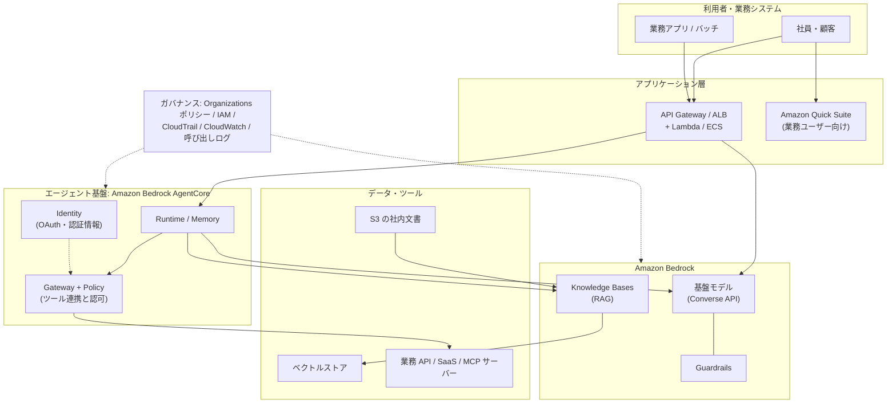
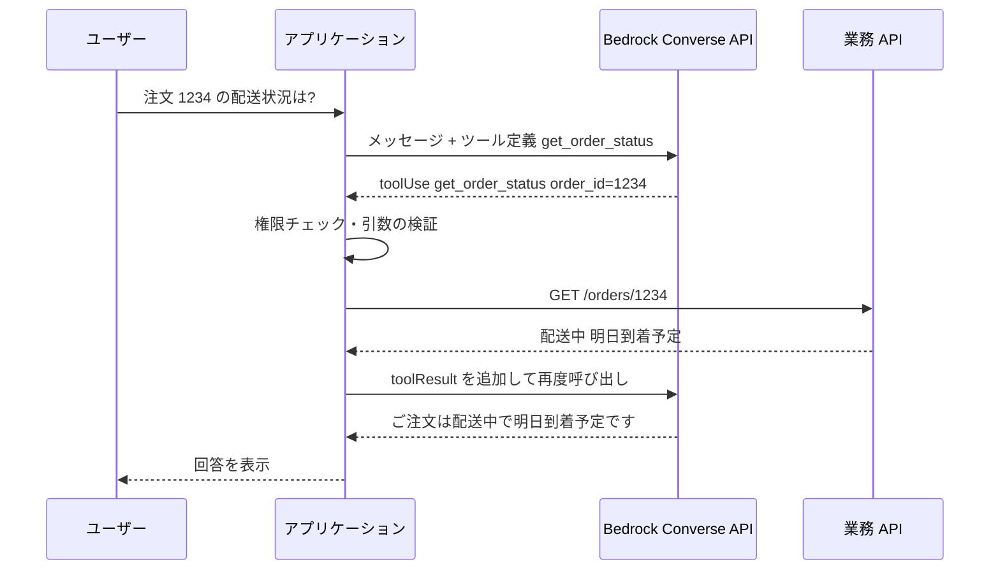
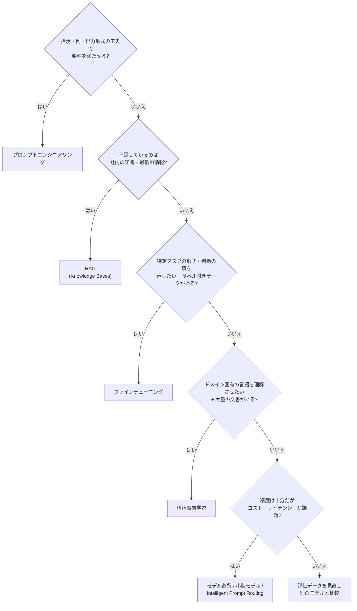
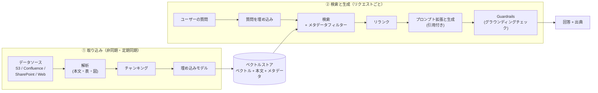

[ホーム](../README.md) > [Phase 3: プロフェッショナル](README.md) > 生成 AI・エージェント AI のアーキテクチャ

# 生成 AI・エージェント AI のアーキテクチャ

> **この章のゴール**
> - トークン・コンテキストウィンドウ・推論パラメーター・ハルシネーションが、コスト・性能・信頼性にどう効くかを説明できる
> - Amazon Bedrock の推論オプション（オンデマンド / バッチ / プロビジョンドスループット / サービスティア / クロスリージョン推論）と最適化機能（プロンプトキャッシュ、Intelligent Prompt Routing、モデル蒸留）を使い分けられる
> - プロンプトエンジニアリング・RAG・ファインチューニング・継続事前学習から、要件に合うカスタマイズ手法を選べる
> - Knowledge Bases を使った RAG を、チャンキング・ベクトルストア・メタデータフィルタリング・評価まで含めて設計できる
> - Guardrails と Amazon Bedrock AgentCore を組み合わせ、人による承認を含む安全なエージェントを設計できる
> - 組織全体の生成 AI ガバナンス（モデル制限、Guardrails の強制、ログ、ネットワーク）を設計できる
>
> **対応試験**: SAP-C03（D1 クラウドネイティブアーキテクチャの設計と実装 が中心。D2 セキュリティ・ガバナンス、D3 コスト最適化、D5 運用にも関連。ドメイン名は仮訳）
> **目安時間**: 合計 10 時間（読む 7 時間 / 確認問題 1 時間 / [Lab 12](../04-labs/lab12-bedrock-rag.md) 2 時間）

## この章の全体像

SAP-C03 で最も大きく追加された領域が、生成 AI とエージェント AI です。発表時点の情報では、この領域で **11 のスキル** が追加され、Amazon Bedrock を使ったアプリケーション統合の設計、Amazon Bedrock AgentCore による AI エージェントのアーキテクチャ、RAG（検索拡張生成）、Guardrails によるコンテンツフィルタリング、人による監督（human oversight）、コスト管理などが挙げられています。正式なタスクステートメントは 2026-10-27 公開予定の試験ガイドで必ず確認してください。

SAP で問われるのは「モデルの作り方」ではありません。**基盤モデルを部品として使い、既存のデータ・業務システム・セキュリティ統制と安全につなぐアーキテクチャ** です。本章は次の地図に沿って進みます。



| 追加スキル（発表内容の要約） | 本章の主な節 |
|---|---|
| Bedrock を使ったアプリケーション統合の設計 | 2 節、11 節 |
| RAG の設計 | 4 節 |
| コンテンツフィルタリング（Guardrails） | 5 節 |
| AgentCore による AI エージェントのアーキテクチャ | 6 節 |
| 人による監督（human-in-the-loop） | 6.7 節 |
| セキュリティとガバナンス（D2 と重なる） | 7 節 |
| コスト管理・運用 | 2.5〜2.8 節、8 節 |

> [!IMPORTANT]
> **2026年9月時点のサービス状況（古い教材との違い）**
> - **Amazon Bedrock Agents** は「**Agents Classic**」に名称変更され、2026-07-30 に新規受付を終了しました（2026年6月に発表）。新しいエージェントは **Amazon Bedrock AgentCore** で構築します。Knowledge Bases と Guardrails は影響を受けません。
> - **Amazon Kendra** と **Amazon Q Business** は 2026年6月に新規受付終了が発表されました。社内文書の RAG は Bedrock Knowledge Bases、業務ユーザー向けの AI アシスタントは Amazon Quick Suite や Bedrock ベースのアプリで設計します。
> - **Amazon SageMaker AI** の Model Monitor / Clarify / Ground Truth / Augmented AI（A2I）も 2026年6月に新規受付終了が発表されました。
> - **Amazon Q Developer** は 2026-05-15 に新規サインアップを停止し、IDE プラグインは 2027-04-30 にサポート終了予定です（後継は AI IDE の **Kiro**）。
>
> 試験や古い教材では、これらの旧サービスが正解として出題される可能性があります。本章では現在の推奨構成を教え、旧サービスは「レガシー」として仕組みだけ押さえます。最新の状況は [AWS のメンテナンス中サービス一覧](https://docs.aws.amazon.com/general/latest/gr/maintenance_services.html) で確認できます。

---

## 1. 生成 AI の基礎（アーキテクトが押さえる最小限）

### 1.1 基盤モデルと LLM

**基盤モデル（Foundation Model、FM）** は、膨大なデータで事前学習され、要約・質問応答・分類・コード生成など多くのタスクに転用できる大規模なモデルです。テキストを中心に扱うものを **大規模言語モデル（LLM）** と呼びます。

LLM の動作原理はシンプルです。入力（プロンプト）の続きとして「次に来る確率が高いトークン」を 1 つずつ選び、それを入力に足してまた次を選ぶ、という処理を繰り返します（自己回帰生成）。ここから、アーキテクチャ上の重要な性質が 3 つ導かれます。

1. **モデルは「事実を検索」していない**: もっともらしい続きを生成しているだけなので、事実と異なる内容を自信を持って出力することがある（ハルシネーション）。
2. **モデルは社内データや最新情報を知らない**: 学習データには知識のカットオフ（ある時点まで）があり、自社の規程や在庫は含まれない。→ RAG やツール連携で「外から渡す」必要がある。
3. **コストと時間は生成するトークン数に比例する**: 出力が長いほど遅く、高くなる。

| 種類 | 入力 → 出力 | 用途例 | Bedrock での例 |
|---|---|---|---|
| テキスト生成（LLM） | テキスト（+ 画像・文書）→ テキスト | 要約、QA、分類、抽出、コード | Anthropic Claude、Amazon Nova、Meta Llama、Mistral AI など |
| 埋め込み（Embedding） | テキスト・画像 → ベクトル | 意味検索、RAG、クラスタリング | Amazon Titan Text Embeddings V2、Cohere Embed |
| 画像・動画生成 | テキスト → 画像・動画 | 広告素材、デザイン案 | Amazon Nova Canvas、Stability AI など |
| リランク | クエリ + 文書群 → 関連度順 | 検索結果の並べ替え | Amazon Rerank、Cohere Rerank |

### 1.2 トークンとコンテキストウィンドウ

**トークン** は、モデルが処理する最小単位（単語の一部や記号）です。Bedrock のオンデマンド料金は **入力トークン数と出力トークン数** で決まり、多くのモデルで出力トークンの単価は入力より高く設定されています。また、呼び出しのクォータも **1 分あたりのトークン数（TPM）とリクエスト数（RPM）** で管理されます。

日本語は英語に比べて、同じ文字数でもトークン数が多くなりやすい傾向があります（トークナイザーに依存）。見積もりは英語の目安をそのまま使わず、実データで計測してください。

**コンテキストウィンドウ** は、1 回の呼び出しで扱える最大トークン数（入力 + 出力）です。最近のモデルは数十万〜100 万トークン級のものもありますが、「全部入れればよい」わけではありません。

| 概念 | 設計への影響 |
|---|---|
| 入力トークン | 長いシステムプロンプト・会話履歴・検索結果はそのままコストになる → プロンプトキャッシュ、履歴の要約、取得チャンク数の最適化 |
| 出力トークン | レイテンシーとコストに直結 → 最大トークン数の制限、簡潔な出力形式の指定、ストリーミング |
| コンテキストウィンドウ | 超える入力はエラーになる。長大な入力は精度・レイテンシー・コストが悪化しやすい（文書の中ほどにある情報を見落としやすいことも知られている）→ RAG で必要な部分だけ渡す |
| TPM / RPM クォータ | ピーク時のスロットリングの原因 → クロスリージョン推論、プロビジョンドスループット、キューで平準化 |

### 1.3 推論パラメーター

推論パラメーターは、次のトークンをどう選ぶか（ばらつき）と、どこで止めるかを制御します。

| パラメーター | 意味 | 小さくすると | 典型的な使い方 |
|---|---|---|---|
| temperature | 確率分布の「鋭さ」。高いほど低確率のトークンも選ばれやすい | 出力が安定・保守的になる | 抽出・分類・社内 QA は低め、コピーライティングやアイデア出しは高め |
| top_p | 累積確率が p に達するまでの候補からだけ選ぶ | 候補が絞られ、突飛な語が減る | temperature とどちらか一方を主に調整する |
| top_k | 確率上位 k 個の候補からだけ選ぶ（対応モデルのみ） | 候補が絞られる | 細かなチューニング用 |
| 最大トークン数 | 出力の上限 | 長い回答が途中で切れる | コストとレイテンシーの上限を決める安全装置 |
| 停止シーケンス | 指定文字列が出たら生成を止める | ― | 出力形式の制御、無駄な生成の防止 |

> [!WARNING]
> **ひっかけ注意**: temperature を 0 にしても、出力が完全に再現される保証はありません。「同じ入力で同じ出力を監査のために再現したい」という要件には、パラメーターではなく **呼び出しログ（入力・出力の保存）** で応えます（7.6 節）。

### 1.4 ハルシネーションとその対策

ハルシネーションは、モデルが事実と異なる内容や根拠のない内容をもっともらしく生成する現象です。原因は 1.1 節の「確率的な生成」「社内データを知らない」「知識のカットオフ」にあります。**モデルを大きくするだけでは解消しない** ため、アーキテクチャで多層的に抑えます。

| 対策 | 仕組み | AWS での実現 |
|---|---|---|
| 根拠を渡す | 回答に必要な文書を検索してプロンプトに入れる | Knowledge Bases（RAG）、ツールで業務 API を参照 |
| 根拠を示させる | 引用元（出典）付きで回答させ、利用者が検証できるようにする | RetrieveAndGenerate の引用（citations） |
| 根拠との整合を検査する | 回答が参照文書に基づいているか、質問に関連しているかを採点して閾値未満を遮断 | Guardrails のコンテキストグラウンディングチェック |
| ルールとの整合を論理検証する | 規程などから作った論理ルールで回答の正しさを検証 | Guardrails の自動推論チェック（Automated Reasoning checks） |
| 分からないと言わせる | 「根拠がなければ回答しない」とシステムプロンプトで指示 | プロンプト設計、低い temperature |
| 出力を機械的に検証する | JSON スキーマ、業務ルール、参照整合性をコードでチェック | Lambda / Step Functions での検証 |
| 人が確認する | 影響の大きい出力は人の承認を経てから使う | Step Functions のタスクトークン（6.7 節） |

### 1.5 埋め込みとベクトル検索（RAG の土台）

**埋め込み（エンベディング）** は、文章や画像の「意味」を数百〜数千次元の数値ベクトルに変換したものです。意味が近い文章はベクトル空間上で近くに配置されるため、キーワードが一致しなくても「似た意味の文書」を探せます。例えば「有給休暇の申請方法」というクエリで「年次休暇を取得する手続き」という見出しの文書を見つけられます。

- **類似度**: コサイン類似度、ユークリッド距離、内積などで測る。
- **近似最近傍探索（ANN）**: 全件と比較すると遅いため、HNSW などのインデックスで「ほぼ最も近いもの」を高速に探す。精度と速度・メモリのトレードオフがある。
- **同じ埋め込みモデルを使う**: 文書の取り込み時と検索時で同じモデル・同じ次元数を使う必要がある。モデルを変えたら **全文書の再埋め込み（再インデックス）** が必要。
- **次元数のトレードオフ**: 次元が大きいほど表現力は高いが、ストレージ・メモリ・検索レイテンシーが増える（例: Titan Text Embeddings V2 は 256 / 512 / 1,024 次元から選べる）。
- **ハイブリッド検索**: 型番・社員番号・固有名詞のような「完全一致が重要な語」はベクトル検索が苦手。キーワード検索（BM25 など）と組み合わせると精度が上がる。

> [!TIP]
> **試験のポイント**: 「意味的に類似した文書を検索」「セマンティック検索」「RAG の検索部分」とあれば **埋め込みモデル + ベクトルストア**。「製品型番の完全一致も重要」とあれば **ハイブリッド検索**（キーワード + ベクトル）に対応したストア（OpenSearch など）を選びます。

---

## 2. Amazon Bedrock の設計ポイント

### 2.1 Bedrock の全体像

Amazon Bedrock は、複数のプロバイダーの基盤モデルを **サーバーレスな単一の API** で利用できるフルマネージドサービスです。GPU の調達やモデルのホスティングは不要で、使った分（トークン数など）だけ支払います。さらに、アプリケーションに必要な部品が機能として揃っています。

| 機能 | 役割 | 本章 |
|---|---|---|
| 基盤モデル（モデルカタログ） | Anthropic、Amazon（Nova）、Meta、Mistral AI、Cohere などのモデルを API で利用 | 2 節 |
| Knowledge Bases | マネージドな RAG（取り込み・チャンキング・埋め込み・検索・引用） | 4 節 |
| Guardrails | 入力と出力の安全対策（有害コンテンツ、個人情報、プロンプト攻撃、根拠チェック） | 5 節 |
| Amazon Bedrock AgentCore | エージェントを本番運用するための基盤（実行、メモリ、ツール連携、認証、観測、ポリシー、評価） | 6 節 |
| Flows / Prompt Management | プロンプトや処理をつないだワークフロー、プロンプトのバージョン管理 | 2.9 節 |
| Evaluations | モデル・RAG の品質評価（自動評価、LLM-as-a-judge、人による評価） | 8.2 節 |
| Bedrock Data Automation（BDA） | 文書・画像・音声・動画から構造化データを抽出 | 11.3 節 |
| モデルのカスタマイズ | ファインチューニング、継続事前学習、モデル蒸留、カスタムモデルのインポート | 3 節 |

### 2.2 モデルアクセス（2025年10月以降の変更）

2025年10月以降、商用リージョンでは Bedrock の **サーバーレスな基盤モデルがデフォルトで利用可能** になりました（以前の「モデルアクセス」ページは廃止）。Anthropic のモデルだけは、初回に **一度だけユースケースの申請フォーム** の提出が必要です。

「どのモデルを誰が使えるか」は、コンソールのスイッチではなく **IAM ポリシーと SCP** で制御します（7.3 節）。

> [!WARNING]
> **ひっかけ注意**: 古い教材や試験問題では「モデルアクセスページで対象モデルを有効化していないため AccessDeniedException になる」という設定が出てくることがあります。現在はデフォルトで有効なので、組織として利用モデルを絞りたい場合は **SCP や IAM で明示的に拒否・許可** する設計が必要です。「何もしなければ使えない」という前提は成り立ちません。

### 2.3 モデル選択の観点

SAP の問題では「最も高性能なモデル」ではなく、**要件を満たす中で最もコスト効率が高いモデル** が正解になることが多いです。

| 観点 | 確認すること | 設計上の意味 |
|---|---|---|
| タスク品質 | 自社の評価データセットでの正答率・有用性 | 候補モデルを Bedrock Evaluations で比較してから決める |
| 日本語性能 | 日本語の読解・敬語・表記ゆれへの強さ | 英語のベンチマークだけで判断しない |
| レイテンシー | 最初のトークンまでの時間（TTFT）、出力トークン/秒 | 対話 UI はストリーミング + 小〜中規模モデル、バッチは問わない |
| コスト | 入力・出力トークン単価、キャッシュ単価 | 大量処理は小型モデル・バッチ・蒸留を検討 |
| コンテキスト長 | 必要な入力の長さ | 長文を毎回入れるならキャッシュや RAG と併用 |
| モダリティ | 画像・PDF・音声・動画の入力、画像生成 | 図表を含む文書処理はマルチモーダルモデル |
| 機能対応 | ツール利用、プロンプトキャッシュ、クロスリージョン推論、バッチ、ファインチューニング、Guardrails との組み合わせ | モデルによって対応が異なる |
| リージョンとデータ所在 | 利用リージョン、推論が処理されるリージョン | データ所在要件があれば地理的推論プロファイル（2.5 節） |

> [!TIP]
> **試験のポイント**: 「簡単な分類を大量に」「最小のコスト」→ 小型モデル（+ バッチ）。「難易度がばらつく問い合わせ」→ Intelligent Prompt Routing。「特定タスクで大型モデル並みの精度を小型モデルで」→ モデル蒸留。「モデルを差し替えやすくしたい」→ Converse API。

### 2.4 呼び出し API: InvokeModel と Converse API

| API | 特徴 | 使いどころ |
|---|---|---|
| InvokeModel / InvokeModelWithResponseStream | リクエスト本文がモデルごとに異なる（ネイティブ形式） | 埋め込み・画像生成など、モデル固有の機能を使う場合 |
| **Converse / ConverseStream** | **モデル間で共通のメッセージ形式**。システムプロンプト、マルチターン会話、ツール利用、画像・文書入力、Guardrails の指定を統一的に扱える | チャット・エージェント・業務アプリの標準。モデル ID を変えるだけで差し替えられる |
| バッチ推論（CreateModelInvocationJob） | S3 上の JSONL をまとめて非同期処理 | リアルタイム性が不要な大量処理（2.5 節） |

Converse API の重要な機能が **ツール利用（Tool use / Function calling）** です。モデルは自分で API を呼べません。モデルは「このツールをこの引数で呼んでほしい」という **要求（toolUse）** を返し、実際の実行はアプリケーション側が行って結果（toolResult）を返します。この「モデルが考え、アプリが実行する」ループが、6 節のエージェントの基本形です。



この構造から、セキュリティ上の大原則が導かれます。**ツールを実行するのはアプリケーション（またはエージェント基盤）であり、そこで認可・入力検証を行える**、ということです。モデルの出力を信用せず、実行前に必ず検証します（7.4 節）。

> [!NOTE]
> ツール定義に JSON スキーマを与えてモデルにそのツールを使わせると、モデルの出力を **スキーマに沿った JSON** として受け取れます。文書からの項目抽出など、後続処理が機械的に読む出力に便利です。それでも、受け取った JSON はコード側で検証します。

### 2.5 推論オプション（オンデマンド / サービスティア / バッチ / プロビジョンドスループット / クロスリージョン推論）

同じモデルでも、**どう呼び出すか** でコスト・レイテンシー・スループットが大きく変わります。SAP では「リアルタイム性が必要か」「量は一定か、バースト的か」「データをどこで処理してよいか」の 3 点から選びます。

| オプション | 課金（2026年9月時点） | 特徴 | 向いているワークロード |
|---|---|---|---|
| オンデマンド（Standard ティア） | 入力・出力トークン単価 | コミットなし。TPM / RPM クォータの範囲で利用 | 一般的な対話・業務アプリ |
| Priority ティア | Standard より割増（公式ページでは約 75% 増し） | 処理が優先され、出力トークン/秒が向上（多くの対応モデルで最大 25% 程度） | レイテンシーが顧客体験や売上に直結する対話 |
| Flex ティア | Standard より割引（公式ページでは 50% 割引） | 優先度が低く、処理時間が延びることを許容 | モデル評価、要約、エージェントのバックグラウンド処理 |
| バッチ推論 | オンデマンドの約 50%（対応モデル） | S3 上の JSONL をジョブでまとめて非同期処理し、結果を S3 に出力 | 大量文書の要約・分類・埋め込み生成、夜間処理 |
| プロビジョンドスループット | モデルユニット（MU）単位の時間課金。1 か月または 6 か月のコミットで割引（カスタムモデルにはコミットなしの購入方法もある） | 一定のスループットを確保できる。カスタムモデルの推論で使うことが多い | 安定した大量トラフィック、スループットの保証、カスタムモデル |
| クロスリージョン推論 | 追加料金なし（送信元リージョンの料金） | 推論プロファイル経由で、複数リージョンの容量に自動で振り分け | ピーク時のスロットリング対策、スループット向上 |

サービスティア（Priority / Standard / Flex）は 2025年11月に追加された仕組みで、リクエストごとに選べます。2026年9月時点では、キャパシティを予約する Reserved ティアも案内されています。料金と対応モデルは [Amazon Bedrock のサービスティア](https://aws.amazon.com/bedrock/service-tiers/) で確認してください。

#### クロスリージョン推論とデータ所在

クロスリージョン推論（CRIS）は、**推論プロファイル** を指定して呼び出すと、Bedrock が同じ地域グループ内の複数リージョンに推論を自動で振り分ける仕組みです。1 つのリージョンの容量不足によるスロットリングを避けられます。

| 種類 | 振り分け先 | 使いどころ |
|---|---|---|
| 地理的クロスリージョン推論 | 同じ地理的範囲のリージョンのみ（US、EU、APAC など。一部のモデルでは **日本（東京・大阪）** や オーストラリアに閉じたプロファイルもある） | データ所在要件がある場合の標準 |
| グローバルクロスリージョン推論（2025-09〜） | 世界中の対応商用リージョン | データ所在の制約がなく、スループットを最大化したい場合 |

- 通信は AWS のグローバルネットワーク上を流れ、パブリックインターネットを経由しません。
- 推論の **処理** が他リージョンで行われることがあっても、呼び出しログやナレッジベースなど **保存されるデータは送信元リージョン** に置かれます。
- IAM では、推論プロファイルと振り分け先リージョンの基盤モデルの両方に対する権限が必要です。**リージョンを制限する SCP を使っている組織では、振り分け先リージョンでの推論が SCP で拒否されないように例外を設計** します（詳細は [クロスリージョン推論の公式ドキュメント](https://docs.aws.amazon.com/bedrock/latest/userguide/cross-region-inference.html) を参照）。

> [!WARNING]
> **ひっかけ注意**: 「個人データを日本国内で処理することが規制で求められる」要件に対して、**グローバル** クロスリージョン推論は選べません。東京リージョン内のオンデマンド推論、または日本（東京・大阪）に閉じた地理的推論プロファイル（対象モデルのみ）を選びます。「スロットリング対策」だけを見てグローバルを選ばないようにしてください。

> [!TIP]
> **試験のポイント**: 「翌朝までに数百万件を処理」「リアルタイム性不要」「最もコスト効率が高い」→ **バッチ推論**（または Flex）。「ピーク時に ThrottlingException」→ **クロスリージョン推論**（+ 指数バックオフ付きリトライ）。「常に一定の大量トラフィックでスループットを保証」「カスタムモデル」→ **プロビジョンドスループット**。「レイテンシー最優先で割増料金を許容」→ **Priority ティア**。

### 2.6 プロンプトキャッシュ

RAG やエージェントでは、長いシステムプロンプト、ツール定義、参照文書など **毎回同じ前半部分（プレフィックス）** を送り続けることがよくあります。プロンプトキャッシュ（2025年4月 GA）は、このプレフィックスの処理結果を一時的に保持して再利用する機能です。

- **仕組み**: プロンプト内にキャッシュのチェックポイントを置くと、チェックポイントまでの内容が完全に一致する後続リクエストでは、その部分をキャッシュから読み込みます。キャッシュ読み取りのトークンは通常の入力より大幅に安く、処理も速くなります（AWS は対応モデルでコスト最大 90%・レイテンシー最大 85% の削減を例示）。
- **有効期間**: キャッシュは最後のアクセスから短時間（既定で 5 分程度）で失効し、ヒットするたびに延長されます。
- **設計のコツ**: 変わらない内容（システムプロンプト、ツール定義、長い文書）を前に、変わる内容（ユーザーの質問）を後ろに置きます。チェックポイントごとに最小トークン数があり、モデルによって対応状況が異なります。
- **注意**: モデルによってはキャッシュ書き込みが通常の入力より割高です。再利用されないプレフィックスをキャッシュすると逆にコストが増えます。

### 2.7 Intelligent Prompt Routing

Intelligent Prompt Routing（2025年4月 GA）は、**同じモデルファミリー内** の複数のモデル（例: 大型と小型）の間で、リクエストごとに「どのモデルなら十分な品質の回答をより安く返せるか」を予測して振り分ける機能です。簡単な質問は小型モデル、難しい質問は大型モデルに送られます。

- 向いているのは、問い合わせの難易度がばらつくチャットや FAQ（AWS は最大 30% 程度のコスト削減を例示）。
- ルーターは **同一ファミリー内** のモデルが対象で、異なるプロバイダー間の振り分けには使えません。
- 自社のルールで明確に振り分けられる場合（例: 「要約は小型、契約書レビューは大型」）は、アプリ側で決め打ちするほうが単純です。

### 2.8 モデル蒸留（Model Distillation）

モデル蒸留は、大型で高精度な **教師モデル** の回答を使って、小型で高速な **生徒モデル** を特定タスク向けに学習させる手法です。Bedrock では、用意したプロンプト（または呼び出しログに残っている実際のプロンプト）を教師モデルに回答させて学習データを自動生成し、生徒モデルをファインチューニングします。

- **効果**: 特定タスクにおいて、大型モデルに近い精度を、小型モデルのコストとレイテンシーで実現する。
- **向いている状況**: 同じ種類のタスクが大量にあり、大型モデルの品質は必要だがコストやレイテンシーが見合わない。
- **注意**: 結果はカスタムモデルになるため、推論方法（プロビジョンドスループット、または対応モデルではオンデマンド）と更新の運用が必要です。汎用性は下がります。

### 2.9 Bedrock Flows と Prompt Management

- **Bedrock Flows**（2024年11月 GA）: プロンプト、ナレッジベース、Lambda、条件分岐などをつないだ生成 AI ワークフローを定義し、バージョンとエイリアスで管理します。処理の順序が決まっている定型処理に向いています。
- **Prompt Management**: 変数付きのプロンプトテンプレートをバージョン管理し、アプリのコードから分離します。

> [!NOTE]
> 人の承認待ち、長時間の待機、多数の AWS サービスとの連携、エラー時の補償処理が必要な業務ワークフローは、**AWS Step Functions**（Bedrock の最適化統合あり）のほうが適しています。Step Functions の設計は [クラウドネイティブ設計](08-cloud-native-architecture.md) を参照してください。

---

## 3. カスタマイズの選択肢

### 3.1 どの順番で検討するか

基盤モデルを自社の要件に合わせる手段は複数あります。原則は **「安く・速く・元に戻せる手法から試す」** です。プロンプトの工夫は即日試せて失敗しても捨てるだけですが、継続事前学習は大量のデータと費用が必要で、知識は学習時点で固定されます。

| 手法 | 何を変えるか | 必要なデータ | コスト・期間 | 知識の鮮度 | 向いている用途 | 注意点 |
|---|---|---|---|---|---|---|
| プロンプトエンジニアリング | 入力（指示、例、出力形式） | 少数の例（few-shot） | 最小・即日 | 入力に含めた分だけ | 出力形式・口調の統一、単純なタスク | 長いプロンプトはトークンコスト → キャッシュ |
| RAG | 実行時に渡す知識 | 文書（ラベル不要） | 中（取り込み処理とベクトルストア） | **同期すれば最新** | 社内規程 QA、マニュアル、出典の提示が必要な回答 | 検索の品質が回答の品質を決める |
| ファインチューニング | モデルの重み（振る舞い） | ラベル付きの入力と出力のペア | 中〜高（学習 + カスタムモデルの推論費用） | 学習時点で固定 | 特定の形式・文体・分類、プロンプトで直らない癖 | 事実知識の注入には不向き。変更のたびに再学習 |
| 継続事前学習 | モデルの重み（ドメインの言語理解） | 大量のラベルなしドメイン文書 | 高 | 学習時点で固定 | 専門用語が多い業界（医療・法務・社内独自用語）への適応 | データ量と費用が大きい。まず RAG で足りるか検証 |
| モデル蒸留 | 小型モデルの重み | プロンプト（回答は教師モデルが生成） | 中 | 学習時点で固定 | 精度を保ったままコストとレイテンシーを下げる | 特定タスク向けで汎用性は下がる |

これらは排他的ではありません。例えば「ファインチューニングで社内の回答フォーマットを身につけさせ、知識は RAG で渡す」という組み合わせは一般的です。他の環境で学習したモデルの重みは、**カスタムモデルインポート** で Bedrock に取り込み、サーバーレスに推論させることもできます（対応するアーキテクチャのみ）。



> [!WARNING]
> **ひっかけ注意**: 「毎週更新される社内規程にモデルが答えられるよう、規程をファインチューニングで学習させる」は典型的な誤答です。(1) 更新のたびに再学習が必要で古くなる、(2) 回答の出典を示せない、(3) 利用者ごとの閲覧権限を反映できない、(4) それでもハルシネーションは起きる、という理由で **RAG** が正解です。

> [!TIP]
> **試験のポイント**: 「ラベル付きデータ」→ ファインチューニング。「ラベルなしの大量のドメイン文書」→ 継続事前学習。「最新情報」「出典」「ドキュメントごとのアクセス制御」→ RAG。「運用上のオーバーヘッドが最も少ない」→ まずプロンプトエンジニアリング、次にマネージドな RAG（Knowledge Bases）。

---

## 4. RAG の設計

### 4.1 RAG の仕組み

RAG（Retrieval-Augmented Generation、検索拡張生成）は、質問に関連する文書を検索し、その内容をプロンプトに加えてから回答を生成させる方式です。モデルの重みは変えず、**知識を実行時に渡す** のが本質です。RAG は性質の異なる 2 つのパイプラインから成ります。



- **取り込みパイプライン** はバッチ処理です。同期の頻度が「回答の新しさ」を決めます（例: 毎時同期なら最大 1 時間古い）。
- **検索と生成のパイプライン** はリクエストごとに動きます。レイテンシーは「埋め込み + 検索 + リランク + 生成」の合計で、ほとんどは生成が占めます。
- 回答の品質は、**検索で正しいチャンクを取れたか**（検索品質）と、**取れたチャンクから正しく答えたか**（生成品質）に分解して考えます（4.8 節）。

### 4.2 Amazon Bedrock Knowledge Bases

Knowledge Bases は、上の図の取り込みと検索をマネージドに提供する機能です。

| 項目 | 内容 |
|---|---|
| データソース | S3、Web クローラー、Confluence、SharePoint、Salesforce、カスタム（API から直接取り込み）など |
| 同期 | 取り込みジョブで追加・変更・削除された文書だけを反映（増分同期）。EventBridge のスケジュールなどで定期実行 |
| 解析（パーサー） | 既定のパーサー（テキスト中心）のほか、表や図を含む PDF などには Bedrock Data Automation や基盤モデルをパーサーとして使える |
| API | **Retrieve**（関連チャンクを返す。生成は自前）/ **RetrieveAndGenerate**（検索から引用付きの回答生成まで一括） |
| 構造化データ | Redshift などに対して、自然言語から SQL を生成して回答する構成に対応 |
| GraphRAG | Neptune Analytics と組み合わせ、エンティティ間の関係をたどる質問に強くする |

Retrieve API だけを使えば、生成部分は自前のプロンプトやエージェントに任せられます。RetrieveAndGenerate は最短で RAG を作れる代わりに、細かな制御は Retrieve より少なくなります。

> [!NOTE]
> 以前は Amazon Kendra を RAG の検索基盤として使う構成が定番でしたが、Kendra は 2026年6月に新規受付終了が発表されました。新規の設計では **Bedrock Knowledge Bases** を使います。試験や古い教材で「Kendra + LLM」の構成が出てきたら、「エンタープライズ検索のマネージドサービスで、コネクターと文書単位のアクセス制御を持つ」という位置づけを思い出してください。

### 4.3 チャンキング戦略

チャンキングは、文書を検索の単位（チャンク）に分割する処理です。**チャンクが小さすぎると文脈が失われ、大きすぎると無関係な内容が混ざって埋め込みがぼやけ、トークンコストも増えます。** 文書の構造に合わせて選びます。

| 戦略 | 仕組み | 長所 | 短所 | 向いている文書 |
|---|---|---|---|---|
| デフォルト | 約 300 トークンを目安に、文の区切りを考慮して分割 | 設定不要 | 文書構造は考慮しない | まず試す基準 |
| 固定サイズ | 指定したトークン数とオーバーラップ（重なり）で分割 | 単純で予測しやすい | 節の途中で切れることがある | 均質な文章 |
| 階層型 | 小さな子チャンクで検索し、対応する大きな親チャンクを返す | 検索精度と文脈量を両立 | 生成に渡すトークンが増える | 章・節構造のあるマニュアルや規程 |
| セマンティック | 文の意味の近さで話題の切れ目を判定して分割 | 話題単位でまとまる | 取り込み時に埋め込み処理の追加コスト | 話題が混在する長文 |
| チャンキングなし | 1 ファイル = 1 チャンク | 事前に分割済みなら最適 | 大きなファイルには不向き | 1 問 1 ファイルの FAQ など |
| カスタム（Lambda） | 独自ロジックで分割・加工 | 独自フォーマットや表に対応 | 開発と運用の手間 | 特殊な帳票、コードなど |

> [!TIP]
> **試験のポイント**: 「回答に必要な前後の文脈が欠ける」→ 階層型チャンキングやオーバーラップの拡大。「無関係な内容が混ざる」「トークンコストが高い」→ チャンクを小さくする、取得件数を減らしてリランクする。「表の内容が正しく検索できない」→ 表や図に対応したパーサー（Bedrock Data Automation や基盤モデルのパーサー）。

### 4.4 埋め込みモデルの選択

- **言語**: 日本語文書なら多言語対応の埋め込みモデル（Amazon Titan Text Embeddings V2、Cohere Embed Multilingual など）を選び、自社データで検索精度を比較します。
- **次元数**: 次元を下げるとストレージとレイテンシーは改善しますが、精度が下がる場合があります。
- **変更の影響**: 埋め込みモデルを変えると全文書の再埋め込みが必要です。最初に評価データで選び、安易に変えない設計にします。

### 4.5 ベクトルストアの選択

Knowledge Bases は複数のベクトルストアに対応しています。**性能要件（レイテンシー・QPS）、データ量、検索頻度、既存資産、コスト構造** で選びます。

| ベクトルストア | 特性 | コスト構造 | 向いている用途 | 注意点 |
|---|---|---|---|---|
| Amazon OpenSearch Serverless | 低レイテンシー・高 QPS。ハイブリッド検索（キーワード + ベクトル）や豊富なフィルター | OCU（計算容量）+ ストレージ。**クラシックコレクションは最小 OCU 分の料金が常時かかる**。2026年から **コレクショングループの NextGen コレクションはゼロまでスケール可能** | 本番の対話型 RAG、型番など完全一致も重要な検索 | クラシックは小規模・低頻度だと割高。NextGen はアイドル後の初回にコールドスタートがある |
| Amazon OpenSearch Service（マネージドクラスター） | 既存クラスターを活用でき、細かく調整できる | インスタンス時間 | 既に OpenSearch を運用している組織 | クラスターの運用が必要 |
| Aurora PostgreSQL（pgvector） | SQL でベクトルと業務データを一緒に扱える。トランザクション | Aurora の料金（Serverless v2 も可） | 既存の Aurora 資産、リレーショナルなメタデータとの結合 | 大規模・高 QPS では索引とインスタンスのチューニングが必要 |
| **Amazon S3 Vectors**（2025-12-02 GA） | S3 のベクトルバケット / ベクトルインデックス。1 インデックス最大 20 億ベクトル | 保存量・書き込み・クエリの従量課金。**低コスト**（AWS は総コスト最大 90% 削減をうたう） | 大量のベクトルを安く保持したい、検索頻度が低〜中程度 | ミリ秒単位の応答や高 QPS が必要なら OpenSearch を選ぶ |
| Amazon Neptune Analytics | グラフ + ベクトル。**GraphRAG** | 確保するメモリ容量ベース | 「A 社の子会社の取引先は?」のような関係をたどる多段の質問 | グラフ構築の処理とコスト |
| サードパーティ（Pinecone、MongoDB Atlas、Redis Enterprise Cloud など） | 既存の SaaS を活用 | 各社の料金 | 既に利用している組織 | データが AWS 外に出る場合の統制 |

OpenSearch Serverless の NextGen コレクションは、リクエストがない状態が 10 分続くとゼロまでスケールし、課金も止まります（2026年9月時点。[公式ドキュメント](https://docs.aws.amazon.com/opensearch-service/latest/developerguide/serverless-scale-to-zero.html)）。

> [!WARNING]
> **ひっかけ注意**: 古い教材には「OpenSearch Serverless は最小 OCU の料金が常にかかるので小規模には高い」とだけ書かれています。これは **クラシックコレクション** の話です。2026年からはコレクショングループの NextGen コレクションでゼロまでスケールできます。一方、**大量のベクトルを低頻度で検索し、コストを最優先する** 要件なら、S3 Vectors が有力な答えです。

### 4.6 メタデータフィルタリングとアクセス制御

社内 RAG で最も重要な非機能要件が「**見てはいけない文書を回答に使わない**」ことです。Knowledge Bases では、文書にメタデータを付けて検索時にフィルターできます。S3 のデータソースでは、文書と同じ場所に `<ファイル名>.metadata.json` を置きます。

```json
{
  "metadataAttributes": {
    "department": "hr",
    "confidentiality": 2,
    "year": 2026
  }
}
```

検索時（Retrieve / RetrieveAndGenerate）にフィルターを指定します。

```json
{
  "vectorSearchConfiguration": {
    "numberOfResults": 5,
    "filter": {
      "andAll": [
        { "in": { "key": "department", "value": ["all", "hr"] } },
        { "lessThanOrEquals": { "key": "confidentiality", "value": 2 } }
      ]
    }
  }
}
```

**設計の原則**:

1. **フィルターはバックエンドで組み立てる**: 利用者の所属や権限は、認証済みのトークン（Amazon Cognito や IAM Identity Center 経由の IdP のグループ情報など）からサーバー側で決めます。クライアントから送られたフィルターを信用してはいけません。
2. **権限の変更に追従させる**: 元のシステムで文書の閲覧権限が変わったら、メタデータを更新して再同期する仕組みを作ります。
3. **マルチテナントの分離レベルを選ぶ**:

| 方式 | 分離の強さ | コスト・運用 | 向いているケース |
|---|---|---|---|
| テナントごとにナレッジベース（+ インデックス）を分ける | 強い（物理的・論理的に分離） | リソース数と運用が増える | 規制業種、契約で分離が求められる |
| 共有ナレッジベース + `tenant_id` メタデータフィルター | フィルターの正しさに依存 | 効率的 | 多数の小規模テナント |
| 階層化（大口は専用、小口は共有） | 中間 | 中間 | SaaS の料金プランに合わせる |

### 4.7 検索品質を上げる工夫

- **ハイブリッド検索**: 対応するベクトルストア（OpenSearch など）では、意味検索とキーワード検索を組み合わせられます。型番・略語・社内コードに強くなります。
- **リランク**: 最初の検索で多め（例: 20〜50 件）に取り、リランクモデル（Amazon Rerank、Cohere Rerank）で関連度順に並べ替えて上位数件だけを生成に渡します。**精度が上がり、渡すトークンも減る** ので、品質とコストの両方に効きます。
- **クエリの分解・書き換え**: 複合的な質問（「A 製品と B 製品の保証期間の違いは?」）を複数の検索クエリに分解します。
- **取得件数の調整**: 多すぎると無関係な内容でモデルが混乱し、少なすぎると根拠が欠けます。評価データで決めます。
- **引用の提示**: 出典を UI に表示すると、利用者が回答を検証でき、信頼性が上がります。

### 4.8 RAG の評価

RAG の品質は「なんとなく良さそう」ではなく、**評価データセットと指標** で管理します。

| 観点 | 主な指標 | 悪いときの対策 |
|---|---|---|
| 検索品質 | 文脈の関連性（取れたチャンクは質問に関係するか）、文脈の網羅性（正解に必要な情報を取れたか） | チャンキング、埋め込みモデル、ハイブリッド検索、メタデータ、リランク |
| 生成品質 | 正確性、完全性、忠実性（取れた文脈に基づいているか）、有用性 | プロンプト、モデル、グラウンディングチェック |
| 安全性 | 有害性、回答拒否の適切さ | Guardrails |

- **Amazon Bedrock Evaluations** の RAG 評価では、「検索のみ」または「検索と生成」を対象に、LLM を評価者として使う方式（LLM-as-a-judge）で上記の指標を採点できます。Knowledge Bases だけでなく、自前の RAG の出力を持ち込んで評価することもできます。
- 評価データセット（質問、模範回答、期待される出典）は業務の専門家と作ります。チャンキング・埋め込みモデル・プロンプト・モデルを変えるたびに実行し、**回帰テスト** として CI/CD に組み込みます。
- 本番では、利用者のフィードバック（良い / 悪い）、「回答できません」の割合、Guardrails の介入率を継続的に監視します。

> [!TIP]
> **試験のポイント**: 「回答に必要な文書が検索結果に含まれていない」→ 検索側（チャンキング、埋め込み、ハイブリッド検索、メタデータ）を直す。「正しい文書は取れているのに回答が不正確」→ 生成側（プロンプト、モデル、グラウンディングチェック）を直す。原因を分解できるかが問われます。

RAG は [Lab 12: Amazon Bedrock Knowledge Bases で RAG](../04-labs/lab12-bedrock-rag.md) で実際に構築します。本節を読んだ後に取り組むと理解が深まります。
