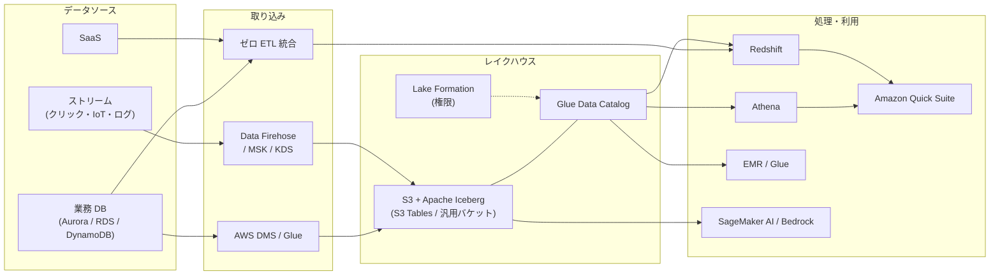
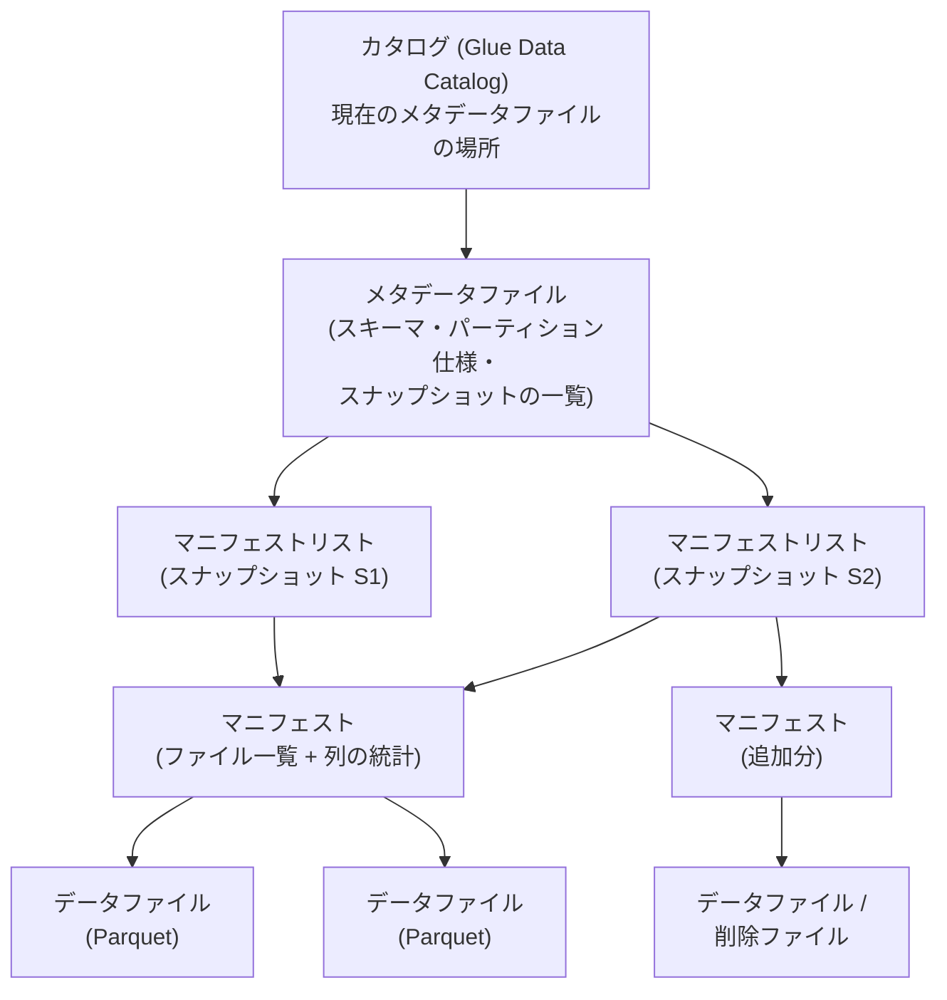
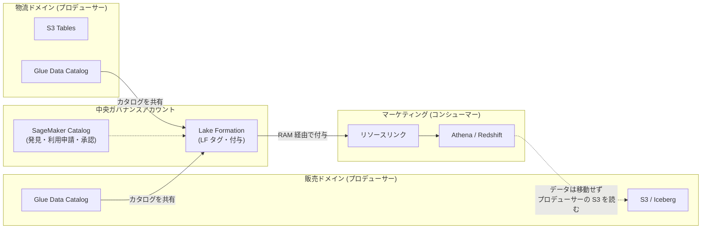
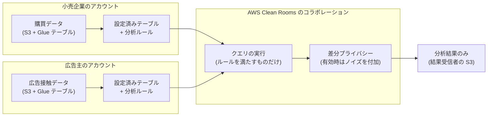

[ホーム](../README.md) > [Phase 3: プロフェッショナル](README.md) > データと分析のアーキテクチャ

# データと分析のアーキテクチャ

> **この章のゴール**
> - データレイクからレイクハウスへ進化した理由（ACID、スキーマ進化、複数エンジンでの共有）を説明できる
> - Apache Iceberg の仕組みを理解し、S3 Tables とセルフマネージドな Iceberg を使い分けられる
> - Lake Formation（LF タグ、行・列・セルレベルのフィルター、クロスアカウント共有、ハイブリッドアクセスモード）でマルチアカウントのデータガバナンスを設計できる
> - バッチ・ストリーミング・ゼロ ETL の取り込みと、Glue / EMR / Flink / Redshift の処理を要件で選べる
> - データメッシュ、Redshift データ共有、AWS Clean Rooms を使い分けられる
> - パーティション・ファイルサイズ・圧縮・コンパクションでコストと性能を最適化できる
>
> **対応試験**: SAP-C03（D1 クラウドネイティブアーキテクチャの設計と実装 が中心。D2 ガバナンス、D3 コスト最適化にも関連。ドメイン名は仮訳）
> **目安時間**: 合計 7 時間（読む 5.5 時間 / 確認問題 1.5 時間）

## この章の全体像

SAP-C03 では、データと分析の領域で **レイクハウス（Lake Formation と Apache Iceberg）** と **AWS Clean Rooms** に関するスキルが追加されたと発表されています。クラウドネイティブの領域でも **サーバーレスなデータパイプライン** が挙げられています。正式なタスクステートメントは 2026-10-27 公開予定の試験ガイドで確認してください。

各サービスの基本は [データ分析サービス](../02-associate/14-analytics.md) で学びました。この章では、**数十のアカウントと部門にまたがるデータを、1 つの統制のもとで多数のエンジンから安全に使う** ための設計を扱います。



| SAP-C03 で追加・強調された領域（発表内容の要約） | 本章の主な節 |
|---|---|
| レイクハウス（Lake Formation と Apache Iceberg） | 1〜5 節 |
| サーバーレスなデータパイプライン | 6〜7 節 |
| データ共有とガバナンス（D2 と重なる） | 4 節、8 節 |
| AWS Clean Rooms | 9 節 |
| コストと性能の最適化（D3 と重なる） | 11 節 |

> [!IMPORTANT]
> **2026年9月時点のサービス状況（古い教材との違い）**
> - **Amazon QuickSight** は 2025年10月に **Amazon Quick Suite** へ再編されました（BI の機能は Amazon Quick Sight）。
> - 機械学習サービスの Amazon SageMaker は **Amazon SageMaker AI** に改称され、「Amazon SageMaker」はデータ・分析・AI の統合プラットフォームの名称になりました（5 節）。SageMaker Lakehouse は現在「Amazon SageMaker のレイクハウスアーキテクチャ」と呼ばれます。
> - **Kinesis Data Analytics for SQL** は 2026-01-27 に終了しました。ストリーム処理は **Amazon Managed Service for Apache Flink** を使います。
> - **AWS Glue の Ray ジョブ** は 2026年3月に新規受付終了が発表されました。**AWS Data Pipeline**、**S3 Select**、**Amazon CloudSearch** も新規受付を終了しています（後継はそれぞれ Glue / Step Functions / Amazon MWAA、Athena、OpenSearch Service）。
>
> 試験や古い教材では旧名称や旧サービスで出題される可能性があります。本章では現在の推奨構成を教えます。

---

## 1. モダンデータアーキテクチャ: データレイクからレイクハウスへ

### 1.1 データウェアハウスと従来型データレイクの限界

データ基盤は次のように進化してきました。

| 観点 | データウェアハウス（DWH） | 従来型のデータレイク | レイクハウス |
|---|---|---|---|
| 保存形式 | DWH 独自の形式（エンジンと一体） | S3 上のファイル（CSV / Parquet）+ Hive 形式のテーブル定義 | S3 上の **オープンなテーブル形式**（Apache Iceberg） |
| データの種類 | 構造化 | 構造化・半構造化・非構造化 | 構造化・半構造化（非構造化データは S3 に併置） |
| 更新・削除 | 得意（ACID トランザクション） | 苦手（パーティション単位でファイルを書き直す） | **行レベルの更新・削除（ACID）** |
| スキーマ変更 | 可能 | 困難（既存ファイルとの不整合） | **スキーマ進化** に対応 |
| 使えるエンジン | その DWH のみ | 多数（Athena、EMR、Glue など） | 多数（**同じテーブルを複数エンジンで共有**） |
| コスト | 計算とストレージが一体になりがち | 安価（S3） | 安価（S3）+ 計算は用途ごとに選択 |

従来型のデータレイク（ディレクトリ = パーティションという Hive 形式のテーブル）には、規模が大きくなるほど次の問題が表面化します。

1. **トランザクションがない**: 書き込みの途中を読むと不完全なデータが見える。複数のジョブが同時に書くと壊れる。
2. **行単位の削除が難しい**: 「この顧客のデータを削除してほしい」という個人情報保護法や GDPR の要求に、パーティション全体の書き直しで対応することになる。
3. **スキーマ変更が危険**: 列の追加・名前変更で、古いファイルとの対応が崩れる。
4. **ファイルの一覧取得が遅い**: クエリのたびに S3 のプレフィックスを一覧し、パーティションとファイルを探す必要がある。
5. **過去の状態を再現できない**: 誤った更新を元に戻す、先月末時点のデータで再集計する、といったことができない。

**レイクハウス** は、S3 の安さと拡張性を保ったまま、テーブル形式（Iceberg）で DWH のようなトランザクションと管理機能を実現し、**ストレージは 1 つ、エンジンは用途ごと** に選べるようにした構成です。

### 1.2 AWS のモダンデータアーキテクチャ

AWS は、スケーラブルなデータレイクを中心に、目的別の分析サービス、統合されたガバナンス、データの移動を組み合わせる考え方を「モダンデータアーキテクチャ」と呼んでいます。データの動き方は次の 4 つに整理されます。

| データの動き | 意味 | 例 |
|---|---|---|
| インサイドアウト | データレイクから目的別のサービスへ | レイクのログの一部を OpenSearch Service に入れて検索する |
| アウトサイドイン | 目的別のサービスからデータレイクへ | DynamoDB のデータを S3 にエクスポートして分析する |
| 周辺（around the perimeter） | 目的別のサービス同士の間で | Aurora から Redshift へゼロ ETL で複製する |
| 共有（sharing across） | アカウント・組織をまたいで共有 | Lake Formation や Redshift データ共有で他部門に公開する |

> [!TIP]
> **試験のポイント**: 「複数のエンジン（Athena、EMR、Redshift）から同じデータを使う」「ACID」「行レベルの削除（削除要求への対応）」「スキーマ進化」「タイムトラベル」とあれば **Apache Iceberg によるレイクハウス** です。

---

## 2. Apache Iceberg の仕組み

### 2.1 テーブルを「ディレクトリ」ではなく「メタデータ」で管理する

Iceberg の本質は、**テーブルに属するファイルの一覧をメタデータとして明示的に管理する** ことです。Hive 形式のように「このディレクトリにあるファイルがテーブル」とはしません。



この構造から、Iceberg の主な機能が導かれます。

| 従来型データレイクの課題 | Iceberg の解決方法 |
|---|---|
| 書き込み途中のデータが見える、同時書き込みで壊れる | 書き込みは新しいファイルとメタデータを作り、最後に **カタログのポインターをアトミックに切り替える**（楽観的同時実行制御。競合したら再試行）。読み手は常に一貫したスナップショットを見る |
| 行単位の削除・更新が難しい | **行レベルの DELETE / UPDATE / MERGE**。コピーオンライト（ファイルを書き直す。読み取りが速い）とマージオンリード（削除ファイルを書く。書き込みが速いが、後でコンパクションが必要）を選べる |
| スキーマ変更が危険 | 列を ID で管理するため、列の追加・削除・名前変更・並べ替えを安全に行える（**スキーマ進化**） |
| パーティション列を意識したクエリが必要、パーティションの変更は全データの書き直し | **隠しパーティション**（`day(ts)` などの変換で分割し、利用者は `ts` で絞るだけでよい）と **パーティション進化**（既存データを書き直さずに分割方法を変更） |
| ファイルの一覧取得が遅い | マニフェストにファイル一覧と列の統計（最小値・最大値など）があるため、S3 の一覧取得なしで不要なファイルを読み飛ばせる |
| 過去の状態を再現できない | スナップショットによる **タイムトラベル** と **ロールバック** |

### 2.2 AWS のエンジンから Iceberg を使う

| エンジン | Iceberg での主な操作 |
|---|---|
| Amazon Athena | テーブル作成、INSERT / UPDATE / DELETE / MERGE INTO、タイムトラベル、`OPTIMIZE`（コンパクション）、`VACUUM`（スナップショットの期限切れと孤立ファイルの削除） |
| Amazon EMR / AWS Glue（Spark） | 読み書きのすべて、メンテナンス用の手続き（ファイルの書き直し、スナップショットの期限切れなど） |
| Amazon Redshift | データレイクの Iceberg テーブルへのクエリ |
| Amazon Data Firehose | ストリームを Iceberg テーブルへ直接書き込み（6.2 節） |
| Managed Service for Apache Flink | ストリーム処理の結果を Iceberg テーブルへ書き込み |

Athena での操作例です。

```sql
-- 削除要求への対応（行レベルの削除）
DELETE FROM sales.orders WHERE customer_id = 'C-1024';

-- 変更データ（CDC）の反映（アップサートと削除）
MERGE INTO sales.orders t
USING staging.orders_cdc s
  ON t.order_id = s.order_id
WHEN MATCHED AND s.op = 'D' THEN DELETE
WHEN MATCHED THEN UPDATE SET status = s.status, updated_at = s.updated_at
WHEN NOT MATCHED THEN INSERT (order_id, customer_id, status, updated_at)
  VALUES (s.order_id, s.customer_id, s.status, s.updated_at);

-- 1 日前の状態を参照（タイムトラベル）
SELECT count(*) FROM sales.orders
FOR TIMESTAMP AS OF (current_timestamp - interval '1' day);
```

> [!NOTE]
> Glue・EMR・Athena は Apache Hudi や Delta Lake にも対応しています。ただし、S3 Tables、Glue Data Catalog のテーブル最適化、Firehose の直接書き込み、SageMaker のレイクハウスなど、AWS のマネージド機能の多くは **Iceberg を中心に** 提供されています。既存の資産がなければ、AWS 上の新しいレイクハウスは Iceberg を選ぶのが自然です。

---

## 3. S3 Tables とセルフマネージドな Iceberg

**Amazon S3 Tables**（2024-12 GA）は、Iceberg テーブルを保存するための専用のバケットタイプ（**テーブルバケット**）です。テーブルバケットの中に名前空間とテーブルを作り、各テーブルは Iceberg 形式で管理されます。

Iceberg は強力ですが、運用しないと劣化します。ストリーミングで小さなファイルが大量にでき、古いスナップショットが参照するファイルが残り続けるからです。S3 Tables は、この **メンテナンス（コンパクション、スナップショットの管理、参照されないファイルの削除）を自動で実行** します。

| 観点 | S3 Tables（テーブルバケット） | セルフマネージド（汎用バケット + Glue Data Catalog） |
|---|---|---|
| 保存先 | テーブルバケット（テーブル専用のバケットタイプ） | 通常の S3 汎用バケット |
| メンテナンス | コンパクション、スナップショットの管理、参照されないファイルの削除を自動実行 | 自分で設定・実行する（Glue Data Catalog のテーブル最適化、Athena の OPTIMIZE / VACUUM、Spark の手続き） |
| アクセス制御 | テーブルバケット・テーブル単位の IAM ポリシーとリソースポリシー。分析サービスからは Lake Formation できめ細かく制御 | S3 バケットポリシー + IAM、Lake Formation |
| 分析サービスとの統合 | 統合を有効にすると Glue Data Catalog から参照でき、Athena・Redshift・EMR・Glue・Firehose などで使える。Iceberg REST エンドポイントも提供 | Glue Data Catalog に登録して使う |
| 柔軟性 | マネージドな範囲に限られる | ファイルの配置やメンテナンス方法を細かく制御できる |
| 料金 | ストレージ・リクエスト・監視に加え、自動メンテナンス（コンパクション）にも料金がかかる | S3 の料金 + メンテナンスに使う計算の料金 |
| 向いている場面 | 新しいレイクハウス、運用負荷を最小にしたい、ストリーミングで小さなファイルが大量にできる | 既存のデータレイクがある、汎用バケットの機能や既存ツールとの互換性を重視する、細かなチューニングが必要 |

> [!TIP]
> **試験のポイント**: 「Iceberg テーブルのコンパクションやスナップショット管理の **運用上のオーバーヘッドを最小に**」→ **S3 Tables**。「既存の汎用バケットの Iceberg テーブルのメンテナンスを自動化」→ **Glue Data Catalog のテーブル最適化**（コンパクション、スナップショットの保持、孤立ファイルの削除）。

> [!WARNING]
> **ひっかけ注意**: テーブルバケットは汎用バケットとは別の種類のバケットで、Iceberg テーブルとして扱うことが前提です。汎用バケットの機能やオブジェクト単位の操作がすべてそのまま使えるわけではありません。「任意のファイルを置く場所」ではなく「テーブルを置く場所」と考えてください。

---

## 4. Glue Data Catalog と Lake Formation によるガバナンス

### 4.1 レイクハウスの構成

```mermaid
flowchart LR
  subgraph Store["ストレージ"]
    GP["S3 汎用バケット<br/>(Iceberg / Parquet)"]
    TB["S3 Tables<br/>(テーブルバケット)"]
  end
  subgraph Gov["カタログとガバナンス"]
    GDC["Glue Data Catalog<br/>(テーブル定義)"]
    LFM["Lake Formation<br/>(LF タグ・データフィルター)"]
  end
  subgraph Eng["クエリ・処理エンジン"]
    ATH["Athena"]
    RS["Redshift"]
    EMR["EMR / EMR Serverless"]
    GLU["Glue ETL"]
  end
  USR["分析者 / アプリ<br/>(IAM ロール)"]
  GP --- GDC
  TB --- GDC
  GDC --- LFM
  USR --> ATH
  LFM -->|"権限の評価と<br/>一時認証情報の払い出し"| ATH
  LFM --> RS
  LFM --> EMR
  LFM --> GLU
```



- **Glue Data Catalog** は、テーブルの定義（スキーマ、場所、Iceberg の現在のメタデータ）を保持するカタログです。Iceberg の書き込みはカタログを直接更新するため、クローラーでパーティションを検出し直す必要はありません。
- **Lake Formation** は、カタログのリソース（データベース、テーブル、列）に対する権限を、データベースのような GRANT / REVOKE で一元管理します。
- **認証情報の払い出し（credential vending）**: 分析者が Athena でクエリすると、Athena は Lake Formation に権限を問い合わせます。Lake Formation は権限を評価し、対象の S3 の場所だけに使える **一時的な認証情報** をエンジンに渡します。分析者の IAM ロールに S3 への直接の権限は不要で、列や行の制限はエンジンが適用します。

### 4.2 Lake Formation の権限モデル

| 仕組み | 内容 |
|---|---|
| データの場所の登録 | S3 のパスを Lake Formation に登録し、Lake Formation の管理下に置く |
| カタログの権限 | データベース・テーブル・列に対して SELECT、INSERT、DELETE、DESCRIBE、ALTER などを付与する。付与可能（grantable）オプションで再付与も委任できる |
| データフィルター | **行フィルター**（例: `country = 'JP'`）と **列の包含・除外**（例: `email` を除外）を組み合わせ、**セルレベル** のセキュリティを実現する |
| LF タグ（LF-TBAC） | タグ（キーと値）をデータベース・テーブル・列に付け、**タグの式に対して権限を付与** する |

LF タグベースのアクセス制御（LF-TBAC）は、大規模環境での標準です。

| 観点 | 名前付きリソース方式 | LF タグベース（LF-TBAC） |
|---|---|---|
| 付与の単位 | データベース・テーブル・列を個別に指定 | タグの式（例: `domain = sales` かつ `sensitivity = public`） |
| 新しいテーブル | 追加のたびに付与が必要 | タグを付ければ、既存の付与が自動で適用される |
| 向いている規模 | 少数のテーブル | 数百〜数万のテーブル、多数のアカウント |

例えば、タグを `domain = {sales, hr, finance}`、`sensitivity = {public, internal, pii}` と定義し、販売データのテーブルには `domain = sales, sensitivity = internal` を、そのテーブルのメールアドレス列には `sensitivity = pii` を付けます。マーケティング部門のロールに「`domain = sales` かつ `sensitivity` が `public` または `internal`」の SELECT を付与すると、**pii タグの列は自動的に見えなくなります**（列に付けたタグはテーブルのタグより優先されます）。新しい販売テーブルを追加しても、タグを付けるだけで同じルールが適用されます。

### 4.3 クロスアカウント共有

マルチアカウント環境では、データを持つ **プロデューサーアカウント** から、使う側の **コンシューマーアカウント** へテーブルを共有します。

1. プロデューサー（または中央ガバナンスアカウント）が、コンシューマーのアカウント、組織、OU、または別アカウントの IAM プリンシパルに Lake Formation の権限を付与する。裏側では AWS RAM のリソース共有が使われる（同じ組織内で RAM の組織共有を有効にしていれば、招待の承諾は不要）。
2. コンシューマー側のデータレイク管理者は、共有されたテーブルを指す **リソースリンク** を自分のカタログに作成し、自アカウントのロールに権限を付与する。
3. コンシューマーは Athena などでクエリする。**データはプロデューサーの S3 から移動しません**。ストレージの費用はプロデューサー、クエリの計算費用はコンシューマーが支払います。

> [!TIP]
> **試験のポイント**: 「多数のアカウントで、データをコピーせずにテーブルを共有」「列レベルの制御」「新しいテーブルにも自動で同じポリシー」→ **Lake Formation の LF タグ + クロスアカウント付与 + リソースリンク**。RAM の仕組みは [マルチアカウント戦略とガバナンス](02-multi-account-governance.md) を参照してください。

### 4.4 既定の設定の落とし穴とハイブリッドアクセスモード

Lake Formation には、IAM だけで制御していた時代との互換性のための既定の設定があります。新しいデータベースやテーブルに対して、**IAMAllowedPrincipals** グループに全権限（Super）が与えられる設定が有効な場合、実質的に IAM と S3 のポリシーだけで制御されます。この状態では、Lake Formation で列の制限を設定しても効きません。Lake Formation で統制するには、IAMAllowedPrincipals の権限を外し、既定の設定を無効にします。

既存のデータレイクで、IAM ベースで動いている多数のジョブを一度に切り替えるのは危険です。そこで使うのが **ハイブリッドアクセスモード** です。

- S3 の場所をハイブリッドアクセスモードで登録すると、既存の IAM プリンシパルはこれまでどおり IAM と S3 の権限でアクセスできる。
- 指定したプリンシパル（例: 新しい分析チームのロール）だけを、特定のテーブルについて Lake Formation の権限に **オプトイン** させる。
- 既存のジョブのロールを順番に Lake Formation の権限へ移行し、最後に IAM ベースのアクセスを止める。

> [!WARNING]
> **ひっかけ注意**: 「Lake Formation で `email` 列を除外したのに、ユーザーが全列を参照できる」という問題文では、(1) IAMAllowedPrincipals の権限が残っている、(2) ユーザーが IAM ポリシーで S3 に直接アクセスできる、(3) S3 の場所が Lake Formation に登録されていない、のどれかを疑います。列レベルの制御は S3 のバケットポリシーや S3 Access Grants ではできません（オブジェクトやプレフィックス単位の制御だからです）。

---

## 5. 次世代の Amazon SageMaker（Unified Studio・レイクハウス・Catalog）

2024年12月、AWS は「Amazon SageMaker」を **データ・分析・AI の統合プラットフォーム** として再定義しました。従来の機械学習サービスは **Amazon SageMaker AI** に改称されています。名前が似ているため、試験でも混乱しやすいところです。

| 現在の名称 | 役割 | 以前の名称・関係 |
|---|---|---|
| Amazon SageMaker AI | 機械学習モデルの構築・学習・デプロイ | 旧 Amazon SageMaker（2024-12 に改称） |
| Amazon SageMaker（次世代） | データ・分析・AI の統合プラットフォーム | ― |
| SageMaker Unified Studio | SQL 分析、データ処理、ノートブック、モデル開発、生成 AI アプリ開発を 1 つの環境で行う（2025-03 GA） | ― |
| Amazon SageMaker のレイクハウスアーキテクチャ | S3 のデータレイクと Redshift のデータウェアハウスを統合したカタログを、Iceberg 互換のエンジンから使う | 旧 SageMaker Lakehouse（2024-12 GA） |
| SageMaker Catalog | データ資産の発見、利用申請と承認、ビジネス用語集、品質、リネージ | Amazon DataZone を基盤とする |

**レイクハウスアーキテクチャ** のポイントは次のとおりです。

- S3 のデータレイク（S3 Tables を含む）と Redshift のデータを、Glue Data Catalog 上の **複数のカタログ** として統合して見せる。
- **Apache Iceberg の REST API** で公開されるため、Athena・EMR・Redshift だけでなく、Iceberg に対応したオープンソースのエンジンからも同じテーブルを使える。
- 権限は Lake Formation で **1 度定義すれば、エンジンをまたいで適用** される。
- ゼロ ETL 統合で、業務 DB や SaaS のデータをレイクハウスに取り込める（6 節）。

**SageMaker Catalog**（Amazon DataZone が基盤）は、ガバナンスの「人の手続き」の部分を担います。

1. プロデューサーがデータ資産（テーブルやダッシュボード）を、ビジネス上の説明・用語集・品質スコア付きで **カタログに公開** する（説明文の生成を AI が支援する）。
2. コンシューマーがカタログで検索し、目的を添えて **利用を申請** する。
3. プロデューサーが **承認** すると、Lake Formation の付与や Redshift のデータ共有などの **アクセス権が自動で設定** される。

> [!TIP]
> **試験のポイント**: 「部門をまたいでデータを発見し、利用申請と承認のワークフローでアクセスを付与したい」→ **SageMaker Catalog（Amazon DataZone）**。「行・列レベルの権限を実際に強制する」→ **Lake Formation**。カタログ（発見と手続き）と強制（権限の評価）の役割の違いを押さえてください。試験や古い教材では「Amazon DataZone」「SageMaker Lakehouse」の名称で出題される可能性があります。

---

## 6. 取り込み（バッチ・ストリーミング・ゼロ ETL）

### 6.1 取り込みパターンの選び方

| ソースと要件 | 推奨 | ポイント |
|---|---|---|
| 業務 DB を分析用に近リアルタイムで複製したい（運用を最小に） | **ゼロ ETL 統合** | パイプラインの構築が不要。Aurora（MySQL / PostgreSQL 互換）、RDS for MySQL、DynamoDB などから Redshift へ。DynamoDB から OpenSearch Service や SageMaker のレイクハウスへ |
| 業務 DB の変更（CDC）を S3 のレイクへ | AWS DMS（フルロード + CDC） | S3 に Parquet で出力し、Glue / EMR で Iceberg テーブルに MERGE する |
| SaaS（Salesforce など）のデータ | Glue のゼロ ETL 統合やコネクター、Amazon AppFlow | 対応する SaaS はドキュメントで確認する |
| オンプレミスのファイル、SFTP | AWS DataSync、AWS Transfer Family | [移行とハイブリッド接続](../02-associate/16-migration-hybrid.md) を参照 |
| クリックストリームやログをレイクへ（運用を最小に） | **Amazon Data Firehose → Iceberg テーブル**（S3 Tables を含む） | バッファリング、形式変換、テーブルへの振り分けをマネージドで行う（6.2 節） |
| 低レイテンシーの独自処理、複数のコンシューマー | Kinesis Data Streams / Amazon MSK + Managed Service for Apache Flink | 状態を持つ処理、ウィンドウ集計、exactly-once |
| DWH へ直接ストリーミングで取り込む | Redshift のストリーミング取り込み（KDS / MSK から） | マテリアライズドビューで、数秒程度の遅延で取り込む |

**ゼロ ETL 統合** は、AWS がソースからターゲットへの複製（初期ロードと変更の反映）を管理する仕組みです。ETL パイプラインの開発・監視・障害対応が不要になり、ソースの更新が数秒程度でターゲットに反映されます。

> [!WARNING]
> **ひっかけ注意**: ゼロ ETL は「複製」です。複雑な変換、複数のターゲットへの分岐、データ品質のチェックが必要なら、複製した先（Redshift のマテリアライズドビューや SQL）で変換するか、DMS・Glue・Flink でパイプラインを作ります。「ゼロ ETL = 変換も不要になる」ではありません。

### 6.2 Firehose から Iceberg テーブルへ

Amazon Data Firehose は、ストリームデータを **Iceberg テーブルへ直接書き込めます**（汎用バケットの Iceberg テーブル、S3 Tables のどちらにも対応）。

- レコードの内容に応じて **書き込み先のテーブルを振り分ける**（レコード内のフィールドや Lambda による変換で指定）。
- 挿入だけでなく、更新・削除の操作にも対応する。
- **バッファサイズと間隔** のトレードオフ: バッファを大きくするとファイルが大きくなり小さなファイルが減りますが、データが見えるまでの遅延は増えます。
- ストリーミングで書き込むと小さなファイルは必ず増えるため、**コンパクション** が必要です（S3 Tables なら自動）。

Iceberg を使わない従来の構成では、Firehose の **動的パーティショニング** と **Parquet / ORC への形式変換** で S3 に書き込み、Hive 形式のテーブルとしてクエリしていました。この構成も有効ですが、行レベルの更新やスキーマ進化が必要なら Iceberg に書き込む構成を選びます。

### 6.3 CDC をレイクハウスに反映するパターン

| パターン | 構成 | 向いている場面 |
|---|---|---|
| マネージドな複製 | ゼロ ETL 統合（対応するソースとターゲットのみ） | 運用を最小にしたい |
| バッチ的な反映 | DMS（CDC）→ S3 → Glue / EMR のジョブで定期的に `MERGE INTO` | 数分〜数時間の遅延でよい、変換も行いたい |
| ストリーミングでの反映 | DMS または Debezium（MSK Connect）→ KDS / MSK → Flink → Iceberg | 低遅延で、変換やエンリッチも行いたい |

サーバーレスなデータパイプラインのオーケストレーション（Step Functions のエラー処理、再実行、冪等性）は、[クラウドネイティブ設計](08-cloud-native-architecture.md) を参照してください。

---

## 7. 処理エンジンの選択

| サービス | 実行モデル | 強み | 向いている処理 | 注意点 |
|---|---|---|---|---|
| AWS Glue（Spark ETL） | サーバーレス（DPU 時間で課金） | コネクター、Glue Studio、Data Quality、ジョブブックマーク（増分処理）、Flex 実行（急がないジョブを低料金で） | 定期的な ETL、データ品質チェック | クラスターの細かな調整はできない。Ray ジョブは新規受付終了 |
| Amazon EMR on EC2 | クラスター（EC2） | 全面的な制御、多様なフレームワーク（Spark、Trino、HBase、Flink など）、スポットインスタンス | 大規模・長時間の処理、独自の設定や既存の Hadoop エコシステム | クラスターの運用が必要 |
| Amazon EMR on EKS | 既存の EKS クラスター上 | コンテナ基盤を他のワークロードと共有 | EKS を標準の基盤にしている組織 | EKS の運用知識が必要 |
| Amazon EMR Serverless | サーバーレス（vCPU・メモリの使用時間で課金） | EMR ランタイムの性能をクラスター管理なしで使える。事前初期化容量で起動を速くできる | 断続的に実行する Spark / Hive ジョブ | OS レベルの細かな制御はできない |
| Amazon Managed Service for Apache Flink | サーバーレス（KPU で課金） | 状態を持つストリーム処理、イベント時刻のウィンドウ、exactly-once | リアルタイムの集計・異常検知・エンリッチ | Kinesis Data Analytics for SQL は 2026-01-27 に終了 |
| Amazon Redshift（Serverless / プロビジョンド RA3） | データウェアハウス | SQL による ELT、マテリアライズドビュー、同時実行スケーリング | BI 向けの集計、定型レポート | 生データの大規模な変換は、レイク側のエンジンのほうが安い場合がある |
| Amazon Athena | サーバーレス SQL（スキャン量で課金、またはプロビジョンド容量） | 準備不要。Iceberg の DML | アドホック分析、軽い ELT（CTAS / INSERT / MERGE） | 大量の複雑な変換は Spark のほうが向く |
| AWS Lambda | イベント駆動 | 小さな変換、ファイル到着時の処理 | 軽量な前処理 | 最大 15 分、メモリの上限 |

**オーケストレーション** には、AWS Step Functions（Glue、EMR、Athena、Redshift Data API とのサービス統合、サーバーレス）か、Amazon MWAA（Apache Airflow。既存の DAG 資産や複雑な依存関係）を使います。AWS Data Pipeline は新規受付を終了しています。

> [!TIP]
> **試験のポイント**: 「サーバーレスで Spark、運用を最小に」→ **Glue**（コネクターやカタログとの統合を重視）または **EMR Serverless**（既存の EMR 向け Spark コードや EMR ランタイムを活用）。「既存の Hadoop エコシステム、独自の設定、長時間稼働」→ **EMR on EC2**。「状態を持つリアルタイム処理」「Kinesis Data Analytics の移行先」→ **Managed Service for Apache Flink**。「SQL だけで済む」→ **Athena / Redshift**。

---

## 8. データ共有とガバナンス

### 8.1 データメッシュ

組織が大きくなると、中央のデータチームがすべてのデータを取り込み・整備する方式はボトルネックになります。**データメッシュ** は、データの所有と責任をビジネスのドメイン（販売、物流、人事など）に分散させる考え方で、次の 4 つの原則から成ります。

| 原則 | 意味 | AWS での実現 |
|---|---|---|
| ドメインによる所有 | データを最もよく知るドメインが所有し、責任を持つ | ドメインごとのプロデューサーアカウント（S3 / Iceberg、Glue Data Catalog） |
| プロダクトとしてのデータ | 品質・説明・SLA を備えた「データプロダクト」として提供する | SageMaker Catalog への公開、Glue Data Quality |
| セルフサービスのデータ基盤 | ドメインが自分でパイプラインを作れる共通基盤 | IaC のテンプレート、Glue / EMR Serverless / Athena |
| 連合型のガバナンス | 全社共通のルールを、各ドメインで自動的に適用する | 中央ガバナンスアカウントの Lake Formation（LF タグ）、SageMaker Catalog の承認フロー |



- プロデューサーは、データの品質・スキーマ・更新に責任を持ち、カタログを中央ガバナンスアカウントと共有します。
- 中央ガバナンスアカウントは、LF タグの定義と付与を管理し、SageMaker Catalog で発見と利用申請の手続きを提供します。
- コンシューマーは、リソースリンク経由でクエリします。データはコピーされず、常に最新です。

### 8.2 Redshift データ共有

**Redshift データ共有** は、Redshift のデータを **コピーせずに、トランザクション的に一貫したライブの状態で** 他の Redshift（プロビジョンドの RA3 または Serverless）から読めるようにする機能です。

- プロデューサーがデータ共有（datashare）を作成し、コンシューマーの名前空間やアカウントに付与します。コンシューマーは共有からデータベースを作成してクエリします。
- 同一アカウント、別アカウント、別リージョンで共有できます（リージョン間ではデータ転送料金がかかる）。
- **コンシューマーのクエリはコンシューマー側の計算資源で実行** されるため、ワークロードを分離できます（例: ETL 用、BI 用、データサイエンス用で Redshift を分ける）。
- 対応する構成では、コンシューマー側からの書き込み（マルチデータウェアハウス書き込み）にも対応しています。
- **AWS Data Exchange** を使えば、データ共有を社外の顧客にライセンス提供（販売）できます。Lake Formation でデータ共有の権限を一元管理する構成もあります。

### 8.3 共有方式の比較

| 方式 | 共有するもの | データのコピー | 共有先 | 向いている場面 |
|---|---|---|---|---|
| Lake Formation のクロスアカウント共有 | S3 上のテーブル（Iceberg など） | なし | 組織内外の AWS アカウント | データレイクのテーブルを部門間で共有する |
| Redshift データ共有 | Redshift のデータベースオブジェクト | なし（ライブ） | 同一・別アカウント、別リージョン | DWH のワークロード分離、部門間の共有 |
| AWS Data Exchange | 製品化したデータ（S3 のファイル、Redshift のデータ共有、API など） | 形式による | 社外（有償・無償の提供） | データの販売・購入 |
| AWS Clean Rooms | 生データは共有しない（ルールを満たす分析結果だけ） | なし | 他社（パートナー） | 顧客データの共同分析（9 節） |
| ETL によるデータのコピー | 任意 | あり | 任意 | 上記で要件を満たせない場合のみ |

> [!WARNING]
> **ひっかけ注意**: 「各部門の S3 バケットや Redshift に定期的にデータをコピーして共有する」は、SAP ではほぼ誤答です。データが古くなる、ストレージとパイプラインの費用が重複する、コピー先で統制が効かなくなる、という 3 つの問題があるからです。まず **コピーしない共有**（Lake Formation、Redshift データ共有）を検討します。

---

## 9. AWS Clean Rooms

### 9.1 解決する課題

小売企業と広告主が「広告を見た人のうち、実際に店舗で購入した人は何人か」を知りたいとします。そのためには両社の顧客データを突き合わせる必要がありますが、個人データを相手に渡すことは、プライバシーの規制や契約上できません。ハッシュ化した ID を渡すだけでも、個人データとして扱われる場合があります。

**AWS Clean Rooms** は、**各社が自分のデータを自分のアカウントに置いたまま、合意したルールの範囲でだけ共同分析する** ためのサービスです。相手の生データは見えず、ルールを満たす分析結果だけが得られます。

### 9.2 仕組み



| 構成要素 | 内容 |
|---|---|
| コラボレーション | 作成者が他の AWS アカウントをメンバーとして招待する。**クエリを実行できるメンバー、結果を受け取るメンバー、計算料金を支払うメンバー** を設定する |
| 設定済みテーブル | 自分のデータ（Glue Data Catalog のテーブルなど）への参照。コラボレーションで使える列を指定する。**データはコピーされず**、クエリ時に読まれる |
| 分析ルール | 設定済みテーブルに付けて、どんなクエリを許すかを決める（下表） |
| 暗号コンピューティング（C3R） | データを自社で暗号化してから持ち込み、暗号化したまま結合などを行う。規制が特に厳しい場合に使う |

**分析ルール** の違いが試験の中心です。

| 分析ルール | 許可されるクエリ | 出力 | 例 |
|---|---|---|---|
| 集計（aggregation） | 集計関数（COUNT、SUM、AVG など）だけ。結合に使う列、集計できる列、グループ化できる列を指定し、**最小集計しきい値**（例: 結果の各行が 100 人以上）を設定する | 集計結果のみ | 広告を見た顧客のうち購入した人数を、地域別・年代別に集計する |
| リスト（list） | 両社のデータで重なった行について、許可した列の一覧を出す | 行レベルのリスト（許可した列のみ） | 両社に共通する顧客のセグメントを、キャンペーン配信に使う |
| カスタム（custom） | 事前に承認した分析テンプレート、または許可したメンバーからのクエリ | 分析による | 独自の分析ロジック。**差分プライバシーを適用できる** |

**差分プライバシー**（2024-04 GA）は、クエリ結果に統計的に調整したノイズを加え、「特定の個人がデータに含まれているか」を推測しにくくする仕組みです。少しずつ条件を変えたクエリを何度も実行して差分から個人を特定する攻撃（差分攻撃）を防ぐため、**プライバシーバジェット**（実行できるクエリの総量）を設定し、使い切ると一定期間（例: 毎月の更新まで）クエリできなくなります。

**Clean Rooms ML** は、データを共有せずに機械学習を行う機能です。

- **類似オーディエンスのモデル（lookalike modeling）**: 一方のメンバーの学習データからモデルを作り、もう一方のメンバーが渡す少数の「シード顧客」に似たユーザーを見つける。
- **カスタムモデル**: 独自のモデルの学習・推論のコードをコラボレーションに持ち込み、プライバシーの制御のもとで両社のデータを使う。

> [!TIP]
> **試験のポイント**: 「他社と顧客データを共同分析したいが、生データは互いに見せない」→ **AWS Clean Rooms**。「集計結果だけを許可」→ **集計分析ルール**。「共通顧客のリストを配信に使う」→ **リスト分析ルール**。「繰り返しのクエリで個人を特定されないように」→ **差分プライバシー**（カスタム分析ルール）。「似た顧客を見つけたい」→ **Clean Rooms ML の類似オーディエンスのモデル**。

> [!WARNING]
> **ひっかけ注意**: Lake Formation のクロスアカウント共有や Redshift データ共有は、相手に **行レベルのデータを読ませる** 仕組みです。個人を特定できる列を除外しても、行そのものは相手に見えます。「相手に生データを見せない」要件には Clean Rooms を選びます。
