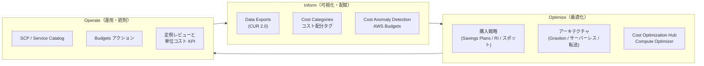
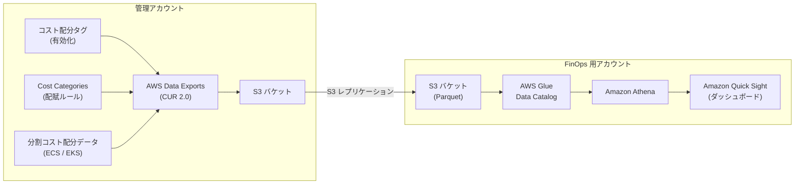
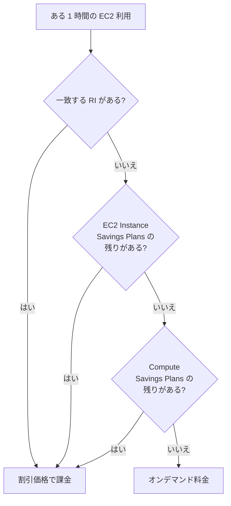
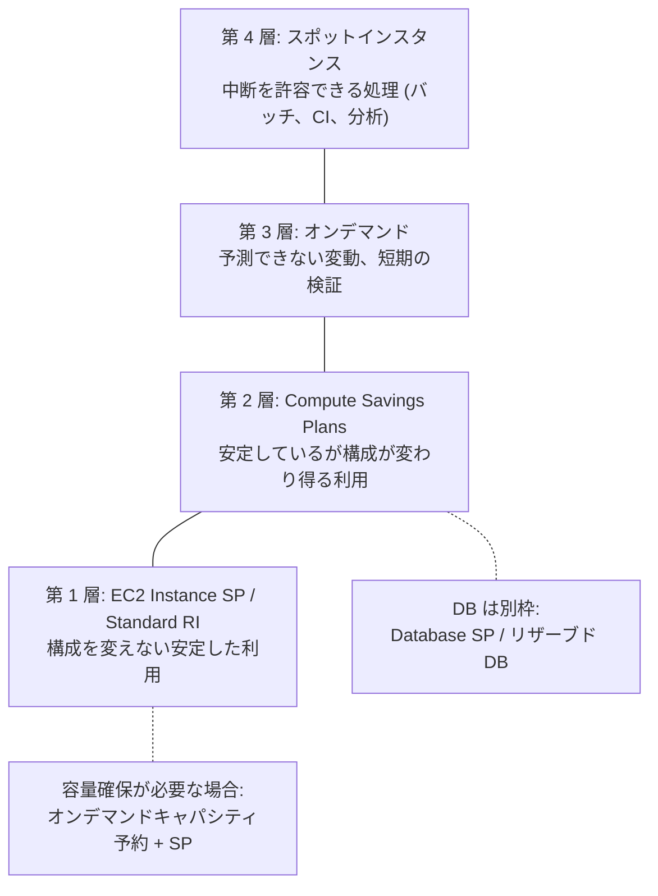
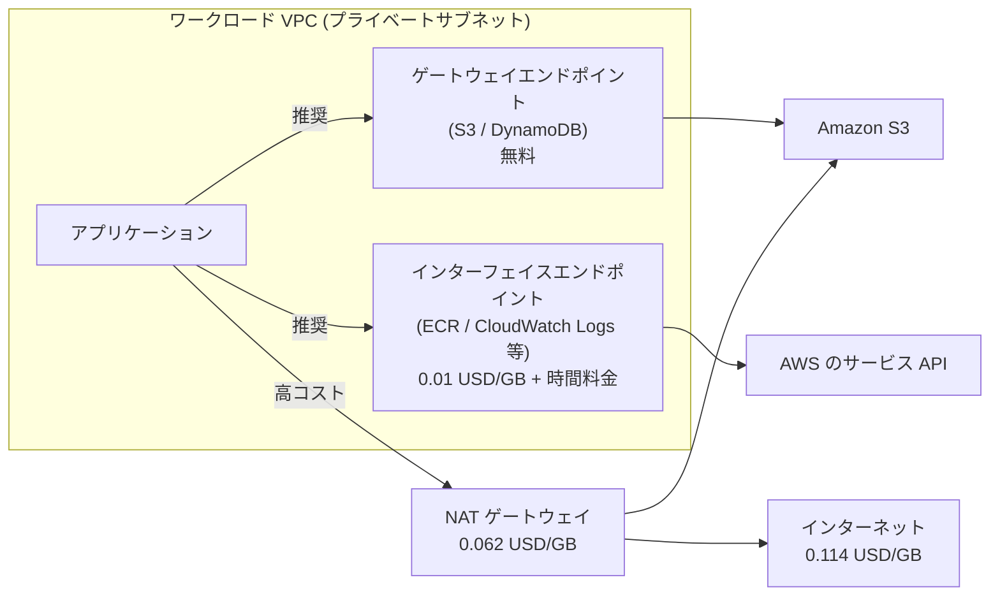
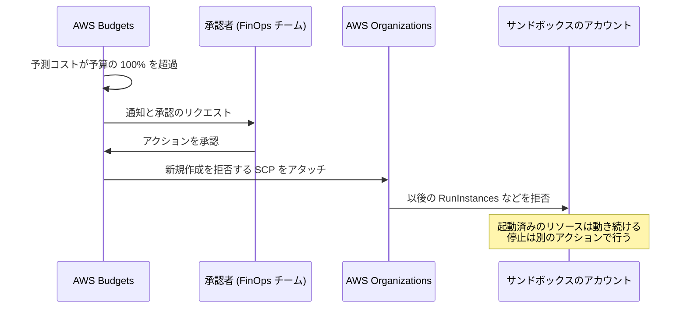

[ホーム](../README.md) > [Phase 3: プロフェッショナル](README.md) > 大規模環境のコスト最適化

# 大規模環境のコスト最適化

> **この章のゴール**
> - FinOps（Inform → Optimize → Operate）の流れに沿って、組織全体のコスト管理の仕組みを説明できる
> - AWS Data Exports（CUR 2.0）、Cost Categories、コスト配分タグ、分割コスト配分データを組み合わせて、部門別のショーバック／チャージバックを設計できる
> - Savings Plans・リザーブドインスタンス・スポットインスタンスを組織レベルで組み合わせ、割引の共有範囲を制御できる
> - データ転送、NAT ゲートウェイ、ログなどの「見えにくいコスト」を構造的に削減できる
> - SCP、AWS Service Catalog、Budgets アクションでコストのガードレールを設計できる
> - ライセンス（BYOL、Dedicated Hosts、CPU オプション）を含めた総コストを最適化できる
>
> **対応試験**: SAP-C03（ドメイン 3: コストを最適化したアーキテクチャの設計（仮訳）、ドメイン 2: ガバナンス ほか）
> **目安時間**: 6 時間（読む 4 時間 / 確認問題と復習 2 時間）

> [!NOTE]
> この章は [Phase 2: コスト最適化](../02-associate/18-cost-optimization.md) の内容（料金モデルの基本、S3 ストレージクラス、Cost Explorer・Budgets の基本）を前提にしています。
> SAP では「どんな割引があるか」ではなく、**数十〜数百アカウントの組織で、誰が・何を・どの範囲で最適化するか** を設計する力が問われます。

## この章の全体像

大規模環境のコスト最適化は、一度きりの「削減プロジェクト」ではなく、**可視化 → 最適化 → 統制** を回し続ける仕組みづくりです。



SAP で問われる典型的な問いと、この章の対応節は次のとおりです。

| 問題文の問い | 答えの方向性 | 節 |
|---|---|---|
| 部門ごとにコストを正確に配賦したい。共有リソースの費用も按分したい | CUR 2.0 + Cost Categories（分割料金ルール）+ タグ | 2 節 |
| 組織全体で割引を最大化しつつ、部門の購入分は部門で使いたい | Savings Plans の一元購入 + RI/SP のグループ共有 | 3 節 |
| NAT ゲートウェイやデータ転送の料金が急増した | VPC エンドポイント、同一 AZ 通信、集約の損益分岐 | 4 節 |
| 開発アカウントのコスト暴走を自動で止めたい | SCP + Budgets アクション + 異常検出 | 5 節 |
| 商用 DB のライセンス費用が大きい | CPU オプション、Dedicated Hosts、License Manager | 6 節 |

## 1. FinOps の考え方

### 1.1 大規模環境でコストが「見えなくなる」理由

1 アカウント・1 システムなら、Cost Explorer を見れば「何にいくら」がすぐ分かります。数百アカウントの組織では、次の理由でそれが急に難しくなります。

- **共有リソース**: Transit Gateway、NAT ゲートウェイ、Direct Connect、共有 EKS クラスター、ログ基盤などは複数部門が使うため、そのままでは「誰のコストか」が決まりません。
- **割引の共有**: Savings Plans やリザーブドインスタンス（RI）の割引は組織全体で共有されます。「A 部門が買った割引が B 部門の利用に適用される」ことが普通に起こります。
- **リソースに紐付かない料金**: データ転送、リクエスト課金、サポート料金、税などはタグで分類しにくい費用です。
- **規模**: 数百アカウント × 複数リージョンのリソースを人がレビューするのは不可能です。所有者不明のリソースも必ず生まれます。

したがって大規模環境では、**「コストの見える化」と「最適化の責任分担」を仕組みとして設計すること** が出発点になります。

### 1.2 FinOps の 3 フェーズ

FinOps は、財務・技術・ビジネスが協力してクラウドの支出から価値を最大化する実践の枠組みです（FinOps Foundation が定義。AWS は同じ考え方を **クラウド財務管理（Cloud Financial Management、CFM）** と呼び、Well-Architected のコスト最適化の柱でも最初の設計原則「クラウド財務管理を実践する」として扱います）。

| フェーズ | 目的 | 主な活動 | AWS の主なツール |
|---|---|---|---|
| Inform（可視化） | 誰が何にいくら使っているかを正確に把握する | 配賦ルール、タグ付け、ダッシュボード、予測、異常検出 | Data Exports（CUR 2.0）、Cost Explorer、Cost Categories、コスト配分タグ、Cost Anomaly Detection |
| Optimize（最適化） | 同じ価値をより少ないコストで得る | 右サイジング、コミットメント購入、アーキテクチャ改善 | Cost Optimization Hub、Compute Optimizer、Savings Plans、スポット |
| Operate（運用） | 最適化を継続させ、逸脱を防ぐ | ポリシー、予算管理、KPI、定例レビュー、自動化 | SCP、Service Catalog、AWS Budgets（アクション）、Config |

3 つのフェーズは一方通行ではなく、ワークロードの変化に合わせて繰り返し回します。

### 1.3 役割分担: 中央チームとワークロードチーム

大規模組織では、次のように責任を分けるのが定石です。

| 担当 | 責任 | 例 |
|---|---|---|
| 中央の FinOps チーム（CCoE の一部であることが多い） | 可視化基盤、配賦ルール、コミットメントの一元購入、ポリシー、レポート | CUR 2.0 基盤の運用、Savings Plans の購入計画、SCP の設計 |
| ワークロードチーム | 自分のリソースの右サイジング、アーキテクチャ改善、タグ付け、予算遵守 | Graviton への移行、不要リソースの削除 |
| 財務・経営 | 予算策定、予測、投資判断、単位コストの目標設定 | 部門予算、「1 注文あたりのコスト」の目標 |

合言葉は **「割引は中央で買い、使用量は現場で減らす」** です。コミットメント（Savings Plans / RI）は組織全体の利用を見て中央で買うほうが無駄が出にくく、使用量そのものの削減は、アーキテクチャを知っている現場にしかできないからです。

### 1.4 ショーバック、チャージバック、単位コスト

- **ショーバック（showback）**: 各部門にコストを「見せる」だけで、実際の請求は中央で払います。導入が容易で、まずここから始めます。
- **チャージバック（chargeback）**: 各部門の予算から実際にコストを負担させます。配賦ルールの正確さと合意が必要です。
- **単位コスト（unit economics）**: 総額ではなく「ビジネスの単位あたりのコスト」で効率を測ります。例えば月額インフラコスト 120,000 USD で 4,000,000 件の注文を処理しているなら、1 注文あたり 0.03 USD です。売上が伸びて総額が増えても、単位コストが下がっていれば健全といえます。

> [!TIP]
> **試験のポイント**: 「コストの説明責任（accountability）を持たせたい」「部門ごとに請求したい」とあれば、**アカウント構成 + コスト配分タグ + Cost Categories** による配賦の仕組みが答えの中心です。
> 「全社でコストを削減したい」だけを見て個別の削減策を選ぶと、配賦（Inform）の要件を取りこぼします。

## 2. 可視化（Inform）

### 2.1 可視化スタックの全体像

組織全体のコストを可視化する標準的な構成は次のとおりです。請求データは管理アカウントに集まりますが、管理アカウントでの作業は最小限にするのがベストプラクティスなので、**分析基盤は FinOps 用の専用アカウントに置き、S3 レプリケーションでデータを渡す** 構成がよく使われます（AWS が公開している Cloud Intelligence Dashboards もこの方式です）。



このほか、管理アカウント（または委任された管理者アカウント）で有効化する次のサービスを組み合わせます。

| ツール | 答えてくれる問い | 特徴 |
|---|---|---|
| Cost Explorer | 最近どのサービス・アカウントのコストが増えたか | すぐ使える。予測、RI/SP のレポートと推奨事項 |
| AWS Data Exports（CUR 2.0） | 時間単位・リソース単位で、何にいくら払ったか | 最も詳細な一次データ。SQL で自由に分析 |
| Cost Categories | ビジネスの単位（部門・製品）ごとにいくらか | ルールで配賦。共有コストの按分も可能 |
| Cost Anomaly Detection | いつもと違う支出が起きていないか | 機械学習で異常を検知して通知 |
| AWS Budgets | 予算を超えそうか。超えたら何をするか | 実績・予測のしきい値、アクションで自動制御 |
| Cost Optimization Hub | 組織全体で、どこから手を付けると一番得か | 推奨事項を集約・重複排除し、削減額で優先順位付け |
| Compute Optimizer | このリソースのサイズは適正か | 使用率メトリクスに基づく右サイジング |

### 2.2 AWS Data Exports（CUR 2.0）

**AWS Data Exports** は、請求データを S3 にエクスポートする仕組みです。その中心が **CUR 2.0**（Cost and Usage Report 2.0）で、従来の CUR（legacy CUR）の後継にあたります。

| 観点 | CUR 2.0（Data Exports） | 従来の CUR |
|---|---|---|
| スキーマ | 固定スキーマ。タグやコストカテゴリーはマップ型の列（`resource_tags`、`cost_category`）にまとまる | タグごとに列が増え、スキーマが変動する |
| 列・行の選択 | SQL 風のクエリで必要な列を選び、行を絞り込める | 全列を出力 |
| 形式 | Parquet または CSV（圧縮） | Parquet / CSV |
| オプション | リソース ID、時間単位の粒度、分割コスト配分データなど | 同様（一部） |

Data Exports では、CUR 2.0 のほかに **FOCUS 形式**（FinOps Foundation が策定したクラウド横断の請求データ仕様）のエクスポートや、**Cost Optimization Hub の推奨事項** のエクスポートも作成できます。マルチクラウドの組織は FOCUS 形式を使うと、他クラウドの請求データと同じ列定義で集計できます。

管理アカウントでエクスポートを作成すると、組織全体のデータが得られます。Glue Data Catalog にテーブルを定義し、Athena でクエリします。

```sql
-- 例: 2026 年 8 月に NAT ゲートウェイのデータ処理料金が多かったアカウント上位 10
-- （テーブル名・パーティション列名は Glue での定義に合わせて読み替えてください）
SELECT
  line_item_usage_account_id              AS account_id,
  SUM(line_item_usage_amount)             AS processed_gb,
  ROUND(SUM(line_item_unblended_cost), 2) AS cost_usd
FROM cur2
WHERE billing_period = '2026-08'
  AND line_item_usage_type LIKE '%NatGateway-Bytes'
GROUP BY line_item_usage_account_id
ORDER BY cost_usd DESC
LIMIT 10;
```

使用タイプ（`line_item_usage_type`）には `APN1-NatGateway-Bytes`（東京リージョンの NAT ゲートウェイのデータ処理量）のようにリージョンの接頭辞が付きます。「どの使用タイプが増えたか」を追うのが、原因調査の基本です。

ダッシュボードには Amazon QuickSight（2025年10月に Amazon Quick Suite へ再編。BI 機能は Amazon Quick Sight）を使うのが一般的です。

> [!NOTE]
> 公式ドキュメント: [AWS Data Exports](https://docs.aws.amazon.com/cur/latest/userguide/what-is-data-exports.html)
> 古い教材に出てくる「AWS Usage Report」は新規受付を終了しています（2025年10月に発表）。詳細な使用量データは CUR / Data Exports を使います。

> [!TIP]
> **試験のポイント**: 「リソース単位で長期間」「独自の配賦ロジック」「複数の請求データを SQL で分析」→ **CUR 2.0 + Athena**。
> 「すぐに傾向を確認」「予測」→ Cost Explorer。両者は対立するものではなく、併用するのが普通です。

### 2.3 コスト配分タグとタグ戦略

**コスト配分タグ** は、リソースのタグを請求データの分類軸として使う仕組みです。

- **ユーザー定義タグ**（例: `CostCenter`）と、**AWS 生成タグ**（例: 作成者を示す `aws:createdBy`）があります。
- どちらも **管理アカウントの Billing コンソールで「有効化」して初めて** Cost Explorer や CUR に現れます。タグを付けただけでは請求データに反映されません。
- 有効化以前の期間には原則として反映されません（過去期間へのバックフィルをリクエストする機能はあります）。**タグ戦略は組織の立ち上げ時に決める** のが理想です。

最小限のタグセットの例を示します。

| タグキー | 用途 | 値の例 |
|---|---|---|
| `CostCenter` | 費用負担部門（チャージバックの軸） | `CC-1203` |
| `Application` | システム・サービス名 | `order-api` |
| `Environment` | 環境 | `prod` / `stg` / `dev` |
| `Owner` | 問い合わせ先チーム | `team-payments` |

タグの統制は、次の 3 層で考えます。

1. **標準化（タグポリシー）**: AWS Organizations のタグポリシーで、キーの表記（`CostCenter` と `costcenter` の混在防止）や許可する値を定義します。強制（enforce）を指定したリソースタイプでは、ポリシーに準拠しない値でのタグ付けが拒否されます。
2. **作成時の必須化（SCP）**: タグポリシーの強制は「値の標準化」であり、**タグがないままリソースを作ることは止められません**。作成時にタグを必須にするには、`aws:RequestTag` 条件を使った SCP を組み合わせます（作成時のタグ付けをサポートするアクションが対象です）。
3. **検出と是正**: AWS Config の `required-tags` マネージドルールや Tag Editor で、タグのないリソースを見つけて修正します。

```json
{
  "Version": "2012-10-17",
  "Statement": [
    {
      "Sid": "DenyRunInstancesWithoutCostCenter",
      "Effect": "Deny",
      "Action": ["ec2:RunInstances", "ec2:CreateVolume"],
      "Resource": ["arn:aws:ec2:*:*:instance/*", "arn:aws:ec2:*:*:volume/*"],
      "Condition": {
        "Null": { "aws:RequestTag/CostCenter": "true" }
      }
    }
  ]
}
```

> [!WARNING]
> **ひっかけ注意**: 「タグポリシーを適用すれば、タグのないリソースは作成できなくなる」は誤りです。タグポリシーは値の標準化とコンプライアンスレポートの仕組みで、作成時の必須化には SCP（`aws:RequestTag` + `Null` 条件）が必要です。
> また、タグはデータ転送やサポート料金など **リソースに紐付かない費用** を配賦できません。これは次の Cost Categories で扱います。

大規模環境で最も確実な配賦軸は、タグではなく **アカウント** です。「ワークロードごと・環境ごとにアカウントを分ける」マルチアカウント戦略（[02 章](02-multi-account-governance.md)）は、セキュリティ境界であると同時に最強のコスト境界でもあります。タグは、アカウント内をさらに細かく分けるために使います。

### 2.4 Cost Categories と共有コストの按分

**Cost Categories** は、ルールでコストをビジネスの分類（部門、製品、チームなど）にマッピングする機能です。

- ルールの条件には、アカウント、タグ、サービス、料金タイプ、他のコストカテゴリーなどを使えます。タグの値をそのままカテゴリーの値として引き継ぐこともできます。
- どのルールにも一致しないコストには、既定値（例: `Unallocated`）を割り当てます。未配賦コストが大きいことは、それ自体が改善すべき KPI です。
- 定義したカテゴリーは Cost Explorer、AWS Budgets、CUR 2.0、Cost Anomaly Detection で分析軸として使えます。

**分割料金ルール（split charge rules）** を使うと、共有コストを他のカテゴリー値に按分できます。按分方法は **比例（proportional）**、**均等（even split）**、**固定比率（fixed）** の 3 種類です。

例: ネットワーク共有アカウント（Transit Gateway、NAT ゲートウェイ、Direct Connect）の費用が月 30,000 USD。各部門の直接コストが Retail 300,000 USD、Payments 150,000 USD、Data 50,000 USD の場合、比例按分では 60% / 30% / 10% となり、Retail 18,000 USD、Payments 9,000 USD、Data 3,000 USD を負担します。
なお、Transit Gateway 自体にも、料金を利用側のアカウントに配分できる Flexible Cost Allocation（2025年11月）があります（[04 章](04-advanced-networking.md)）。

なお、社内向けに独自の料金レートやマージンを乗せた請求書（プロフォーマ請求）を作りたい場合は、**AWS Billing Conductor** を使います。

> [!NOTE]
> 公式ドキュメント: [AWS Cost Categories](https://docs.aws.amazon.com/cost-management/latest/userguide/manage-cost-categories.html)

### 2.5 分割コスト配分データ（ECS / EKS）

共有のコンテナクラスターでは、EC2 インスタンスの費用が「クラスターを持つアカウント」に計上されるだけで、どのチーム（サービス・名前空間）が使ったかが分かりません。

**分割コスト配分データ（split cost allocation data）** を有効にすると、Amazon ECS のタスクや Amazon EKS の Pod が予約・使用した CPU とメモリに基づいて、EC2 インスタンスのコストがタスク／Pod 単位に按分され、CUR（CUR 2.0 を含む）に出力されます。

- 管理アカウントの Cost Management の設定でオプトインし、CUR 2.0 のエクスポートで分割コスト配分データを含めるよう設定します。
- インスタンスのうちどのタスク／Pod にも使われなかった **未使用分のコスト** も分かるため、ビンパッキング（4.4 節）の改善余地が数字で見えます。
- ECS ではサービスやタスク定義のタグをタスクに伝播させておくと、タグでの配賦と組み合わせられます。

> [!TIP]
> **試験のポイント**: 「複数チームが共有する EKS クラスター（または ECS クラスター）のコストを、チーム・名前空間ごとに配賦したい」→ **分割コスト配分データ（CUR）**。
> チームごとにクラスターを分けるのは、配賦は簡単になりますが集約効率が落ちてコストが上がります。

### 2.6 Cost Anomaly Detection

**AWS Cost Anomaly Detection** は、機械学習で過去の支出パターンを学習し、通常と異なる支出を検知して通知するサービスです。

- **モニター（監視対象）の種類**: AWS のサービス（アカウント内の全サービス）、リンクされたアカウント、コストカテゴリー、コスト配分タグ。管理アカウントで「アカウントごと」や「部門（コストカテゴリー）ごと」のモニターを作ると、組織全体を監視できます。
- **アラートのサブスクリプション**: 個別アラート（Amazon SNS 経由でほぼ即時。チャットツール連携も可能）、日次・週次のサマリー（メール）。しきい値は金額または割合で指定します。
- **根本原因の提示**: 異常の原因となったアカウント、リージョン、サービス、使用タイプを示します。

| 観点 | AWS Budgets | Cost Anomaly Detection |
|---|---|---|
| 検知の基準 | 人が決めた予算額・しきい値 | 機械学習による「いつもと違う」の判定 |
| 得意なこと | 予算管理、予測超過の警告、アクションによる自動制御 | 想定外の急増（設定ミス、暴走、攻撃）の早期発見 |
| 苦手なこと | 予算内で起きた異常な変化 | 予算の管理そのもの、自動的な停止 |

### 2.7 AWS Budgets と Budgets アクション

AWS Budgets では、コスト、使用量、Savings Plans と RI の **使用率・カバレッジ** の予算を作成できます。アカウント、タグ、コストカテゴリー、サービスで絞り込み、実績または予測がしきい値を超えたときに通知します。

**Budgets アクション** を使うと、しきい値を超えたときに次の操作を実行できます。

| アクションの種類 | 内容 | 使いどころ |
|---|---|---|
| IAM ポリシーの適用 | 指定した IAM ユーザー・グループ・ロールにポリシーをアタッチ | 新規リソースの作成権限を剥奪する |
| SCP の適用 | 指定した OU・アカウントに SCP をアタッチ（管理アカウントから） | サンドボックス OU で高額な操作を禁止する |
| 特定インスタンスの停止 | 指定した EC2 インスタンスや RDS インスタンスを停止 | 開発環境を自動停止する |

アクションは **自動実行** か **承認後に実行** かを選べます。Budgets がアクションを実行するための IAM ロールが必要です。

> [!WARNING]
> **ひっかけ注意**: 請求データの反映には数時間の遅れがあるため、Budgets（とそのアクション）は **リアルタイムの防止策ではありません**。「そもそも高額なインスタンスを起動させない」要件には SCP などの予防的コントロールを使い、Budgets アクションは「使いすぎたら止める」二段目の防御として組み合わせます。

### 2.8 Cost Optimization Hub と Compute Optimizer

**Cost Optimization Hub** は、組織内の全アカウント・全リージョンのコスト最適化の推奨事項を 1 か所に集約するサービスです（追加料金なし）。

- 右サイジング、Graviton への移行、アイドルリソースの停止・削除、EBS ボリュームの gp3 への変更、Savings Plans / RI の購入などの推奨事項をまとめて表示します。
- 同じリソースに対する重複・矛盾する推奨（例: 「右サイジング」と「そのサイズでの Savings Plans 購入」）を整理し、**既存の割引（RI / Savings Plans、契約割引）を反映した推定削減額** で優先順位を付けられます。
- 管理アカウント（または委任された管理者アカウント）で有効にすると、組織全体を対象にできます。推奨事項は Data Exports で S3 にエクスポートすることもできます。

**AWS Compute Optimizer** は、CloudWatch の使用率メトリクスを機械学習で分析し、右サイジングを推奨します。

- 対象: EC2 インスタンス、Auto Scaling グループ、EBS ボリューム、Lambda 関数、Fargate 上の ECS サービス、RDS など。商用ソフトウェアのライセンス（SQL Server のエディションなど）やアイドルリソースの推奨もあります。
- 既定では過去 14 日間のメトリクスを分析します。有料の **拡張インフラストラクチャメトリクス** を有効にすると最大 93 日間を分析でき、月次の繁忙期があるワークロードでも精度が上がります。
- EC2 の **メモリ使用率は CloudWatch エージェントを入れないと取得できません**。メモリを考慮しない推奨はダウンサイジングの判断を誤らせるので、エージェントの導入を標準化します。

このほか、AWS Trusted Advisor にもコスト最適化のチェックがあります（全チェックの利用には Business Support+ 以上のサポートプランが必要です）。

> [!TIP]
> **試験のポイント**: 「組織全体の最適化の推奨事項を一元的に、削減額の大きい順に把握したい」→ **Cost Optimization Hub**。
> 「個々のインスタンスや Lambda 関数のサイズが適正か」→ **Compute Optimizer**。メモリを考慮した推奨には CloudWatch エージェントが必要、という点もよく問われます。

## 3. 購入戦略（Optimize: 料金モデル）

### 3.1 コミットメント割引の種類

Savings Plans は「1 時間あたり何 USD 分を使うか」という **金額のコミットメント** です。コミット額を超えた利用はオンデマンド料金になり、コミット額に満たない時間は差額が無駄（未使用）になります。リザーブドインスタンス（RI）は「どのインスタンスを使うか」という **構成のコミットメント** です。

| 種類 | 対象 | 最大割引率（公表値） | 柔軟性 | 期間・支払い |
|---|---|---|---|---|
| Compute Savings Plans | EC2（ファミリー・サイズ・リージョン・OS・テナンシーを問わない）、Fargate、Lambda | 最大 66% | 最も高い | 1 年 / 3 年。全額前払い・一部前払い・前払いなし |
| EC2 Instance Savings Plans | 特定リージョンの特定インスタンスファミリー（サイズ・OS・テナンシーは自由） | 最大 72% | 中（ファミリー・リージョン固定） | 1 年 / 3 年 |
| SageMaker AI Savings Plans | SageMaker AI のインスタンス利用 | 最大 64% | 中 | 1 年 / 3 年 |
| Database Savings Plans | Aurora、RDS、DynamoDB、ElastiCache、DocumentDB、Neptune、Keyspaces、Timestream、DMS（2026年3月から OpenSearch Service と Neptune Analytics も）。エンジン・インスタンスファミリー・サイズ・リージョンを問わない | 最大 35% | 高い | 1 年、前払いなし |
| Standard RI | 特定のインスタンスタイプ（リージョン単位またはゾーン単位） | 最大 72% | 低い（Marketplace で売却は可能） | 1 年 / 3 年 |
| Convertible RI | 同等以上の価値の別構成に交換可能 | 最大 66% | 中 | 1 年 / 3 年 |
| リザーブド DB インスタンス・ノード | RDS / Aurora、ElastiCache、OpenSearch Service、Redshift など（DynamoDB はリザーブドキャパシティ） | サービス・条件による | 低い | 1 年 / 3 年 |

（割引率は 2026年9月時点の公表値。最新は [Savings Plans](https://aws.amazon.com/savingsplans/) と各サービスの料金ページで確認してください）

- **Database Savings Plans**（2025年12月発表）は、DB エンジンの移行やリージョンの変更を計画している組織に向きます。構成を固定できるならリザーブド DB インスタンスのほうが割引率が高いことが多い、というトレードオフです。
- **Lambda Managed Instances**（Lambda 関数を自分のアカウントの EC2 インスタンス上で実行する機能）は、EC2 と同様に Savings Plans / RI の対象になります。
- Savings Plans は原則として途中解約・売却ができません（購入直後の短期間に限った返品の仕組みはあります）。

> [!NOTE]
> SAA・SAP の既存の問題や古い教材では、データベースの割引として「リザーブド DB インスタンス」だけが正解になる出題が多くあります。Database Savings Plans は比較的新しい選択肢なので、選択肢に出たら「柔軟性（エンジン・リージョン変更）」と「割引率」のどちらが要件かで判断してください。

### 3.2 組織内での適用順序と共有

AWS Organizations の一括請求（consolidated billing）では、全アカウントの利用が合算され、RI と Savings Plans の割引は **既定で組織全体に共有** されます。割引は次の順序で適用されます。

1. まず **購入したアカウント自身** の利用に適用され、余った分が組織内の他のアカウントに適用されます。
2. 割引の種類は **RI → EC2 Instance Savings Plans → Compute Savings Plans** の順に適用されます。
3. Savings Plans の中では、**割引率の高い利用から** 順に適用されます。



割引の共有範囲は、管理アカウントの Billing の設定で制御できます。

| 方式 | 動作 | 向いている状況 |
|---|---|---|
| 組織全体で共有（既定） | 購入アカウント → 組織全体の順で適用 | 割引の総額を最大化したい。中央で一括購入する |
| アカウント単位で共有を無効化 | そのアカウントの RI / SP はそのアカウントだけに適用され、他アカウントの割引も受けない | 独立採算の子会社アカウントなど、完全に切り離したい |
| 優先グループ共有 | Cost Categories で定義したグループ内に先に適用し、余りを組織の残りに共有 | 部門が自分で買った割引を、まず自部門で使いたい |
| 制限付きグループ共有 | グループ内だけに適用し、外には共有しない | 法的・会計上の理由で割引を部門外に出せない |

グループ共有（Reserved Instances and Savings Plans Group Sharing）は 2025年11月に一般提供された機能で、グループの定義に **Cost Categories** を使います（2026年9月時点。[公式ドキュメント](https://docs.aws.amazon.com/awsaccountbilling/latest/aboutv2/ri-turn-off.html)）。

> [!WARNING]
> **ひっかけ注意**: 「部門 A の購入した割引を部門 A の 10 アカウントの中だけで使いたい」という要件に対し、「部門 A のアカウントで共有を無効化する」は誤りです。共有を無効化すると **アカウント単位** で閉じるため、部門内の 10 アカウントの間でも共有されなくなります。部門単位で閉じるには **制限付きグループ共有** を使います。
> 古い教材では「共有の無効化」しか選択肢がないので注意してください。

### 3.3 カバレッジと使用率

コミットメントの管理では、2 つの指標を区別します。

| 指標 | 定義 | 低いときの意味 | 対策 |
|---|---|---|---|
| 使用率（utilization） | 使われたコミットメント ÷ 購入したコミットメント | 買いすぎ（コミットメントの無駄） | 購入を止める。Convertible RI の交換。利用を寄せる |
| カバレッジ（coverage） | コミットメントでカバーされた利用 ÷ 対象となる利用の総額 | オンデマンドで払っている部分が多い | 安定した部分を追加購入する |

使用率はほぼ 100% を、カバレッジは「変動の少ない最低ライン（ベースライン）」を目標にするのが基本です。AWS Budgets では Savings Plans / RI の使用率とカバレッジの予算を作成でき、しきい値を下回ったら通知できます。

コミットメントを追加で買うべきかは、次の損益分岐で判断できます。割引率を d とすると、追加分のコミットメントが **全時間の (1 − d) 以上の割合で使われる見込みがあれば得** になります。

例: EC2 の利用額（オンデマンド換算）が夜間の最低 60 USD/時、平均 100 USD/時。割引率を仮に 30% とします。

- 最低ラインの 60 USD/時をカバーするコミットメント（60 × 0.7 = 42 USD/時）は常に使い切られるので、1 時間あたり 18 USD、月間（730 時間）で約 13,140 USD を確実に削減できます。
- 60〜100 USD/時の部分をカバーする追加分は、その利用が **70% 以上の時間** 発生しているなら得、そうでなければ損です。

実務では次の点も押さえます。

- Cost Explorer の Savings Plans 推奨事項（過去の利用に基づく）や購入分析（Purchase Analyzer）で購入額ごとの効果を試算します。
- 一度に大量購入せず、四半期ごとなどに **分割して購入（ラダリング）** し、満了時期を分散させます。利用の増減やアーキテクチャの変更に合わせて調整しやすくなります。
- アーキテクチャ変更の予定（Graviton への移行、コンテナ化、サーバーレス化）がある部分は、**Compute Savings Plans** でカバーします。EC2 Instance Savings Plans はファミリーを固定するため、m6i から m7g への移行でカバーが外れます。

### 3.4 レイヤリング（割引の組み合わせ方）

利用を性質ごとの層に分けて、層ごとに最適な購入方法を選びます。



> [!TIP]
> **試験のポイント**: 「割引」と「容量の確保」は別物です。Savings Plans とリージョン単位の RI は **容量を予約しません**。
> 「特定の AZ で確実に起動できる必要がある」要件には、**オンデマンドキャパシティ予約（ODCR）** を使い、Savings Plans やリージョン RI と組み合わせて割引を得ます（ゾーン単位の RI も容量を予約しますが柔軟性が低い）。GPU を短期間確実に使いたい場合は ML 用キャパシティブロックも候補です。

### 3.5 スポットインスタンスの大規模活用

スポットインスタンスは、AWS の余剰容量を最大 90% 引きで使える代わりに、**2 分前の通知で中断される** ことがあります。大規模に使うときの原則は「中断を前提に、分散させる」です。

| 原則 | 具体策 |
|---|---|
| 容量プールを分散する | 多数のインスタンスタイプ・サイズ・AZ を指定する。属性ベースのインスタンスタイプ選択（vCPU・メモリの範囲で指定）を使うと、新しいタイプも自動で候補に入る |
| 中断されにくいプールを選ぶ | 割り当て戦略は **price-capacity-optimized**（価格と空き容量の両方を考慮。AWS の推奨）を使う |
| 中断に先回りする | Auto Scaling グループの **キャパシティの再調整** を有効にし、リバランス推奨を受けたら代替インスタンスを先に起動する |
| 中断に備える | 中断通知を EventBridge やインスタンスメタデータで受け取り、チェックポイントの保存や接続のドレインを行う |
| 場所を選ぶ | スポットプレイスメントスコアで、必要な容量を確保しやすいリージョン・AZ を評価する |

| プラットフォーム | スポットの使い方 |
|---|---|
| EC2 Auto Scaling | 混合インスタンスポリシー（オンデマンドのベース容量 + ベースを超える部分のオンデマンド比率）で、最低限の容量はオンデマンドで保証する |
| EC2 フリート | 大量の容量を 1 回の API で、複数タイプ・AZ にまたがって確保する |
| Amazon EMR | インスタンスフリートを使い、コアノードはオンデマンド、タスクノードはスポットにする |
| Amazon EKS | Karpenter やマネージドノードグループでスポットを利用する（Karpenter は統合（consolidation）で安いノードへ詰め替える） |
| Amazon ECS | キャパシティプロバイダーでスポットの Auto Scaling グループや Fargate Spot（Fargate 料金から最大 70% 引き）を使う |
| AWS Batch / SageMaker AI | マネージドなコンピューティング環境でスポットを利用。SageMaker AI はマネージドスポットトレーニング（チェックポイント前提） |

> [!WARNING]
> **ひっかけ注意**:
> - 単一のインスタンスタイプ・単一 AZ だけでスポットを使う構成や、価格だけで選ぶ lowest-price 戦略は、中断や容量不足が起きやすく不正解になりがちです。
> - 状態を持つ単一のサーバー（プライマリ DB など）はスポットに向きません。
> - 古い教材の「スポットブロック（期間指定のスポットインスタンス）」は現在は利用できません。

## 4. アーキテクチャによる最適化（Optimize: 設計）

### 4.1 コスト削減のレバー

コストは「単価 × 量 × 時間」で決まります。購入戦略（3 節）は単価を下げますが、**量と時間を減らせるのはアーキテクチャだけ** です。

| レバー | なぜ安くなるか | 効果の目安 | 注意点 |
|---|---|---|---|
| サーバーレス化・スケールトゥゼロ | 使った分だけ課金され、アイドル時の費用がゼロに近づく | 利用率が低い・変動が大きいほど有利 | 常時高負荷では割高になり得る |
| Graviton（Arm） | 価格性能比の高いプロセッサに移る | 同等の x86 より価格性能比が最大 40%（AWS 公表。世代・用途で異なる） | arm64 用のビルド、マルチアーキテクチャのイメージが必要 |
| 右サイジング | 過剰なサイズを削る | Compute Optimizer / Cost Optimization Hub で特定 | メモリ使用率、ピーク時の余裕 |
| コンテナの集約 | ビンパッキングでノードの遊休を減らす | 分割コスト配分データで未使用分を把握 | 過大な CPU・メモリ要求（requests） |
| ストレージの階層化 | アクセス頻度に応じた単価の層に移す | S3 Standard 0.025 → Glacier Instant Retrieval 0.005 USD/GB 月（東京） | 取り出し料金、最低保存期間 |
| データ転送の経路 | NAT・AZ 間・インターネットへの転送を減らす | 4.6 節 | 可用性とのトレードオフ |
| ログの量と保持期間 | 取り込み量と保存期間を減らす | 4.7 節 | 監査・調査の要件 |
| 非本番環境の停止 | 夜間・週末に止める | 平日 12 時間だけ稼働させると稼働時間は約 64% 減 | NAT ゲートウェイなど停止できないリソース |
| OpenSearch Serverless のスケールトゥゼロ | コレクショングループの NextGen コレクションは最小 OCU が既定で 0。10 分間リクエストがないとゼロまで縮小し、課金が止まる（2026年） | アイドル時の OCU 料金がゼロ | クラシックコレクションは最小 OCU 分が常時課金。再開時のコールドスタート |

> [!NOTE]
> OpenSearch Serverless について「最小 OCU の料金が常にかかるので小規模には高い」と説明する教材があります。これはクラシックコレクションの説明で、2026年からはコレクショングループの NextGen コレクションでゼロまでスケールできます（[公式ドキュメント](https://docs.aws.amazon.com/opensearch-service/latest/developerguide/serverless-scale-to-zero.html)）。

### 4.2 サーバーレスとスケールトゥゼロ

サーバーレスが安いのは **利用率が低い、または変動が大きい** ときです。24 時間高い負荷が続く処理では、Savings Plans を適用したコンテナや EC2 のほうが安くなることがあります。「常にサーバーレスが最安」ではない点が SAP の判断ポイントです。

- **AWS Lambda**: arm64（Graviton）を選ぶと GB 秒あたりの料金が x86 より約 20% 低くなります。メモリを増やすと CPU も増えて実行時間が短くなるため、メモリの最適値を計測（Lambda Power Tuning など）すると、かえって安くなることがあります。コールドスタート対策は、常時課金のプロビジョニングされた同時実行より先に SnapStart（Java、Python、.NET）を検討します。常時高負荷の関数は Lambda Managed Instances（EC2 料金 + Savings Plans / RI の対象）も選択肢です。
- **AWS Step Functions**: 大量・短時間のワークフローは Express（リクエスト数と実行時間で課金）、長時間・監査が必要なワークフローは Standard（状態遷移数で課金）を使います。
- **Aurora Serverless v2**: 0〜256 ACU で自動スケールし、5 分〜24 時間のアイドル後に自動一時停止できます（再開に最大 15 秒程度）。開発・検証環境の DB に向きます。
- **Amazon DynamoDB**: 2024年11月にオンデマンドモードの料金が 50% 値下げされ、変動のあるワークロードではオンデマンドが第一候補になりました。安定した高スループットなら、プロビジョンドモード + Auto Scaling（+ リザーブドキャパシティや Database Savings Plans）を比較します。
- **Aurora I/O-Optimized**: I/O 料金が Aurora の総コストの 25% を超える I/O 集約型のワークロードでは、I/O-Optimized 構成に変えると最大 40% 削減できる（AWS 公表）とされています。

### 4.3 Graviton への移行

Graviton は AWS が設計した Arm ベースのプロセッサです。移行の難易度はワークロードによって異なります。

- **マネージドサービス**（RDS、Aurora、ElastiCache、OpenSearch Service、Lambda、Fargate など）は、インスタンスクラスやアーキテクチャの設定を変えるだけで移行できることが多く、最初に着手すべき対象です。
- **インタープリター言語・JVM 系**（Python、Node.js、Java など）は、ネイティブライブラリの対応を確認すればほぼそのまま動きます。
- **コンテナ** は、マルチアーキテクチャのイメージ（amd64 と arm64 の両方）をビルドして ECR に置き、段階的に移行します。
- Cost Optimization Hub と Compute Optimizer は Graviton への移行の推奨事項も出すので、削減額の大きい順に計画できます。

### 4.4 コンテナの集約（ビンパッキング）

| 対象 | 施策 |
|---|---|
| Amazon ECS（EC2 起動タイプ） | タスク配置戦略 `binpack`（CPU またはメモリの空きが少ないインスタンスから詰める）、キャパシティプロバイダーのマネージドスケーリング、タスクの CPU・メモリ設定の見直し |
| Amazon EKS | Karpenter の統合（consolidation）で使用率の低いノードを減らし、より安いノード（スポット、Graviton）に詰め替える。Pod の requests を実測に合わせる |
| Fargate と EC2 の選択 | Fargate はノードの遊休コストがない代わりに vCPU 時間あたりの単価が高い。大規模で安定したクラスターは、集約率の高い EC2 + Savings Plans のほうが安いことが多い。Compute Savings Plans は Fargate にも適用される |
| 可視化 | 分割コスト配分データで、ノードのうちどのタスク／Pod にも使われていない「未使用分」を把握する |

### 4.5 ストレージの階層化

| S3 ストレージクラス（東京リージョンの例） | ストレージ料金（USD/GB 月） | 主な注意点 |
|---|---|---|
| S3 Standard | 0.025（最初の 50 TB） | ― |
| S3 Standard-IA | 0.0138 | 取り出し 0.01 USD/GB、最低保存期間 30 日 |
| S3 One Zone-IA | 0.011 | 単一 AZ（再作成できるデータ向け） |
| S3 Glacier Instant Retrieval | 0.005 | 取り出し 0.03 USD/GB、最低保存期間 90 日 |
| S3 Glacier Flexible Retrieval | 0.0045 | 取り出しに分〜時間 |
| S3 Glacier Deep Archive | 約 0.002 | 取り出しに最大 12〜48 時間 |

（2026年9月時点、東京リージョンの例。最新は [S3 の料金](https://aws.amazon.com/s3/pricing/) を確認してください）

例えば 40 TB のログを S3 Standard に置くと月 1,000 USD ですが、30 日後に Glacier Instant Retrieval へ移せば月 200 USD、Deep Archive なら約 80 USD になります。大規模環境では、次の点を組織全体で徹底することが効きます。

- **S3 Storage Lens**（組織全体のダッシュボード）で、ライフサイクルルールのないバケット、未完了のマルチパートアップロード、非現行バージョンの肥大化を見つけます。
- **S3 ライフサイクル**: 未完了のマルチパートアップロードの削除、非現行バージョンの失効を全バケットの標準にします。128 KB 未満のオブジェクトは既定で移行されない点に注意します。
- **S3 Intelligent-Tiering**: アクセスパターンが不明・変化するデータに使います。取り出し料金はありませんが、オブジェクト数に応じた監視料金（1,000 オブジェクトあたり 0.0025 USD）がかかります。128 KB 未満のオブジェクトは自動階層化の対象外です。
- **EBS**: gp2 から gp3 に変えると GB 単価が最大 20% 下がり、IOPS とスループットを容量と独立して設定できます。アタッチされていないボリュームを削除し、長期保存のスナップショットは **スナップショットアーカイブ**（保存料金が最大 75% 低い。最低 90 日、復元に 24〜72 時間）に移します。スナップショットの保持は Amazon Data Lifecycle Manager や AWS Backup のポリシーで自動化します。
- **Amazon EFS**: ライフサイクル管理で、アクセスされないファイルを低頻度アクセス（IA）やアーカイブのストレージクラスへ自動で移します。

### 4.6 データ転送の最適化

データ転送は、SAP のコスト問題で最も出題されやすく、実務でも見落とされやすい費用です。まず主要な単価を押さえます。

| 経路 | 料金（2026年9月時点、東京リージョンの例） |
|---|---|
| インターネットへの送信（最初の 10 TB/月） | 0.114 USD/GB |
| リージョン間 | 0.09 USD/GB |
| 同一リージョン内の AZ 間 | 送信側・受信側それぞれ 0.01 USD/GB（往復ではなく片道でも実質 0.02 USD/GB） |
| NAT ゲートウェイ | 0.062 USD/時間 + 処理量 0.062 USD/GB |
| インターフェイス VPC エンドポイント | 0.014 USD/時間（AZ ごと）+ 0.01 USD/GB |
| ゲートウェイ VPC エンドポイント（S3・DynamoDB） | 無料 |
| Transit Gateway | 0.07 USD/時間（アタッチメントごと）+ 処理量 0.02 USD/GB |
| パブリック IPv4 アドレス | 0.005 USD/時間（1 アドレスあたり） |
| インターネットからの受信 | 無料 |

（最新の料金は [Amazon VPC の料金](https://aws.amazon.com/vpc/pricing/) と [EC2 オンデマンド料金（データ転送）](https://aws.amazon.com/ec2/pricing/on-demand/) を確認してください）



**(1) VPC エンドポイントで NAT を迂回する**

- プライベートサブネットから S3・DynamoDB へのアクセスは、無料の **ゲートウェイエンドポイント** を必ず使います。NAT 経由で S3 から月 50 TB をダウンロードしていると、処理料金だけで 50,000 GB × 0.062 = 3,100 USD/月かかりますが、ゲートウェイエンドポイントならゼロです。
- ECR からのイメージ取得には、ECR 用のインターフェイスエンドポイント（`ecr.api` と `ecr.dkr`）に加えて、**S3 のゲートウェイエンドポイント** が必要です（イメージのレイヤーは S3 に保存されているため）。
- インターフェイスエンドポイントは GB 単価が NAT より 0.052 USD 安い一方、AZ ごとの時間料金がかかります。3 AZ に作ると月 0.042 × 730 ≈ 30.66 USD なので、**そのサービスへの通信が VPC あたり月約 590 GB を超えるなら** NAT より安くなります。

**(2) AZ 間の通信を減らす（同一 AZ の優先）**

マイクロサービス間で月 100 TB が AZ をまたぐと、100,000 GB × 0.02 = 2,000 USD/月になります。

- ECS Service Connect のゾーン認識ルーティング（2026年7月に追加）や、Kubernetes のトポロジー認識ルーティングで、同じ AZ のターゲットを優先させます。
- Network Load Balancer と Gateway Load Balancer のクロスゾーン負荷分散は既定で無効で、有効にすると AZ 間のデータ転送料金がかかります（Application Load Balancer は既定で有効）。
- 可用性を犠牲にしないことが前提です。「同じ AZ を優先し、障害時は他の AZ に流れる」設計にし、単一 AZ に固定してはいけません。

**(3) Amazon CloudFront を前段に置く**

AWS のオリジン（S3、ALB、EC2 など）から CloudFront への転送は無料です。キャッシュによってオリジンへのリクエストと計算資源を減らせることが最大の効果で、Origin Shield を使うとオリジンへの取得をさらに集約できます。

**(4) Direct Connect を使う**

オンプレミスへ大量のデータを送る場合、Direct Connect 経由のデータ送信はインターネット経由より GB 単価が低く設定されています（別途ポート時間料金がかかります）。

**(5) 集約（中央集権型）エグレスのトレードオフ**

多数の VPC の NAT ゲートウェイを、Transit Gateway でつないだエグレス用 VPC に集約する構成は、NAT の時間料金を減らせる代わりに Transit Gateway の処理料金が上乗せされます。

例: 20 VPC × 3 AZ で 60 個の NAT ゲートウェイがあると、時間料金だけで 60 × 0.062 × 730 ≈ 2,716 USD/月。エグレス VPC に 3 個へ集約すると約 136 USD/月で、差は約 2,580 USD/月です。一方、インターネット向け通信には Transit Gateway の処理料金 0.02 USD/GB が加わるため、**損益分岐は月約 129 TB**（2,580 ÷ 0.02）です。すでに Transit Gateway のアタッチメントがある前提なら、インターネット向けの通信量がこれより少ない組織では集約のほうが安くなります。インターフェイスエンドポイントの集約（共有サービス VPC にまとめ、Route 53 のプライベートホストゾーンや Route 53 Profiles で名前解決を共有）も同じ考え方で評価します。

**(6) その他**

- リージョン間レプリケーション（S3 レプリケーション、DynamoDB グローバルテーブルなど）は、DR 要件を満たす最小限のデータだけに絞ります。
- パブリック IPv4 アドレスは 1 個で月約 3.65 USD かかります。1,000 個なら月 3,650 USD です。ロードバランサーや CloudFront の背後に置いてインスタンスのパブリック IP を減らし、IPv6 の活用を検討します。Amazon VPC IP Address Manager（IPAM）のパブリック IP インサイトで利用状況を把握できます。

> [!WARNING]
> **ひっかけ注意**:
> - ゲートウェイエンドポイントは、オンプレミス（Direct Connect / VPN 経由）や他のリージョン、ピアリング先の VPC からは利用できません。オンプレミスから S3 にプライベート接続するならインターフェイスエンドポイントを使います。
> - インターフェイスエンドポイントを「全 VPC × 全サービス」で作ると、時間料金が積み上がります。
> - NAT ゲートウェイの集約は常に安いわけではありません。通信量が多いと Transit Gateway の処理料金が上回ります。

### 4.7 ログとオブザーバビリティのコスト

ログは「念のため全部残す」とすぐに大きな費用になります。CloudWatch Logs の主な課金要素は **取り込み量（GB）**、**保存量（GB 月）**、**Logs Insights のスキャン量** です。

1. **保持期間を必ず設定する**: CloudWatch Logs のロググループの保持期間は、既定では「失効しない」です。AWS Config のルールで保持期間の未設定を検出します。
2. **ログレベルを制御する**: 本番は INFO / WARN を基本にします。Lambda では高度なログ制御（JSON 形式、ログレベルによる絞り込み）を使えます。
3. **低頻度アクセス（Infrequent Access）ログクラス**: 取り込み単価が Standard クラスの約半分です。メトリクスフィルターや Live Tail など一部の機能は使えないため、調査用にまれに参照するログに向きます。
4. **大量のログは S3 へ**: VPC フローログは S3 に Parquet 形式・時間単位のパーティションで出力すると、保存と Athena での分析が安くなります。大量のアプリケーションログも Amazon Data Firehose 経由で S3 に置けます。
5. **メトリクスのカーディナリティに注意する**: CloudWatch のカスタムメトリクスは、ディメンションの組み合わせごとに 1 メトリクスとして課金されます。ユーザー ID のような値をディメンションにすると爆発的に増えます。
6. **トレースはサンプリングする**: すべてのリクエストをトレースする必要はありません。
7. **CloudTrail**: 各リージョンの管理イベントの最初のコピーは無料ですが、追加の証跡やデータイベントは有料です。データイベントは対象のバケットや関数を絞ります。長期分析は S3 + Athena で行います（AWS CloudTrail Lake は 2026年5月に新規受付を終了しています）。
8. **ログアーカイブ用 S3 のライフサイクル**: 監査用の長期保存ログは、Glacier 系のストレージクラスに移します。

### 4.8 非本番環境の停止とアカウントのライフサイクル

- **Instance Scheduler on AWS**（AWS が提供するソリューション）で、タグに基づいて EC2 と RDS を複数アカウント・リージョンにわたって定時に起動・停止します。
- RDS の DB インスタンスは停止しても **最大 7 日で自動的に起動** します。長期間止めたい場合はスナップショットを取って削除するか、Aurora Serverless v2 の自動一時停止を使います。
- 開発環境は IaC で「必要なときに作って、終わったら消す」一時的な環境にします。サンドボックスアカウントには予算とクリーンアップの仕組みを最初から組み込みます（5 節）。
- アイドル状態のロードバランサー、未使用の Elastic IP、古いスナップショット、使われていない NAT ゲートウェイは Cost Optimization Hub や Trusted Advisor で定期的に洗い出します。

## 5. ガバナンス（Operate）

### 5.1 予防・検出・是正を組み合わせる

コストのガバナンスも、セキュリティと同じく **予防・検出・是正** の 3 層で設計します。

| 層 | 仕組み | 例 |
|---|---|---|
| 予防 | SCP、Service Catalog の制約、IAM | 高額なインスタンスタイプの禁止、許可リージョンの限定、コミットメント購入の中央集約 |
| 検出 | Cost Anomaly Detection、Budgets のアラート、AWS Config ルール | 支出の急増の通知、タグのないリソースの検出 |
| 是正 | Budgets アクション、EventBridge + SSM Automation / Lambda | SCP の自動アタッチ、開発用インスタンスの停止 |

### 5.2 SCP によるコストの制限

次の SCP は、ワークロード用の OU にアタッチして、(1) 承認されていないインスタンスタイプの起動と、(2) 各アカウントでのコミットメントの購入を禁止する例です。コミットメントは FinOps アカウント（別の OU に置く）だけが購入できるようにします。

```json
{
  "Version": "2012-10-17",
  "Statement": [
    {
      "Sid": "DenyUnapprovedInstanceTypes",
      "Effect": "Deny",
      "Action": "ec2:RunInstances",
      "Resource": "arn:aws:ec2:*:*:instance/*",
      "Condition": {
        "StringNotLike": {
          "ec2:InstanceType": ["t4g.*", "m7g.large", "m7g.xlarge", "c7g.large"]
        }
      }
    },
    {
      "Sid": "DenyCommitmentPurchaseOutsideFinOps",
      "Effect": "Deny",
      "Action": [
        "ec2:PurchaseReservedInstancesOffering",
        "rds:PurchaseReservedDBInstancesOffering",
        "savingsplans:CreateSavingsPlan"
      ],
      "Resource": "*"
    }
  ]
}
```

- 許可リージョンの限定（`aws:RequestedRegion` とグローバルサービスの除外）は [02 章](02-multi-account-governance.md) を参照してください。使わないリージョンを禁止すると、コストだけでなく攻撃対象領域も減ります。
- SCP は **管理アカウントには適用されない**、**権限を付与しない**（上限を決めるだけ）という基本も忘れないでください。

### 5.3 AWS Service Catalog による「安くて正しい」セルフサービス

AWS Service Catalog は、承認済みの構成（CloudFormation テンプレートや Terraform の構成）を「製品」として、ポートフォリオにまとめて提供するサービスです。ポートフォリオは Organizations を通じて OU 単位で共有できます。

- **テンプレート制約**: パラメーターの許可値を制限します（例: インスタンスタイプは `m7g.large` か `m7g.xlarge` だけ）。
- **起動制約**: 製品のプロビジョニングに使う IAM ロールを指定します。利用者には広い権限を与えず、Service Catalog の操作権限だけで済みます。
- **TagOptions**: `CostCenter` などのタグを必須にし、自動で付与します。
- 製品の既定値を Graviton、gp3、S3 ライフサイクル付きなどの **コスト効率のよい構成** にしておくと、開発者が意識しなくても最適化された構成が広がります。

> [!NOTE]
> Service Catalog の AppRegistry（アプリケーションの登録機能）は、2026年6月に新規受付終了が発表されています。Service Catalog のポートフォリオと製品の機能は引き続き利用できます。

### 5.4 Budgets アクションによる自動制御

サンドボックス OU で、予測コストが予算を超えたときに新規リソースの作成を止める流れの例です。



> [!WARNING]
> **ひっかけ注意**: SCP をアタッチしても **起動済みのリソースは止まりません**（以後の API 呼び出しが拒否されるだけです）。費用の発生そのものを止めるには「特定インスタンスの停止」アクションや、EventBridge + SSM Automation による停止を組み合わせます。

## 6. ライセンスの最適化

Windows Server、SQL Server、Oracle Database などの商用ソフトウェアでは、**ライセンス費用がインフラ費用を上回る** ことも珍しくありません。ライセンスの持ち込み方は、主に次の 2 つです。

- **ライセンス込み（License Included）**: AWS の料金にライセンス費用が含まれます。管理は簡単ですが、既存ライセンスを活用できません。
- **ライセンス持ち込み（BYOL）**: 既存ライセンスを使います。ただし、ベンダーのライセンス条件（物理コア数での計算、専有ハードウェアの要否など）を満たす必要があります。

### 6.1 AWS License Manager

AWS License Manager は、ライセンスの使用状況を追跡し、ルールを強制するサービスです。

- **ライセンス構成**: vCPU、コア、ソケット、インスタンス数のいずれかで数え方を定義し、**ハードリミット**（超える起動をブロック）または **ソフトリミット**（超えたら通知）を設定します。
- AMI や起動テンプレートにライセンス構成を関連付けると、起動時に自動でカウントされます。
- AWS Organizations と連携して、組織全体の使用状況を追跡できます。Systems Manager のインベントリで、インストール済みのソフトウェアを検出することもできます。
- **ホストリソースグループ**: Dedicated Hosts の割り当て・解放と、インスタンスの配置を自動化します。

### 6.2 Dedicated Hosts と Dedicated Instances

| 観点 | Dedicated Hosts | Dedicated Instances |
|---|---|---|
| 物理サーバーの専有 | ○ | ○ |
| ソケット・物理コアの可視性 | ○（BYOL のライセンス計算に使える） | × |
| インスタンスの配置の制御（ホストアフィニティ） | ○ | × |
| 課金の単位 | ホスト単位 | インスタンス単位（加えてリージョン単位の専有料金） |
| 主な用途 | ソケット・コア単位の BYOL、厳格なコンプライアンス | 物理的な分離だけが必要な場合 |

Microsoft 製品の BYOL では、Windows Server のライセンスの持ち込みに Dedicated Hosts が必要になる一方、SQL Server はソフトウェアアシュアランスのライセンスモビリティがあれば共有テナンシーでも持ち込める、といった条件の違いがあります。ライセンス条件はベンダーが定め、改定されることもあるため、実際には契約条件を必ず確認します。Dedicated Hosts には、1 年・3 年の予約による割引もあります。

### 6.3 CPU オプション（Optimize CPUs）

vCPU やコアの数でライセンス費用が決まるソフトウェアでは、**CPU オプション** が効きます。インスタンスの起動時に **コア数（CoreCount）** と **コアあたりのスレッド数（ThreadsPerCore）** を指定し、メモリなどはそのままで、有効な vCPU 数だけを減らせます。

例: メモリが 256 GiB 必要な DB サーバーに r7i.8xlarge（32 vCPU = 16 コア × 2 スレッド）を使う場合、CPU オプションで 8 コア × 1 スレッドにすると、有効な vCPU は 8 になります。**EC2 の料金は変わりません** が、コア・vCPU 単位のライセンス数を大きく減らせます。

- Compute Optimizer は SQL Server のエディションの推奨（Enterprise の機能を使っていなければ Standard へ）も出します。
- RDS for Oracle でも、DB インスタンスクラスのプロセッサ機能（コア数・スレッド数）を設定できます。なお、RDS Custom for Oracle は 2027年3月31日にサポート終了予定です。
- 根本的な削減策としては、商用 DB から Aurora PostgreSQL などへの移行（[07 章](07-migration-modernization.md)）や、AWS Transform による .NET アプリケーションの Windows から Linux への移行があります。

> [!TIP]
> **試験のポイント**:
> - 「既存のソケット・コア単位のライセンスを持ち込みたい」「ライセンスの使用状況を追跡し、上限を強制したい」→ **Dedicated Hosts + License Manager**。
> - 「Dedicated Instances」はソケット・コアが見えないので、この要件では不正解です。
> - 「コア単位のライセンス費用を減らしたいがメモリは必要」→ **CPU オプション**（または vCPU あたりのメモリが大きいインスタンスファミリー）。

## 7. 生成 AI のコスト管理

生成 AI のコストは、主に **入力トークン + 出力トークン**（と、エージェントならツール呼び出しの回数）で決まります。設計の詳細は [09 章](09-generative-ai-architecture.md) で扱うので、ここではコストのレバーだけを整理します。

| レバー | 内容 |
|---|---|
| モデルの選択 | タスクに十分な最小のモデルを使う。Intelligent Prompt Routing でリクエストごとにモデルを振り分ける |
| プロンプトキャッシュ | 繰り返し送る長いコンテキスト（システムプロンプト、文書）をキャッシュして、入力トークンの費用と遅延を減らす |
| バッチ推論 | 即時性が不要な大量処理は、オンデマンドの約 50% の料金で処理する |
| サービス階層 | Priority / Standard / Flex から選ぶ。遅延を許容できる処理は Flex |
| Provisioned Throughput | 1 か月または 6 か月のコミットメント。安定した大量利用やカスタムモデル向け |
| RAG の最適化 | チャンクサイズと取得件数を調整し、不要なコンテキストを送らない。ベクトルストアは S3 Vectors（低コスト）や、スケールトゥゼロできる OpenSearch Serverless を検討する |
| 配賦と監視 | アプリケーション推論プロファイルにタグを付けてアプリ・部門ごとのコストを把握し、Budgets と Cost Anomaly Detection で監視する |

## 8. 典型シナリオと解法

### シナリオ 1: 300 アカウントのチャージバック

- **状況**: 300 アカウント、5 つの事業部。共有ネットワークアカウントと、複数チームが使う共有 EKS クラスターがある。タグ付けはチームによってばらばら。
- **要件**: 事業部ごとの月次チャージバック。共有コストも公平に按分し、SQL で検証できること。
- **推奨設計**: アカウントを第一の配賦軸にし、Cost Categories で事業部を定義する（共有ネットワークは比例按分の分割料金ルール）。EKS は分割コスト配分データを有効にする。タグはタグポリシーで標準化し、作成時の必須化は SCP で行う。Data Exports（CUR 2.0）→ S3 → Athena → Quick Sight で可視化する。
- **他の選択肢が劣る理由**: Cost Explorer だけでは共有コストの按分とリソース単位の長期分析ができない。事業部ごとに組織やクラスターを分けると、共有による効率が失われてコストが上がる。

### シナリオ 2: 部門が購入した Savings Plans を部門内に限定する

- **状況**: 事業部 A が自部門の予算で Compute Savings Plans を購入した。事業部 A は 12 アカウントを持つ。
- **要件**: 事業部 A の割引は事業部 A の中で優先的に使い、余った分だけ全社に回したい。
- **推奨設計**: Cost Categories で事業部 A のグループを定義し、**優先グループ共有** を設定する（外に一切出したくないなら制限付きグループ共有）。
- **他の選択肢が劣る理由**: アカウント単位で共有を無効化すると、事業部 A の 12 アカウントの間でも共有されなくなり、使用率が下がる。

### シナリオ 3: NAT ゲートウェイの料金が急増した

- **状況**: EKS のノードがプライベートサブネットにあり、ECR からのイメージ取得と S3 からのデータ取得がすべて NAT ゲートウェイを経由している。
- **要件**: セキュリティ水準を下げずに、データ転送コストを削減したい。
- **推奨設計**: Cost Explorer や CUR 2.0 で `NatGateway-Bytes` の使用タイプを確認し、VPC フローログで通信先を特定する。S3 のゲートウェイエンドポイント（無料）と ECR のインターフェイスエンドポイント（`ecr.api`、`ecr.dkr`）を作成する。
- **他の選択肢が劣る理由**: ノードをパブリックサブネットに置くのはセキュリティ要件に反し、パブリック IPv4 の料金もかかる。NAT インスタンスへの置き換えは運用負荷と可用性の問題がある。

### シナリオ 4: 数万 vCPU の中断可能なバッチ

- **状況**: 毎晩 20,000 vCPU 規模のバッチ。ジョブは冪等で、チェックポイントから再開できる。日中は 2,000 vCPU 程度の常時処理がある。
- **要件**: 最小のコストで、朝までに確実に完了させる。
- **推奨設計**: 日中の常時処理（ベースライン）は Compute Savings Plans でカバーする。夜間バッチは、AWS Batch や EC2 フリートでスポットを使い、多数のインスタンスタイプと全 AZ を指定して price-capacity-optimized 戦略を使う。締め切りに間に合わない場合に備え、オンデマンドへのフォールバックを用意する。
- **他の選択肢が劣る理由**: 夜間だけの利用を RI / Savings Plans でカバーすると、日中にコミットメントが使われず無駄になる。単一タイプのスポットは容量不足と中断が増える。

### シナリオ 5: サンドボックスのコスト暴走を防ぐ

- **状況**: 開発者が自由に試せるサンドボックスアカウントが 80 ある。大型の GPU インスタンスの放置で高額な請求が発生した。
- **要件**: 高額なリソースは起動させない。予算を超えそうなら自動で止める。カスタムコードは最小限。
- **推奨設計**: SCP で承認済みのインスタンスタイプ以外の起動を拒否する（予防）。アカウントごとの予算に Budgets アクションを設定し、予測超過時に新規作成を拒否する SCP をアタッチし、開発用インスタンスを停止する（是正）。Cost Anomaly Detection で想定外の急増を通知する（検出）。
- **他の選択肢が劣る理由**: 異常検出だけでは止められない。Lambda で Cost Explorer API をポーリングする自作の仕組みは運用負荷が高い。

### シナリオ 6: 商用 DB のライセンス費用を下げる

- **状況**: EC2 上の SQL Server Enterprise（コア単位のライセンス）。メモリは多く必要だが、CPU 使用率は 20% 程度。
- **要件**: アプリケーションの変更なしで、短期間にライセンス費用を下げたい。
- **推奨設計**: メモリ最適化インスタンスで CPU オプションを使い、有効なコア数を減らす。License Manager で使用状況を追跡する。Compute Optimizer のライセンスの推奨で、Standard エディションへの変更も検討する。中長期的には Aurora PostgreSQL などへの移行を計画する。
- **他の選択肢が劣る理由**: 小さいインスタンスへの変更はメモリ要件を満たさない。DB の移行は「アプリケーションの変更なし・短期間」の要件に反する。

## まとめ

- 大規模環境のコスト管理は、**Inform（可視化）→ Optimize（最適化）→ Operate（統制）** を回し続ける仕組みです。「割引は中央で買い、使用量は現場で減らす」が基本の役割分担です。
- 最も確実な配賦軸は **アカウント** です。タグは作成時の必須化（SCP）と標準化（タグポリシー）を組み合わせ、コスト配分タグとして有効化します。
- 共有コストは **Cost Categories の分割料金ルール**、共有コンテナクラスターは **分割コスト配分データ** で配賦し、**CUR 2.0（Data Exports）+ Athena / Quick Sight** で分析します。
- **Cost Anomaly Detection は検出**、**Budgets アクションは是正**、**SCP は予防** です。Budgets はリアルタイムではない点に注意します。
- 割引は **RI → EC2 Instance SP → Compute SP** の順に適用され、既定で組織全体に共有されます。部門単位で閉じるなら **RI / SP のグループ共有**（Cost Categories で定義）を使います。
- コミットメントは「使用率ほぼ 100%」を守れる最低ラインに合わせ、分割して購入します。追加購入は「(1 − 割引率) 以上の時間で使われるか」で判断します。
- 容量の確保は ODCR（+ SP で割引）です。Savings Plans は容量を予約しません。
- スポットは **分散 + price-capacity-optimized + キャパシティの再調整 + チェックポイント** で大規模に使います。
- データ転送は、**ゲートウェイエンドポイント（無料）**、インターフェイスエンドポイントの損益分岐、**同一 AZ の優先**、CloudFront、エグレス集約の損益分岐で最適化します。
- ライセンスは **Dedicated Hosts + License Manager**（BYOL）と **CPU オプション**（コア数の削減）で最適化します。

## 確認問題

### 問1
ある企業は AWS Organizations で 250 のアカウントを運用しています。アカウントはワークロードごとに分かれていますが、ネットワーク共有アカウント（Transit Gateway、NAT ゲートウェイ、Direct Connect）と共有の Amazon EKS クラスターは、複数の事業部が利用しています。財務部門は事業部ごとのコストを毎月チャージバックしたいと考えています。共有ネットワークのコストは各事業部の直接コストに比例して按分し、共有 EKS クラスターのコストは各事業部のワークロードが使ったリソース量に応じて配賦する必要があります。結果は SQL で検証でき、経営層向けのダッシュボードも必要です。最も運用上のオーバーヘッドが少ない方法はどれですか。

- A. 各事業部のアカウントで Cost Explorer のレポートを保存し、共有コストは財務部門が毎月スプレッドシートで按分する。EKS のワーカーノードには事業部のタグを付ける。
- B. 事業部ごとに別の組織を作成し、共有ネットワークと EKS クラスターも事業部ごとに複製する。
- C. Cost Anomaly Detection のモニターを事業部ごとに作成し、モニターが示す金額を集計してチャージバックする。
- D. Cost Categories で事業部を定義し、共有ネットワークのコストに比例按分の分割料金ルールを設定する。分割コスト配分データを有効にして CUR 2.0 に含め、Data Exports で S3 に出力し、Athena と Amazon Quick Sight で分析する。

<details>
<summary>解答と解説</summary>

**正解: D**

**解説**: 共有コストの按分は Cost Categories の分割料金ルール、共有 EKS クラスターの配賦は分割コスト配分データで行います。CUR 2.0 を S3 に出力すれば Athena で SQL 検証でき、Quick Sight でダッシュボード化できます。すべてマネージドな機能の組み合わせで、手作業がありません。

**各選択肢の検討**
- A: ✗ 毎月の手作業が発生します。また、ワーカーノードは複数事業部の Pod が共有するため、ノードのタグでは事業部ごとに分けられません。
- B: ✗ 共有による効率が失われてコストが増え、運用負荷も大きくなります。
- C: ✗ Cost Anomaly Detection は異常の検知の仕組みで、コストの配賦には使えません。
- D: ✓ 按分・配賦・分析・可視化の要件をすべてマネージドな機能で満たします。

</details>

### 問2
ある企業には 3 つの事業部（A、B、C）があり、それぞれ 5〜15 のアカウントを使っています。事業部 A は自部門の予算で Compute Savings Plans を購入しました。法務部門の要件により、事業部 A が購入した割引は事業部 A のアカウントの中だけで使い、他の事業部に適用してはいけません。一方、事業部 B と C が購入する割引は、全社で最大限に共有したいと考えています。これらの要件を満たす方法はどれですか。

- A. Cost Categories で事業部 A のアカウントのグループを定義し、事業部 A の Savings Plans に制限付きグループ共有を設定する。
- B. 管理アカウントの Billing の設定で、事業部 A のすべてのアカウントの RI と Savings Plans の割引共有を無効にする。
- C. 事業部 A 用に別の組織を作成し、事業部 A のアカウントを移動する。
- D. 事業部 B と C のアカウントに、`savingsplans:*` を拒否する SCP をアタッチする。

<details>
<summary>解答と解説</summary>

**正解: A**

**解説**: RI / Savings Plans のグループ共有（2025年11月に一般提供）では、Cost Categories で定義したグループの中だけに割引を閉じ込める「制限付きグループ共有」を設定できます。事業部 A の複数アカウントの間では共有され、事業部 B・C の割引は従来どおり全社で共有されます。

**各選択肢の検討**
- A: ✓ 部門単位で割引を閉じ込め、それ以外は全社共有を維持できます。
- B: ✗ 共有の無効化はアカウント単位なので、事業部 A の複数アカウントの間でも共有されなくなり、使用率が下がります。また、それらのアカウントは他部門の割引も受けられなくなります。
- C: ✗ 組織を分けると一括請求やガバナンスが分断され、運用負荷が大きくなります。要件に対して過剰です。
- D: ✗ SCP は API の実行を制御するもので、割引がどのアカウントに適用されるかは制御できません。

</details>

### 問3
ある企業は、3 つの AZ のプライベートサブネットで Amazon EKS クラスターを複数の VPC で運用しています。コストを調べたところ、NAT ゲートウェイのデータ処理料金が EC2 に次いで大きく、その大半は Amazon ECR からのコンテナイメージの取得と、アプリケーションによる同じリージョンの S3 バケットからのデータのダウンロードでした。セキュリティ要件により、ワークロードをパブリックサブネットに置くことはできません。NAT ゲートウェイのコストを最も効果的に削減する方法はどれですか。2 つ選択してください。

- A. NAT ゲートウェイを、各 AZ に配置した小さな NAT インスタンスに置き換える。
- B. 各 VPC に S3 のゲートウェイ VPC エンドポイントを作成し、プライベートサブネットのルートテーブルに関連付ける。
- C. S3 Transfer Acceleration を有効にして、ダウンロードを高速化する。
- D. ワーカーノードにパブリック IPv4 アドレスを割り当て、インターネットゲートウェイ経由で ECR にアクセスさせる。
- E. 各 VPC に ECR 用のインターフェイス VPC エンドポイント（`ecr.api` と `ecr.dkr`）を作成する。

<details>
<summary>解答と解説</summary>

**正解: B、E**

**解説**: S3 へのアクセスは無料のゲートウェイエンドポイントで NAT を迂回できます。ECR は API 呼び出し用にインターフェイスエンドポイント（`ecr.api`、`ecr.dkr`）が必要で、イメージのレイヤーは S3 から取得されるため、S3 のゲートウェイエンドポイントと組み合わせると ECR の取得も NAT を通らなくなります。

**各選択肢の検討**
- A: ✗ NAT インスタンスはパッチ適用、冗長化、帯域の管理など運用負荷が大きく、可用性も下がります。
- B: ✓ S3 のデータと ECR のイメージレイヤーの取得を無料の経路に移せます。
- C: ✗ Transfer Acceleration は遠隔地からの転送の高速化で、追加料金がかかり、NAT の料金は減りません。
- D: ✗ パブリックサブネットに置けないという要件に反し、パブリック IPv4 アドレスの料金もかかります。
- E: ✓ ECR の API 呼び出しを NAT を通さずに行えます。GB 単価も NAT より安くなります。

</details>

### 問4
あるメディア企業は、毎晩 20,000 vCPU 規模のレンダリングジョブを実行しています。各ジョブは 10〜30 分で終わり、中断されても最後のチェックポイントから再開できます。現在は単一のインスタンスタイプ（c6i.8xlarge）のスポットインスタンスを lowest-price 戦略で起動していますが、容量不足と中断が頻発し、朝までに処理が終わらない日があります。コストを低く保ちながら、中断と容量不足を減らす方法はどれですか。

- A. すべてをオンデマンドインスタンスに切り替え、Compute Savings Plans でカバーする。
- B. c6i.8xlarge のゾーン単位のリザーブドインスタンスを購入して、容量を確保する。
- C. EC2 フリート（または Auto Scaling グループ）で、属性ベースのインスタンスタイプ選択により複数のファミリー・サイズと全 AZ を指定し、price-capacity-optimized 戦略とキャパシティの再調整を使う。
- D. スポットブロックで 1 時間の期間を指定してインスタンスを起動する。

<details>
<summary>解答と解説</summary>

**正解: C**

**解説**: スポットの中断と容量不足を減らす基本は、容量プールの分散（多数のタイプ・サイズ・AZ）と、空き容量を考慮する price-capacity-optimized 戦略です。キャパシティの再調整でリバランス推奨に先回りして代替インスタンスを起動でき、ジョブはチェックポイントから再開できます。

**各選択肢の検討**
- A: ✗ 夜間だけの利用に Savings Plans を適用すると、日中にコミットメントが使われず無駄になります。オンデマンドはスポットより大幅に高額です。
- B: ✗ RI は 24 時間分の支払いになるため夜間だけの利用には割高で、単一タイプへの固定は柔軟性もありません。
- C: ✓ 低コストを維持しながら、中断と容量不足を減らせます。
- D: ✗ スポットブロック（期間指定のスポットインスタンス）は現在は利用できません。

</details>

### 問5
ある企業は、開発者が自由に試せるサンドボックス OU に 80 のアカウントを持っています。最近、大型の GPU インスタンスが起動されたまま放置され、高額な請求が発生しました。FinOps チームは次の要件を満たす仕組みを求めています。(1) サンドボックスでは、承認済みの小型インスタンスタイプ以外は起動できない。(2) アカウントの月額コストの予測が 500 USD を超えたら、そのアカウントでの新規リソースの作成を自動的に止める。カスタムコードは最小限にしたいと考えています。どの組み合わせで要件を満たせますか。2 つ選択してください。

- A. サンドボックス OU に、`ec2:InstanceType` が承認済みのリストに一致しない `ec2:RunInstances` を拒否する SCP をアタッチする。
- B. Cost Anomaly Detection でアカウントごとのモニターを作成し、異常を検知したら開発者にメールで通知する。
- C. 各アカウントで Lambda 関数を 1 時間ごとに実行し、Cost Explorer API で予測コストを取得して、超えていたら IAM ポリシーを変更する。
- D. アカウントごとに AWS Budgets の予算（予測 500 USD）を作成し、しきい値を超えたら新規作成を拒否する SCP をそのアカウントに自動でアタッチする Budgets アクションを設定する。
- E. AWS Service Catalog のポートフォリオを作成し、承認済みの製品だけを使うよう開発者に周知する。

<details>
<summary>解答と解説</summary>

**正解: A、D**

**解説**: 要件 (1) は予防的コントロールである SCP で満たします。要件 (2) は Budgets アクションで、予測コストがしきい値を超えたときに SCP を自動でアタッチできます。どちらもカスタムコードが不要です。

**各選択肢の検討**
- A: ✓ 承認されていないインスタンスタイプの起動を、組織のレベルで確実に拒否できます。
- B: ✗ 通知するだけで、新規作成を止められません。また、しきい値（500 USD）に基づく判定でもありません。
- C: ✗ 自作の仕組みで、カスタムコードを最小限にする要件に反します。
- D: ✓ 予測超過時に新規作成を拒否する SCP を自動でアタッチできます。
- E: ✗ 周知だけでは強制力がなく、開発者は直接 API を呼び出して起動できます。

</details>

### 問6
ある企業は、オンプレミスで使っている Windows Server と SQL Server のライセンス（ソフトウェアアシュアランスなし、物理コア単位）を AWS に持ち込んで、200 台のサーバーを移行する計画です。ライセンス契約上、物理サーバーのソケット数とコア数に基づいてライセンスを割り当てる必要があります。監査に備えて使用状況を追跡し、保有ライセンス数を超える起動を防ぐ必要もあります。ホストの割り当てと解放はできるだけ自動化したいと考えています。最も適切な方法はどれですか。

- A. 共有テナンシーのインスタンスで BYOL 用の AMI を使い、AWS Config のルールでライセンス数を監視する。
- B. Dedicated Hosts を使い、AWS License Manager でコア単位のライセンス構成（ハードリミット）を作成して AMI に関連付け、ホストリソースグループでホストの割り当てと解放を自動化する。
- C. Dedicated Instances を使い、インスタンスに付けたタグで使用中のライセンス数を管理する。
- D. ライセンス込みの Windows Server の AMI と、ライセンス込みの Amazon RDS for SQL Server を使う。

<details>
<summary>解答と解説</summary>

**正解: B**

**解説**: 物理ソケット・コア単位のライセンスを持ち込むには、ソケットとコアが見える Dedicated Hosts が必要です。License Manager のハードリミットで超過する起動を防ぎ、ホストリソースグループでホストの割り当て・解放を自動化できます。

**各選択肢の検討**
- A: ✗ ライセンス条件が物理サーバー単位の割り当てを求めているため、共有テナンシーでは条件を満たせません。Config のルールでは超過の防止もできません。
- B: ✓ ライセンス条件、追跡、超過の防止、自動化の要件をすべて満たします。
- C: ✗ Dedicated Instances はソケット・コアが見えず、タグでの手動管理では超過を防げません。
- D: ✗ 既存ライセンスを活用する要件に反し、ライセンス費用を二重に払うことになります。

</details>

### 問7
ある企業は、東京リージョンで Aurora MySQL、Amazon DynamoDB、Amazon ElastiCache を使う複数のシステムを運用しており、データベース関連の料金が月 80,000 USD に達しています。今後 1 年以内に、一部の Aurora MySQL を Aurora PostgreSQL に移行し、一部のシステムを大阪リージョンに移す計画があります。前払いなしで、これらの構成変更に追従できる割引を適用したいと考えています。最も適切な方法はどれですか。

- A. 現在の構成に合わせて、3 年のリザーブド DB インスタンスと DynamoDB のリザーブドキャパシティを購入する。
- B. Compute Savings Plans を購入して、データベースの利用もカバーする。
- C. 今後も安定して使い続ける見込みの利用額に合わせて、Database Savings Plans（1 年、前払いなし）を購入する。
- D. EC2 Instance Savings Plans を購入し、データベースを EC2 上のセルフマネージドなデータベースに移行する。

<details>
<summary>解答と解説</summary>

**正解: C**

**解説**: Database Savings Plans は、エンジン、インスタンスファミリー、サイズ、リージョンを問わず、Aurora、RDS、DynamoDB、ElastiCache などに適用される 1 年・前払いなしのコミットメントです。エンジンの移行やリージョンの変更があっても割引が追従します。

**各選択肢の検討**
- A: ✗ リザーブド DB インスタンスはエンジン・リージョンなどが固定され、移行後に割引が適用されなくなるおそれがあります。3 年の固定もリスクが大きくなります。
- B: ✗ Compute Savings Plans は EC2、Fargate、Lambda が対象で、データベースサービスには適用されません。
- C: ✓ 柔軟性と前払いなしの要件を満たします。
- D: ✗ マネージドサービスをやめてセルフマネージドにすると、運用負荷が大きく増えます。

</details>

## 次のステップ

- 次の章: [運用上の優秀性と自動化](12-operational-excellence.md) で、IaC・CI/CD・オブザーバビリティによる運用の自動化を学びます。
- SCP の実践: [Lab 10: Organizations と SCP によるガバナンス](../04-labs/lab10-organizations-scp.md)
- 関連章: [マルチアカウント戦略とガバナンス](02-multi-account-governance.md)、[生成 AI・エージェント AI のアーキテクチャ](09-generative-ai-architecture.md)
- 公式ドキュメント: [Well-Architected フレームワーク コスト最適化の柱](https://docs.aws.amazon.com/wellarchitected/latest/cost-optimization-pillar/welcome.html)、[Savings Plans の適用の仕組み](https://docs.aws.amazon.com/savingsplans/latest/userguide/sp-applying.html)、[AWS Compute Optimizer](https://docs.aws.amazon.com/compute-optimizer/latest/ug/what-is-compute-optimizer.html)、[AWS License Manager](https://docs.aws.amazon.com/license-manager/latest/userguide/license-manager.html)、[CPU オプション](https://docs.aws.amazon.com/AWSEC2/latest/UserGuide/instance-optimize-cpu.html)

---
[← 前の章](10-data-analytics-architecture.md) | [目次](README.md) | [次の章 →](12-operational-excellence.md)
