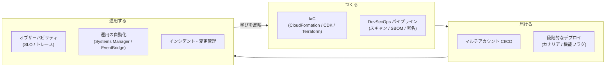
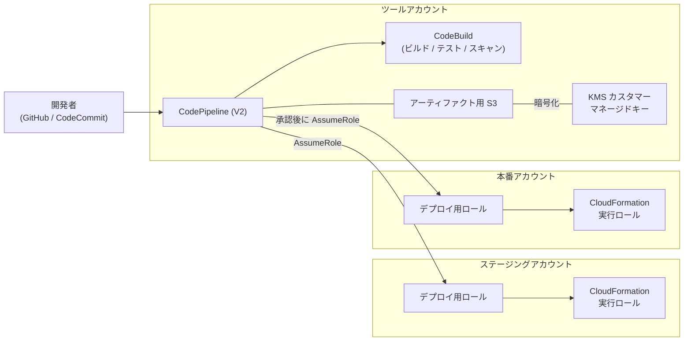
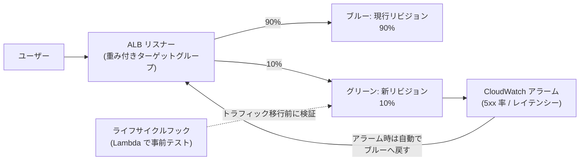
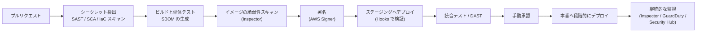
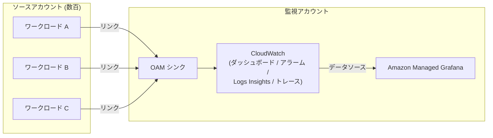
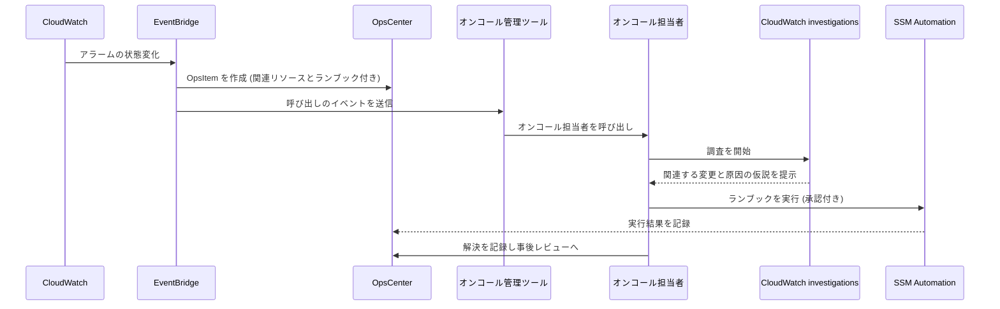

[ホーム](../README.md) > [Phase 3: プロフェッショナル](README.md) > 運用上の優秀性と自動化

# 運用上の優秀性と自動化

> **この章のゴール**
> - DevOps・SRE の考え方と SLI / SLO / エラーバジェットを使って、運用の目標を定量的に設計できる
> - CloudFormation StackSets、CDK、Terraform、CloudFormation Guard / Hooks を使い分け、組織全体に IaC を展開できる
> - ツールアカウントを中心としたマルチアカウント CI/CD（クロスアカウント、KMS、GitHub Actions の OIDC）を設計できる
> - デプロイ戦略（ローリング、イミュータブル、ブルー/グリーン、カナリア、線形）と AppConfig の機能フラグを要件に応じて選べる
> - パイプラインに脆弱性スキャン、IaC スキャン、シークレット検出、SBOM、署名を組み込んだ DevSecOps を設計できる
> - CloudWatch（Application Signals、Container Insights、Synthetics、RUM など）と OpenTelemetry で、組織横断のオブザーバビリティを設計できる
> - Systems Manager と EventBridge で運用と修復を自動化し、現在のサービス状況に合ったインシデント管理・変更管理を設計できる
>
> **対応試験**: SAP-C03（ドメイン 5: 運用上の優秀性と自動化（仮訳）、ドメイン 2: セキュリティ、コンプライアンス、ガバナンス ほか）
> **目安時間**: 9 時間（読む 6 時間 / 確認問題と復習 3 時間）

> [!NOTE]
> この章は [Phase 2: 監視と運用管理](../02-associate/13-monitoring-management.md)（CloudWatch、CloudTrail、Config、Systems Manager、CloudFormation の基本）を前提にしています。
> 手を動かして確認するなら [Lab 07: CloudFormation で IaC](../04-labs/lab07-cloudformation-iac.md) と [Lab 08: CloudWatch で監視](../04-labs/lab08-cloudwatch-monitoring.md) が対応します。

## この章の全体像

SAP-C03 のドメイン 5 は、「作る → 届ける → 運用する → 学ぶ」のループを **組織全体の規模で自動化する** 力を問います。



| 問題文の問い | 答えの方向性 | 節 |
|---|---|---|
| 数百アカウント（新規アカウントを含む）に同じ構成を展開したい | StackSets（サービスマネージド + 自動デプロイ） | 2 節 |
| 開発者が作るリソースのポリシー違反を、作成前に止めたい | CloudFormation Hooks（Guard）、プロアクティブコントロール | 2 節 |
| ツールアカウントから複数アカウントへ安全にデプロイしたい | CodePipeline + クロスアカウントロール + KMS カスタマーマネージドキー | 3 節 |
| 長期的なアクセスキーなしで外部 CI から AWS にデプロイしたい | OIDC フェデレーション（GitHub Actions） | 3 節 |
| 少しずつ新バージョンに切り替え、異常なら自動で戻したい | カナリア / 線形デプロイ + CloudWatch アラーム、AppConfig | 4 節 |
| 脆弱なイメージや署名のない成果物を本番に出したくない | Inspector、SBOM、AWS Signer、承認ゲート | 5 節 |
| 全アカウントのメトリクス・ログ・トレースを 1 か所で見たい | CloudWatch クロスアカウントオブザーバビリティ | 6 節 |
| 組織全体のパッチ適用や修復を自動化したい | Quick Setup のパッチポリシー、SSM Automation、EventBridge | 7 節 |

## 1. 運用モデル（DevOps、SRE、SLI/SLO）

### 1.1 運用上の優秀性の設計原則

Well-Architected フレームワークの運用上の優秀性の柱には、8 つの設計原則があります。この章の内容は、すべてこの原則のどれかに対応します。

| 設計原則 | 意味 | この章の対応 |
|---|---|---|
| ビジネス成果を中心にチームを編成する | 技術ではなく顧客価値を軸にチームと目標を決める | 1 節（SLO） |
| 実用的なインサイトを得るためにオブザーバビリティを実装する | 行動につながる計測をする | 6 節 |
| 可能な限り安全に自動化する | 手作業をなくし、自動化にもガードレールを付ける | 2・7 節 |
| 頻繁に、小規模で、元に戻せる変更を行う | 変更の影響範囲を小さくする | 3・4 節 |
| 運用手順を頻繁に改善する | ランブックを継続的に見直す | 7 節 |
| 障害を予測する | 障害を前提に訓練・検証する | 1.4 節、[06 章](06-resilience-business-continuity.md) |
| すべての運用上のイベントとメトリクスから学ぶ | 事後レビューで学びを仕組みに反映する | 7.8 節 |
| マネージドサービスを使用する | 運用負荷そのものを減らす | 全体 |

### 1.2 DevOps、SRE、プラットフォームエンジニアリング

| 観点 | DevOps | SRE（サイト信頼性エンジニアリング） | プラットフォームエンジニアリング |
|---|---|---|---|
| 何か | 開発と運用が協力し、価値を速く安全に届ける文化と実践 | 信頼性をソフトウェアエンジニアリングの手法で実現する役割・手法 | 開発者向けの内部プラットフォーム（標準化された「舗装された道」）を提供する |
| 主な手段 | CI/CD、IaC、自動テスト、小さな変更、「作った人が運用する」 | SLO、エラーバジェット、トイル（繰り返しの手作業）の削減、事後レビュー | セルフサービス、テンプレート、共通の CI/CD・監視基盤 |
| AWS での例 | CodePipeline、CDK、CloudFormation | Application Signals の SLO、AWS FIS | Service Catalog、CDK のコンストラクトライブラリ、Control Tower の Account Factory |

> [!NOTE]
> 古い教材では、プラットフォームエンジニアリングのサービスとして AWS Proton が登場します。Proton は **2026年10月7日にサポート終了予定** なので、新しい設計では Service Catalog や CDK のコンストラクトライブラリなどを使います。

### 1.3 SLI、SLO、SLA とエラーバジェット

- **SLI（サービスレベル指標）**: ユーザー体験を表す測定値です。例:「300 ms 以内に成功したリクエストの割合」。
- **SLO（サービスレベル目標）**: SLI の目標値と期間です。例:「30 日間で 99.9%」。
- **SLA（サービスレベル契約）**: 顧客との契約で、未達時の返金などを伴います。SLO は SLA より厳しく設定し、契約違反の前に気付けるようにします。
- **エラーバジェット** = 1 − SLO。SLO が 99.9% なら、30 日間で 0.1%（時間なら 43.2 分）まで「失敗」が許されます。

| SLO（30 日間） | 許容される停止時間 |
|---|---|
| 99% | 432 分（7.2 時間） |
| 99.9% | 43.2 分 |
| 99.95% | 21.6 分 |
| 99.99% | 約 4.3 分 |

エラーバジェットは、**リリースの速度と信頼性のバランスを取るための合意** です。予算が残っていれば新機能を積極的に出し、使い切ったらリスクの高いリリースを止めて信頼性の改善を優先する、というポリシーを事前に決めておきます。

アラートには **バーンレート**（エラーバジェットを消費する速さ）を使います。バーンレート 1 は「ちょうど 30 日で予算を使い切る速さ」です。バーンレート 14.4 が 1 時間続くと、30 日分の予算の 2%（14.4 ÷ 720 時間）を 1 時間で消費します。速い消費はすぐに呼び出し、遅い消費はチケットで対応する、というように複数の時間窓で判断します。

> [!TIP]
> **試験のポイント**: 「ユーザーから見た信頼性を定量的に管理したい」「リリースの速度と信頼性のバランスを取りたい」→ **SLO とエラーバジェット**（AWS では CloudWatch Application Signals の SLO）。
> SLI には CPU 使用率のような内部指標ではなく、成功率やレイテンシーのような **ユーザーから見える指標** を選びます。

### 1.4 学習のループ: ランブック、ゲームデー、事後レビュー

- **ランブック**（定型の対応手順）は、SSM Automation のランブックとしてコード化し、誰が実行しても同じ結果になるようにします。**プレイブック**（調査の進め方）は、原因が分からない状況での判断を支援します。
- **ゲームデー**（障害の模擬訓練）とカオスエンジニアリングで、手順と仕組みを事前に検証します。障害注入には AWS FIS を使います（[06 章](06-resilience-business-continuity.md)）。
- **事後レビュー**（ポストインシデントレビュー。Amazon では COE: Correction of Errors と呼ぶ）は、個人を責めない形式で、タイムライン、影響、根本原因、再発防止策を記録し、防止策を仕組み（アラーム、テスト、ガードレール）に落とし込みます。

## 2. IaC 戦略

### 2.1 ツールの使い分け

| 観点 | AWS CloudFormation | AWS CDK | Terraform |
|---|---|---|---|
| 記述方法 | YAML / JSON（宣言型） | TypeScript、Python、Java などのプログラミング言語 → CloudFormation テンプレートに合成 | HCL（宣言型） |
| 状態の管理 | AWS が管理（スタック） | 同左（CloudFormation のスタック） | state ファイルを自分で管理（S3 バックエンドと状態ロック） |
| マルチアカウント展開 | StackSets | CDK Pipelines、StackSets | プロバイダーごとの AssumeRole、Account Factory for Terraform（AFT） |
| ポリシーのチェック | cfn-lint、CloudFormation Guard、Hooks | cdk-nag（Aspects）、Hooks | OPA などのポリシー・アズ・コード、plan の JSON を Guard で検査 |
| 向いているケース | AWS ネイティブで標準的な構成 | 開発者主体。再利用できる抽象化（コンストラクト）を配布したい | マルチクラウド、既存の Terraform 資産 |

どれを選んでも、**組織として 1〜2 種類に標準化し、ポリシーのチェックとマルチアカウント展開の仕組みを共通化する** ことが重要です。

### 2.2 CloudFormation StackSets

StackSets は、1 つのテンプレートを **複数のアカウント × 複数のリージョン** に「スタックインスタンス」として展開する仕組みです。アクセス許可のモデルが 2 種類あり、SAP では違いがよく問われます。

| 観点 | セルフマネージドのアクセス許可 | サービスマネージドのアクセス許可 |
|---|---|---|
| 権限の準備 | 管理者アカウントに `AWSCloudFormationStackSetAdministrationRole`、各ターゲットアカウントに `AWSCloudFormationStackSetExecutionRole` を自分で作成 | Organizations で信頼されたアクセスを有効にするだけ。必要なロールは自動で作成される |
| ターゲットの指定 | アカウント ID | OU（または組織のルート） |
| 自動デプロイ | なし（新しいアカウントは手動で追加） | **あり**: OU に追加されたアカウントに自動で展開。アカウントが OU から外れたときにスタックを削除するか保持するかを選べる |
| 操作できるアカウント | 任意のアカウント | 管理アカウントまたは委任管理者アカウント |
| 管理アカウントへの展開 | 可能 | **不可**（ルートを指定しても管理アカウントは対象外） |
| 主な用途 | 組織外のアカウント、細かな制御 | 組織全体のベースライン（監査用ロール、Config ルール、EventBridge ルールなど） |

展開の速さと安全性は、**同時実行アカウント数**（数または割合）、**障害耐性**（何アカウントの失敗まで続行するか）、**リージョンの同時実行**（順次または並列）、**リージョンの順序** で制御します。最初に 1 リージョン・少数のアカウントへ展開して問題がないことを確かめてから広げる、という段階的な展開もこの設定で実現できます。

> [!WARNING]
> **ひっかけ注意**:
> - 「新しく作成されるアカウントにも自動で展開したい」→ **サービスマネージド + 自動デプロイ** です。セルフマネージドには自動デプロイがありません。
> - サービスマネージドの StackSets は **管理アカウントには展開されません**。管理アカウントにも同じリソースが必要なら、別途スタックを作成します。
> - AWS Control Tower も内部で StackSets を使っています。Control Tower のランディングゾーンでは、Customizations for Control Tower（CfCT）や AFT で独自のベースラインを展開する方法もあります（[02 章](02-multi-account-governance.md)）。

### 2.3 AWS CDK

- **コンストラクト** には 3 つのレベルがあります。L1（CloudFormation のリソースと 1 対 1）、L2（安全な既定値やヘルパーを持つ抽象化）、L3（複数のリソースを組み合わせたパターン）です。組織の標準（暗号化、ログ、タグ）を組み込んだ独自の L3 コンストラクトをライブラリとして配布すると、プラットフォームエンジニアリングの強力な手段になります。
- `cdk synth` で CloudFormation テンプレートを生成し、CloudFormation がデプロイします。したがって、変更セット、ロールバック、Hooks などの CloudFormation の安全装置がそのまま使えます。
- **ブートストラップ**: デプロイ先のアカウント・リージョンごとに `cdk bootstrap` を実行し、アセット用の S3 バケットや ECR リポジトリ、デプロイ用のロールを作成します。クロスアカウントでデプロイするには、ツールアカウントを信頼させます。

```bash
# 本番アカウント（222222222222）を、ツールアカウント（111111111111）からデプロイできるようにする
cdk bootstrap aws://222222222222/ap-northeast-1 \
  --trust 111111111111 \
  --cloudformation-execution-policies arn:aws:iam::aws:policy/AdministratorAccess
# 本番では CloudFormation 実行ロールのポリシーを必要最小限に絞ることを検討する
```

- **CDK Pipelines** は、パイプライン自身の定義もコードで管理し、変更時にパイプラインが自分自身を更新する（セルフミューテーション）仕組みです。複数のアカウント・リージョンへの段階的な展開（ウェーブ）を簡潔に書けます。
- **Aspects** と **cdk-nag** を使うと、合成の段階でセキュリティやコンプライアンスのルール違反を検出できます。

### 2.4 Terraform

- **state ファイル** にはリソースの属性（ときに機密情報）が含まれます。S3 バックエンドに保存して SSE-KMS で暗号化し、アクセスを厳しく制限します。同時実行による破損を防ぐため、状態ロック（DynamoDB テーブル、または新しいバージョンでは S3 のロックファイル）を使います。
- マルチアカウントでは、プロバイダーの設定で各アカウントのロールを引き受けます。環境（dev / stg / prod）ごとに state を分け、影響範囲を小さくします。
- パイプラインでは `plan` の結果を成果物として保存し、承認後にその plan を `apply` します。
- Control Tower 環境のアカウント払い出しには AFT、Terraform の構成を承認済み製品として提供するには Service Catalog の Terraform 製品を使えます。

### 2.5 ポリシー・アズ・コード: CloudFormation Guard と Hooks

「ポリシー違反のリソースを作らせない」仕組みは、どの段階で止めるかによって、確実さと回避されやすさが変わります。

| 段階 | 仕組み | 止められるもの | 限界 |
|---|---|---|---|
| 開発時・プルリクエスト | cfn-lint、CloudFormation Guard（cfn-guard）、checkov、cdk-nag | テンプレートの誤りやポリシー違反 | パイプラインを通らない変更は対象外 |
| プロビジョニング時 | **CloudFormation Hooks** | CloudFormation（と Cloud Control API）経由の作成・更新・削除 | CloudFormation を使わない操作は対象外 |
| API の実行時 | SCP、RCP、IAM、宣言型ポリシー | 権限と条件で表現できる操作 | リソースの細かなプロパティまでは表現しにくい |
| 作成後 | AWS Config ルール、Security Hub CSPM | すべての構成（検出） | 作成そのものは止めない |

**CloudFormation Guard** は、JSON / YAML のデータ（CloudFormation テンプレート、Terraform の plan の JSON、Kubernetes のマニフェストなど）を検証するポリシー・アズ・コードのツールです。

```text
# S3 バケットはバージョニングを有効にする
let s3_buckets = Resources.*[ Type == 'AWS::S3::Bucket' ]

rule S3_VERSIONING_ENABLED when %s3_buckets !empty {
    %s3_buckets.Properties.VersioningConfiguration.Status == 'Enabled'
    <<
        S3 バケットではバージョニングを有効にしてください
    >>
}
```

パイプラインでは `cfn-guard validate --data template.yaml --rules s3.guard` のように実行し、違反があればビルドを失敗させます。

**CloudFormation Hooks** は、CloudFormation がリソースを作成・更新・削除する **前に** 評価を実行し、違反があれば操作を止める（または警告する）仕組みです。

- **フックの種類**: Guard フック（Guard のルールを S3 に置くだけで使える、サービスマネージドのフック）、Lambda フック（評価を Lambda 関数に任せる）、プロアクティブコントロールのフック（AWS Control Tower のコントロールカタログのルールを使う）、カスタムフック（ハンドラーを自分で開発）。
- **評価の対象（ターゲット）**: リソース単位（RESOURCE）、スタック全体（STACK）、変更セット（CHANGE_SET）、Cloud Control API の操作（CLOUD_CONTROL）。スタックや変更セットを対象にすると、複数のリソースの関係をまとめて評価できます。
- **失敗時の動作**: 操作を止める（FAIL）か、警告だけにする（WARN）かを選べます。まず WARN で影響を確認してから FAIL に切り替えるのが安全です。
- フックはアカウント・リージョンごとに有効化するので、組織全体には StackSets で展開します。Control Tower のプロアクティブコントロールも、この Hooks の仕組みで実装されています。

（2026年9月時点。[CloudFormation Hooks](https://docs.aws.amazon.com/cloudformation-cli/latest/hooks-userguide/what-is-cloudformation-hooks.html)）

> [!TIP]
> **試験のポイント**: 「CloudFormation でプロビジョニングされる **前に**、非準拠のリソースをブロックしたい」→ **CloudFormation Hooks**（または Control Tower のプロアクティブコントロール）。
> 「作成後に検出して通知・修復したい」→ AWS Config ルール（+ 自動修復）。「API レベルで確実に禁止したい」→ SCP / RCP。

### 2.6 ドリフトの検出と防止

**ドリフト** とは、コンソールでの手作業などにより、実際の構成がテンプレートとずれた状態です。

- **検出**: CloudFormation のドリフト検出（スタック、StackSets）を使います。AWS Config のマネージドルール `cloudformation-stack-drift-detection-check` で定期的に検出することもできます。
- **防止**: 本番アカウントでは、IAM や SCP で「パイプラインのロール以外によるリソースの変更」を拒否します。条件キー `aws:PrincipalArn`（パイプラインのロールだけを許可）や `aws:CalledVia`（CloudFormation 経由の呼び出しだけを許可）を使います。緊急時のためのブレークグラス用ロールは、利用を厳しく監視したうえで例外にします。
- **是正**: テンプレートを実態に合わせて更新するか、テンプレートから再デプロイします。IaC の管理外で作られたリソースは、リソースのインポートや IaC ジェネレーター（既存のリソースからテンプレートを生成）で管理下に入れます。

> [!WARNING]
> **ひっかけ注意**: ドリフト検出は **検出するだけ** で、自動では元に戻しません。また、すべてのリソースタイプ・プロパティに対応しているわけではありません。「ドリフトを自動で防ぐ」要件には、変更そのものを権限で制限する設計が必要です。

## 3. マルチアカウント CI/CD

### 3.1 全体構成

大規模な組織では、パイプラインを **ツールアカウント**（デプロイ専用のアカウント）に集約し、各ワークロードアカウントにはデプロイに必要なロールだけを置きます。人が本番アカウントを直接操作する機会を減らし、「本番への変更はパイプライン経由だけ」を実現するためです。



### 3.2 CodePipeline（V2）と関連サービス

| サービス | 役割 | ポイント |
|---|---|---|
| AWS CodePipeline（V2 タイプ） | パイプラインの制御 | Git のタグ・ブランチ・ファイルパスによるトリガーの絞り込み、パイプライン変数、実行モード（SUPERSEDED / QUEUED / PARALLEL）、ステージ失敗時の自動ロールバック、ステージの条件（ルール）による前後のチェック。料金はアクションの実行時間（分）に応じた課金 |
| AWS CodeBuild | ビルド、テスト、スキャン | マネージドなビルド環境。VPC 内のリソースへのアクセス、コンテナイメージのビルド、テストレポート |
| AWS CodeDeploy | EC2 / オンプレミス、Lambda、ECS へのデプロイ | 段階的なトラフィック移行と自動ロールバック（4 節） |
| AWS CodeConnections（旧 CodeStar Connections） | GitHub、GitLab、Bitbucket との接続 | 外部のリポジトリをパイプラインのソースにする |
| AWS CodeCommit | Git リポジトリ | 2025年11月に一般提供へ復帰し、新規利用も可能 |
| AWS CodeArtifact | パッケージリポジトリ（npm、PyPI、Maven など） | 依存パッケージを組織内で管理し、上流の公開リポジトリをキャッシュする |

> [!NOTE]
> CodeCommit は 2024年に新規受付を停止しましたが、2025年11月に一般提供に戻っています。「CodeCommit は廃止された」と書かれた教材は古い情報です。一方、Amazon CodeCatalyst は新規受付の終了が発表されています（2025年11月）。

### 3.3 クロスアカウント・クロスリージョンの権限設計

ツールアカウントのパイプラインが本番アカウントにデプロイするには、次の 5 つをそろえます。

1. **アーティファクト用バケットをカスタマーマネージドキーで暗号化する**: AWS マネージドキー（`aws/s3`）はキーポリシーを変更できないため、他のアカウントに復号を許可できません。
2. **KMS キーポリシー** で、ターゲットアカウントのデプロイ用ロールに復号などを許可する。
3. **バケットポリシー** で、ターゲットアカウントのロールにアーティファクトの読み取りを許可する。
4. ターゲットアカウントに 2 つのロールを作る。**デプロイ用ロール**（ツールアカウントのパイプラインを信頼し、パイプラインが引き受ける）と、**CloudFormation 実行ロール**（CloudFormation サービスを信頼し、実際にリソースを作る権限を持つ）です。デプロイ用ロールは `iam:PassRole` で実行ロールを CloudFormation に渡します。
5. **クロスリージョン**: CodePipeline はアクションを実行するリージョンごとにアーティファクトストア（S3 バケット）が必要です。各リージョンのバケットにも KMS キーを設定します。

```json
{
  "Sid": "AllowTargetAccountDeployRoles",
  "Effect": "Allow",
  "Principal": {
    "AWS": [
      "arn:aws:iam::222222222222:role/PipelineDeployRole",
      "arn:aws:iam::333333333333:role/PipelineDeployRole"
    ]
  },
  "Action": [
    "kms:Decrypt",
    "kms:DescribeKey",
    "kms:Encrypt",
    "kms:ReEncrypt*",
    "kms:GenerateDataKey*"
  ],
  "Resource": "*"
}
```

> [!WARNING]
> **ひっかけ注意**:
> - クロスアカウントのデプロイで「アーティファクトの取得時に AccessDenied」→ 原因の定番は **AWS マネージドキーで暗号化されている** ことと、**キーポリシーの許可漏れ** です。S3 の権限を広げても解決しません。
> - CloudFormation 実行ロールに `AdministratorAccess` を付けるのは手軽ですが、本番では必要な権限に絞り、アクセス許可の境界で上限を設けることを検討します。

### 3.4 GitHub Actions と OIDC フェデレーション

外部の CI（GitHub Actions など）から AWS にデプロイする場合、**IAM ユーザーのアクセスキーを CI のシークレットに保存するのは避けます**。漏えいすると長期間悪用されるからです。代わりに OIDC フェデレーションを使います。

1. GitHub がワークフローの実行ごとに、短期間だけ有効な OIDC トークン（どのリポジトリ・ブランチ・環境の実行かを示すクレームを含む）を発行します。
2. AWS 側に GitHub 用の IAM OIDC ID プロバイダー（`token.actions.githubusercontent.com`）を作成し、そのトークンを信頼する IAM ロールを作ります。
3. ワークフローは `sts:AssumeRoleWithWebIdentity` でロールを引き受け、一時的な認証情報でデプロイします。

信頼ポリシーでは、**`aud`（対象者）に加えて `sub`（どのリポジトリのどの実行か）を必ず条件にします**。

```json
{
  "Version": "2012-10-17",
  "Statement": [
    {
      "Effect": "Allow",
      "Principal": {
        "Federated": "arn:aws:iam::222222222222:oidc-provider/token.actions.githubusercontent.com"
      },
      "Action": "sts:AssumeRoleWithWebIdentity",
      "Condition": {
        "StringEquals": {
          "token.actions.githubusercontent.com:aud": "sts.amazonaws.com",
          "token.actions.githubusercontent.com:sub": "repo:example-org/order-api:environment:production"
        }
      }
    }
  ]
}
```

ワークフロー側では、OIDC トークンを取得するための権限（`id-token: write`）を付け、公式のアクションでロールを引き受けます。

```yaml
permissions:
  id-token: write   # OIDC トークンの取得に必要
  contents: read
jobs:
  deploy:
    runs-on: ubuntu-latest
    environment: production   # GitHub の環境の保護ルール（承認者など）と組み合わせる
    steps:
      - uses: actions/checkout@v4
      - uses: aws-actions/configure-aws-credentials@v4
        with:
          role-to-assume: arn:aws:iam::222222222222:role/GitHubActionsDeployRole
          aws-region: ap-northeast-1
      - run: aws cloudformation deploy --template-file template.yaml --stack-name order-api
```

> [!WARNING]
> **ひっかけ注意**:
> - 信頼ポリシーで `sub` を条件にしないと、**GitHub 上の任意のリポジトリ** のワークフローがロールを引き受けられてしまいます。`repo:example-org/*` のような広いワイルドカードも避けます。
> - 複数アカウントへのデプロイで、あるロールから別のロールを引き受ける「ロールの連鎖」を使う場合、セッションの最大時間は 1 時間です。長時間のデプロイでは、各アカウントに OIDC プロバイダーとロールを作る方式も検討します。

## 4. デプロイ戦略

### 4.1 戦略の比較

| 戦略 | 仕組み | ダウンタイム | ロールバック | 追加コスト | 影響範囲 |
|---|---|---|---|---|---|
| 一括（インプレース） | 全台を同時に更新する | 発生し得る | 遅い（再デプロイ） | なし | 全ユーザー |
| ローリング | 一定数ずつ更新する | なし（容量は一時的に減る） | 遅い（再デプロイ） | なし | 徐々に拡大 |
| 追加バッチ付きローリング | 追加の台数を起動してから一定数ずつ更新する | なし（容量を維持） | 遅い | 小 | 徐々に拡大 |
| イミュータブル | 新しいインスタンス群を作り、正常なら旧群と入れ替える | なし | 速い（新群を捨てる） | 一時的に 2 倍 | 入れ替えまで限定 |
| ブルー/グリーン | 本番と同等の環境（グリーン）を並行して用意し、トラフィックを切り替える | なし | 最速（戻すだけ） | 一時的に 2 倍 | 切り替え方次第 |
| カナリア | 少量（例: 10%）を先に流し、問題なければ残りを一度に移す | なし | 速い | 小〜中 | 最小 |
| 線形 | 一定の割合ずつ一定の間隔で増やす（例: 1 分ごとに 10%） | なし | 速い | 小〜中 | 段階的 |

ブルー/グリーンは「環境を 2 つ用意する」パターンで、カナリア・線形・一括は「その間でトラフィックをどう移すか」を表します。組み合わせて「ブルー/グリーン + カナリア」のように使います。

### 4.2 AWS での実装

| 対象 | 選べる方式 | 仕組みとポイント |
|---|---|---|
| CodeDeploy（EC2 / オンプレミス） | インプレース（1 台ずつ、半分ずつ、一括など）、ブルー/グリーン（EC2 のみ） | ブルー/グリーンでは Auto Scaling グループをコピーして新環境を作り、ロードバランサーで切り替える |
| CodeDeploy（Lambda） | カナリア、線形、一括 | エイリアスの重みでバージョン間のトラフィックを移す。移行前後のフック（Lambda）と CloudWatch アラームによる自動ロールバック |
| CodeDeploy（ECS） | ブルー/グリーン（カナリア、線形、一括） | テスト用リスナーで新しいタスクセットを検証してから本番リスナーを切り替える |
| ECS ネイティブ | ローリング更新（デプロイサーキットブレーカーで自動ロールバック）、ブルー/グリーン（2025年7月）、線形・カナリア（2025年10月） | CodeDeploy なしで、ライフサイクルフック（Lambda）、ベイク時間、CloudWatch アラームによる自動ロールバックを使える。線形・カナリアは ALB または Service Connect を使うサービスが対象 |
| Elastic Beanstalk | 一括、ローリング、追加バッチ付きローリング、イミュータブル、トラフィック分割、ブルー/グリーン（環境の URL のスワップ） | 設定だけで選べる |
| API Gateway | カナリアリリース | ステージ単位で一部のトラフィックを新しいデプロイに流す |
| CloudFront | 継続的デプロイ | ステージング用ディストリビューションに、重みまたはヘッダーでトラフィックを振り分ける |
| ALB / Route 53 | 重み付きターゲットグループ / 加重ルーティング | Route 53 は DNS のキャッシュ（TTL）があるため、切り替えが即時ではない |
| Amazon EKS | Argo Rollouts、Flagger などの OSS | Kubernetes のエコシステムでカナリアを実現する |

（ECS の方式は 2026年9月時点。[ECS のカナリアデプロイ](https://docs.aws.amazon.com/AmazonECS/latest/developerguide/canary-deployment.html)）

ECS ネイティブのデプロイは、CodeDeploy と同等の段階的なトラフィック移行を追加のサービスなしで実現でき、AWS のブログでも多くの新規プロジェクトで推奨される方式として紹介されています。



> [!TIP]
> **試験のポイント**:
> - 「一部のトラフィックで新バージョンを検証し、問題があれば自動で戻す」→ **カナリア（または線形）+ CloudWatch アラームによる自動ロールバック**。
> - 「ロールバックを最速にしたい」→ **ブルー/グリーン**（旧環境が残っている）。
> - 「追加コストを最小にしたい（ダウンタイムは許容しないが容量減は許容）」→ ローリング。
> - 「ECS で追加のデプロイサービスを導入せずに」→ **ECS ネイティブ** のブルー/グリーン・カナリア・線形。

### 4.3 Lambda のエイリアスと段階的デプロイ

Lambda では、**バージョン**（不変のスナップショット）と、バージョンを指す **エイリアス**（重み付きで 2 つのバージョンを指せる）を使います。AWS SAM では、次のように書くだけで CodeDeploy による段階的デプロイが設定されます。

```yaml
OrderFunction:
  Type: AWS::Serverless::Function
  Properties:
    Handler: app.handler
    Runtime: python3.13
    AutoPublishAlias: live            # デプロイごとに新バージョンを発行し、エイリアスを移す
    DeploymentPreference:
      Type: Canary10Percent5Minutes   # 10% を 5 分流してから残りを移す
      Alarms:
        - !Ref OrderErrorsAlarm       # アラームが発生したら自動でロールバック
      Hooks:
        PreTraffic: !Ref PreTrafficCheckFunction
```

### 4.4 データベースを含む変更

アプリケーションとデータベースを同時に切り替えることは難しいため、**後方互換性のある変更（Expand / Contract）** を基本にします。まず新旧どちらのコードでも動くようにスキーマを拡張（列の追加など）し、新しいコードをデプロイし、データを移行した後で、古い列などを削除（縮小）します。

RDS と Aurora には **ブルー/グリーンデプロイ** の機能があります。本番（ブルー）からレプリケーションで同期されたステージング環境（グリーン）でメジャーバージョンアップやパラメーター変更を検証し、準備ができたら短時間で切り替えられます。

### 4.5 AppConfig による機能フラグ

**AWS AppConfig** の機能フラグを使うと、**デプロイ（コードを配置すること）とリリース（機能を有効にすること）を分離** できます。新機能のコードを無効の状態でデプロイしておき、フラグで段階的に有効にし、問題があればコードの再デプロイなしに即座に無効にできます（キルスイッチ）。

- **構成**: アプリケーション、環境、構成プロファイル（機能フラグ型または自由形式）、デプロイ戦略の 4 つを定義します。
- **デプロイ戦略**: 設定値そのものを段階的に配信します。AWS が用意した戦略（例: `AppConfig.Canary10Percent20Minutes`、`AppConfig.Linear50PercentEvery30Seconds`、`AppConfig.AllAtOnce`）のほか、独自の戦略も作れます。
- **安全装置**: バリデーター（JSON スキーマ、Lambda 関数）で不正な値の配信を防ぎ、配信中とベイク時間中に CloudWatch アラームが発生したら自動でロールバックします。
- **マルチバリアントフラグ**: ユーザーの属性（地域、会員区分など）に応じて異なる値を返せます。社内ユーザー → 一部の顧客 → 全員、という公開の順序を制御できます。
- **取得方法**: AppConfig エージェント（Lambda 拡張機能、ECS / EKS のサイドカーなど）が設定をキャッシュし、定期的に更新を確認するので、アプリケーションは手元から高速に値を読めます。

> [!TIP]
> **試験のポイント**: 「コードを再デプロイせずに機能を有効化・無効化したい」「一部のユーザーにだけ新機能を公開したい」「問題時に即座に無効化したい」→ **AppConfig の機能フラグ**。
> 古い教材に出てくる CloudWatch Evidently は、サポート終了が発表され、AppConfig への移行が案内されています。

> [!WARNING]
> **ひっかけ注意**: 機能フラグはアクセス制御の仕組みではありません。「フラグで非表示にしたからセキュリティ上も安全」とはならないので、認可は IAM やアプリケーションで行います。また、使い終わったフラグを放置すると技術的負債になるため、削除の計画も立てます。

## 5. DevSecOps

### 5.1 パイプラインに組み込むセキュリティ

DevSecOps の基本は **シフトレフト**（問題をできるだけ早い段階で見つける）と、**本番に出た後も継続的に監視する** ことの両立です。脆弱性は後から公開されるので、「デプロイ時にスキャンしたから安全」とはなりません。



### 5.2 スキャンの種類と配置

| 種類 | 何を見つけるか | 実行する段階 | AWS / OSS の例 |
|---|---|---|---|
| シークレット検出 | コード内のアクセスキー、パスワード | コミット前、プルリクエスト | git-secrets、GitHub のシークレットスキャン、gitleaks など |
| SAST（静的解析） | 自社コードの脆弱性（インジェクションなど） | プルリクエスト、ビルド | Amazon Inspector のコードセキュリティ、各種 OSS |
| SCA（ソフトウェア構成分析） | 依存ライブラリの既知の脆弱性 | プルリクエスト、ビルド | Inspector のコードセキュリティ、Inspector の SBOM Generator + スキャン API |
| IaC スキャン | テンプレートの設定ミス（暗号化なし、公開設定など） | プルリクエスト、ビルド | cfn-lint、CloudFormation Guard、checkov、cdk-nag、Inspector のコードセキュリティ |
| コンテナイメージのスキャン | OS パッケージ・言語パッケージの CVE | ビルド後、ECR へのプッシュ時、継続的 | Inspector（CI/CD 連携、ECR の拡張スキャン） |
| DAST（動的解析） | 実行中のアプリケーションの脆弱性 | ステージング | OWASP ZAP などの OSS |
| 実行時の監視 | 新たに公開された CVE、脅威 | 本番 | Inspector（EC2、ECR、Lambda の継続的スキャン）、GuardDuty |

### 5.3 Amazon Inspector

Amazon Inspector は、脆弱性管理を自動化するサービスです。

- **対象**: EC2 インスタンス（SSM エージェントを使う方式とエージェントレスの方式）、ECR のコンテナイメージ、Lambda 関数（依存パッケージと関数コード）、コードリポジトリ（**コードセキュリティ**: GitHub・GitLab のリポジトリに対する SAST、SCA、IaC スキャン。2025年6月に一般提供）。
- **継続的な評価**: 新しい CVE が公開されると、既存のリソースも自動で再評価します。
- **CI/CD との連携**: Inspector SBOM Generator（sbomgen）でイメージやディレクトリから SBOM を作り、Inspector のスキャン API で評価できます。パイプラインで重大度のしきい値を超えたらビルドを失敗させる、といったゲートを作れます。
- **SBOM のエクスポート**: 管理対象のリソースの SBOM を CycloneDX や SPDX の形式で S3 にエクスポートできます。
- **組織全体での有効化**: 委任管理者アカウントから組織のアカウントを自動で有効化できます。2025年11月からは Organizations の Inspector ポリシーでも一元的に有効化を管理できます。検出結果は Security Hub に集約します。

| 観点 | ECR のベーシックスキャン | ECR の拡張スキャン（Inspector） |
|---|---|---|
| 実行のタイミング | プッシュ時または手動 | プッシュ時 + **継続的**（新しい CVE が公開されると再評価） |
| 対象 | OS パッケージが中心 | OS パッケージ + プログラミング言語のパッケージ |
| 結果の集約 | ECR のコンソール・API | Inspector、Security Hub、EventBridge |

> [!WARNING]
> **ひっかけ注意**: 古い教材では、コードレビューの自動化に Amazon CodeGuru Reviewer が登場しますが、2025年に新規受付の終了が発表されています。新しい設計では Inspector のコードセキュリティや OSS のツールを使います。
> また、GuardDuty（Runtime Monitoring を含む）は **脅威の検出** のサービスで、脆弱性のあるイメージのデプロイを止めるゲートではありません。

### 5.4 シークレットの管理

- シークレットはコードや設定ファイルに書かず、AWS Secrets Manager（自動ローテーション）や Systems Manager Parameter Store（SecureString）に保存します。CodeBuild のビルド仕様、ECS のタスク定義、Lambda の拡張機能から参照できます。
- シークレット検出は、開発者の端末（コミット前のフック）とリポジトリ側の両方で行います。
- 漏えいを検出したら、**履歴から消すだけでは不十分** です。直ちにシークレットを無効化・ローテーションします。

### 5.5 SBOM と署名によるサプライチェーン対策

- **SBOM（ソフトウェア部品表）**: 成果物に含まれるコンポーネントとバージョンの一覧です。ビルド時に生成して成果物と一緒に保管しておくと、新しい脆弱性が公開されたときに「影響を受ける成果物はどれか」をすぐに調べられます。
- **AWS Signer**: コンテナイメージ（Notation 形式）や Lambda のコードに署名します。Lambda の **コード署名の設定** を使うと、信頼された署名プロファイルで署名されていないコードのデプロイを拒否できます。EKS では、アドミッションコントローラー（Kyverno や Ratify などの OSS）で署名を検証し、署名のないイメージの実行を拒否できます。
- **ECR の設定**: タグの上書きを禁止する **イメージタグのイミュータビリティ** を有効にし、デプロイではダイジェスト（ハッシュ値）でイメージを指定します。
- 依存パッケージは CodeArtifact などで組織内に取り込み、取得元を管理します。

### 5.6 承認ゲートと職務分掌

- CodePipeline の **手動承認アクション** で、本番へのデプロイ前に承認を求めます（SNS で承認者に通知。承認されないまま 7 日が経過すると失敗します）。
- ブランチ保護（レビュー必須、直接のプッシュ禁止）で、1 人だけで本番に変更を出せないようにします。
- 本番アカウントでは、SCP やアクセス許可の境界で **パイプラインのロール以外によるリソースの変更を拒否** します（2.6 節）。これにより、承認ゲートを迂回した変更も防げます。

## 6. オブザーバビリティ

### 6.1 知りたいことと使う機能

オブザーバビリティの基本シグナルは **メトリクス、ログ、トレース** です。監視の出発点としては、レイテンシー、トラフィック、エラー、飽和度（リソースの逼迫）の 4 つ（ゴールデンシグナル）が定番です。

| 知りたいこと | 使う機能 |
|---|---|
| ユーザーから見た可用性・レイテンシーと SLO の達成状況 | CloudWatch Application Signals |
| リクエストがどのサービスのどこで遅いか | AWS X-Ray（OpenTelemetry で計装） |
| コンテナのリソース使用率、再起動、異常 | CloudWatch Container Insights |
| 利用者がいない時間帯でも壊れていないか | CloudWatch Synthetics |
| 実際のユーザーのブラウザでの体験 | CloudWatch RUM |
| ISP や地域単位のインターネットの問題 | CloudWatch Internet Monitor |
| Prometheus のメトリクスと Grafana のダッシュボード | Amazon Managed Service for Prometheus / Amazon Managed Grafana |
| 生成 AI の呼び出し数、レイテンシー、トークン数 | Amazon Bedrock の CloudWatch メトリクス、AgentCore Observability |
| 全アカウントのデータを 1 か所で見る | CloudWatch のクロスアカウントオブザーバビリティ |
| 障害の原因調査の支援 | CloudWatch investigations |

### 6.2 CloudWatch Application Signals と SLO

**CloudWatch Application Signals** は、アプリケーションを OpenTelemetry 互換のエージェント（CloudWatch エージェントや ADOT）で自動計装し、サービスごと・操作（API）ごとの標準的なメトリクス（リクエスト数、レイテンシー、フォールト（5xx）、エラー（4xx））と、サービス間の依存関係のマップを提供します。EKS、ECS、EC2、Lambda 上のアプリケーションに対応しています。

- **SLO の作成**: サービスや操作のレイテンシー・可用性、または任意の CloudWatch メトリクスを SLI として、期間ベース（条件を満たした時間の割合）またはリクエストベース（良いリクエストの割合）の SLO を定義します。
- **エラーバジェットの管理**: SLO の達成度とエラーバジェットの残量を表示し、それらに CloudWatch アラームを設定できます。
- **他の機能との連携**: Synthetics のカナリアや RUM のデータ、X-Ray のトレースと関連付けて、SLO 違反から原因のトレースまでたどれます。

### 6.3 分散トレーシング: X-Ray と OpenTelemetry（ADOT）

- **トレース** は 1 つのリクエストがサービスをまたいで処理される全体の記録で、処理の区間（スパン。X-Ray ではセグメント）の集まりです。トレースの文脈はリクエストのヘッダーで次のサービスへ伝播されます。全リクエストを記録すると高コストなので、**サンプリング** を使います。
- **AWS Distro for OpenTelemetry（ADOT）** は、AWS がサポートする OpenTelemetry のディストリビューションです。コレクターからメトリクスを CloudWatch や Amazon Managed Service for Prometheus へ、トレースを X-Ray へ送れます。

> [!IMPORTANT]
> **X-Ray SDK とデーモンは 2026年2月25日にメンテナンスモードに入り、2027年2月25日にサポート終了予定** です。AWS は OpenTelemetry ベースの計装（ADOT、CloudWatch エージェント）への移行を推奨しており、X-Ray のコンソールでのトレースの確認は引き続き利用できます（[公式のタイムライン](https://docs.aws.amazon.com/xray/latest/devguide/xray-sdk-daemon-timeline.html)）。
> 古い教材や問題では「X-Ray SDK で計装する」が正解になっていることがありますが、新しい設計では OpenTelemetry を選びます。

### 6.4 コンテナの監視と Prometheus / Grafana

- **Container Insights**: ECS と EKS のクラスター、ノード、サービス／Pod、コンテナ単位のメトリクスとログを収集します。より詳細なメトリクスとダッシュボードを提供する、オブザーバビリティ強化版もあります。
- **Amazon Managed Service for Prometheus（AMP）**: Prometheus 互換のマネージドなメトリクス基盤です。PromQL でクエリでき、アラートのルールも管理できます。EKS からは AWS マネージドのコレクター（エージェントレスのスクレイパー）や ADOT でメトリクスを取り込みます。
- **Amazon Managed Grafana（AMG）**: マネージドな Grafana です。IAM Identity Center や SAML で認証し、CloudWatch、AMP、X-Ray などをデータソースとしてダッシュボードを作れます。

**選び方**: AWS ネイティブで統一するなら CloudWatch、既存の Prometheus / Grafana の資産やスキル、他の環境との共通化を重視するなら AMP / AMG です。両者を併用するのも一般的です。

### 6.5 外形監視と実ユーザー監視

| 観点 | CloudWatch Synthetics | CloudWatch RUM | CloudWatch Internet Monitor |
|---|---|---|---|
| 何を見るか | スクリプト化した操作（API 呼び出し、画面遷移）を定期的に実行した結果 | 実際のユーザーのブラウザでの表示速度、JavaScript のエラー、セッション | ユーザーの所在地・ISP と AWS 上のアプリケーションの間のインターネットの状態 |
| 強み | 利用者がいない時間帯でも障害を先に検知できる。VPC 内の内部エンドポイントも監視できる | 実際の体験（Core Web Vitals など）を把握できる | ISP・都市単位の障害の影響範囲と、改善策（リージョンや CloudFront の利用）が分かる |
| 仕組み | カナリア（スクリプト）をスケジュール実行する | Web ページに JavaScript のスニペットを埋め込む | CloudFront、VPC、NLB などのトラフィックから分析する |
| 使いどころ | ログインや購入フローの監視、SLO の SLI | フロントエンドの性能改善 | グローバルなユーザー向けの経路の問題の把握 |

> [!TIP]
> **試験のポイント**: 「ユーザーがアクセスする前に障害を検知したい」「定期的に購入フローを確認したい」→ **Synthetics**。「実際のユーザーの体験を計測したい」→ **RUM**。「特定の ISP・地域のユーザーだけが遅い原因を知りたい」→ **Internet Monitor**。

### 6.6 AI/ML ワークロードの監視

生成 AI のワークロードでは、通常のメトリクスに加えて **トークン数、スロットリング、応答の品質** を監視します。設計の詳細は [09 章](09-generative-ai-architecture.md) を参照してください。

- **Amazon Bedrock のメトリクス**: CloudWatch に呼び出し数（Invocations）、レイテンシー（InvocationLatency）、クライアント・サーバーのエラー、スロットリング（InvocationThrottles）、入力・出力のトークン数（InputTokenCount / OutputTokenCount）などがモデルごとに発行されます。スロットリングはクォータの見直し、トークン数の急増はコストの異常の兆候です。
- **モデル呼び出しのログ**: プロンプトと応答を CloudWatch Logs や S3 に記録できます。個人情報を含み得るため、暗号化とアクセス制御を徹底します。Guardrails の介入状況も監視します。
- **エージェント**: Amazon Bedrock AgentCore の Observability で、エージェントの推論の各ステップ、ツール呼び出し、メモリの利用を OpenTelemetry 形式のトレースとして CloudWatch で確認できます。応答の品質は、Bedrock の評価機能や AgentCore Evaluations で継続的に測ります。
- **SageMaker AI のエンドポイント**: 呼び出し数、モデルのレイテンシー（ModelLatency）、CPU / GPU の使用率を CloudWatch で監視します。SageMaker AI Model Monitor は 2026年6月に新規受付の終了が発表されているため、古い教材の「Model Monitor でドリフトを検出」という解答には注意してください。

### 6.7 クロスアカウントオブザーバビリティ

数百アカウントの環境で、障害のたびにアカウントを切り替えて調べるのは現実的ではありません。**CloudWatch のクロスアカウントオブザーバビリティ** では、**監視アカウント** に **シンク** を作り、各 **ソースアカウント** から **リンク** を作成して、メトリクス、ログ、トレース、Application Signals などを共有します（Observability Access Manager（OAM）の仕組み）。

- データはソースアカウントに残ったまま、監視アカウントからアカウント横断でダッシュボード、アラーム、Logs Insights のクエリ、トレースの検索ができます。データのコピー（二重保管）は発生しません。
- シンクのポリシーで組織全体や特定の OU からのリンクを許可し、リンクは CloudFormation StackSets で全アカウントに展開します。
- セキュリティ目的の長期保存（ログアーカイブアカウントへの集約）とは目的が異なるので、両方を組み合わせます。



> [!NOTE]
> 公式ドキュメント: [CloudWatch のクロスアカウントオブザーバビリティ](https://docs.aws.amazon.com/AmazonCloudWatch/latest/monitoring/CloudWatch-Unified-Cross-Account.html)

### 6.8 CloudWatch investigations

**CloudWatch investigations**（2025年6月に一般提供）は、生成 AI を使って障害の原因調査を支援する機能です。アラームなどから調査を開始すると、関連するメトリクス、ログ、トレース、直近のデプロイや構成の変更（CloudTrail）などを自動で集めて分析し、原因の仮説と対応の候補を提示します。担当者は仮説を採用・却下しながら調査を進め、結果を記録として残せます。7.8 節のインシデント対応の流れの中で使います。

## 7. 運用の自動化

### 7.1 Systems Manager の主要機能と現在の状況

| 機能 | 用途 | 状況（2026年9月時点） |
|---|---|---|
| Automation | ランブックによる複数ステップの自動化（複数アカウント・リージョン） | 利用可 |
| Run Command | コマンドの一括実行 | 利用可 |
| State Manager | あるべき状態の維持（関連付け） | 利用可 |
| Patch Manager | パッチの評価と適用（パッチポリシー） | 利用可 |
| Session Manager | インバウンドポートを開けないシェル接続と操作ログ | 利用可 |
| Parameter Store / Inventory | 設定値の保存 / ソフトウェア・構成情報の収集 | 利用可 |
| OpsCenter | 運用上の問題（OpsItem）の集約と対応 | 利用可 |
| Change Calendar / Quick Setup | 変更禁止期間の管理 / 組織全体への推奨設定の展開 | 利用可 |
| Incident Manager / Change Manager | インシデント対応 / 変更の承認 | 【新規受付終了】2025年11月に発表 |
| Application Manager | アプリケーション単位の運用管理 | 【新規受付終了】2026年7月 |

（[AWS のメンテナンス中のサービス一覧](https://docs.aws.amazon.com/general/latest/gr/maintenance_services.html)）

### 7.2 Automation ランブック

**SSM Automation** は、ランブック（YAML / JSON のドキュメント）に定義した複数のステップを実行します。ステップには AWS API の呼び出し（`aws:executeAwsApi`）、Python / PowerShell のスクリプト（`aws:executeScript`）、Run Command の実行、**承認待ち（`aws:approve`）**、条件分岐などを使えます。

- **複数アカウント・複数リージョン**: 管理アカウント（または委任管理者アカウント）から、OU やアカウントとリージョンを指定して一括で実行できます。**同時実行数（MaxConcurrency）とエラーのしきい値（MaxErrors）** で、影響範囲を制御します。
- **まず AWS 提供のランブックを探す**: `AWS-`、`AWSSupport-`、`AWSConfigRemediation-` で始まる多数のランブックが用意されています（例: S3 バケットのパブリックアクセスをブロックするランブック）。自作は最後の手段です。
- **起動のきっかけ**: AWS Config の修復アクション、EventBridge のルール、OpsCenter、State Manager、メンテナンスウィンドウ、手動実行。

### 7.3 State Manager

**State Manager** は、ドキュメントと対象（タグやリソースグループで指定）とスケジュールを「関連付け」として定義し、**あるべき状態を維持し続ける** 機能です。CloudWatch エージェントの導入と設定、SSM エージェントの更新、ソフトウェアのインストールなどを、新しく起動したインスタンスにも自動で適用します。準拠状況はコンプライアンスとして報告されます。関連付けには Change Calendar を指定でき、カレンダーが「OPEN」のときだけ実行するように制御できます（8.3 節）。

> [!NOTE]
> 古い教材では、構成管理に AWS OpsWorks（Chef / Puppet）が登場しますが、OpsWorks は 2024年にサービスを終了しています。構成管理には State Manager や Automation を使います。

### 7.4 Patch Manager とパッチポリシー

- **パッチベースライン**: どのパッチを承認するかのルールです。例えば「重要度が Critical のセキュリティパッチは公開から 7 日後に自動承認」のように定義します。
- **スキャンとインストール**: まずスキャンだけで準拠状況を把握し、メンテナンスの時間帯にインストールと再起動を行います。
- **パッチポリシー（Quick Setup）**: 管理アカウント（または委任管理者アカウント）で 1 つのポリシーを定義するだけで、**組織の OU とリージョンをまたいで**、スキャンとインストールのスケジュール、ベースライン、ログの出力先を一括で展開できます。組織全体のパッチの準拠状況も一元的に確認できます。
- **デフォルトのホスト管理設定（DHMC）**: Quick Setup で有効にすると、インスタンスプロファイルを個別に設定しなくても EC2 インスタンスが Systems Manager のマネージドノードになります（SSM エージェントのバージョンや IMDSv2 などの前提条件があります）。
- オンプレミスのサーバーも、ハイブリッドアクティベーションでマネージドノードにして同じ仕組みでパッチを適用できます。

> [!TIP]
> **試験のポイント**: 「数百アカウント・複数リージョンのパッチ適用を、最小の運用負荷で標準化したい」→ **Quick Setup のパッチポリシー**。アカウントごとにメンテナンスウィンドウを手作業で作る方法や、cron で自作する方法は運用負荷が高く不正解になりがちです。

### 7.5 Session Manager

**Session Manager** は、IAM で認可されたユーザーが、**インバウンドポートを開けず、踏み台サーバーも SSH キーもなしに** インスタンスへ接続できる機能です。

- 操作ログを S3 や CloudWatch Logs に記録し、セッションのデータを KMS で暗号化できます。アイドル時のタイムアウトも設定できます。
- タグを条件にした IAM ポリシーで、「本番のインスタンスには運用チームだけが接続できる」といった制御ができます。
- ポートフォワーディングで、インスタンス経由でプライベートな RDS などに接続することもできます。
- インターネットへの経路がないプライベートサブネットでは、`ssm`、`ssmmessages`、`ec2messages` のインターフェイス VPC エンドポイントを使います。

> [!WARNING]
> **ひっかけ注意**: ポートフォワーディングや SSH を使うセッションでは、セッション内の操作ログは記録されません（通信が暗号化されているため）。「すべての操作コマンドを記録する」要件には、通常のシェルセッションを使います。

### 7.6 EventBridge による自動修復

検出と修復を EventBridge でつなぐのが、AWS における自動修復の基本形です。

| 検出のきっかけ | 修復・通知の例 |
|---|---|
| AWS Config ルールの非準拠 | Config の修復アクション（SSM Automation。自動実行と再試行が可能）で、暗号化の有効化やパブリックアクセスのブロックを行う |
| Security Hub CSPM の検出結果 | EventBridge → SSM Automation / Lambda で修復。カスタムアクションで「担当者がボタンを押したら修復」も可能 |
| GuardDuty の検出結果 | EventBridge → Step Functions で、侵害が疑われるインスタンスの隔離（セキュリティグループの変更、スナップショットの取得、タグ付け）を行う |
| AWS Health のイベント | EC2 のリタイア予定のインスタンスを、メンテナンス時間内に停止・起動する |
| CloudWatch アラーム | OpsCenter の OpsItem の作成、チャット（Amazon Q Developer in chat applications（旧 AWS Chatbot））への通知 |

組織全体で運用するには、各アカウントのイベントを **中央のイベントバス** に転送します（イベントバスのリソースポリシーで `aws:PrincipalOrgID` を条件に許可）。Security Hub や GuardDuty のように委任管理者アカウントに検出結果が集約されるサービスは、そのアカウントの EventBridge で一括して処理できます。

自動修復は強力な反面、誤作動の影響も大きいため、**通知のみ → 承認付きの修復（`aws:approve`）→ 完全な自動修復** の順に段階的に導入し、修復が別のルールを再び発火させる「修復のループ」が起きないように設計します。

### 7.7 AWS Health の組織ビュー

**AWS Health** は、自分のアカウントのリソースに影響するイベント（AWS 側の障害、予定されたメンテナンス、インスタンスのリタイア、ランタイムのサポート終了の通知など）を知らせます。

- **組織ビュー**: 管理アカウント（または委任管理者アカウント）で有効にすると、組織内の全アカウントの Health イベントを集約して確認できます。
- **Health API** で集約したイベントをプログラムから取得できます（Business Support+ 以上のサポートプランが必要です）。
- Health のイベントは EventBridge でも受け取れるため、影響を受けるリソースの所有者（タグで特定）への通知や、SSM Automation による対応を自動化できます。

### 7.8 インシデント管理

**状況の整理**: Systems Manager Incident Manager は 2025年11月に新規受付の終了が発表されました（既存の利用者は継続して利用できます）。新しい設計では、次のサービスを組み合わせます。

- **検知**: CloudWatch アラーム（複合アラーム、異常検出を含む）、Application Signals の SLO、Synthetics、AWS Health
- **作業項目の管理**: Systems Manager OpsCenter（OpsItem に関連リソース、関連イベント、ランブックを紐付ける）
- **呼び出し（ページング）とオンコール管理**: パートナー製のインシデント管理ツール
- **コミュニケーション**: Amazon Q Developer in chat applications による Slack / Microsoft Teams への通知と、チャットからの操作
- **調査**: CloudWatch investigations
- **対応**: SSM Automation のランブック（承認付き）



セキュリティインシデントでは、AWS Security Incident Response（2024年12月に一般提供）で、検出結果のトリアージや AWS の対応チームとの連携を行えます（[05 章](05-security-architecture.md)）。インシデントの後は、1.4 節の事後レビューで再発防止策をアラーム、テスト、ガードレール、ランブックに反映します。

## 8. 変更管理

### 8.1 考え方

従来の変更管理は「変更諮問委員会（CAB）が 1 件ずつ承認する」方式でしたが、変更の頻度が高いクラウドでは、**小さく頻繁で元に戻せる変更を、自動化された検証と段階的なデプロイで安全に行う** 方式が主流です。リスクの低い定型の変更はパイプラインで自動承認し、リスクの高い変更だけを人が承認します。

### 8.2 CloudFormation の安全装置

| 機能 | 何を防ぐか |
|---|---|
| 変更セット | 実行前に変更の内容（追加・変更・置換・削除）を確認する。特に **置換（Replacement）** は、データを持つリソースでは要注意 |
| スタックポリシー | 重要なリソース（本番の DB など）の更新や置換を拒否する |
| 削除保護（Termination protection） | スタックの誤った削除を防ぐ |
| DeletionPolicy / UpdateReplacePolicy | リソースの削除・置換時に、リソースを保持（Retain）またはスナップショットを取得（Snapshot）する |
| ロールバックトリガー | デプロイ後の監視期間（最大 180 分）に、指定した CloudWatch アラーム（最大 5 個）が発生したら自動でロールバックする |
| Hooks | ポリシーに違反するリソースの作成・変更を事前に止める（2.5 節） |

### 8.3 Change Calendar

**Change Calendar** は、変更を許可する期間・禁止する期間を定義する機能です（既定で OPEN のカレンダーと、既定で CLOSED のカレンダーを作れます）。年末の変更凍結期間や大型セールの期間などをイベントとして登録します。

- State Manager の関連付けに Change Calendar を指定すると、カレンダーが OPEN のときだけ実行されます。
- Automation のランブックの中でカレンダーの状態（`GetCalendarState` API）を確認し、CLOSED なら処理を止めることもできます。
- パイプラインでも、デプロイの前にカレンダーの状態を確認するステップを入れておくと、変更凍結期間の誤ったデプロイを防げます。

### 8.4 新規受付を終了したサービスと代替

古い教材や問題に登場しても、新しい設計では選ばないサービスをまとめます。

| サービス・機能 | 状況 | 新しい設計での代替 |
|---|---|---|
| Systems Manager Incident Manager | 【新規受付終了】2025年11月に発表 | OpsCenter + パートナーのインシデント管理ツール + チャット通知 + CloudWatch investigations |
| Systems Manager Change Manager | 【新規受付終了】2025年11月に発表 | ITSM のパートナー製品、パイプラインの承認ゲート、Change Calendar |
| Systems Manager Application Manager | 【新規受付終了】2026年7月（2026年6月に発表） | タグとリソースグループ、CloudWatch のダッシュボードと Application Signals |
| myApplications、Service Catalog AppRegistry | 【新規受付終了】2026年6月に発表 | 同上（アプリケーション単位のタグ設計が基本） |
| AWS Service Management Connector | 【サポート終了予定】2027年3月31日 | ITSM 製品側の AWS 連携機能 |
| AWS Proton | 【サポート終了予定】2026年10月7日 | Service Catalog、CDK のコンストラクトライブラリ |
| X-Ray SDK / デーモン | 2026年2月25日からメンテナンスモード、2027年2月25日にサポート終了予定 | OpenTelemetry（ADOT、CloudWatch エージェント） |

## 9. 典型シナリオと解法

### シナリオ 1: 新規アカウントを含む組織全体へのベースライン展開

- **状況**: 400 アカウント。毎月 10 前後のアカウントが増える。監査用ロール、Config ルール、EventBridge ルールを東京と大阪に展開したい。
- **要件**: 新しいアカウントには自動で展開し、組織から外れたアカウントからは削除する。運用負荷を最小にする。
- **推奨設計**: 委任管理者アカウントから、サービスマネージドの StackSets でルート（または対象 OU）をターゲットにし、自動デプロイを有効化（削除時はスタックを削除）。同時実行数と障害耐性で段階的に展開する。管理アカウントに必要なリソースは別途展開する。
- **他の選択肢が劣る理由**: セルフマネージドには自動デプロイがない。CreateAccount イベントで Lambda を起動する自作の仕組みは運用負荷が高く、削除時の処理も必要になる。

### シナリオ 2: 長期キーなしのマルチアカウントデプロイ

- **状況**: GitHub Actions から、IAM ユーザーのアクセスキーを使って 3 つのアカウントにデプロイしている。監査で長期的な認証情報を指摘された。
- **要件**: 長期的な認証情報をなくし、本番へのデプロイは特定のリポジトリの production 環境のジョブだけに限定する。
- **推奨設計**: 各アカウントに GitHub の OIDC ID プロバイダーとデプロイ用ロールを作成し、信頼ポリシーで `aud` と `sub`（リポジトリと環境）を条件にする。ワークフローには `id-token: write` を付ける。GitHub の環境の保護ルールで本番のデプロイに承認を必須にする。
- **他の選択肢が劣る理由**: アクセスキーの自動ローテーションは長期的な認証情報が残る。`aud` だけの条件では、任意のリポジトリからロールを引き受けられてしまう。

### シナリオ 3: 段階的なリリースと即時の無効化

- **状況**: ALB の背後の ECS（Fargate）で EC サイトを運用している。新しい決済機能をリリースしたい。
- **要件**: 新しいリビジョンはまず 10% のトラフィックで検証し、エラー率が上がれば自動で戻す。新機能は社内ユーザー → 一部の顧客 → 全員の順に公開し、問題があれば再デプロイなしで即座に無効にしたい。
- **推奨設計**: ECS ネイティブのカナリアデプロイ（ライフサイクルフックで事前テスト、ベイク時間、CloudWatch アラームで自動ロールバック）と、AppConfig の機能フラグ（マルチバリアントフラグ、アラームによる自動ロールバック）を組み合わせる。
- **他の選択肢が劣る理由**: Route 53 の加重ルーティングは DNS のキャッシュで切り替えが不正確。環境変数で機能を切り替える方法は再デプロイが必要。

### シナリオ 4: 脆弱なイメージを本番に出さない

- **状況**: CodeBuild でコンテナイメージをビルドし、ECR 経由で EKS にデプロイしている。
- **要件**: CRITICAL の脆弱性を含むイメージは ECR へのプッシュ前に止める。デプロイ後に公開された CVE も継続的に検出する。署名のないイメージは実行させない。
- **推奨設計**: CodeBuild で Inspector SBOM Generator とスキャン API を使ってゲートを作る。ECR の拡張スキャン（Inspector）で継続的に再評価し、検出結果を Security Hub に集約する。AWS Signer で署名し、EKS のアドミッションコントローラーで検証する。
- **他の選択肢が劣る理由**: ECR のベーシックスキャンは継続的な再評価をしない。GuardDuty は脅威の検出でゲートにはならない。CodeGuru Reviewer は新規受付を終了している。

### シナリオ 5: 組織横断のオブザーバビリティと SLO

- **状況**: 150 のワークロードアカウント。EKS 上のサービスは Prometheus のメトリクスを出している。障害時の調査に時間がかかっている。
- **要件**: 1 か所で全アカウントのメトリクス・ログ・トレースを横断的に調べたい。主要な API の SLO を管理し、ユーザーがいない夜間でも購入フローの障害を検知したい。
- **推奨設計**: 監視アカウントに OAM のシンクを作り、StackSets で全アカウントからリンクする。Application Signals で自動計装して SLO を定義し、Synthetics のカナリアで購入フローを定期実行する。Prometheus のメトリクスは AMP に集め、AMG で可視化する。計装は OpenTelemetry（ADOT）で統一する。
- **他の選択肢が劣る理由**: アカウントごとのスイッチロールでの調査は時間がかかる。ログをサブスクリプションフィルターで集約する方法はログしか扱えず、データの二重保管のコストもかかる。

### シナリオ 6: 組織全体のパッチ適用と変更凍結、インシデント対応

- **状況**: 200 アカウントの EC2（Windows / Linux）。年末は変更凍結期間。Incident Manager は使ったことがない。
- **要件**: 組織全体のパッチ適用を標準化し、凍結期間には自動で止める。障害時は作業項目の作成と担当者の呼び出しを自動化し、調査を支援したい。
- **推奨設計**: Quick Setup のパッチポリシーで OU・リージョンにまたがってパッチ適用を展開し、DHMC でマネージドノード化する。Change Calendar で凍結期間を定義し、関連付けや Automation をカレンダーでゲートする。障害時は EventBridge → OpsCenter（OpsItem）とパートナー製のオンコール管理ツール、CloudWatch investigations で調査を支援する。
- **他の選択肢が劣る理由**: Incident Manager と Change Manager は新規受付を終了している。アカウントごとのメンテナンスウィンドウの手作業での設定は運用負荷が高い。

## まとめ

- 運用上の優秀性は、**小さく頻繁で元に戻せる変更**、**安全な自動化**、**オブザーバビリティ**、**学習のループ** の組み合わせです。SLO とエラーバジェットでリリースの速度と信頼性のバランスを取ります。
- 組織全体への展開は **StackSets（サービスマネージド + 自動デプロイ）**。管理アカウントには展開されない点に注意します。
- ポリシー違反は、PR（cfn-lint / Guard）→ プロビジョニング時（**CloudFormation Hooks**）→ API（SCP / RCP）→ 作成後（Config）の多層で止めます。
- マルチアカウント CI/CD は、ツールアカウント + **KMS カスタマーマネージドキー** + デプロイ用ロール / CloudFormation 実行ロール。外部 CI からは **OIDC（`sub` の条件が必須）** で長期キーをなくします。
- デプロイは、ロールバックの速さならブルー/グリーン、影響範囲の最小化ならカナリア / 線形 + アラームによる自動ロールバック。**ECS ネイティブ** のブルー/グリーン・線形・カナリアは CodeDeploy なしで使えます。
- **AppConfig の機能フラグ** でデプロイとリリースを分離し、再デプロイなしで機能を無効化できます。
- DevSecOps は、シークレット検出・SAST・SCA・IaC スキャン → SBOM → イメージスキャン（**Inspector**）→ 署名（**AWS Signer**）→ 承認 → 段階的デプロイ → 継続的な監視、の流れで組みます。
- オブザーバビリティは、**Application Signals（SLO）**、**OpenTelemetry**（X-Ray SDK はサポート終了予定）、Container Insights、**Synthetics / RUM / Internet Monitor**、Bedrock のメトリクス、**OAM によるクロスアカウント** で設計します。
- 運用の自動化は、**SSM Automation / State Manager / Quick Setup のパッチポリシー / Session Manager** と **EventBridge による自動修復**、**AWS Health の組織ビュー**。
- インシデント管理と変更管理は、新規受付を終了した Incident Manager / Change Manager ではなく、**OpsCenter + パートナーツール + CloudWatch investigations**、**変更セット + Change Calendar + 承認ゲート** で設計します。

## 確認問題

### 問1
ある企業は AWS Organizations で 400 のアカウントを管理しており、毎月 10 前後の新しいアカウントが作成されます。セキュリティチームは、すべてのメンバーアカウントの東京リージョンと大阪リージョンに、監査用の IAM ロールと Amazon EventBridge のルールを一律に展開したいと考えています。新しいアカウントには作成後に自動で展開され、アカウントが組織から削除されたときにはリソースも削除される必要があります。最も運用上のオーバーヘッドが少ない方法はどれですか。

- A. セルフマネージドのアクセス許可で StackSet を作成し、各アカウントに実行ロールを作成する。新しいアカウントが作成されるたびに、アカウント ID を StackSet に追加する。
- B. 各アカウントに AWS CodePipeline のパイプラインを作成し、同じ CloudFormation テンプレートをそれぞれデプロイする。
- C. 委任管理者アカウントから、サービスマネージドのアクセス許可で StackSet を作成する。組織のルートをターゲットにして自動デプロイを有効にし、アカウントの削除時にはスタックを削除するよう設定する。
- D. CloudTrail の CreateAccount イベントで AWS Lambda 関数を起動し、新しいアカウントのロールを引き受けて CloudFormation スタックを作成する。

<details>
<summary>解答と解説</summary>

**正解: C**

**解説**: サービスマネージドの StackSets は、OU（またはルート）をターゲットにでき、自動デプロイを有効にすると、OU に追加されたアカウントへ自動でスタックを展開します。アカウントが外れたときにスタックを削除するか保持するかも選べます。委任管理者アカウントから操作すれば、管理アカウントの利用も最小限にできます。なお、管理アカウント自体には展開されないため、必要なら別途作成します。

**各選択肢の検討**
- A: ✗ セルフマネージドには自動デプロイがなく、アカウントの追加が手作業になります。
- B: ✗ 400 のパイプラインの管理は運用負荷が非常に大きくなります。
- C: ✓ 自動展開と自動削除の要件を、マネージドな機能だけで満たします。
- D: ✗ 自作の仕組みで運用負荷が高く、アカウントの削除時の処理も別途必要です。

</details>

### 問2
ある企業は、ツールアカウントの AWS CodePipeline から本番アカウントへ、AWS CloudFormation でデプロイするパイプラインを構築しています。本番アカウントのデプロイ用ロールは正しく引き受けられていますが、デプロイアクションがアーティファクトを取得するときに AccessDenied が発生します。アーティファクト用の S3 バケットは、AWS マネージドキー（`aws/s3`）を使った SSE-KMS で暗号化されており、バケットポリシーでは本番アカウントのデプロイ用ロールに `s3:GetObject` を許可しています。この問題を解決する方法はどれですか。

- A. アーティファクトストアの暗号化キーをカスタマーマネージドキーに変更し、キーポリシーで本番アカウントのデプロイ用ロールに `kms:Decrypt` などの使用を許可する。
- B. 本番アカウントのデプロイ用ロールに、AmazonS3FullAccess マネージドポリシーをアタッチする。
- C. パイプラインのアーティファクトの暗号化を無効にし、バケットの既定の暗号化を SSE-S3 に変更する。
- D. 本番アカウントに S3 バケットを作成し、ツールアカウントのアーティファクト用バケットからレプリケーションする。

<details>
<summary>解答と解説</summary>

**正解: A**

**解説**: AWS マネージドキーはキーポリシーを変更できないため、他のアカウントのプリンシパルに復号を許可できません。クロスアカウントのパイプラインでは、アーティファクトをカスタマーマネージドキーで暗号化し、キーポリシーでターゲットアカウントのロールに使用を許可します。

**各選択肢の検討**
- A: ✓ 原因である KMS キーの権限の問題を解決します。
- B: ✗ S3 の権限は既に付与されています。原因は KMS キーの復号の権限なので、S3 の権限を広げても解決せず、最小権限の原則にも反します。
- C: ✗ CodePipeline のアーティファクトストアは暗号化が前提で、暗号化を無効にすることはできません。セキュリティの後退でもあります。
- D: ✗ 構成が複雑になり、レプリケーションされたオブジェクトの暗号化と権限の問題も残ります。

</details>

### 問3
ある企業は、GitHub Actions のワークフローから AWS アカウントにアプリケーションをデプロイしています。現在は IAM ユーザーのアクセスキーを GitHub のシークレットに保存していますが、セキュリティ監査で長期的な認証情報の使用を指摘されました。本番アカウントへのデプロイは、特定のリポジトリの production 環境で実行されるジョブだけに許可する必要があります。これらの要件を満たすために必要な手順はどれですか。2 つ選択してください。

- A. アクセスキーを 30 日ごとにローテーションする AWS Lambda 関数を作成し、新しいキーを GitHub のシークレットに自動で書き込む。
- B. 本番アカウントに GitHub 用の IAM OIDC ID プロバイダーを作成する。信頼ポリシーで、`token.actions.githubusercontent.com:aud` が `sts.amazonaws.com` に一致し、`token.actions.githubusercontent.com:sub` が対象リポジトリの production 環境に一致する場合だけ `sts:AssumeRoleWithWebIdentity` を許可する IAM ロールを作成する。
- C. 信頼ポリシーの条件を `token.actions.githubusercontent.com:aud` だけにして、組織内のどのリポジトリからでもデプロイできるようにする。
- D. ワークフローに `id-token: write` の権限を付与し、`aws-actions/configure-aws-credentials` アクションでロールを引き受けるよう変更する。
- E. IAM Roles Anywhere のトラストアンカーを作成し、GitHub のランナーに X.509 証明書を配布する。

<details>
<summary>解答と解説</summary>

**正解: B、D**

**解説**: OIDC フェデレーションでは、AWS 側に OIDC ID プロバイダーと、`aud` と `sub` を条件にした信頼ポリシーを持つロールを作ります（B）。ワークフロー側では OIDC トークンを取得するための `id-token: write` の権限を付け、公式のアクションでロールを引き受けます（D）。これで長期的な認証情報が不要になり、特定のリポジトリの production 環境だけに限定できます。

**各選択肢の検討**
- A: ✗ ローテーションしてもアクセスキーは長期的な認証情報のままで、監査の指摘を解消できません。
- B: ✓ AWS 側の信頼の設定です。`sub` の条件でリポジトリと環境を限定します。
- C: ✗ `aud` だけの条件では、意図しないリポジトリからもロールを引き受けられてしまい、要件に反します。
- D: ✓ ワークフロー側の設定です。この権限がないと OIDC トークンを取得できません。
- E: ✗ IAM Roles Anywhere はオンプレミスのサーバーなど向けの仕組みで、証明書の配布と管理の運用負荷がかかります。GitHub Actions には OIDC がネイティブに使えます。

</details>

### 問4
ある企業は、Application Load Balancer の背後の Amazon ECS（AWS Fargate）でサービスを運用しています。新しいバージョンのデプロイでは、まず本番トラフィックの 10% だけを新しいリビジョンに流して 15 分間観察し、エラー率が上がった場合は自動で元に戻したいと考えています。また、トラフィックを流す前に AWS Lambda 関数で新しいリビジョンの簡単なテストを実行したいと考えています。追加のデプロイサービスは導入せず、運用上のオーバーヘッドを最小にする必要があります。要件を満たす方法はどれですか。

- A. ECS のローリング更新でデプロイサーキットブレーカーを有効にし、最小ヘルス率を 90% に設定する。
- B. 新旧 2 つの ALB を用意し、Amazon Route 53 の加重ルーティングで 10% と 90% の重みを設定する。
- C. AWS CodeDeploy で ECS のブルー/グリーンデプロイを構成し、カナリアのデプロイ設定を選択する。
- D. ECS ネイティブのカナリアデプロイ戦略を使い、カナリアの割合を 10%、ベイク時間を 15 分に設定する。ライフサイクルフックに Lambda 関数を指定し、CloudWatch アラームによる自動ロールバックを有効にする。

<details>
<summary>解答と解説</summary>

**正解: D**

**解説**: Amazon ECS は、CodeDeploy を使わずにブルー/グリーン（2025年7月）、線形・カナリア（2025年10月）のデプロイを実行できます。カナリアの割合とベイク時間、ライフサイクルフック（Lambda）による検証、CloudWatch アラームによる自動ロールバックをすべてサービスの設定で行えます。

**各選択肢の検討**
- A: ✗ ローリング更新はタスクを順次入れ替えるだけで、トラフィックの割合を制御できません。サーキットブレーカーはタスクの起動失敗などを検知するもので、エラー率に基づくロールバックではありません。
- B: ✗ DNS のキャッシュにより割合が不正確で、切り戻しも即時ではありません。ALB の二重化と手作業の切り替えで運用負荷も高くなります。
- C: ✗ 要件は満たせますが、「追加のデプロイサービスを導入しない」という制約に反します。
- D: ✓ すべての要件を ECS の機能だけで満たします。

</details>

### 問5
ある企業は、コンテナイメージを AWS CodeBuild でビルドして Amazon ECR にプッシュし、Amazon EKS にデプロイしています。セキュリティチームは次の要件を示しました。(1) 重大度が CRITICAL の脆弱性を含むイメージは、ECR にプッシュする前にパイプラインで止める。(2) デプロイ後に新しい CVE が公開された場合も、影響を受けるイメージを継続的に検出する。(3) 検出結果を組織全体で一元的に確認する。最も運用上のオーバーヘッドが少ない方法はどれですか。

- A. ECR のベーシックスキャンをプッシュ時に実行するよう設定し、スキャン結果を毎週手動で確認する。
- B. CodeBuild で Amazon Inspector SBOM Generator を使って SBOM を作成し、Inspector のスキャン API で評価して CRITICAL があればビルドを失敗させる。ECR では Inspector による拡張スキャンを有効にし、検出結果を委任管理者アカウントの AWS Security Hub に集約する。
- C. Amazon GuardDuty の Runtime Monitoring を EKS で有効にし、脆弱性のあるコンテナを検出する。
- D. Amazon CodeGuru Reviewer をリポジトリに関連付けて、コンテナイメージの脆弱性を検出する。

<details>
<summary>解答と解説</summary>

**正解: B**

**解説**: プッシュ前のゲートには、Inspector の SBOM Generator とスキャン API を CI/CD に組み込みます。デプロイ後の継続的な検出には、ECR の拡張スキャン（Inspector）が新しい CVE の公開時に再評価します。検出結果は Security Hub に集約して組織全体で確認できます。

**各選択肢の検討**
- A: ✗ ベーシックスキャンはプッシュ後の実行で、プッシュ前に止められません。継続的な再評価もなく、手動の確認は運用負荷が高くなります。
- B: ✓ 3 つの要件をすべてマネージドな機能で満たします。
- C: ✗ GuardDuty は実行時の脅威を検出するサービスで、脆弱性のスキャンやデプロイのゲートには使えません。
- D: ✗ CodeGuru Reviewer はコードレビューの仕組みで、イメージの CVE は検出できません。また、新規受付の終了が発表されています。

</details>

### 問6
ある企業は、120 のワークロードアカウントで Amazon CloudWatch のメトリクスとログ、AWS X-Ray のトレースを収集しています。運用チームは、障害時に複数のアカウントにまたがるサービスの依存関係をたどり、1 つのコンソールでメトリクス、ログ、トレースを横断的に検索したいと考えています。データを別のアカウントにコピーして保存するコストは避けたいと考えています。最も適切な方法はどれですか。

- A. 監視アカウントに CloudWatch のクロスアカウントオブザーバビリティのシンクを作成し、組織の各アカウントから AWS CloudFormation StackSets でリンクを作成して、メトリクス、ログ、トレースを共有する。
- B. 各アカウントのロググループにサブスクリプションフィルターを設定し、Amazon Data Firehose で監視アカウントの S3 バケットにログを集約する。
- C. 運用チームに各アカウントへのスイッチロールの権限を付与し、アカウントごとに CloudWatch のコンソールで確認する。
- D. 各アカウントに Amazon Managed Grafana のワークスペースを作成し、ダッシュボードを共有する。

<details>
<summary>解答と解説</summary>

**正解: A**

**解説**: CloudWatch のクロスアカウントオブザーバビリティ（OAM）では、データはソースアカウントに残ったまま、監視アカウントからメトリクス、ログ、トレースを横断的に検索・可視化できます。リンクは StackSets で組織全体に展開できます。

**各選択肢の検討**
- A: ✓ 横断的な調査と、データをコピーしない要件の両方を満たします。
- B: ✗ ログしか扱えず、メトリクスやトレースを横断的に調べられません。データのコピーによる保管コストもかかります。
- C: ✗ 120 アカウントを切り替えながらの調査は時間がかかり、運用負荷が高くなります。
- D: ✗ 120 のワークスペースの管理が必要で、横断的な検索の要件も満たせません。

</details>

### 問7
ある企業は、新しく AWS 上にシステムを構築し、インシデント対応の仕組みを整えようとしています。要件は次のとおりです。(1) CloudWatch アラームが発生したら、関連リソースと対応用のランブックが紐付いた作業項目を自動で作成する。(2) オンコール担当者の呼び出しには、社内で標準化されているパートナー製のオンコール管理ツールを使う。(3) 担当者の原因調査を、関連するテレメトリーや直近の変更の分析で支援する。要件 (1) と (3) を満たすために、AWS で構成すべきものはどれですか。2 つ選択してください。

- A. AWS Systems Manager Incident Manager で対応計画とエスカレーション計画を作成する。
- B. AWS Systems Manager Change Manager のテンプレートで、インシデント時の変更を承認する。
- C. Amazon EventBridge のルールで CloudWatch アラームの状態変化を検知し、AWS Systems Manager OpsCenter に関連リソースとランブックを紐付けた OpsItem を作成する。
- D. Amazon SageMaker AI Model Monitor でアラームのパターンを学習させ、原因を推定する。
- E. CloudWatch investigations を使い、アラームから調査を開始して、関連するメトリクス、ログ、変更に基づく原因の仮説を得る。

<details>
<summary>解答と解説</summary>

**正解: C、E**

**解説**: 作業項目の自動作成には、EventBridge と OpsCenter（OpsItem に関連リソースとランブックを紐付け）を使います。原因調査の支援には、生成 AI で関連するテレメトリーと変更を分析する CloudWatch investigations を使います。呼び出しはパートナー製のツールが担います。

**各選択肢の検討**
- A: ✗ Incident Manager は新規受付の終了が発表されており、新たに利用を始める企業は選べません。
- B: ✗ Change Manager も新規受付の終了が発表されており、要件（作業項目の作成、調査の支援）にも対応しません。
- C: ✓ 要件 (1) を満たします。
- D: ✗ Model Monitor は ML モデルの品質の監視の機能で目的が異なり、新規受付の終了も発表されています。
- E: ✓ 要件 (3) を満たします。

</details>

## 次のステップ

- 次の章: [SAP-C03 試験対策](13-sap-exam-prep.md) で、Phase 3 の総仕上げをします。
- ハンズオン: [Lab 07: CloudFormation で IaC（変更セット・ドリフト検出）](../04-labs/lab07-cloudformation-iac.md)、[Lab 08: CloudWatch で監視・アラーム・ログ分析](../04-labs/lab08-cloudwatch-monitoring.md)
- 関連章: [マルチアカウント戦略とガバナンス](02-multi-account-governance.md)、[セキュリティとコンプライアンスのアーキテクチャ](05-security-architecture.md)、[回復力と事業継続](06-resilience-business-continuity.md)
- 公式ドキュメント: [CloudFormation StackSets](https://docs.aws.amazon.com/AWSCloudFormation/latest/UserGuide/what-is-cfnstacksets.html)、[GitHub の OIDC ID プロバイダーの作成](https://docs.aws.amazon.com/IAM/latest/UserGuide/id_roles_providers_create_oidc.html)、[AWS AppConfig](https://docs.aws.amazon.com/appconfig/latest/userguide/what-is-appconfig.html)、[Amazon Inspector](https://docs.aws.amazon.com/inspector/latest/user/what-is-inspector.html)、[AWS Systems Manager](https://docs.aws.amazon.com/systems-manager/latest/userguide/what-is-systems-manager.html)

---
[← 前の章](11-cost-optimization-at-scale.md) | [目次](README.md) | [次の章 →](13-sap-exam-prep.md)
