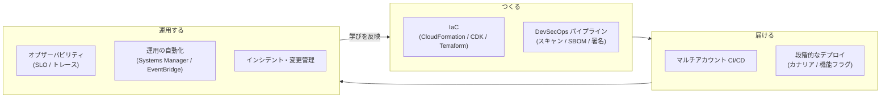
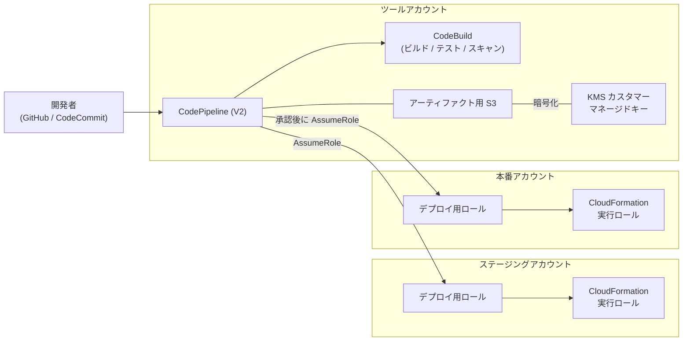
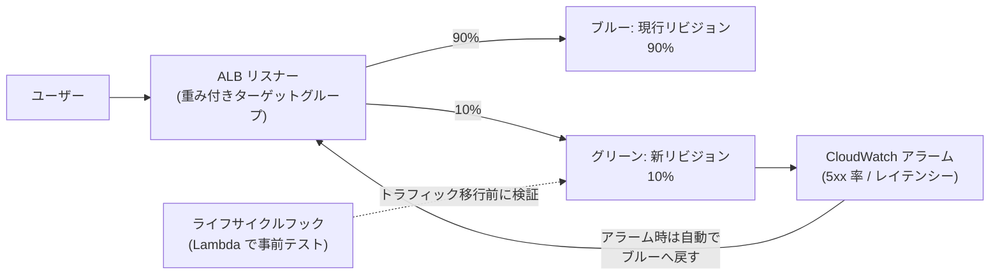

[ホーム](../README.md) > [Phase 3: プロフェッショナル](README.md) > 運用上の優秀性と自動化

# 運用上の優秀性と自動化

> **この章のゴール**
> - DevOps・SRE の考え方と SLI / SLO / エラーバジェットを使って、運用の目標を定量的に設計できる
> - CloudFormation StackSets、CDK、Terraform、CloudFormation Guard / Hooks を使い分け、組織全体に IaC を展開できる
> - ツールアカウントを中心としたマルチアカウント CI/CD（クロスアカウント、KMS、GitHub Actions の OIDC）を設計できる
> - デプロイ戦略（ローリング、イミュータブル、ブルー/グリーン、カナリア、線形）と AppConfig の機能フラグを要件に応じて選べる
> - パイプラインに脆弱性スキャン、IaC スキャン、シークレット検出、SBOM、署名を組み込んだ DevSecOps を設計できる
> - CloudWatch（Application Signals、Container Insights、Synthetics、RUM など）と OpenTelemetry で、組織横断のオブザーバビリティを設計できる
> - Systems Manager と EventBridge で運用と修復を自動化し、現在のサービス状況に合ったインシデント管理・変更管理を設計できる
>
> **対応試験**: SAP-C03（ドメイン 5: 運用上の優秀性と自動化（仮訳）、ドメイン 2: セキュリティ、コンプライアンス、ガバナンス ほか）
> **目安時間**: 9 時間（読む 6 時間 / 確認問題と復習 3 時間）

> [!NOTE]
> この章は [Phase 2: 監視と運用管理](../02-associate/13-monitoring-management.md)（CloudWatch、CloudTrail、Config、Systems Manager、CloudFormation の基本）を前提にしています。
> 手を動かして確認するなら [Lab 07: CloudFormation で IaC](../04-labs/lab07-cloudformation-iac.md) と [Lab 08: CloudWatch で監視](../04-labs/lab08-cloudwatch-monitoring.md) が対応します。

## この章の全体像

SAP-C03 のドメイン 5 は、「作る → 届ける → 運用する → 学ぶ」のループを **組織全体の規模で自動化する** 力を問います。



| 問題文の問い | 答えの方向性 | 節 |
|---|---|---|
| 数百アカウント（新規アカウントを含む）に同じ構成を展開したい | StackSets（サービスマネージド + 自動デプロイ） | 2 節 |
| 開発者が作るリソースのポリシー違反を、作成前に止めたい | CloudFormation Hooks（Guard）、プロアクティブコントロール | 2 節 |
| ツールアカウントから複数アカウントへ安全にデプロイしたい | CodePipeline + クロスアカウントロール + KMS カスタマーマネージドキー | 3 節 |
| 長期的なアクセスキーなしで外部 CI から AWS にデプロイしたい | OIDC フェデレーション（GitHub Actions） | 3 節 |
| 少しずつ新バージョンに切り替え、異常なら自動で戻したい | カナリア / 線形デプロイ + CloudWatch アラーム、AppConfig | 4 節 |
| 脆弱なイメージや署名のない成果物を本番に出したくない | Inspector、SBOM、AWS Signer、承認ゲート | 5 節 |
| 全アカウントのメトリクス・ログ・トレースを 1 か所で見たい | CloudWatch クロスアカウントオブザーバビリティ | 6 節 |
| 組織全体のパッチ適用や修復を自動化したい | Quick Setup のパッチポリシー、SSM Automation、EventBridge | 7 節 |

## 1. 運用モデル（DevOps、SRE、SLI/SLO）

### 1.1 運用上の優秀性の設計原則

Well-Architected フレームワークの運用上の優秀性の柱には、8 つの設計原則があります。この章の内容は、すべてこの原則のどれかに対応します。

| 設計原則 | 意味 | この章の対応 |
|---|---|---|
| ビジネス成果を中心にチームを編成する | 技術ではなく顧客価値を軸にチームと目標を決める | 1 節（SLO） |
| 実用的なインサイトを得るためにオブザーバビリティを実装する | 行動につながる計測をする | 6 節 |
| 可能な限り安全に自動化する | 手作業をなくし、自動化にもガードレールを付ける | 2・7 節 |
| 頻繁に、小規模で、元に戻せる変更を行う | 変更の影響範囲を小さくする | 3・4 節 |
| 運用手順を頻繁に改善する | ランブックを継続的に見直す | 7 節 |
| 障害を予測する | 障害を前提に訓練・検証する | 1.4 節、[06 章](06-resilience-business-continuity.md) |
| すべての運用上のイベントとメトリクスから学ぶ | 事後レビューで学びを仕組みに反映する | 7.8 節 |
| マネージドサービスを使用する | 運用負荷そのものを減らす | 全体 |

### 1.2 DevOps、SRE、プラットフォームエンジニアリング

| 観点 | DevOps | SRE（サイト信頼性エンジニアリング） | プラットフォームエンジニアリング |
|---|---|---|---|
| 何か | 開発と運用が協力し、価値を速く安全に届ける文化と実践 | 信頼性をソフトウェアエンジニアリングの手法で実現する役割・手法 | 開発者向けの内部プラットフォーム（標準化された「舗装された道」）を提供する |
| 主な手段 | CI/CD、IaC、自動テスト、小さな変更、「作った人が運用する」 | SLO、エラーバジェット、トイル（繰り返しの手作業）の削減、事後レビュー | セルフサービス、テンプレート、共通の CI/CD・監視基盤 |
| AWS での例 | CodePipeline、CDK、CloudFormation | Application Signals の SLO、AWS FIS | Service Catalog、CDK のコンストラクトライブラリ、Control Tower の Account Factory |

> [!NOTE]
> 古い教材では、プラットフォームエンジニアリングのサービスとして AWS Proton が登場します。Proton は **2026年10月7日にサポート終了予定** なので、新しい設計では Service Catalog や CDK のコンストラクトライブラリなどを使います。

### 1.3 SLI、SLO、SLA とエラーバジェット

- **SLI（サービスレベル指標）**: ユーザー体験を表す測定値です。例:「300 ms 以内に成功したリクエストの割合」。
- **SLO（サービスレベル目標）**: SLI の目標値と期間です。例:「30 日間で 99.9%」。
- **SLA（サービスレベル契約）**: 顧客との契約で、未達時の返金などを伴います。SLO は SLA より厳しく設定し、契約違反の前に気付けるようにします。
- **エラーバジェット** = 1 − SLO。SLO が 99.9% なら、30 日間で 0.1%（時間なら 43.2 分）まで「失敗」が許されます。

| SLO（30 日間） | 許容される停止時間 |
|---|---|
| 99% | 432 分（7.2 時間） |
| 99.9% | 43.2 分 |
| 99.95% | 21.6 分 |
| 99.99% | 約 4.3 分 |

エラーバジェットは、**リリースの速度と信頼性のバランスを取るための合意** です。予算が残っていれば新機能を積極的に出し、使い切ったらリスクの高いリリースを止めて信頼性の改善を優先する、というポリシーを事前に決めておきます。

アラートには **バーンレート**（エラーバジェットを消費する速さ）を使います。バーンレート 1 は「ちょうど 30 日で予算を使い切る速さ」です。バーンレート 14.4 が 1 時間続くと、30 日分の予算の 2%（14.4 ÷ 720 時間）を 1 時間で消費します。速い消費はすぐに呼び出し、遅い消費はチケットで対応する、というように複数の時間窓で判断します。

> [!TIP]
> **試験のポイント**: 「ユーザーから見た信頼性を定量的に管理したい」「リリースの速度と信頼性のバランスを取りたい」→ **SLO とエラーバジェット**（AWS では CloudWatch Application Signals の SLO）。
> SLI には CPU 使用率のような内部指標ではなく、成功率やレイテンシーのような **ユーザーから見える指標** を選びます。

### 1.4 学習のループ: ランブック、ゲームデー、事後レビュー

- **ランブック**（定型の対応手順）は、SSM Automation のランブックとしてコード化し、誰が実行しても同じ結果になるようにします。**プレイブック**（調査の進め方）は、原因が分からない状況での判断を支援します。
- **ゲームデー**（障害の模擬訓練）とカオスエンジニアリングで、手順と仕組みを事前に検証します。障害注入には AWS FIS を使います（[06 章](06-resilience-business-continuity.md)）。
- **事後レビュー**（ポストインシデントレビュー。Amazon では COE: Correction of Errors と呼ぶ）は、個人を責めない形式で、タイムライン、影響、根本原因、再発防止策を記録し、防止策を仕組み（アラーム、テスト、ガードレール）に落とし込みます。

## 2. IaC 戦略

### 2.1 ツールの使い分け

| 観点 | AWS CloudFormation | AWS CDK | Terraform |
|---|---|---|---|
| 記述方法 | YAML / JSON（宣言型） | TypeScript、Python、Java などのプログラミング言語 → CloudFormation テンプレートに合成 | HCL（宣言型） |
| 状態の管理 | AWS が管理（スタック） | 同左（CloudFormation のスタック） | state ファイルを自分で管理（S3 バックエンドと状態ロック） |
| マルチアカウント展開 | StackSets | CDK Pipelines、StackSets | プロバイダーごとの AssumeRole、Account Factory for Terraform（AFT） |
| ポリシーのチェック | cfn-lint、CloudFormation Guard、Hooks | cdk-nag（Aspects）、Hooks | OPA などのポリシー・アズ・コード、plan の JSON を Guard で検査 |
| 向いているケース | AWS ネイティブで標準的な構成 | 開発者主体。再利用できる抽象化（コンストラクト）を配布したい | マルチクラウド、既存の Terraform 資産 |

どれを選んでも、**組織として 1〜2 種類に標準化し、ポリシーのチェックとマルチアカウント展開の仕組みを共通化する** ことが重要です。

### 2.2 CloudFormation StackSets

StackSets は、1 つのテンプレートを **複数のアカウント × 複数のリージョン** に「スタックインスタンス」として展開する仕組みです。アクセス許可のモデルが 2 種類あり、SAP では違いがよく問われます。

| 観点 | セルフマネージドのアクセス許可 | サービスマネージドのアクセス許可 |
|---|---|---|
| 権限の準備 | 管理者アカウントに `AWSCloudFormationStackSetAdministrationRole`、各ターゲットアカウントに `AWSCloudFormationStackSetExecutionRole` を自分で作成 | Organizations で信頼されたアクセスを有効にするだけ。必要なロールは自動で作成される |
| ターゲットの指定 | アカウント ID | OU（または組織のルート） |
| 自動デプロイ | なし（新しいアカウントは手動で追加） | **あり**: OU に追加されたアカウントに自動で展開。アカウントが OU から外れたときにスタックを削除するか保持するかを選べる |
| 操作できるアカウント | 任意のアカウント | 管理アカウントまたは委任管理者アカウント |
| 管理アカウントへの展開 | 可能 | **不可**（ルートを指定しても管理アカウントは対象外） |
| 主な用途 | 組織外のアカウント、細かな制御 | 組織全体のベースライン（監査用ロール、Config ルール、EventBridge ルールなど） |

展開の速さと安全性は、**同時実行アカウント数**（数または割合）、**障害耐性**（何アカウントの失敗まで続行するか）、**リージョンの同時実行**（順次または並列）、**リージョンの順序** で制御します。最初に 1 リージョン・少数のアカウントへ展開して問題がないことを確かめてから広げる、という段階的な展開もこの設定で実現できます。

> [!WARNING]
> **ひっかけ注意**:
> - 「新しく作成されるアカウントにも自動で展開したい」→ **サービスマネージド + 自動デプロイ** です。セルフマネージドには自動デプロイがありません。
> - サービスマネージドの StackSets は **管理アカウントには展開されません**。管理アカウントにも同じリソースが必要なら、別途スタックを作成します。
> - AWS Control Tower も内部で StackSets を使っています。Control Tower のランディングゾーンでは、Customizations for Control Tower（CfCT）や AFT で独自のベースラインを展開する方法もあります（[02 章](02-multi-account-governance.md)）。

### 2.3 AWS CDK

- **コンストラクト** には 3 つのレベルがあります。L1（CloudFormation のリソースと 1 対 1）、L2（安全な既定値やヘルパーを持つ抽象化）、L3（複数のリソースを組み合わせたパターン）です。組織の標準（暗号化、ログ、タグ）を組み込んだ独自の L3 コンストラクトをライブラリとして配布すると、プラットフォームエンジニアリングの強力な手段になります。
- `cdk synth` で CloudFormation テンプレートを生成し、CloudFormation がデプロイします。したがって、変更セット、ロールバック、Hooks などの CloudFormation の安全装置がそのまま使えます。
- **ブートストラップ**: デプロイ先のアカウント・リージョンごとに `cdk bootstrap` を実行し、アセット用の S3 バケットや ECR リポジトリ、デプロイ用のロールを作成します。クロスアカウントでデプロイするには、ツールアカウントを信頼させます。

```bash
# 本番アカウント（222222222222）を、ツールアカウント（111111111111）からデプロイできるようにする
cdk bootstrap aws://222222222222/ap-northeast-1 \
  --trust 111111111111 \
  --cloudformation-execution-policies arn:aws:iam::aws:policy/AdministratorAccess
# 本番では CloudFormation 実行ロールのポリシーを必要最小限に絞ることを検討する
```

- **CDK Pipelines** は、パイプライン自身の定義もコードで管理し、変更時にパイプラインが自分自身を更新する（セルフミューテーション）仕組みです。複数のアカウント・リージョンへの段階的な展開（ウェーブ）を簡潔に書けます。
- **Aspects** と **cdk-nag** を使うと、合成の段階でセキュリティやコンプライアンスのルール違反を検出できます。

### 2.4 Terraform

- **state ファイル** にはリソースの属性（ときに機密情報）が含まれます。S3 バックエンドに保存して SSE-KMS で暗号化し、アクセスを厳しく制限します。同時実行による破損を防ぐため、状態ロック（DynamoDB テーブル、または新しいバージョンでは S3 のロックファイル）を使います。
- マルチアカウントでは、プロバイダーの設定で各アカウントのロールを引き受けます。環境（dev / stg / prod）ごとに state を分け、影響範囲を小さくします。
- パイプラインでは `plan` の結果を成果物として保存し、承認後にその plan を `apply` します。
- Control Tower 環境のアカウント払い出しには AFT、Terraform の構成を承認済み製品として提供するには Service Catalog の Terraform 製品を使えます。

### 2.5 ポリシー・アズ・コード: CloudFormation Guard と Hooks

「ポリシー違反のリソースを作らせない」仕組みは、どの段階で止めるかによって、確実さと回避されやすさが変わります。

| 段階 | 仕組み | 止められるもの | 限界 |
|---|---|---|---|
| 開発時・プルリクエスト | cfn-lint、CloudFormation Guard（cfn-guard）、checkov、cdk-nag | テンプレートの誤りやポリシー違反 | パイプラインを通らない変更は対象外 |
| プロビジョニング時 | **CloudFormation Hooks** | CloudFormation（と Cloud Control API）経由の作成・更新・削除 | CloudFormation を使わない操作は対象外 |
| API の実行時 | SCP、RCP、IAM、宣言型ポリシー | 権限と条件で表現できる操作 | リソースの細かなプロパティまでは表現しにくい |
| 作成後 | AWS Config ルール、Security Hub CSPM | すべての構成（検出） | 作成そのものは止めない |

**CloudFormation Guard** は、JSON / YAML のデータ（CloudFormation テンプレート、Terraform の plan の JSON、Kubernetes のマニフェストなど）を検証するポリシー・アズ・コードのツールです。

```text
# S3 バケットはバージョニングを有効にする
let s3_buckets = Resources.*[ Type == 'AWS::S3::Bucket' ]

rule S3_VERSIONING_ENABLED when %s3_buckets !empty {
    %s3_buckets.Properties.VersioningConfiguration.Status == 'Enabled'
    <<
        S3 バケットではバージョニングを有効にしてください
    >>
}
```

パイプラインでは `cfn-guard validate --data template.yaml --rules s3.guard` のように実行し、違反があればビルドを失敗させます。

**CloudFormation Hooks** は、CloudFormation がリソースを作成・更新・削除する **前に** 評価を実行し、違反があれば操作を止める（または警告する）仕組みです。

- **フックの種類**: Guard フック（Guard のルールを S3 に置くだけで使える、サービスマネージドのフック）、Lambda フック（評価を Lambda 関数に任せる）、プロアクティブコントロールのフック（AWS Control Tower のコントロールカタログのルールを使う）、カスタムフック（ハンドラーを自分で開発）。
- **評価の対象（ターゲット）**: リソース単位（RESOURCE）、スタック全体（STACK）、変更セット（CHANGE_SET）、Cloud Control API の操作（CLOUD_CONTROL）。スタックや変更セットを対象にすると、複数のリソースの関係をまとめて評価できます。
- **失敗時の動作**: 操作を止める（FAIL）か、警告だけにする（WARN）かを選べます。まず WARN で影響を確認してから FAIL に切り替えるのが安全です。
- フックはアカウント・リージョンごとに有効化するので、組織全体には StackSets で展開します。Control Tower のプロアクティブコントロールも、この Hooks の仕組みで実装されています。

（2026年9月時点。[CloudFormation Hooks](https://docs.aws.amazon.com/cloudformation-cli/latest/hooks-userguide/what-is-cloudformation-hooks.html)）

> [!TIP]
> **試験のポイント**: 「CloudFormation でプロビジョニングされる **前に**、非準拠のリソースをブロックしたい」→ **CloudFormation Hooks**（または Control Tower のプロアクティブコントロール）。
> 「作成後に検出して通知・修復したい」→ AWS Config ルール（+ 自動修復）。「API レベルで確実に禁止したい」→ SCP / RCP。

### 2.6 ドリフトの検出と防止

**ドリフト** とは、コンソールでの手作業などにより、実際の構成がテンプレートとずれた状態です。

- **検出**: CloudFormation のドリフト検出（スタック、StackSets）を使います。AWS Config のマネージドルール `cloudformation-stack-drift-detection-check` で定期的に検出することもできます。
- **防止**: 本番アカウントでは、IAM や SCP で「パイプラインのロール以外によるリソースの変更」を拒否します。条件キー `aws:PrincipalArn`（パイプラインのロールだけを許可）や `aws:CalledVia`（CloudFormation 経由の呼び出しだけを許可）を使います。緊急時のためのブレークグラス用ロールは、利用を厳しく監視したうえで例外にします。
- **是正**: テンプレートを実態に合わせて更新するか、テンプレートから再デプロイします。IaC の管理外で作られたリソースは、リソースのインポートや IaC ジェネレーター（既存のリソースからテンプレートを生成）で管理下に入れます。

> [!WARNING]
> **ひっかけ注意**: ドリフト検出は **検出するだけ** で、自動では元に戻しません。また、すべてのリソースタイプ・プロパティに対応しているわけではありません。「ドリフトを自動で防ぐ」要件には、変更そのものを権限で制限する設計が必要です。

## 3. マルチアカウント CI/CD

### 3.1 全体構成

大規模な組織では、パイプラインを **ツールアカウント**（デプロイ専用のアカウント）に集約し、各ワークロードアカウントにはデプロイに必要なロールだけを置きます。人が本番アカウントを直接操作する機会を減らし、「本番への変更はパイプライン経由だけ」を実現するためです。



### 3.2 CodePipeline（V2）と関連サービス

| サービス | 役割 | ポイント |
|---|---|---|
| AWS CodePipeline（V2 タイプ） | パイプラインの制御 | Git のタグ・ブランチ・ファイルパスによるトリガーの絞り込み、パイプライン変数、実行モード（SUPERSEDED / QUEUED / PARALLEL）、ステージ失敗時の自動ロールバック、ステージの条件（ルール）による前後のチェック。料金はアクションの実行時間（分）に応じた課金 |
| AWS CodeBuild | ビルド、テスト、スキャン | マネージドなビルド環境。VPC 内のリソースへのアクセス、コンテナイメージのビルド、テストレポート |
| AWS CodeDeploy | EC2 / オンプレミス、Lambda、ECS へのデプロイ | 段階的なトラフィック移行と自動ロールバック（4 節） |
| AWS CodeConnections（旧 CodeStar Connections） | GitHub、GitLab、Bitbucket との接続 | 外部のリポジトリをパイプラインのソースにする |
| AWS CodeCommit | Git リポジトリ | 2025年11月に一般提供へ復帰し、新規利用も可能 |
| AWS CodeArtifact | パッケージリポジトリ（npm、PyPI、Maven など） | 依存パッケージを組織内で管理し、上流の公開リポジトリをキャッシュする |

> [!NOTE]
> CodeCommit は 2024年に新規受付を停止しましたが、2025年11月に一般提供に戻っています。「CodeCommit は廃止された」と書かれた教材は古い情報です。一方、Amazon CodeCatalyst は新規受付の終了が発表されています（2025年11月）。

### 3.3 クロスアカウント・クロスリージョンの権限設計

ツールアカウントのパイプラインが本番アカウントにデプロイするには、次の 5 つをそろえます。

1. **アーティファクト用バケットをカスタマーマネージドキーで暗号化する**: AWS マネージドキー（`aws/s3`）はキーポリシーを変更できないため、他のアカウントに復号を許可できません。
2. **KMS キーポリシー** で、ターゲットアカウントのデプロイ用ロールに復号などを許可する。
3. **バケットポリシー** で、ターゲットアカウントのロールにアーティファクトの読み取りを許可する。
4. ターゲットアカウントに 2 つのロールを作る。**デプロイ用ロール**（ツールアカウントのパイプラインを信頼し、パイプラインが引き受ける）と、**CloudFormation 実行ロール**（CloudFormation サービスを信頼し、実際にリソースを作る権限を持つ）です。デプロイ用ロールは `iam:PassRole` で実行ロールを CloudFormation に渡します。
5. **クロスリージョン**: CodePipeline はアクションを実行するリージョンごとにアーティファクトストア（S3 バケット）が必要です。各リージョンのバケットにも KMS キーを設定します。

```json
{
  "Sid": "AllowTargetAccountDeployRoles",
  "Effect": "Allow",
  "Principal": {
    "AWS": [
      "arn:aws:iam::222222222222:role/PipelineDeployRole",
      "arn:aws:iam::333333333333:role/PipelineDeployRole"
    ]
  },
  "Action": [
    "kms:Decrypt",
    "kms:DescribeKey",
    "kms:Encrypt",
    "kms:ReEncrypt*",
    "kms:GenerateDataKey*"
  ],
  "Resource": "*"
}
```

> [!WARNING]
> **ひっかけ注意**:
> - クロスアカウントのデプロイで「アーティファクトの取得時に AccessDenied」→ 原因の定番は **AWS マネージドキーで暗号化されている** ことと、**キーポリシーの許可漏れ** です。S3 の権限を広げても解決しません。
> - CloudFormation 実行ロールに `AdministratorAccess` を付けるのは手軽ですが、本番では必要な権限に絞り、アクセス許可の境界で上限を設けることを検討します。

### 3.4 GitHub Actions と OIDC フェデレーション

外部の CI（GitHub Actions など）から AWS にデプロイする場合、**IAM ユーザーのアクセスキーを CI のシークレットに保存するのは避けます**。漏えいすると長期間悪用されるからです。代わりに OIDC フェデレーションを使います。

1. GitHub がワークフローの実行ごとに、短期間だけ有効な OIDC トークン（どのリポジトリ・ブランチ・環境の実行かを示すクレームを含む）を発行します。
2. AWS 側に GitHub 用の IAM OIDC ID プロバイダー（`token.actions.githubusercontent.com`）を作成し、そのトークンを信頼する IAM ロールを作ります。
3. ワークフローは `sts:AssumeRoleWithWebIdentity` でロールを引き受け、一時的な認証情報でデプロイします。

信頼ポリシーでは、**`aud`（対象者）に加えて `sub`（どのリポジトリのどの実行か）を必ず条件にします**。

```json
{
  "Version": "2012-10-17",
  "Statement": [
    {
      "Effect": "Allow",
      "Principal": {
        "Federated": "arn:aws:iam::222222222222:oidc-provider/token.actions.githubusercontent.com"
      },
      "Action": "sts:AssumeRoleWithWebIdentity",
      "Condition": {
        "StringEquals": {
          "token.actions.githubusercontent.com:aud": "sts.amazonaws.com",
          "token.actions.githubusercontent.com:sub": "repo:example-org/order-api:environment:production"
        }
      }
    }
  ]
}
```

ワークフロー側では、OIDC トークンを取得するための権限（`id-token: write`）を付け、公式のアクションでロールを引き受けます。

```yaml
permissions:
  id-token: write   # OIDC トークンの取得に必要
  contents: read
jobs:
  deploy:
    runs-on: ubuntu-latest
    environment: production   # GitHub の環境の保護ルール（承認者など）と組み合わせる
    steps:
      - uses: actions/checkout@v4
      - uses: aws-actions/configure-aws-credentials@v4
        with:
          role-to-assume: arn:aws:iam::222222222222:role/GitHubActionsDeployRole
          aws-region: ap-northeast-1
      - run: aws cloudformation deploy --template-file template.yaml --stack-name order-api
```

> [!WARNING]
> **ひっかけ注意**:
> - 信頼ポリシーで `sub` を条件にしないと、**GitHub 上の任意のリポジトリ** のワークフローがロールを引き受けられてしまいます。`repo:example-org/*` のような広いワイルドカードも避けます。
> - 複数アカウントへのデプロイで、あるロールから別のロールを引き受ける「ロールの連鎖」を使う場合、セッションの最大時間は 1 時間です。長時間のデプロイでは、各アカウントに OIDC プロバイダーとロールを作る方式も検討します。

## 4. デプロイ戦略

### 4.1 戦略の比較

| 戦略 | 仕組み | ダウンタイム | ロールバック | 追加コスト | 影響範囲 |
|---|---|---|---|---|---|
| 一括（インプレース） | 全台を同時に更新する | 発生し得る | 遅い（再デプロイ） | なし | 全ユーザー |
| ローリング | 一定数ずつ更新する | なし（容量は一時的に減る） | 遅い（再デプロイ） | なし | 徐々に拡大 |
| 追加バッチ付きローリング | 追加の台数を起動してから一定数ずつ更新する | なし（容量を維持） | 遅い | 小 | 徐々に拡大 |
| イミュータブル | 新しいインスタンス群を作り、正常なら旧群と入れ替える | なし | 速い（新群を捨てる） | 一時的に 2 倍 | 入れ替えまで限定 |
| ブルー/グリーン | 本番と同等の環境（グリーン）を並行して用意し、トラフィックを切り替える | なし | 最速（戻すだけ） | 一時的に 2 倍 | 切り替え方次第 |
| カナリア | 少量（例: 10%）を先に流し、問題なければ残りを一度に移す | なし | 速い | 小〜中 | 最小 |
| 線形 | 一定の割合ずつ一定の間隔で増やす（例: 1 分ごとに 10%） | なし | 速い | 小〜中 | 段階的 |

ブルー/グリーンは「環境を 2 つ用意する」パターンで、カナリア・線形・一括は「その間でトラフィックをどう移すか」を表します。組み合わせて「ブルー/グリーン + カナリア」のように使います。

### 4.2 AWS での実装

| 対象 | 選べる方式 | 仕組みとポイント |
|---|---|---|
| CodeDeploy（EC2 / オンプレミス） | インプレース（1 台ずつ、半分ずつ、一括など）、ブルー/グリーン（EC2 のみ） | ブルー/グリーンでは Auto Scaling グループをコピーして新環境を作り、ロードバランサーで切り替える |
| CodeDeploy（Lambda） | カナリア、線形、一括 | エイリアスの重みでバージョン間のトラフィックを移す。移行前後のフック（Lambda）と CloudWatch アラームによる自動ロールバック |
| CodeDeploy（ECS） | ブルー/グリーン（カナリア、線形、一括） | テスト用リスナーで新しいタスクセットを検証してから本番リスナーを切り替える |
| ECS ネイティブ | ローリング更新（デプロイサーキットブレーカーで自動ロールバック）、ブルー/グリーン（2025年7月）、線形・カナリア（2025年10月） | CodeDeploy なしで、ライフサイクルフック（Lambda）、ベイク時間、CloudWatch アラームによる自動ロールバックを使える。線形・カナリアは ALB または Service Connect を使うサービスが対象 |
| Elastic Beanstalk | 一括、ローリング、追加バッチ付きローリング、イミュータブル、トラフィック分割、ブルー/グリーン（環境の URL のスワップ） | 設定だけで選べる |
| API Gateway | カナリアリリース | ステージ単位で一部のトラフィックを新しいデプロイに流す |
| CloudFront | 継続的デプロイ | ステージング用ディストリビューションに、重みまたはヘッダーでトラフィックを振り分ける |
| ALB / Route 53 | 重み付きターゲットグループ / 加重ルーティング | Route 53 は DNS のキャッシュ（TTL）があるため、切り替えが即時ではない |
| Amazon EKS | Argo Rollouts、Flagger などの OSS | Kubernetes のエコシステムでカナリアを実現する |

（ECS の方式は 2026年9月時点。[ECS のカナリアデプロイ](https://docs.aws.amazon.com/AmazonECS/latest/developerguide/canary-deployment.html)）

ECS ネイティブのデプロイは、CodeDeploy と同等の段階的なトラフィック移行を追加のサービスなしで実現でき、AWS のブログでも多くの新規プロジェクトで推奨される方式として紹介されています。



> [!TIP]
> **試験のポイント**:
> - 「一部のトラフィックで新バージョンを検証し、問題があれば自動で戻す」→ **カナリア（または線形）+ CloudWatch アラームによる自動ロールバック**。
> - 「ロールバックを最速にしたい」→ **ブルー/グリーン**（旧環境が残っている）。
> - 「追加コストを最小にしたい（ダウンタイムは許容しないが容量減は許容）」→ ローリング。
> - 「ECS で追加のデプロイサービスを導入せずに」→ **ECS ネイティブ** のブルー/グリーン・カナリア・線形。

### 4.3 Lambda のエイリアスと段階的デプロイ

Lambda では、**バージョン**（不変のスナップショット）と、バージョンを指す **エイリアス**（重み付きで 2 つのバージョンを指せる）を使います。AWS SAM では、次のように書くだけで CodeDeploy による段階的デプロイが設定されます。

```yaml
OrderFunction:
  Type: AWS::Serverless::Function
  Properties:
    Handler: app.handler
    Runtime: python3.13
    AutoPublishAlias: live            # デプロイごとに新バージョンを発行し、エイリアスを移す
    DeploymentPreference:
      Type: Canary10Percent5Minutes   # 10% を 5 分流してから残りを移す
      Alarms:
        - !Ref OrderErrorsAlarm       # アラームが発生したら自動でロールバック
      Hooks:
        PreTraffic: !Ref PreTrafficCheckFunction
```

### 4.4 データベースを含む変更

アプリケーションとデータベースを同時に切り替えることは難しいため、**後方互換性のある変更（Expand / Contract）** を基本にします。まず新旧どちらのコードでも動くようにスキーマを拡張（列の追加など）し、新しいコードをデプロイし、データを移行した後で、古い列などを削除（縮小）します。

RDS と Aurora には **ブルー/グリーンデプロイ** の機能があります。本番（ブルー）からレプリケーションで同期されたステージング環境（グリーン）でメジャーバージョンアップやパラメーター変更を検証し、準備ができたら短時間で切り替えられます。

### 4.5 AppConfig による機能フラグ

**AWS AppConfig** の機能フラグを使うと、**デプロイ（コードを配置すること）とリリース（機能を有効にすること）を分離** できます。新機能のコードを無効の状態でデプロイしておき、フラグで段階的に有効にし、問題があればコードの再デプロイなしに即座に無効にできます（キルスイッチ）。

- **構成**: アプリケーション、環境、構成プロファイル（機能フラグ型または自由形式）、デプロイ戦略の 4 つを定義します。
- **デプロイ戦略**: 設定値そのものを段階的に配信します。AWS が用意した戦略（例: `AppConfig.Canary10Percent20Minutes`、`AppConfig.Linear50PercentEvery30Seconds`、`AppConfig.AllAtOnce`）のほか、独自の戦略も作れます。
- **安全装置**: バリデーター（JSON スキーマ、Lambda 関数）で不正な値の配信を防ぎ、配信中とベイク時間中に CloudWatch アラームが発生したら自動でロールバックします。
- **マルチバリアントフラグ**: ユーザーの属性（地域、会員区分など）に応じて異なる値を返せます。社内ユーザー → 一部の顧客 → 全員、という公開の順序を制御できます。
- **取得方法**: AppConfig エージェント（Lambda 拡張機能、ECS / EKS のサイドカーなど）が設定をキャッシュし、定期的に更新を確認するので、アプリケーションは手元から高速に値を読めます。

> [!TIP]
> **試験のポイント**: 「コードを再デプロイせずに機能を有効化・無効化したい」「一部のユーザーにだけ新機能を公開したい」「問題時に即座に無効化したい」→ **AppConfig の機能フラグ**。
> 古い教材に出てくる CloudWatch Evidently は、サポート終了が発表され、AppConfig への移行が案内されています。

> [!WARNING]
> **ひっかけ注意**: 機能フラグはアクセス制御の仕組みではありません。「フラグで非表示にしたからセキュリティ上も安全」とはならないので、認可は IAM やアプリケーションで行います。また、使い終わったフラグを放置すると技術的負債になるため、削除の計画も立てます。
