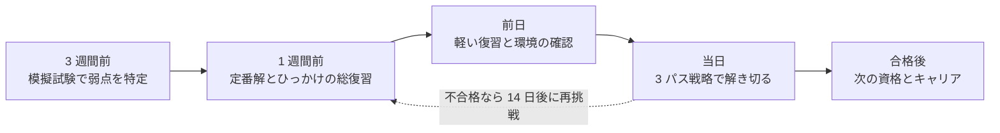
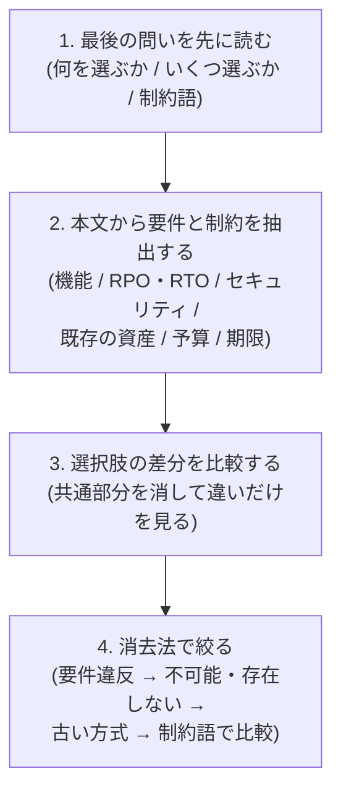

[ホーム](../README.md) > [Phase 3: プロフェッショナル](README.md) > SAP-C03 試験対策

# SAP-C03 試験対策

> **この章のゴール**
> - 75 問 / 180 分を最後まで解き切る時間配分（3 パス戦略）を実行できる
> - 長文問題から要件と制約を抽出し、選択肢の差分比較と消去法で正解を選べる
> - 頻出シナリオの定番解（40 パターン）と典型的なひっかけを、キーワードから即答できる
> - SAP-C03 で追加された領域（生成 AI、回復力、サービス間通信、ポスト量子暗号、レイクハウス、DevSecOps）の要点を最終確認できる
> - 試験前 1 週間・前日・当日の準備と、合格後のキャリアを計画できる
>
> **対応試験**: SAP-C03（全ドメイン）
> **目安時間**: 4 時間（読む 2 時間 / 確認問題 1 時間 / 弱点の復習 1 時間）

> [!IMPORTANT]
> SAP-C03 の公式試験ガイド（タスクステートメントとドメインの配点）は **2026年10月27日に公開予定**（同日に受験登録も開始）です。この章は発表済みの情報に基づいています。公開後は、公式ガイドのタスクステートメントを 1 つずつ確認し、この章のチェックリストと突き合わせてください。試験の全体像は [SAP-C03 完全ガイド](01-sap-c03-overview.md) を参照してください。

## この章の全体像

Phase 3 の最後の章です。新しい知識を増やすより、**これまでの知識を本番の 180 分で確実に得点に変える** ことに集中します。

## 1. 本番の形式を最終確認

| 項目 | 内容 |
|---|---|
| 問題数・時間 | 75 問 / 180 分 |
| 出題形式 | 単一選択（4 択）と複数選択（5 つ以上の選択肢から 2 つ以上を選ぶ） |
| 採点 | 100〜1,000 のスケールスコア。補整型（compensatory）採点で、ドメインごとの合格基準はない |
| 合格点 | SAP-C02 と同様であれば 750 点（公式ガイドで要確認） |
| 採点対象外の問題 | 含まれる（SAP-C02 では 75 問中 10 問。SAP-C03 の内訳は公式ガイドで確認）。どれが対象外かは見分けられない |
| 受験料 | 300 USD（日本円では 40,000 円、税込 44,000 円） |
| 言語 | 日本語で受験でき、問題ごとに英語の原文を表示できる |
| 結果 | 5 営業日以内に通知（試験終了時の画面には合否が表示されないことが多い） |
| 再受験 | 不合格の場合、14 日後から再受験できる（受験料は毎回必要） |
| 日程 | 2026-10-27 登録開始 / SAP-C02 の最終受験日 2026-11-16（公式ブログの記載。認定ページでは 11-17 表記もあるため公式で確認）/ 2026-11-17 SAP-C03 の提供開始 |

- **無回答は不正解** で、誤答による減点はありません。時間切れで空欄を残すことだけは避けます。
- 英語で受験する非ネイティブ向けの **30 分の延長（ESL +30）は、日本語で受験する場合は対象外** です。日本語の問題文で違和感があれば、英語の原文を表示して確認します。

## 2. 時間配分戦略

### 2.1 「1 問 2.4 分」の意味

180 分 ÷ 75 問 = **1 問あたり約 2.4 分** です。SAP の問題文は長く、読むだけで 1〜1.5 分かかる問題もあります。すべての問題を同じペースで解こうとすると、難問に時間を吸われて後半が崩れます。そこで、**1 周目は取れる問題を確実に取り、迷う問題は後回しにする** 3 パス戦略を使います。

### 2.2 3 パス戦略

| パス | 時間の目安 | やること |
|---|---|---|
| 1 パス目 | 0〜120 分（1 問平均 1.6 分） | 全 75 問を一通り解く。自信のある問題は即答する。3 分を超えそうなら、暫定の答えを選んでフラグを付けて次へ進む |
| 2 パス目 | 120〜165 分 | フラグを付けた問題（目安 20〜25 問）を、1 問約 2 分で再検討する |
| 3 パス目 | 165〜175 分 | 未回答がないか、複数選択で選んだ数が正しいかを確認する。残ったフラグの最終判断をする |
| 予備 | 175〜180 分 | 見直し画面での最終確認 |

1 パス目のチェックポイントは **25 問目で 40 分、50 問目で 80 分、75 問目で 120 分** です。遅れていたら、次の数問は即答できるものだけに絞ってペースを戻します。

### 2.3 フラグの使い方

- **フラグを付けるときも、必ず暫定の答えを選んでおきます**。時間切れになっても得点の可能性が残ります。
- 迷った理由を短くメモしておくと、2 パス目の再検討が速くなります（例:「37: B か C。コスト vs 運用負荷」）。
- 答えを変えるのは、**見落としていた要件や制約に気付いたときだけ** にします。根拠のない変更は、正解を誤答に変えることが少なくありません。

### 2.4 集中力の管理

- オンライン受験（OnVUE）では **休憩が認められていません**。180 分間、席を離れずに解き続ける前提で準備します。
- 本番前に、模擬試験 2 回分（40 問 × 2 = 80 問、約 192 分）を続けて解いて、長時間の集中を一度は体験しておきます。
- 集中が切れてきたと感じたら、画面から目を離して 10 秒深呼吸するだけでも効果があります。

## 3. 長文問題の解き方

### 3.1 4 つのステップ

1. **最後の問いを先に読む**: 「最もコスト効率の高い」「運用上のオーバーヘッドが最も少ない」「最小限の変更で」などの **制約語** と、選ぶ数（1 つか 2 つか）を最初に確認します。本文を読むときに、どこに注目すべきかが決まります。
2. **要件と制約を抽出する**: 本文を読みながら、要件（満たさなければならないこと）と制約（守らなければならない条件）を頭の中で表にします。数値（RPO 1 分、30 TB、12 か月）と、否定の表現（「〜できない」「〜してはならない」）は特に重要です。
3. **選択肢の差分を比較する**: SAP の選択肢は、7 割が共通で 3 割だけが違うことがよくあります。共通部分は判断材料にならないので、違う部分だけを比べます。
4. **消去法で絞る**: 「要件を満たさない」→「技術的に不可能・存在しない機能」→「古い方式・新規受付を終了したサービス」→ 残った選択肢を制約語で比較、の順に消します。

### 3.2 例題で読み解く

実際に、長文問題を 4 つのステップで解いてみます。

> ある小売企業は、AWS Organizations で 60 のアカウントを運用しています。受注システムは東京リージョンで稼働しており、Application Load Balancer の背後の Amazon EC2 Auto Scaling グループと、Amazon Aurora MySQL で構成されています。経営層は、東京リージョン全体の障害に備えて大阪リージョンへの DR を求めています。**①【要件】RPO は 1 分以内、RTO は 30 分以内** です。**②【要件】監査部門は、年 2 回のフェイルオーバー訓練の実施と記録を求めています。** **③【制約】DR 環境の平常時のコストはできるだけ抑えたい** と考えています。**④【制約】運用チームは少人数で、切り替えの手順はできるだけ自動化したい** と考えています。
> **⑤【問い】最も運用上のオーバーヘッドが少なく、コスト効率の高いソリューションはどれですか。**
>
> - A. 大阪リージョンに Aurora のクロスリージョンリードレプリカ（バイナリログレプリケーション）を作成する。障害時は、運用チームが手順書に従ってレプリカを昇格し、EC2 インスタンスを起動して、Route 53 のレコードを変更する。
> - B. Aurora Global Database で大阪リージョンにセカンダリクラスターを作成する。大阪には最小台数の Auto Scaling グループと ALB を IaC で用意しておく。ARC のリージョン切り替え（Region switch）のプランで、DB の切り替え、Auto Scaling グループの拡張、DNS の切り替えを自動化し、訓練もプランを実行して行う。
> - C. AWS Backup で Aurora のスナップショットを 1 時間ごとに大阪リージョンへコピーし、障害時に復元する。EC2 の AMI も大阪にコピーしておく。
> - D. 東京と大阪で同じ規模の環境を常時稼働させ、Aurora Global Database の書き込み転送を使って両方のリージョンで書き込みを受け付ける。

**ステップ 1（問い）**: 選ぶのは 1 つ。制約語は「運用上のオーバーヘッドが最も少なく」と「コスト効率が高い」の 2 つです。

**ステップ 2（要件と制約）**: ① RPO 1 分以内・RTO 30 分以内、② 訓練の実施と記録、③ 平常時のコストを抑える、④ 切り替えの自動化。

**ステップ 3（差分）**: 違いは「DB の複製方式」「アプリケーション層の待機のさせ方」「切り替えの方法」の 3 点です。

| 選択肢 | DB の複製 | アプリケーション層 | 切り替え |
|---|---|---|---|
| A | バイナリログレプリケーション | 障害時に起動 | 手順書（手作業） |
| B | Aurora Global Database | 最小構成で待機（パイロットライト） | Region switch で自動化 |
| C | スナップショットのコピー（1 時間ごと） | AMI から復元 | 手作業 |
| D | Global Database + 書き込み転送 | 同規模で常時稼働 | 常時稼働 |

**ステップ 4（消去法）**:

- C は RPO が最大 1 時間になり、要件 ① を満たしません（要件違反）。
- D は平常時も同規模の環境を動かすため、制約 ③ に反します（コスト）。
- A は手作業の手順が多く、制約 ④ に反し、RTO 30 分の達成もリスクがあります（運用負荷）。
- B は、Global Database の通常 1 秒程度の複製で RPO を満たし、パイロットライトで平常時のコストを抑え、Region switch のプランで切り替えを自動化でき、プランの実行で訓練とその記録も行えます。

→ 答えは **B** です。「要件を満たすか」で 2 つ消し、残った 2 つを制約語（運用負荷）で比べる、という流れを身に付けてください。

### 3.3 制約語の早見表

| 制約語 | 選ぶ方向 | 落とし穴 |
|---|---|---|
| 最もコスト効率が高い | 要件を満たす最小の構成、スポット / Savings Plans、変動が大きければサーバーレス | 要件（RPO / RTO、性能）を下回る安い構成は不正解 |
| 運用上のオーバーヘッドが最も少ない | マネージドサービス、既存機能の設定変更、組織レベルの一括設定 | 自作のスクリプト、アカウントごとの手作業 |
| 最小限の変更で / アプリケーションを変更せずに | リホスト、リプラットフォーム、設定の変更 | コードの改修やリファクタリングを伴う案 |
| できるだけ早く | 既存の仕組みの有効化、即効性のある対策 | 大規模な再設計 |
| 最もセキュア / 最小権限 | 一時的な認証情報、条件付きのポリシー、暗号化、プライベート接続 | 長期のアクセスキー、広いワイルドカード |
| ダウンタイムを最小に | CDC による継続的なレプリケーション、ブルー/グリーン、段階的な切り替え | 停止してのダンプ / リストア |
| 高可用性 / DR | 高可用性はマルチ AZ、リージョン障害への DR はマルチリージョン | マルチ AZ を DR の答えにする |

制約語の一覧は、[SAA-C03 試験対策](../02-associate/19-saa-exam-prep.md) の表も合わせて確認してください。

### 3.4 複数選択問題のコツ

- 「2 つ選択してください」の正解の 2 つは、**1 つの解決策の 2 つの部品**（例: AWS 側の設定とクライアント側の設定、ネットワーク側と IAM 側）であることが多いです。
- 各選択肢を **独立に「正しいか」で判定** し、正しいものがちょうど 2 つになるかを確認します。
- 選んだ 2 つが互いに矛盾しないか、組み合わせたときに要件をすべて満たすかを最後に確かめます。

## 4. 頻出シナリオ → 定番解 40 選

問題文のキーワードから定番解を思い出せるようにするための表です。「見分けのポイント」は、よく並ぶ誤答との違いです。詳しくは各章の「典型シナリオと解法」に戻って確認してください。

### 4.1 セキュリティ・ガバナンス（D2）

| # | 問題文のキーワード | 定番解 | 見分けのポイント | 章 |
|---|---|---|---|---|
| 1 | 全アカウントで許可したリージョン以外の利用を禁止 | SCP（`aws:RequestedRegion`、グローバルサービスは除外）、Control Tower のリージョン拒否 | SCP は権限を付与しない。管理アカウントには効かない | [02 章](02-multi-account-governance.md) |
| 2 | 組織外のプリンシパル・リソースとのやり取りを一律に防ぐ（データ境界） | RCP（`aws:PrincipalOrgID`）+ SCP（`aws:ResourceOrgID`）+ VPC エンドポイントポリシー | RCP はリソース側、SCP は自組織のプリンシパル側、エンドポイントポリシーはネットワーク側 | [02 章](02-multi-account-governance.md)、[05 章](05-security-architecture.md) |
| 3 | 数百アカウントへのシングルサインオン、既存の IdP | IAM Identity Center + 外部 IdP（SAML 2.0 + SCIM）+ 許可セット | アカウントごとの IAM ユーザーは不正解 | [03 章](03-identity-federation.md) |
| 4 | 部署やプロジェクトの属性で権限を大規模に管理 | ABAC（プリンシパルタグ / セッションタグ + リソースタグ） | ロールやポリシーを増やし続ける案は運用負荷が高い | [03 章](03-identity-federation.md) |
| 5 | 組織全体の脅威検出と検出結果の集約 | GuardDuty（委任管理者 + 自動有効化）+ Security Hub | Security Hub CSPM（構成チェック）と統合 Security Hub（相関分析）を区別する | [05 章](05-security-architecture.md) |
| 6 | 監査ログの改ざん防止と集中保管 | 組織の証跡 → ログアーカイブアカウントの S3（Object Lock のコンプライアンスモード）+ SCP で証跡の停止を拒否 | CloudTrail Lake は新規受付終了 | [02 章](02-multi-account-governance.md)、[05 章](05-security-architecture.md) |
| 7 | 組織全体の構成のコンプライアンスを継続的に評価 | Config アグリゲーター + 組織の適合パック、Security Hub CSPM の標準 | AWS Audit Manager は新規受付終了 | [05 章](05-security-architecture.md) |
| 8 | 量子コンピューターへの備え | 署名は KMS の ML-DSA キー。通信の鍵交換は KMS / ACM / Secrets Manager のエンドポイントのハイブリッド PQ TLS（ML-KEM） | KMS に ML-KEM のキーはない | [05 章](05-security-architecture.md) |

### 4.2 ネットワーク（D1 / D4）

| # | 問題文のキーワード | 定番解 | 見分けのポイント | 章 |
|---|---|---|---|---|
| 9 | 数百の VPC とオンプレミスの相互接続、経路の分離 | Transit Gateway（ルートテーブルでセグメント分離）+ Direct Connect ゲートウェイ。グローバル規模なら Cloud WAN | VPC ピアリングは推移的ルーティングができない | [04 章](04-advanced-networking.md) |
| 10 | オンプレミスと VPC の双方向の名前解決 | Route 53 Resolver のインバウンド / アウトバウンドエンドポイント + 転送ルール（RAM や Route 53 Profiles で共有） | VPC ごとに DNS サーバーを自前で立てる案は運用負荷が高い | [04 章](04-advanced-networking.md) |
| 11 | 通信を 1 か所で検査（East-West / North-South） | 検査用 VPC の AWS Network Firewall（または GWLB + アプライアンス）、Transit Gateway のアプライアンスモード | アプライアンスモードなしでは非対称ルーティングになる | [04 章](04-advanced-networking.md) |
| 12 | アカウント・VPC をまたぐサービス間通信（CIDR の重複、IAM 認証） | Amazon VPC Lattice（サービスネットワーク、認証ポリシー） | Transit Gateway やピアリングは CIDR の重複を解決しない | [04 章](04-advanced-networking.md)、[08 章](08-cloud-native-architecture.md) |

### 4.3 クラウドネイティブ・生成 AI・データ（D1）

| # | 問題文のキーワード | 定番解 | 見分けのポイント | 章 |
|---|---|---|---|---|
| 13 | ECS サービス間のディスカバリと通信の管理 | ECS Service Connect | App Mesh は 2026-09-30 にサポート終了 | [08 章](08-cloud-native-architecture.md) |
| 14 | 長時間・人の承認を含むワークフロー | Step Functions Standard（タスクトークン）、Lambda durable functions（最大 1 年の待機） | Express は最大 5 分で、大量・短時間の処理向け | [08 章](08-cloud-native-architecture.md) |
| 15 | 社内文書を使う RAG をマネージドに構築 | Bedrock Knowledge Bases（S3 Vectors、OpenSearch Serverless など） | Amazon Kendra は新規受付終了 | [09 章](09-generative-ai-architecture.md) |
| 16 | AI エージェントの本番運用（ホスティング、ツール連携、認証、ルールの強制） | Bedrock AgentCore（Runtime / Gateway / Identity / Policy / Observability） | Bedrock Agents（Agents Classic）は新規受付終了 | [09 章](09-generative-ai-architecture.md) |
| 17 | 有害な出力や個人情報を組織全体でブロック | Bedrock Guardrails + Organizations の Bedrock ポリシー | 自前のフィルターは運用負荷が高い | [09 章](09-generative-ai-architecture.md) |
| 18 | 高リスクな AI の判断に人の承認を入れる | Step Functions のコールバック（タスクトークン）などによる human-in-the-loop | 完全自動化は「人の監督」の要件に反する | [09 章](09-generative-ai-architecture.md) |
| 19 | S3 上のデータに ACID・タイムトラベル・行 / 列レベルの権限 | Apache Iceberg（S3 Tables）+ Lake Formation | 従来の Hive 形式のテーブルでは不足 | [10 章](10-data-analytics-architecture.md) |
| 20 | 生データを渡さずに他社と共同で分析 | AWS Clean Rooms（差分プライバシー、Clean Rooms ML） | データのコピーによる共有は要件違反 | [10 章](10-data-analytics-architecture.md) |

### 4.4 回復力・移行（D4）

| # | 問題文のキーワード | 定番解 | 見分けのポイント | 章 |
|---|---|---|---|---|
| 21 | RDB のリージョン DR（RPO は秒、RTO は分） | Aurora Global Database（マネージドなフェイルオーバー / スイッチオーバー） | スナップショットのコピーでは RPO を満たせない | [06 章](06-resilience-business-continuity.md) |
| 22 | マルチリージョンの切り替え手順の自動化と定期的な訓練 | ARC のリージョン切り替え（Region switch） | 手順書と自作のスクリプトは運用負荷とミスのリスクが大きい | [06 章](06-resilience-business-continuity.md) |
| 23 | AZ の障害（グレー障害を含む）から自動で退避 | ARC のゾーンオートシフト（練習実行付き）+ 静的安定性（容量の事前確保） | ヘルスチェックだけではグレー障害を検知しにくい | [06 章](06-resilience-business-continuity.md) |
| 24 | 本番相当の環境で障害を注入して検証 | AWS FIS（シナリオライブラリ、CloudWatch アラームの停止条件） | 停止条件のない自作の障害注入は危険 | [06 章](06-resilience-business-continuity.md) |
| 25 | RTO / RPO の目標に対する継続的な評価 | AWS Resilience Hub（回復力ポリシー、評価、推奨事項） | Trusted Advisor は RTO / RPO を評価しない | [06 章](06-resilience-business-continuity.md) |
| 26 | ランサムウェアからバックアップを守る | AWS Backup の論理的にエアギャップされたボールト（+ Vault Lock、別アカウント） | 同じアカウントのスナップショットだけでは不十分 | [06 章](06-resilience-business-continuity.md) |
| 27 | マルチリージョンで強い整合性の書き込み | Aurora DSQL（SQL）、DynamoDB グローバルテーブルの MRSC（NoSQL、ちょうど 3 リージョン） | Global Database の書き込みは単一のリージョン。MRSC は TTL・トランザクションに非対応 | [06 章](06-resilience-business-continuity.md)、[08 章](08-cloud-native-architecture.md) |
| 28 | VMware の大規模移行（依存関係の把握を含む） | AWS Transform（VMware）+ AWS Transform MGN（旧 AWS Application Migration Service、MGN） | Migration Hub / Application Discovery Service は新規受付終了 | [07 章](07-migration-modernization.md) |
| 29 | 異種 DB を最小のダウンタイムで移行 | DMS Schema Conversion + DMS（フルロード + CDC） | 停止してのダンプ / リストアは長時間の停止になる | [07 章](07-migration-modernization.md) |
| 30 | 数百 TB のオフライン転送（新規の利用者） | AWS Data Transfer Terminal、または Direct Connect 経由の DataSync | Snowball Edge は新規受付終了 | [07 章](07-migration-modernization.md) |

### 4.5 コスト（D3）

| # | 問題文のキーワード | 定番解 | 見分けのポイント | 章 |
|---|---|---|---|---|
| 31 | 部門別のコスト配賦、共有コストの按分 | Data Exports（CUR 2.0）+ Cost Categories（分割料金ルール）+ コスト配分タグ | Cost Explorer だけでは按分できない | [11 章](11-cost-optimization-at-scale.md) |
| 32 | NAT 経由の S3 / DynamoDB への転送料金が高い | ゲートウェイ VPC エンドポイント | 無料。同じリージョンのみで、オンプレミスからは使えない | [11 章](11-cost-optimization-at-scale.md) |
| 33 | 中断可能なバッチを最安で | スポット（複数のタイプ・AZ、price-capacity-optimized）+ チェックポイント | 単一タイプ・lowest-price は中断が増える | [11 章](11-cost-optimization-at-scale.md) |
| 34 | 部門が購入した RI / Savings Plans を部門内で使いたい | RI / SP のグループ共有（優先 / 制限付き。Cost Categories で定義） | アカウント単位の共有の無効化では部門内でも共有されない | [11 章](11-cost-optimization-at-scale.md) |
| 35 | エンジンやリージョンが変わる DB 群の割引 | Database Savings Plans（1 年、前払いなし） | リザーブド DB インスタンスは柔軟性が低い | [11 章](11-cost-optimization-at-scale.md) |

### 4.6 運用上の優秀性（D5）

| # | 問題文のキーワード | 定番解 | 見分けのポイント | 章 |
|---|---|---|---|---|
| 36 | 新しいアカウントを含めて組織全体に同じ構成を展開 | StackSets（サービスマネージド + 自動デプロイ） | セルフマネージドには自動デプロイがない | [12 章](12-operational-excellence.md) |
| 37 | 外部の CI から長期キーなしで AWS にデプロイ | IAM OIDC ID プロバイダー + `sub` を条件にしたロール | アクセスキーを CI のシークレットに保存するのは不正解 | [12 章](12-operational-excellence.md) |
| 38 | 少量から段階的にリリースし、異常なら自動で戻す | カナリア / 線形（ECS ネイティブ、CodeDeploy、Lambda のエイリアス）+ CloudWatch アラーム、AppConfig | 一括デプロイは影響範囲が大きい | [12 章](12-operational-excellence.md) |
| 39 | 全アカウントのメトリクス・ログ・トレースを 1 か所で | CloudWatch のクロスアカウントオブザーバビリティ（OAM） | スイッチロールでの個別の確認は運用負荷が高い | [12 章](12-operational-excellence.md) |
| 40 | 組織全体のパッチ適用と準拠状況の把握 | Quick Setup のパッチポリシー（Patch Manager） | cron などの自作は運用負荷が高い | [12 章](12-operational-excellence.md) |

## 5. 典型的なひっかけ

### 5.1 ひっかけの 6 つの型

| 型 | 典型例 | 見抜き方 |
|---|---|---|
| 自作で運用負荷が高い | Lambda と cron による定期チェック、EC2 への自前ソフトの導入、アカウントごとの手作業 | 同じことができるマネージドな機能や、組織レベルの設定がないかを考える |
| 要件の一部しか満たさない | 保存時の暗号化だけで転送中の暗号化がない、ログは集約するがメトリクスとトレースは扱えない、検出するが防止しない | 抽出した要件を 1 つずつ選択肢に当てはめる |
| 存在しない機能・不可能な構成 | KMS の ML-KEM キー、オンプレミスからのゲートウェイエンドポイントの利用、CIDR が重複する VPC のピアリング | 「その機能は本当にあるか」「仕組みから考えて可能か」を疑う |
| サービスの制約違反 | Lambda で 15 分を超える処理、Step Functions Express で数日の待機、MRSC を 2 リージョンで構成 | 主要な上限値と制約を覚えておく（[覚えておきたい数値](../06-reference/numbers-to-remember.md)） |
| 古い推奨方式 | OAI、App Mesh、新規利用者の Snowball、Migration Hub、Bedrock Agents、Incident Manager | 新しい設計・新しい利用者には現在の推奨を選ぶ（5.3 節） |
| 制約語の読み違い | 「最もコスト効率」なのに最も高機能な案、「最小限の変更」なのにリファクタリング | 問いの文を最初に読み、制約語を意識して選択肢を比べる |

### 5.2 「できない」ことのチェックリスト

- SCP は **管理アカウント** のプリンシパルとサービスにリンクされたロールには効かず、**権限を付与することもありません**。
- サービスマネージドの StackSets は **管理アカウントには展開されません**。
- ゲートウェイ VPC エンドポイントは、**オンプレミス、他のリージョン、ピアリング先の VPC からは使えません**。
- VPC ピアリングは **推移的ルーティングができず**、CIDR が重複する VPC 同士は接続できません。
- **AWS マネージドキー** はキーポリシーを変更できないため、クロスアカウントで共有できません。
- KMS に **ML-KEM のキーはありません**（ML-KEM はハイブリッド PQ TLS の鍵交換で使われます）。
- Lambda の最大実行時間は **15 分**、Step Functions Express のワークフローは最大 **5 分** です。
- DynamoDB グローバルテーブルの MRSC は **ちょうど 3 リージョン** で、TTL とトランザクションに対応しません。
- Savings Plans とリージョン単位の RI は **容量を予約しません**。
- AWS Budgets は **リアルタイムではありません**（請求データの反映に遅れがあります）。
- SQS のメッセージの最大サイズは **1 MiB** です（古い教材では 256 KB）。

### 5.3 古い推奨方式と現在の推奨

| 古い教材・問題での解答 | 現在の推奨（新しい設計） |
|---|---|
| CloudFront + S3 の OAI | OAC |
| AWS App Mesh | ECS Service Connect / VPC Lattice（App Mesh は 2026-09-30 にサポート終了） |
| Snowball Edge によるオフライン移行 | AWS Data Transfer Terminal、DataSync（Snowball Edge は新規受付終了） |
| Migration Hub / Application Discovery Service | AWS Transform（検出・計画）+ AWS Transform MGN |
| AWS Application Migration Service（MGN） | 名称変更: AWS Transform MGN（2026年6月。API と機能は同じ） |
| Bedrock Agents | Bedrock AgentCore |
| Amazon Kendra による企業内検索 | Bedrock Knowledge Bases |
| AWS Audit Manager | Config の適合パック、Security Hub CSPM の標準、AWS Artifact |
| CloudTrail Lake | 証跡 → S3 + Athena、CloudWatch Logs、Security Lake |
| Incident Manager / Change Manager | OpsCenter + パートナーのツール、パイプラインの承認 + Change Calendar |
| SageMaker AI Model Monitor / Clarify | CloudWatch のメトリクス、Bedrock の評価機能と Guardrails |
| CodeGuru Reviewer | Amazon Inspector のコードセキュリティ |
| App Runner（新規の利用） | ECS Express Mode |
| X-Ray SDK による計装 | OpenTelemetry（ADOT、CloudWatch エージェント） |
| 「Security Hub」 | Security Hub CSPM（構成チェック）と統合された Security Hub（相関分析）を区別する |
| Simple AD | AWS Managed Microsoft AD / AD Connector |

> [!WARNING]
> **ひっかけ注意**: 問題文が「新たに構築する」「AWS を利用し始めたばかり」なら、新規受付を終了したサービスは選びません。一方、「既存の環境で〇〇を使っている」という文脈では、旧サービスが前提として登場することもあります。SAP-C03 は新しい試験ですが、旧名称で出題される可能性もあるので、両方の名前で理解しておきます。一覧は [サービスの変更点](../06-reference/service-changes.md) を参照してください。

## 6. SAP-C03 新領域の直前チェック

SAP-C03 で追加が発表された領域です。各項目を **自分の言葉で 30 秒で説明できるか** を確認し、説明できないものは該当する章に戻ります。

**生成 AI・エージェント AI**（[09 章](09-generative-ai-architecture.md)）
- [ ] Bedrock の基本（サーバーレスの基盤モデルは既定で有効。利用の制御は IAM と SCP で行う）
- [ ] Knowledge Bases（マネージドな RAG）と、ベクトルストアの選択肢（OpenSearch Serverless、Aurora PostgreSQL、S3 Vectors など）
- [ ] AgentCore の構成要素（Runtime、Memory、Gateway、Identity、Observability、Code Interpreter、Browser、Policy、Evaluations）の役割
- [ ] Guardrails の機能（コンテンツフィルター、拒否トピック、単語フィルター、機密情報フィルター、コンテキストに基づくグラウンディングチェック、自動推論チェック）と、Organizations の Bedrock ポリシーによる組織全体の強制
- [ ] 人の監督（human-in-the-loop）の実装パターン
- [ ] コストのレバー（モデルの選択、プロンプトキャッシュ、バッチ推論、サービス階層、Provisioned Throughput、Intelligent Prompt Routing）

**回復力エンジニアリング**（[06 章](06-resilience-business-continuity.md)）
- [ ] ARC のルーティングコントロール、ゾーンシフト / ゾーンオートシフト、リージョン切り替えの違い（準備状況チェックは新規受付終了）
- [ ] FIS の停止条件と、シナリオライブラリ（AZ の電源喪失、クロスリージョンの接続断など）
- [ ] Resilience Hub の回復力ポリシー、評価、推奨事項

**サービス間通信**（[04 章](04-advanced-networking.md)、[08 章](08-cloud-native-architecture.md)）
- [ ] VPC Lattice（サービスネットワーク、認証ポリシー、リソース設定による TCP やデータベースへのアクセス）と ECS Service Connect の使い分け
- [ ] App Mesh の終了と移行先

**ポスト量子暗号**（[05 章](05-security-architecture.md)）
- [ ] 「今収集して将来解読する」脅威と、ML-KEM（鍵交換 = 機密性）/ ML-DSA（署名 = 真正性）の役割
- [ ] KMS は ML-DSA のキーに対応し、ML-KEM は KMS / ACM / Secrets Manager のエンドポイントのハイブリッド PQ TLS で使われること

**データと分析**（[10 章](10-data-analytics-architecture.md)）
- [ ] レイクハウス（Apache Iceberg、S3 Tables、Lake Formation のきめ細かなアクセス制御、SageMaker Unified Studio）
- [ ] Clean Rooms（差分プライバシー、Clean Rooms ML）

**DevSecOps・オブザーバビリティ**（[12 章](12-operational-excellence.md)）
- [ ] パイプラインでの脆弱性スキャン（Inspector、SBOM、署名、承認ゲート）
- [ ] マルチアカウントのデプロイパイプライン（KMS、クロスアカウントロール、OIDC）
- [ ] コンテナの監視（Container Insights、AMP / AMG）と AI/ML のメトリクス（Bedrock、AgentCore Observability）
- [ ] Synthetics と RUM の違い、Application Signals の SLO

## 7. 直前 1 週間・前日・当日のチェックリスト

### 7.1 1 週間前

- [ ] 模擬試験 2 回分を時間を計って解き、**75% 以上** を確認した（75〜80% なら、弱いドメインを復習してから予約・受験する）
- [ ] 間違えた問題を章に対応付け、その章の「典型シナリオと解法」と確認問題を解き直した
- [ ] 4 節の 40 パターンを、キーワードを見ただけで定番解を言えるまで繰り返した
- [ ] 5 節のひっかけと、[問題文キーワード→解答 対応表](../06-reference/exam-keywords.md) を確認した
- [ ] 公式試験ガイドのタスクステートメントを読み、説明できない項目をなくした
- [ ] 予約内容（日時、言語、受験方式）と、身分証明書の氏名が登録名と一致していることを確認した
- [ ] オンライン受験の場合、Pearson VUE のシステムテストを、受験に使う PC とネットワークで実行した
- [ ] 日本語を話す監督者を希望する場合、対応時間（月〜土 9:00〜16:00 JST。英語の監督者は 24 時間）内で予約していることを確認した

### 7.2 前日

- [ ] 新しいことは学ばない。この章の 4〜6 節だけを軽く見直す
- [ ] 身分証明書と予約の確認メールを用意する。テストセンターで受験する場合は、場所と経路、到着時刻を確認する
- [ ] オンライン受験の場合は、机の上を片付け、第 2 モニター、紙、筆記具などを片付ける。OS の更新と再起動を済ませ、通知や常駐アプリケーションを止める
- [ ] 十分に睡眠をとる（180 分の集中力は睡眠で決まります）

### 7.3 当日

**開始前**
- [ ] 軽めの食事をとり、トイレを済ませる（オンライン受験では休憩できない）
- [ ] オンライン受験は、予約時刻の 30 分前からチェックインを始める（本人確認と部屋の撮影に時間がかかる）

**試験中**
- [ ] 各問題は、最初に問いの文を読み、制約語と選ぶ数を確認する
- [ ] 3 分を超えそうな問題は、暫定の答えを選んでフラグを付けて先に進む
- [ ] 25 問ごとに時間を確認する（25 問目で 40 分、50 問目で 80 分、75 問目で 120 分）
- [ ] 最後に、未回答がゼロであることと、複数選択の問題で選んだ数を確認する
- [ ] オンライン受験では、問題文を声に出して読まない（監督者から注意される場合がある）

**終了後**
- [ ] 結果は 5 営業日以内に通知される。不合格の場合は、スコアレポートのドメインごとの評価で弱点を特定し、14 日後以降に再受験する

## 8. 合格後のキャリアと次の資格

### 8.1 認定の維持と特典

- 認定の有効期間は **3 年** です。同じ試験の最新バージョン、または AWS が指定する上位の試験に合格すると更新されます。**SAP に合格すると SAA も更新** され、アソシエイト以上のいずれかに合格すると CLF も更新されます。
- 合格すると、次の試験で使える **50% 割引のバウチャー** が、5 営業日以内に AWS 認定アカウントに発行されます。
- デジタルバッジを職務経歴やプロフィールに登録して、社内外に実績を示しましょう。

### 8.2 次の資格の候補

| 資格 | レベル | 形式 | この教材とのつながり | おすすめの人 |
|---|---|---|---|---|
| DOP-C02 DevOps Engineer – Professional | プロフェッショナル | 75 問 / 180 分 / 300 USD / 750 点 | [12 章](12-operational-excellence.md) の延長（SDLC の自動化 22%、構成管理と IaC 17% など） | 運用と自動化を深めたい人。合格すると DVA と SOA（CloudOps Engineer）も更新される |
| SCS-C03 Security – Specialty | 専門知識 | 65 問 / 170 分 / 300 USD / 750 点 | [03 章](03-identity-federation.md)、[05 章](05-security-architecture.md) の延長（IAM 20%、データ保護 18% など） | セキュリティアーキテクトを目指す人 |
| AIP-C01 Generative AI Developer – Professional | プロフェッショナル | 75 問 / 180 分 / 300 USD / 750 点 | [09 章](09-generative-ai-architecture.md) の延長（基盤モデルの統合・データ管理・コンプライアンス 31% など） | 生成 AI・エージェントの実装を深めたい人。合格すると DEA、MLA、AIF も更新される |
| ANS-C01 Advanced Networking – Specialty | 専門知識 | 65 問 / 170 分 / 300 USD / 750 点 | [04 章](04-advanced-networking.md) の延長 | **2026-12-31 が最終受験日**（後継は未発表）。SAP の後に受験する計画では間に合わない |

（2026年9月時点。受験料は日本円ではプロフェッショナル・専門知識が 40,000 円（税が適用される場合あり））

どれから受けるか迷ったら、業務に最も近いものを選ぶのが一番です。SAP で学んだ内容と重なりが大きいのは DOP-C02 で、運用・自動化の実務にもすぐに役立ちます。ビジネス寄りの役割なら、新設の AWS Certified AI Business Strategist（AIB-C01）も候補になります。

### 8.3 合格後の学び方

- 資格は知識の証明で、設計力は実務で伸びます。Well-Architected のレビューを実際のワークロードで行い、改善を提案してみましょう。業種・用途別のレンズ（生成 AI レンズ、2026年6月に公開されたエージェント AI レンズなど）も活用できます。
- AWS のサービスは毎月のように変わります。What's New、公式ブログ、re:Invent のセッション、AWS Builder Center で情報を更新し続けてください。
- 学んだことをブログや社内勉強会で発信すると、理解が深まり、キャリアの機会も広がります。

## 9. 模擬試験

本番と同じ形式・難易度の模擬試験を 2 回分用意しています。

- [SAP-C03 模擬試験 第 1 回（40 問 / 96 分）](../05-practice-exams/sap-mock-exam-1.md)
- [SAP-C03 模擬試験 第 2 回（40 問 / 96 分）](../05-practice-exams/sap-mock-exam-2.md)

**使い方**
1. 必ず時間を計り、本番と同じく 3 パス戦略で解きます。
2. 目標は **75% 以上** です。75〜80% なら、弱いドメインを復習してから本番を予約します。
3. 採点後は、正解した問題も含めて全問の解説を読み、「なぜ他の選択肢が誤りか」を説明できるかを確認します。
4. 本番の 1〜2 週間前に、2 回分を続けて解いて（80 問、約 192 分）、長時間の集中を体験します。

AWS Skill Builder の公式練習問題集（無料）や公式模擬試験（サブスクリプション）も、SAP-C03 向けの提供状況を確認して活用してください。

## まとめ

- 180 分 ÷ 75 問 = 1 問約 2.4 分。**3 パス戦略**（120 分で 1 周、45 分で見直し、10 分で最終確認）で、全問に解答します。
- フラグを付けるときも **必ず暫定の答えを選ぶ**。答えを変えるのは、見落とした要件に気付いたときだけです。
- 長文問題は、**問いを先に読む → 要件と制約を抽出 → 選択肢の差分を比較 → 消去法** の 4 ステップで解きます。
- 消去の順序は、**要件違反 → 不可能・存在しない → 古い方式 → 制約語での比較** です。
- 定番解 40 パターンは、キーワードを見ただけで答えが浮かぶまで繰り返します。
- 典型的なひっかけは、自作で運用負荷が高い、要件の一部しか満たさない、存在しない機能、制約違反、古い方式、制約語の読み違いの 6 つです。
- 「新しく構築する」なら、新規受付を終了したサービスは選びません。名称変更（例: AWS Transform MGN）にも注意します。
- 新領域（生成 AI、回復力、サービス間通信、ポスト量子暗号、レイクハウス、DevSecOps）は、自分の言葉で説明できるかを最終確認します。
- オンライン受験は休憩なし。日本語の監督者は月〜土 9:00〜16:00 JST です。
- 合格後は、50% 割引のバウチャーを使って DOP-C02、SCS-C03、AIP-C01 などに進みましょう。SAP の合格で SAA も更新されます。

## 確認問題

分野をまたいだ本番形式の長文問題です。1 問 2.4 分を目安に、時間を計って解いてください。

### 問1
ある金融企業は、AWS Organizations で 300 のアカウントを運用し、機密データを多数の S3 バケットに保存しています。セキュリティチームは次の 2 つを実現したいと考えています。(1) 組織内の S3 バケットが誤って組織外に公開・共有された場合でも、バケットポリシーの設定に関係なく、組織外のプリンシパルからのアクセスを一律に防ぐ。(2) 組織内の VPC から、組織外の S3 バケットにデータがアップロードされることを、使用される認証情報に関係なく防ぐ。VPC から S3 へのアクセスは、すべて S3 のゲートウェイ VPC エンドポイントを経由するようにルーティングされています。運用上のオーバーヘッドを最小にしながら、これらを満たす方法はどれですか。2 つ選択してください。

- A. 組織に RCP（リソースコントロールポリシー）をアタッチし、`aws:PrincipalOrgID` が自組織ではないプリンシパルからの S3 へのアクセスを拒否する（AWS のサービスプリンシパルによるアクセスは除外する）。
- B. 全バケットのバケットポリシーを確認し、組織外のアカウントを許可しているステートメントを手作業で削除する。
- C. SCP で、`aws:ResourceOrgID` が自組織ではない S3 バケットへの `s3:PutObject` を拒否する。
- D. 各 VPC の S3 ゲートウェイエンドポイントのポリシーで、`aws:ResourceOrgID` が自組織であるバケットへのアクセスだけを許可する。
- E. Amazon Macie を有効にして、機密データを含むバケットを検出する。

解答と解説

**正解: A、D**

**解説**: (1) はリソース側の境界で、RCP を使うとバケットポリシーの内容に関係なく、組織外のプリンシパルからのアクセスの上限を組織全体で制御できます。(2) は「使用される認証情報に関係なく」なので、ネットワーク側の境界である VPC エンドポイントポリシーで、自組織のバケット以外へのアクセスを止めます。

**各選択肢の検討**
- A: ✓ 組織全体に一律に適用でき、今後作成されるバケットにも効きます。
- B: ✗ 手作業で運用負荷が高く、今後の誤設定も防げません。
- C: ✗ SCP は自組織のプリンシパルにしか適用されません。攻撃者が組織外の認証情報を VPC 内で使った場合は防げず、「認証情報に関係なく」という要件を満たしません。
- D: ✓ VPC からのすべてのアクセスがエンドポイントを経由するため、どの認証情報を使っても組織外のバケットには書き込めません。
- E: ✗ Macie は機密データの検出で、アクセスやアップロードを防ぐ仕組みではありません。

### 問2
ある企業は、3 つの AWS アカウントの VPC で、Amazon ECS と Amazon EKS のマイクロサービスを運用しています。これらの VPC の CIDR ブロックは重複しており、変更は困難です。サービス間では HTTP の API を呼び出す必要があり、呼び出し元のサービスを IAM で認証・認可したいと考えています。また、AWS App Mesh で構築した既存のメッシュは廃止する必要があります。最も運用上のオーバーヘッドが少ない方法はどれですか。

- A. AWS Transit Gateway で 3 つの VPC を接続し、セキュリティグループで通信を制御する。
- B. VPC ピアリングで VPC を相互に接続し、各サービスに独自の認証処理を実装する。
- C. Amazon VPC Lattice のサービスネットワークを作成して AWS RAM で各アカウントと共有し、各サービスを登録して、認証ポリシーで呼び出し元の IAM プリンシパルを許可する。
- D. App Mesh の仮想ゲートウェイを各 VPC に追加し、メッシュ間を相互 TLS で接続する。

解答と解説

**正解: C**

**解説**: VPC Lattice は、VPC やアカウントをまたいだサービス間の通信を、CIDR の重複に関係なく実現し、認証ポリシーで IAM による認証・認可を行えます。ECS と EKS の両方のサービスを登録でき、App Mesh の移行先としても推奨されています。

**各選択肢の検討**
- A: ✗ CIDR が重複する VPC 間ではルーティングできず、IAM による認証・認可もできません。
- B: ✗ CIDR が重複する VPC はピアリングできず、独自の認証処理の実装は運用負荷が高くなります。
- C: ✓ CIDR の重複、IAM 認証、App Mesh からの移行の要件をすべて満たします。
- D: ✗ App Mesh は 2026-09-30 にサポートが終了するため、廃止の要件に反します。

### 問3
ある企業は、東京リージョンの 3 つの AZ にまたがる Application Load Balancer と EC2 Auto Scaling グループで、ウェブアプリケーションを運用しています。以前、1 つの AZ でネットワークが部分的に劣化し、ヘルスチェックは成功するものの応答が遅くなる障害が発生し、影響の特定と切り離しに 1 時間以上かかりました。同様の AZ の障害時には、AWS が障害を検知した段階で、自動的にその AZ からトラフィックを退避させたいと考えています。また、退避の動作を定期的に検証する必要があります。最も運用上のオーバーヘッドが少ない方法はどれですか。

- A. 各 AZ の ALB ノードに対して Route 53 のヘルスチェックを作成し、失敗した AZ の IP アドレスを DNS から除外する AWS Lambda 関数を作成する。
- B. ALB で ARC のゾーンオートシフトを有効にし、練習実行で定期的に動作を検証する。1 つの AZ が使えなくなっても、残りの AZ で処理できる容量を事前に確保しておく。
- C. ARC のルーティングコントロールを作成し、障害を検知したら運用担当者が手動で切り替える。
- D. Auto Scaling グループのヘルスチェックの猶予期間を短くし、異常なインスタンスをすばやく置き換える。

解答と解説

**正解: B**

**解説**: ゾーンオートシフトは、AWS が AZ の障害を検知したときに、対応するリソースのトラフィックを自動でその AZ から退避させます。練習実行で定期的に動作を検証でき、退避しても処理を続けられるよう、静的安定性（容量の事前確保）を組み合わせます。

**各選択肢の検討**
- A: ✗ 自作の仕組みで運用負荷が高く、ヘルスチェックが成功するグレー障害は検知できません。
- B: ✓ 自動での退避と定期的な検証の要件を、マネージドな機能で満たします。
- C: ✗ 手動の切り替えで、「自動的に退避」の要件を満たしません。
- D: ✗ インスタンスは正常と判定されているため置き換えは起こらず、AZ 単位の劣化には効果がありません。

### 問4
ある企業は、オンプレミスの VMware 環境で約 800 台の仮想マシンを運用しており、データセンターの契約満了に合わせて、12 か月以内に AWS へ移行する計画です。アプリケーション間の依存関係は十分に文書化されていません。企業は AWS を新たに利用し始めたばかりで、移行の大部分はリホストで行う予定です。依存関係の把握、移行ウェーブの計画、EC2 への移行を、最も少ない運用上のオーバーヘッドで実施する方法はどれですか。

- A. AWS Application Discovery Service のエージェントを全サーバーに導入し、AWS Migration Hub でウェーブを計画して、VM Import/Export で移行する。
- B. 各アプリケーションの担当者にヒアリングして依存関係を表計算ソフトで管理し、AWS DataSync で仮想マシンのディスクを S3 にコピーして AMI を作成する。
- C. AWS Snowball Edge で仮想マシンのイメージを一括で輸送し、EC2 にインポートする。
- D. AWS Transform で VMware 環境の検出、依存関係の把握、ウェーブの計画を行い、AWS Transform MGN（旧 AWS Application Migration Service、MGN）で継続的にレプリケーションしてから EC2 に切り替える。

解答と解説

**正解: D**

**解説**: AWS Transform は、VMware 環境の検出、依存関係の把握、ウェーブの計画、EC2 への移行をエージェント型 AI で支援します。レプリケーションには AWS Transform MGN（2026年6月に AWS Application Migration Service から名称変更）を使い、継続的な複製の後に短時間で切り替えられます。

**各選択肢の検討**
- A: ✗ Application Discovery Service と Migration Hub は新規受付を終了しており、新たに利用を始める企業は選べません。VM Import/Export での 800 台の移行も手作業が多くなります。
- B: ✗ ヒアリングと手作業の管理は、規模に対して運用負荷が高すぎます。DataSync は仮想マシンの移行ツールではありません。
- C: ✗ Snowball Edge は新規受付を終了しています。また、依存関係の把握やウェーブの計画の要件を満たしません。
- D: ✓ 新規の利用者が使える現在のサービスで、すべての要件を満たします。

### 問5
ある企業は、40 の VPC を AWS Transit Gateway で相互に接続しています。各 VPC には 3 つの AZ のそれぞれに NAT ゲートウェイがあり（合計 120 個）、インターネット向けの通信量は組織全体で月 30 TB です。セキュリティチームは、インターネット向けの通信を 1 か所で検査できるようにしたいとも考えています。可用性を維持しながら、NAT ゲートウェイに関連するコストを最も削減できる方法はどれですか。（東京リージョンの例: NAT ゲートウェイは 0.062 USD/時間 + 0.062 USD/GB、Transit Gateway のデータ処理は 0.02 USD/GB）

- A. エグレス用の VPC を作成して 3 つの AZ に NAT ゲートウェイを配置し、各 VPC のインターネット向けのルートを Transit Gateway 経由でエグレス VPC に向ける。各 VPC の NAT ゲートウェイは削除する。
- B. 各 VPC の NAT ゲートウェイを、1 つの AZ だけに減らす。
- C. 各 VPC の NAT ゲートウェイを、NAT インスタンスに置き換える。
- D. 各 VPC に、インターネット向けの通信のためのインターフェイス VPC エンドポイントを作成する。

解答と解説

**正解: A**

**解説**: NAT ゲートウェイの時間料金は、120 個で月約 5,431 USD（120 × 0.062 × 730）ですが、エグレス VPC の 3 個に集約すると月約 136 USD になり、約 5,295 USD 減ります。インターネット向けの 30 TB に Transit Gateway の処理料金（30,000 GB × 0.02 = 600 USD）が加わっても、差し引き月約 4,700 USD の削減です。NAT ゲートウェイの処理料金（GB 単価）はどちらの構成でも同じです。3 つの AZ に配置するので可用性も保て、エグレス VPC に AWS Network Firewall を置けば 1 か所で検査できます。

**各選択肢の検討**
- A: ✓ コスト削減、可用性、集中検査の要件をすべて満たします。
- B: ✗ AZ の障害時に他の AZ からインターネットに出られなくなり、可用性の要件に反します。まだ 40 個の NAT ゲートウェイが残ります。
- C: ✗ NAT インスタンスはパッチ適用や冗長化の運用負荷が大きく、VPC ごとに必要なままで集中検査もできません。
- D: ✗ インターフェイス VPC エンドポイントは AWS のサービスや PrivateLink のサービスへの接続用で、インターネット向けの通信には使えません。

### 問6
ある企業では、200 のアカウントで、開発チームが AWS CloudFormation と AWS CDK を使ってリソースを作成しています。セキュリティチームは、暗号化が無効な S3 バケットや、すべての IP アドレスからのインバウンドを許可するセキュリティグループが **作成される前に** ブロックしたいと考えています。ルールは既に AWS CloudFormation Guard の形式で作成されています。新しいアカウントにも自動で適用され、開発チームのパイプラインの設定に依存しない仕組みが必要です。最も適切な方法はどれですか。

- A. 各開発チームのパイプラインに、cfn-guard による検証のステップを追加するよう依頼する。
- B. AWS Config のマネージドルールで非準拠のリソースを検出し、自動修復で設定を修正する。
- C. Guard のルールを使う CloudFormation の Guard フックを作成し、サービスマネージドの StackSets で組織の全アカウントとリージョンに自動デプロイで展開する。フックは、違反時に操作を止める（FAIL）モードに設定する。
- D. SCP で `s3:CreateBucket` と `ec2:AuthorizeSecurityGroupIngress` を拒否する。

解答と解説

**正解: C**

**解説**: CloudFormation Hooks は、CloudFormation がリソースを作成・更新する前に評価し、違反があれば操作を止めます。Guard フックなら既存の Guard のルールをそのまま使えます。CDK も CloudFormation でデプロイされるため対象になり、サービスマネージドの StackSets で新しいアカウントにも自動で展開できます。

**各選択肢の検討**
- A: ✗ 各チームのパイプラインの設定に依存するため、要件に反します。パイプラインを経由しない変更も止められません。
- B: ✗ Config のルールは作成後の検出と修復で、作成の前にブロックできません。
- C: ✓ 作成前のブロック、新しいアカウントへの自動適用、パイプラインへの非依存をすべて満たします。
- D: ✗ 準拠しているものを含めて、すべての作成を拒否してしまい、開発ができなくなります。

### 問7
ある企業は、カスタマーサポート向けの AI エージェントを新しく構築しています。エージェントは、社内の注文 API（AWS Lambda 関数）と、外部の SaaS が提供する MCP サーバーをツールとして呼び出します。要件は次のとおりです。(1) ツールを一元的に登録・管理し、エージェントからは統一された方法で呼び出す。(2) 「返金ツールは 1 回あたり 5 万円以下の場合だけ呼び出せる」のようなツール呼び出しのルールを、モデルの判断に依存せず決定的に強制する。今後も継続して利用できるサービスを使う必要があります。これらの要件を満たすものはどれですか。2 つ選択してください。

- A. Amazon Bedrock Agents（Agents Classic）のアクショングループで Lambda 関数を呼び出す。
- B. Amazon Bedrock AgentCore Gateway で、Lambda 関数と MCP サーバーをエージェントのツールとして登録する。
- C. Amazon Bedrock Guardrails の拒否トピックで、5 万円を超える返金の話題をブロックする。
- D. システムプロンプトに「5 万円を超える返金は行わないこと」と記載する。
- E. Amazon Bedrock AgentCore Policy で、Gateway でのツール呼び出しに適用するルールを Cedar で定義する。

解答と解説

**正解: B、E**

**解説**: AgentCore Gateway は、API、Lambda 関数、MCP サーバーをエージェントのツールに変換し、一元的に管理します。AgentCore Policy は、Gateway でのツール呼び出しに Cedar のルールを適用し、モデルの判断とは独立に決定的に許可・拒否します。

**各選択肢の検討**
- A: ✗ Bedrock Agents（Agents Classic）は新規受付を終了しており、「継続して利用できる」要件に合いません。
- B: ✓ 要件 (1) を満たします。
- C: ✗ Guardrails はコンテンツのフィルタリングの仕組みで、ツール呼び出しの金額条件のような認可のルールを決定的に強制するものではありません。
- D: ✗ プロンプトの指示はモデルの判断に依存し、決定的な強制になりません。
- E: ✓ 要件 (2) を満たします。

### 問8
ある企業は、長期間の機密性が求められる医療データを扱っています。セキュリティチームは次の 2 つの対策を求めています。(1)「今収集して、将来解読する（harvest now, decrypt later）」攻撃に備え、アプリケーションから AWS KMS と AWS Secrets Manager への通信の鍵交換を量子耐性のあるものにする。(2) 医療機器に配布するファームウェアに、量子耐性のあるデジタル署名を付ける。運用上のオーバーヘッドを最小にしながら要件を満たす方法はどれですか。

- A. AWS KMS で ML-KEM のキーを作成してデータを暗号化し、ML-DSA のキーでファームウェアに署名する。
- B. AWS CloudHSM に独自の量子耐性アルゴリズムを実装し、TLS を終端するプロキシを自社で構築する。
- C. KMS と Secrets Manager の FIPS エンドポイントを使うように設定し、KMS の RSA キーでファームウェアに署名する。
- D. ハイブリッドのポスト量子 TLS（ML-KEM）に対応したバージョンの AWS SDK に更新して KMS と Secrets Manager のエンドポイントに接続し、KMS で ML-DSA の非対称キーを作成してファームウェアに署名する。

解答と解説

**正解: D**

**解説**: KMS、ACM、Secrets Manager のエンドポイントは、ハイブリッドのポスト量子 TLS（X25519 + ML-KEM-768）の鍵交換に対応しており、クライアントは対応した SDK に更新してオプトインします。署名には、KMS の ML-DSA の非対称キー（Sign / Verify）を使えます。

**各選択肢の検討**
- A: ✗ KMS には ML-KEM のキーはありません。ML-KEM は TLS の鍵交換で使われます。
- B: ✗ 独自の実装とプロキシの構築は運用負荷が非常に大きく、マネージドな機能で満たせる要件です。
- C: ✗ FIPS エンドポイントへの切り替えは量子耐性の要件とは別の話で、RSA の署名は量子耐性がありません。
- D: ✓ 両方の要件を、マネージドな機能で満たします。

## 次のステップ

- [模擬試験の使い方](../05-practice-exams/README.md) を読み、[SAP-C03 模擬試験 第 1 回](../05-practice-exams/sap-mock-exam-1.md) と [第 2 回](../05-practice-exams/sap-mock-exam-2.md) に挑戦してください。
- 弱点の復習には、[比較表集](../06-reference/comparison-tables.md)、[覚えておきたい数値](../06-reference/numbers-to-remember.md)、[問題文キーワード→解答 対応表](../06-reference/exam-keywords.md) が役立ちます。
- 公式情報: [AWS Certified Solutions Architect – Professional](https://aws.amazon.com/certification/certified-solutions-architect-professional/)、[AWS Skill Builder](https://skillbuilder.aws)

---
[← 前の章](12-operational-excellence.md) | [目次](README.md) | [次: 模擬試験の使い方 →](../05-practice-exams/README.md)
