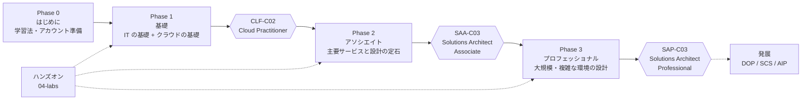
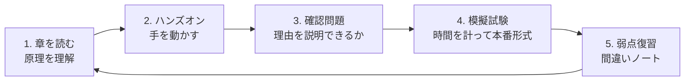

# AWS 学習ロードマップ ― 基礎から AWS 認定ソリューションアーキテクト – プロフェッショナルまで

IT とクラウドの基礎を固め、**CLF → SAA → SAP** と段階的に積み上げて、AWS 認定の最高峰とされる
**AWS Certified Solutions Architect – Professional** の合格を目指す学習教材です。

「サービスの暗記」ではなく、**なぜその設計になるのかを説明できる力**を身につけることを重視しています。
試験に合格するためだけでなく、実務で AWS を設計できるようになることがゴールです。

> [!IMPORTANT]
> **SAP の試験は 2026 年 11 月に改訂されます（SAP-C02 → SAP-C03）**
> - 2026-10-27: SAP-C03 の受験登録開始
> - 2026-11-16: SAP-C02 の最終受験日（AWS 公式ブログの記載。認定ページには 11-17 との表記もあるため、受験予定の方は公式ページで確認してください）
> - 2026-11-17: SAP-C03 の提供開始（75 問 / 180 分 / 300 USD）
> - 新たに **生成 AI・エージェント AI**、**レジリエンスエンジニアリング**（FIS / Resilience Hub / ARC）、**クラウドネイティブ設計**（VPC Lattice / ECS Service Connect など）、**DevSecOps とオブザーバビリティ**、**レイクハウス / Clean Rooms**、**ポスト量子暗号** が加わり、ドメインは 4 つから 5 つに再編されます。
>
> これから学習を始める方が受験するのは SAP-C03 になるため、本教材は **SAP-C03 を最終目標** に設計しています。
> 公式の試験ガイドは 2026-10-27 に公開予定です。公開後は必ず公式ガイドで出題範囲を確認してください。
> 詳細は [AWS 認定の全体像と試験の仕組み](00-start/02-certification-map.md) を参照してください。

---

## ロードマップ

| フェーズ | 目標 | 学習時間の目安 | 到達レベル |
|---|---|---|---|
| Phase 0: はじめに | 学習環境と計画を整える | 5 時間 | 安全な学習用アカウントと学習計画がある |
| Phase 1: 基礎 | **CLF-C02** 合格 | 40〜80 時間 | IT とクラウドの基本を自分の言葉で説明できる |
| Phase 2: アソシエイト | **SAA-C03** 合格 | 120〜180 時間 | 要件から標準的な AWS 構成を設計できる |
| Phase 3: プロフェッショナル | **SAP-C03** 合格 | 180〜250 時間 | 複数アカウント・ハイブリッド・グローバル規模の設計判断ができる |

学習時間は IT 経験によって大きく変わります。自分に合った計画は [学習計画と進捗管理](00-start/03-study-plan.md) で立てましょう。

---

## この教材の特徴

- **基礎を最優先** ― ネットワーク・OS・セキュリティ・データベースの基礎から始め、AWS の仕組みを「原理」から理解します。
- **3 段階の積み上げ** ― 同じテーマ（IAM、ネットワーク、DR など）を CLF → SAA → SAP と深さを変えて繰り返し学びます。
- **2026 年 9 月時点の最新情報** ― SAP-C03 の新領域、サービスの廃止・名称変更（App Mesh の終了、サポートプランの再編など）を反映しています。
- **本番形式の問題** ― 全章に解説付きの確認問題、さらに CLF・SAA・SAP の模擬試験（合計 275 問）を用意しています。
- **手を動かす** ― 13 本のハンズオンで、VPC 構築から RAG、カオスエンジニアリングまで実際に体験します。
- **図で理解** ― アーキテクチャや処理の流れを Mermaid 図で示しています（GitHub 上でそのまま表示されます）。

---

## 目次

### Phase 0: はじめに ― [目次](00-start/README.md)

| # | 章 | 内容 |
|---|---|---|
| 1 | [学習の進め方](00-start/01-how-to-study.md) | 教材の使い方、学習サイクル、公式情報の読み方 |
| 2 | [AWS 認定の全体像と試験の仕組み](00-start/02-certification-map.md) | 資格体系（2026 年版）、SAP-C03 の変更点、スコアリング |
| 3 | [学習計画と進捗管理](00-start/03-study-plan.md) | 6 / 9 / 12 か月プラン、進捗チェックリスト |
| 4 | [安全な学習用 AWS アカウントの準備](00-start/04-aws-account-setup.md) | MFA、予算アラート、IAM Identity Center、無料利用枠 |

### Phase 1: 基礎（CLF-C02） ― [目次](01-foundations/README.md)

| # | 章 | 内容 |
|---|---|---|
| 1 | [ネットワークの基礎](01-foundations/01-network-basics.md) | TCP/IP、CIDR とサブネット計算、DNS、HTTP/TLS |
| 2 | [サーバー・OS・仮想化の基礎](01-foundations/02-server-os-basics.md) | Linux、3 層構成、仮想化とコンテナ、可用性の計算 |
| 3 | [セキュリティとデータベースの基礎](01-foundations/03-security-database-basics.md) | 認証と認可、暗号化、RDB と NoSQL |
| 4 | [クラウドコンピューティングの概念](01-foundations/04-cloud-concepts.md) | 6 つの利点、IaaS/PaaS/SaaS、Well-Architected、CAF |
| 5 | [AWS グローバルインフラストラクチャ](01-foundations/05-global-infrastructure.md) | リージョン、AZ、エッジロケーション |
| 6 | [主要サービスツアー](01-foundations/06-core-services-tour.md) | カテゴリ別の主要サービス早わかり |
| 7 | [AWS のセキュリティとコンプライアンス](01-foundations/07-security-and-compliance.md) | 責任共有モデル、IAM、検出系サービス |
| 8 | [料金・請求・サポート](01-foundations/08-billing-pricing-support.md) | 購入オプション、コスト管理ツール、新サポートプラン |
| 9 | [CLF-C02 試験対策](01-foundations/09-clf-exam-prep.md) | 頻出ポイントと直前チェック |

### Phase 2: アソシエイト（SAA-C03） ― [目次](02-associate/README.md)

| # | 章 | 内容 |
|---|---|---|
| 1 | [IAM 徹底解説](02-associate/01-iam.md) | ポリシー評価ロジック、ロールと STS、クロスアカウント |
| 2 | [VPC とネットワーク設計](02-associate/02-vpc.md) | サブネット、ルーティング、SG と NACL、エンドポイント |
| 3 | [Amazon EC2](02-associate/03-ec2.md) | インスタンスタイプ、購入オプション、プレイスメントグループ |
| 4 | [Elastic Load Balancing と Auto Scaling](02-associate/04-elb-auto-scaling.md) | ALB / NLB / GWLB、スケーリングポリシー |
| 5 | [Amazon S3](02-associate/05-s3.md) | ストレージクラス、暗号化、レプリケーション、Object Lock |
| 6 | [ブロック・ファイルストレージ](02-associate/06-ebs-efs-fsx.md) | EBS / EFS / FSx / Storage Gateway |
| 7 | [データベース](02-associate/07-databases.md) | RDS / Aurora / DynamoDB / ElastiCache |
| 8 | [Route 53・CloudFront・Global Accelerator](02-associate/08-route53-cloudfront.md) | ルーティングポリシー、CDN、エッジ |
| 9 | [アプリケーション統合](02-associate/09-application-integration.md) | SQS / SNS / EventBridge / Kinesis |
| 10 | [サーバーレス](02-associate/10-serverless.md) | Lambda / API Gateway / Step Functions / Cognito |
| 11 | [コンテナ](02-associate/11-containers.md) | ECS / EKS / Fargate / ECR |
| 12 | [セキュリティサービス](02-associate/12-security-services.md) | KMS / WAF / Shield / GuardDuty ほか |
| 13 | [監視と運用管理](02-associate/13-monitoring-management.md) | CloudWatch / CloudTrail / Config / CloudFormation |
| 14 | [データ分析サービス](02-associate/14-analytics.md) | Athena / Glue / Redshift / Kinesis |
| 15 | [高可用性と災害対策](02-associate/15-high-availability-dr.md) | マルチ AZ、DR 戦略 4 種、AWS Backup |
| 16 | [移行とハイブリッド接続](02-associate/16-migration-hybrid.md) | 7R、MGN / DMS / DataSync、VPN と Direct Connect |
| 17 | [AWS Well-Architected Framework](02-associate/17-well-architected.md) | 6 つの柱と設計原則 |
| 18 | [コスト最適化](02-associate/18-cost-optimization.md) | 購入オプション、ストレージ階層、データ転送料金 |
| 19 | [SAA-C03 試験対策](02-associate/19-saa-exam-prep.md) | 制約語の読み方、頻出パターン 50 |

### Phase 3: プロフェッショナル（SAP-C03） ― [目次](03-professional/README.md)

| # | 章 | 内容 |
|---|---|---|
| 1 | [SAP-C03 完全ガイド](03-professional/01-sap-c03-overview.md) | 5 ドメイン、C02 との違い、学習戦略 |
| 2 | [マルチアカウント戦略とガバナンス](03-professional/02-multi-account-governance.md) | Organizations、SCP / RCP、Control Tower |
| 3 | [大規模な ID とアクセス管理](03-professional/03-identity-federation.md) | IAM Identity Center、フェデレーション、ABAC |
| 4 | [高度なネットワーク設計](03-professional/04-advanced-networking.md) | Transit Gateway、Direct Connect、ハイブリッド DNS、VPC Lattice |
| 5 | [セキュリティとコンプライアンスのアーキテクチャ](03-professional/05-security-architecture.md) | 検出の集中化、自動修復、KMS 設計、ポスト量子暗号 |
| 6 | [回復力と事業継続](03-professional/06-resilience-business-continuity.md) | マルチリージョン、ARC、FIS、Resilience Hub |
| 7 | [移行とモダナイゼーション](03-professional/07-migration-modernization.md) | ポートフォリオ分析、AWS Transform、MGN、DMS |
| 8 | [クラウドネイティブ設計](03-professional/08-cloud-native-architecture.md) | イベント駆動、Step Functions、サービス間通信 |
| 9 | [生成 AI・エージェント AI のアーキテクチャ](03-professional/09-generative-ai-architecture.md) | Bedrock、RAG、Guardrails、AgentCore |
| 10 | [データと分析のアーキテクチャ](03-professional/10-data-analytics-architecture.md) | レイクハウス、Iceberg、Lake Formation、Clean Rooms |
| 11 | [大規模環境のコスト最適化](03-professional/11-cost-optimization-at-scale.md) | FinOps、Savings Plans 戦略、コスト可視化 |
| 12 | [運用上の優秀性と自動化](03-professional/12-operational-excellence.md) | IaC、マルチアカウント CI/CD、DevSecOps、オブザーバビリティ |
| 13 | [SAP-C03 試験対策](03-professional/13-sap-exam-prep.md) | 長文問題の解き方、頻出シナリオ 40 |

### ハンズオン ― [一覧と共通ルール](04-labs/README.md)

| # | ラボ | 対応フェーズ |
|---|---|---|
| 1 | [アカウントを守る初期設定](04-labs/lab01-secure-account.md) | Phase 0 |
| 2 | [VPC をゼロから作り EC2 で Web サーバー](04-labs/lab02-vpc-ec2.md) | Phase 2 |
| 3 | [ALB + Auto Scaling で冗長化とスケーリング](04-labs/lab03-alb-auto-scaling.md) | Phase 2 |
| 4 | [S3 + CloudFront（OAC）で静的サイト配信](04-labs/lab04-s3-cloudfront.md) | Phase 2 |
| 5 | [RDS Multi-AZ とフェイルオーバー](04-labs/lab05-rds-multi-az.md) | Phase 2 |
| 6 | [Lambda + API Gateway + DynamoDB のサーバーレス API](04-labs/lab06-serverless-api.md) | Phase 2 |
| 7 | [CloudFormation で IaC](04-labs/lab07-cloudformation-iac.md) | Phase 2 |
| 8 | [CloudWatch で監視・アラーム・ログ分析](04-labs/lab08-cloudwatch-monitoring.md) | Phase 2 |
| 9 | [EventBridge + Step Functions のイベント駆動処理](04-labs/lab09-event-driven.md) | Phase 2〜3 |
| 10 | [Organizations と SCP によるガバナンス](04-labs/lab10-organizations-scp.md) | Phase 3 |
| 11 | [Transit Gateway によるハブ&スポーク](04-labs/lab11-transit-gateway.md) | Phase 3 |
| 12 | [Amazon Bedrock Knowledge Bases で RAG](04-labs/lab12-bedrock-rag.md) | Phase 3 |
| 13 | [AWS FIS で障害注入](04-labs/lab13-fis-chaos.md) | Phase 3 |

### 模擬試験 ― [使い方](05-practice-exams/README.md)

| 試験 | 問題 | 解答と解説 |
|---|---|---|
| CLF-C02（65 問 / 90 分） | [問題](05-practice-exams/clf-mock-exam.md) | [解答](05-practice-exams/clf-mock-exam-answers.md) |
| SAA-C03 第 1 回（65 問 / 130 分） | [問題](05-practice-exams/saa-mock-exam-1.md) | [解答](05-practice-exams/saa-mock-exam-1-answers.md) |
| SAA-C03 第 2 回（65 問 / 130 分） | [問題](05-practice-exams/saa-mock-exam-2.md) | [解答](05-practice-exams/saa-mock-exam-2-answers.md) |
| SAP-C03 第 1 回（40 問 / 96 分） | [問題](05-practice-exams/sap-mock-exam-1.md) | [解答](05-practice-exams/sap-mock-exam-1-answers.md) |
| SAP-C03 第 2 回（40 問 / 96 分） | [問題](05-practice-exams/sap-mock-exam-2.md) | [解答](05-practice-exams/sap-mock-exam-2-answers.md) |

SAP の模擬試験は 1 回 40 問の「ハーフ模試」です。2 回分を続けて解くと、本番（75 問 / 180 分）とほぼ同じ負荷になります。

### リファレンス ― [目次](06-reference/README.md)

| 資料 | 使いどころ |
|---|---|
| [用語集](06-reference/glossary.md) | わからない用語をすぐ引く |
| [サービス早見表](06-reference/service-cheatsheet.md) | サービスを一行で説明できるかの確認 |
| [比較表集](06-reference/comparison-tables.md) | 紛らわしいサービスの使い分け |
| [覚えておきたい数値](06-reference/numbers-to-remember.md) | 上限値・期間など試験に出る数値 |
| [問題文キーワード → 解答 対応表](06-reference/exam-keywords.md) | 直前の総仕上げ |
| [サービスの変更点（2024–2026）](06-reference/service-changes.md) | 廃止・名称変更・新サービス。古い教材を使うときに必読 |
| [学習リソース集](06-reference/resources.md) | 公式ドキュメント、日本語資料、問題集 |

---

## 学習の進め方

1. **章を読む** ― まず「なぜ」を理解します。各章の冒頭にある「この章のゴール」を意識してください。
2. **手を動かす** ― 関連するハンズオンで実際に構築します。一度でも触ると記憶の定着がまったく違います。
3. **確認問題を解く** ― 正解の理由だけでなく、**不正解の選択肢がなぜ誤りか**を説明できるようにします。
4. **模擬試験を解く** ― フェーズの最後に、時間を計って本番形式で解きます。
5. **弱点を復習する** ― 間違えた問題を記録し、関連する章に戻ります。

詳しくは [学習の進め方](00-start/01-how-to-study.md) を参照してください。
**最初に [安全な学習用 AWS アカウントの準備](00-start/04-aws-account-setup.md) を必ず済ませてください。** 予算アラートと MFA を設定せずにハンズオンを始めるのは危険です。

---

## 前提知識

- 前提知識は不要です。IT の基礎（Phase 1 の 1〜3 章）から始められます。
- IT インフラの実務経験がある方は、Phase 1 の 1〜3 章を流し読みし、確認問題で理解度を確かめてから先に進んでも構いません。

## 免責事項

- 本教材は個人の学習用に作成したもので、AWS の公式教材ではありません。
- 内容は **2026 年 9 月時点** の情報に基づいています。AWS のサービスと試験は頻繁に更新されるため、最新情報は必ず [AWS 公式ドキュメント](https://docs.aws.amazon.com/) と [AWS 認定の公式ページ](https://aws.amazon.com/certification/) で確認してください。
- ハンズオンで発生した AWS の利用料金は利用者の負担です。各ラボの「概算コスト」と「後片付け」を必ず確認してください。

## 教材の追加・修正

章や問題を追加・修正するときは [執筆ガイドライン](CONTRIBUTING.md) に従ってください。
